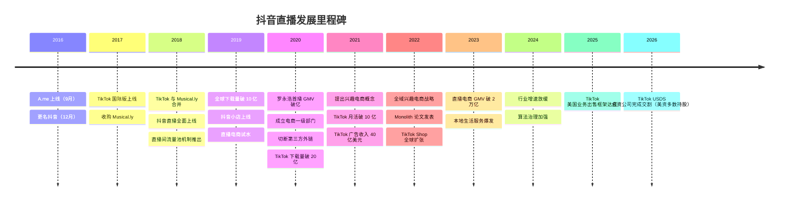
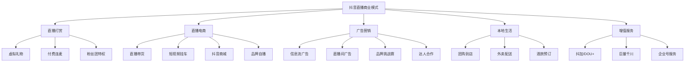
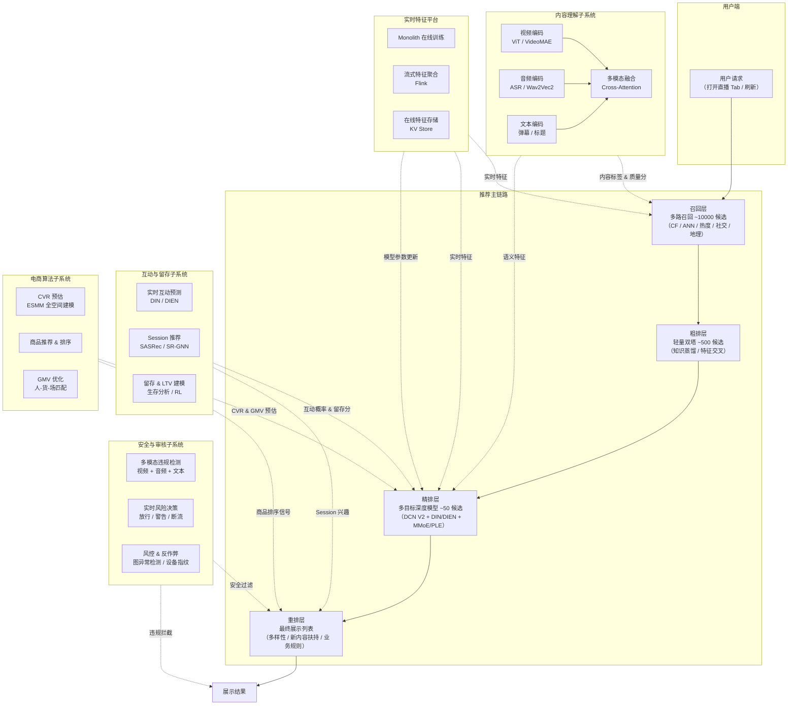
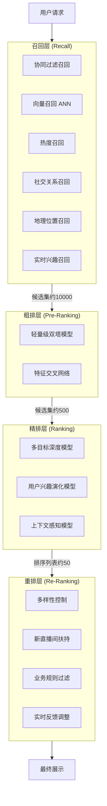
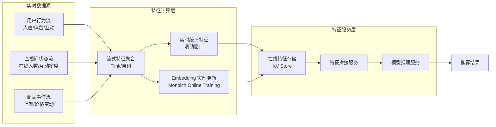
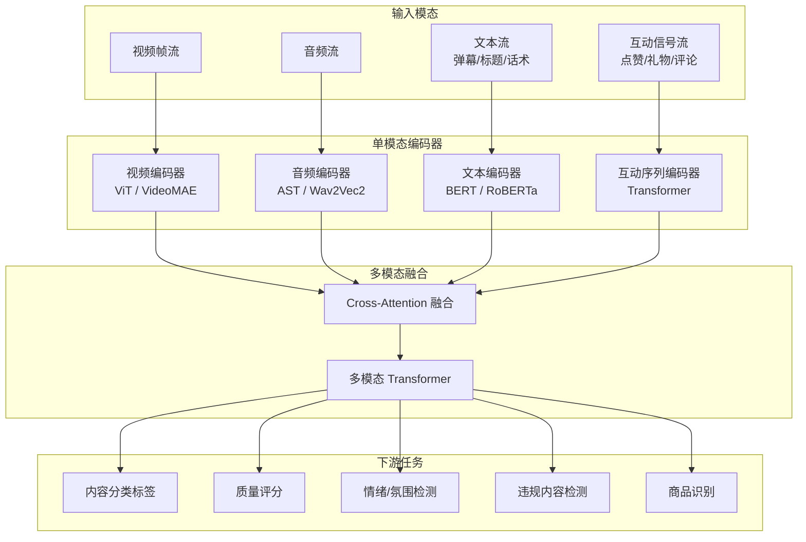
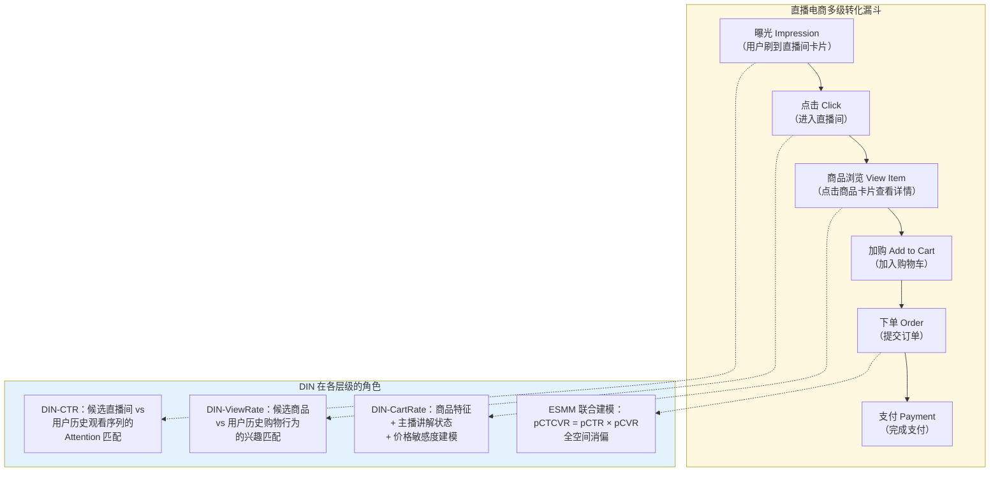
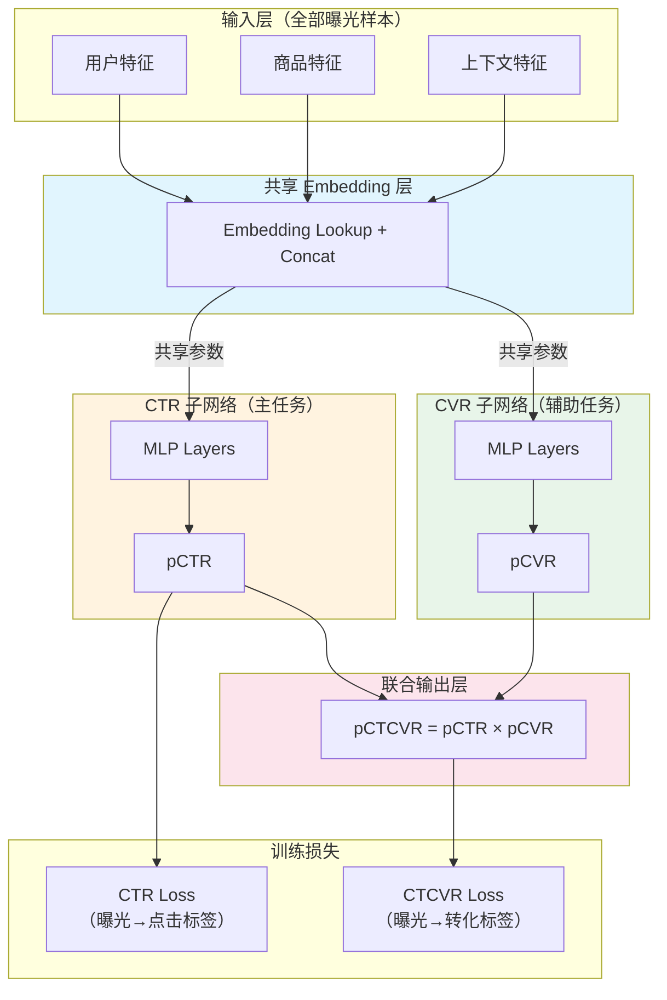
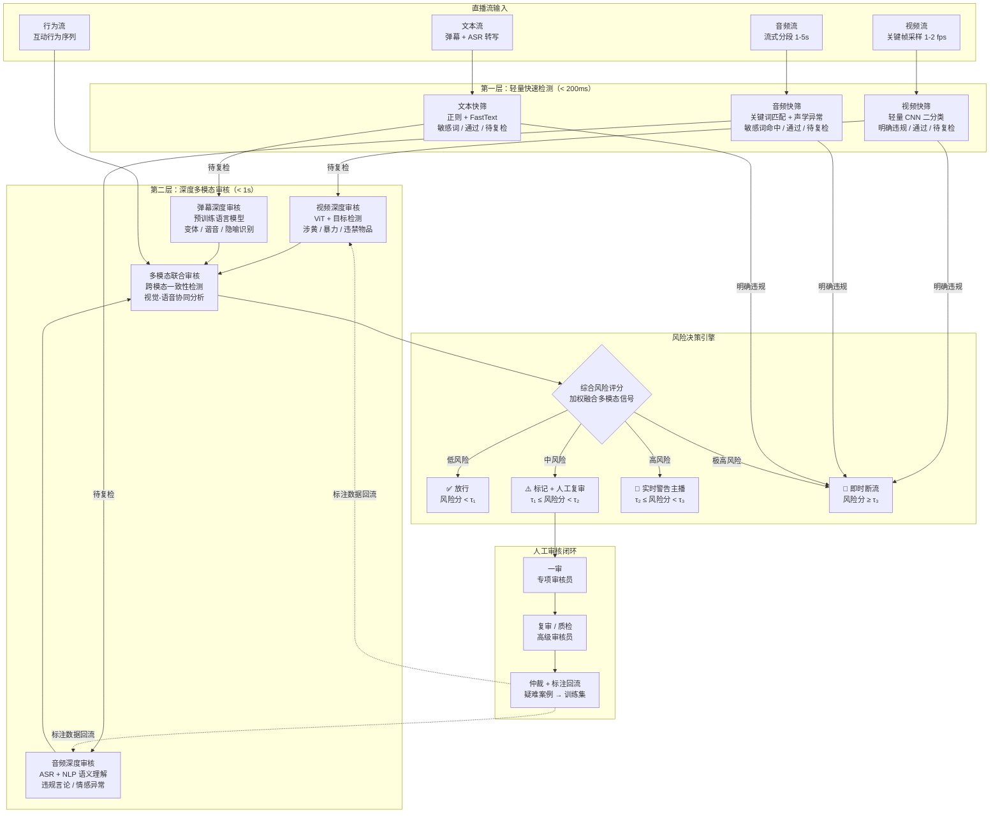
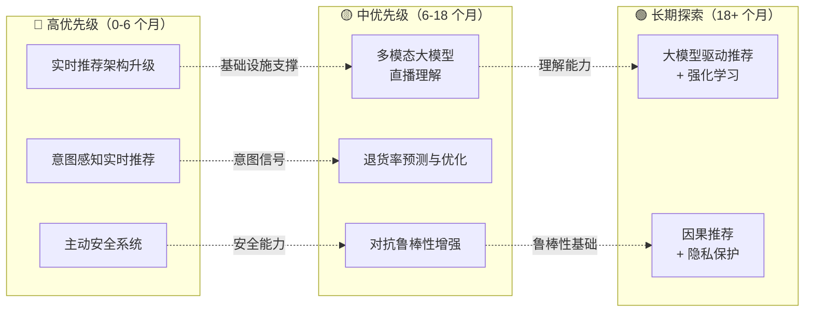

> 本报告旨在为算法工程师提供抖音直播业务的全景认知，涵盖业务发展、竞争格局、算法体系与技术方向。
> 撰写时间：2026 年 5 月

---

## 目录

1. [执行摘要](#1-执行摘要)
2. [发展历史与里程碑](#2-发展历史与里程碑)
3. [业务现状](#3-业务现状)
4. [竞争格局](#4-竞争格局)
5. [算法体系深度解析](#5-算法体系深度解析)
   - 5.1 [推荐算法](#51-推荐算法)
   - 5.2 [内容理解](#52-内容理解)
   - 5.3 [互动与留存](#53-互动与留存)
   - 5.4 [电商算法](#54-电商算法)
   - 5.5 [安全与审核](#55-安全与审核)
6. [核心问题与挑战](#6-核心问题与挑战)
7. [发展建议与算法技术方向](#7-发展建议与算法技术方向)
8. [参考资料](#8-参考资料)

---

### 阅读指南

本报告约 10 万字，建议根据阅读目标选择路径：

| 读者角色 | 推荐阅读路径 | 预计时间 |
|----------|-------------|----------|
| **算法工程师** | 第 5 章（算法体系深度解析）→ 第 7 章（技术方向）→ 第 6 章（挑战） | 60-90 分钟 |
| **业务负责人/产品经理** | 第 1 章（执行摘要）→ 第 3 章（业务现状）→ 第 4 章（竞争格局）→ 7.4 节（优先级总览表） | 30-40 分钟 |
| **管理层/投资人** | 第 1 章（执行摘要，含关键数据表）→ 第 2 章（发展时间线）→ 第 6 章（挑战）→ 第 7 章（建议总览表） | 20-30 分钟 |
| **安全/审核方向** | 5.5 节（安全与审核，8 小节完整技术栈）→ 7.1.3（主动安全）→ 7.2.3（对抗鲁棒性） | 30-40 分钟 |
| **电商方向** | 5.4 节（电商算法）→ 7.1.2（意图感知推荐）→ 7.2.2（退货率优化） | 25-35 分钟 |

> 全文阅读预计 2-3 小时。各章节相对独立，可按需跳读。第 5 章为技术核心，建议算法方向读者优先精读。

---

## 1. 执行摘要

### 核心发现

抖音直播已成为中国互联网生态中最重要的实时内容与商业平台之一。基于字节跳动强大的推荐算法引擎，抖音直播构建了一个连接内容创作者、消费者与商家的三角生态系统。以下是本报告的核心发现：

**业务规模**：抖音（Douyin）于 2016 年 9 月上线，一年内用户突破 1 亿，日均视频观看量超过 10 亿次。截至 2025 年，抖音国内 DAU（日活跃用户）已超过 7 亿，直播日均观看用户超过 3 亿。TikTok（抖音海外版）在 2021 年 9 月即达到 10 亿月活用户。

**商业模式**：抖音直播的商业模式已从早期的打赏为主，演变为"打赏 + 电商 + 广告 + 本地生活"的多元收入结构。直播电商 GMV 在 2023 年估计超过 2 万亿元人民币，是仅次于淘宝直播的第二大直播电商平台，并在增速上保持领先。

**算法驱动**：抖音直播的核心竞争力在于其推荐算法体系。系统综合运用了深度兴趣网络（DIN/DIEN）、多任务学习（MMoE/PLE）、实时特征工程（Monolith）、多模态内容理解等技术，实现了从冷启动到精细化运营的全链路智能化。

**关键挑战**：平台面临用户增长放缓、内容同质化、算法公平性、电商退货率高、监管政策趋严等多维挑战。算法层面，实时推荐的延迟与效果平衡、多目标优化中的目标冲突、长期用户价值建模等仍是开放性难题。

### 关键数据一览

| 指标 | 数据 |
|------|------|
| 抖音国内 DAU | 7+ 亿（2025 年） |
| TikTok 全球月活 | 10+ 亿（2021 年 9 月） |
| TikTok 全球下载量 | 20+ 亿次（2020 年 4 月） |
| 直播电商 GMV | 约 2+ 万亿元（2023 年估计） |
| TikTok 广告收入 | 约 141.5 亿美元（2023 年预测） |
| 字节跳动员工数 | 15 万+，遍布全球 120+ 城市 |
| 直播日均观看用户 | 3+ 亿 |
| 创作者生态 | 千万级活跃创作者 |

---

## 2. 发展历史与里程碑

### 2.1 创业期（2016-2017）：短视频起步

抖音的前身 "A.me" 于 2016 年 9 月 20 日上线，由字节跳动内部孵化。团队仅用约 7 个月完成产品开发。2016 年 12 月，正式更名为"抖音"（Douyin）。这一时期的产品定位是"年轻人的音乐短视频社区"，主要面向一二线城市的年轻用户群体。

2017 年 5 月，字节跳动推出 TikTok 国际版。同年 11 月，以约 10 亿美元收购北美短视频应用 Musical.ly，为全球化扩张奠定基础。

### 2.2 爆发期（2018-2019）：用户高速增长与直播上线

2018 年 8 月，TikTok 与 Musical.ly 正式合并，统一品牌为 TikTok。2018 年上半年，TikTok 在 App Store 的下载量达 1.04 亿次。

抖音直播功能在 2018 年全面上线，初期以娱乐秀场直播为主。平台引入"直播间流量池"机制，通过推荐算法将直播内容分发给潜在观众，打破了传统直播平台依赖粉丝关注的流量分配模式。

2019 年 2 月，抖音与 TikTok 全球下载量合计突破 10 亿次。同年，抖音开始试水直播电商，上线"抖音小店"，探索"内容 + 电商"的商业闭环。

### 2.3 商业化深化期（2020-2021）：直播电商爆发

2020 年是抖音直播的关键转折年：

- **4 月**：罗永浩入驻抖音直播带货，首场直播 GMV 超 1.1 亿元，标志着抖音直播电商的正式起飞
- **6 月**：抖音成立电商一级部门，直播电商上升为战略级业务
- **10 月**：抖音切断第三方外链（淘宝等），构建自有电商闭环
- 2020 年 4 月，TikTok 全球下载量突破 20 亿次

2021 年是全面商业化的一年：

- **4 月**：推出"兴趣电商"概念，强调通过推荐算法激发用户购买兴趣
- **9 月**：TikTok 全球月活用户突破 10 亿
- Cloudflare 数据显示 TikTok 超越 Google 成为全球访问量最大的网站
- 同年，TikTok 广告收入达 40 亿美元
- 抖音直播电商 GMV 快速增长，生态逐渐成熟

### 2.4 生态完善期（2022-2023）：全域兴趣电商

2022 年：

- 抖音提出"全域兴趣电商"战略，从纯直播电商扩展到货架电商（搜索 + 商城）
- TikTok Shop 开始在东南亚和美国市场扩张
- TikTok 全年收入估计达 98.9 亿美元
- 字节跳动发表 Monolith 论文（RecSys 2022 Workshop），公开其实时推荐系统架构

2023 年：

- 直播电商 GMV 估计突破 2 万亿元
- 本地生活服务（团购、到店）成为直播新增长点
- TikTok 收入预计达 141.5 亿美元
- 平台加强内容审核与算法治理

### 2.5 调整与监管期（2024-2026）：合规与可持续发展

2024-2026 年是监管与业务调整并行的时期：

- 国内直播电商行业增速放缓，平台从"流量红利"转向"效率红利"
- 2025 年，TikTok 美国业务出售框架达成；2026 年初，TikTok USDS 合资公司完成交割，Oracle、MGX、Silver Lake 等美资实体合计持有多数股权，字节跳动保留少数股权（具体股权比例各方报道不一，此处不列出争议性数字）
- 直播内容监管政策持续收紧，平台加大合规投入
- 算法透明度和用户隐私保护成为行业共同议题

### 发展时间线

---

## 3. 业务现状

### 3.1 用户规模与画像

**用户规模**：抖音国内 DAU 已超过 7 亿，覆盖中国超过一半的互联网用户。直播业务日均观看用户超过 3 亿，直播渗透率持续提升。

**用户画像特征**（以下数据综合自 QuestMobile、艾瑞咨询等第三方报告及行业估算，非抖音官方披露，仅供参考）：

| 维度 | 特征描述 |
|------|----------|
| 年龄分布 | 18-35 岁用户占比约 55%，35-50 岁用户增长迅速 |
| 性别分布 | 男女比例接近 1:1，女性在购物直播中占比更高 |
| 地域分布 | 一二线城市用户占比约 45%，下沉市场持续增长 |
| 使用时长 | 日均使用时长约 120 分钟，直播场景占比约 30% |
| 消费能力 | 中高消费能力用户占比持续提升 |

**直播创作者生态**：平台活跃创作者达千万级，其中认证主播超过百万。创作者类型覆盖娱乐秀场、知识分享、电商带货、本地生活、游戏直播等多个垂类。平台通过"中腰部创作者扶持计划"不断拓宽创作者金字塔的中间层。

### 3.2 商业模式

抖音直播的商业模式已形成多元化收入结构：

#### 3.2.1 直播打赏

直播打赏是抖音直播最早的商业模式。用户通过购买虚拟"抖币"，在直播间向主播赠送虚拟礼物（如玫瑰花、火箭等）。主播获得的礼物按一定比例（通常为 50%）转化为收入。这一模式在娱乐秀场直播中仍然是主要收入来源。平台对直播打赏有年龄限制（需 18 岁以上）和消费限额等监管措施。

#### 3.2.2 直播电商

直播电商已成为抖音直播最核心的商业模式。其运作模式包括：

- **达人带货**：由具有粉丝基础的 KOL/KOC 在直播间展示和推荐商品
- **品牌自播**：品牌商家自建直播团队，在品牌自有账号直播
- **抖音商城**：2022 年后上线的货架电商，支持搜索和分类浏览购物
- **短视频挂车**：在短视频内容中嵌入商品链接，用户点击即可购买

抖音直播电商 GMV 在 2023 年估计突破 2 万亿元，平台通过佣金（通常为 1%-5%）和广告费用（巨量千川等营销工具）获取收入。

#### 3.2.3 广告营销

广告是字节跳动最主要的收入来源。在直播场景中，广告形式包括：

- **信息流广告**：嵌入在直播推荐流中的原生广告
- **直播间广告**：直播间内的品牌植入、挂件等
- **巨量千川**：专为直播电商设计的投放工具，支持直播间引流和商品推广
- **DOU+**：内容加热工具，帮助创作者获得更多曝光

TikTok 2023 年预计广告收入约 141.5 亿美元，但人均广告变现率仍低于 Facebook 和 Instagram（美国市场每小时用户变现约 0.31 美元，是 Facebook 的三分之一、Instagram 的五分之一）。

#### 3.2.4 本地生活

2023 年起，本地生活服务成为抖音直播的新增长引擎。商家通过直播间推广团购套餐、到店优惠券等，用户线上购买、线下核销。这一模式对美团等本地生活平台形成了直接竞争。

### 3.3 内容生态

抖音直播的内容生态已覆盖以下主要品类：

| 品类 | 代表内容 | 商业模式 | 用户特征* |
|------|----------|----------|----------|
| 电商带货 | 服饰、美妆、食品、3C | 佣金 + 广告 | 以女性为主，25-45 岁 |
| 娱乐秀场 | 唱歌、跳舞、才艺表演 | 打赏 | 年轻用户，晚间活跃 |
| 知识分享 | 教育、职场、理财 | 课程转化 + 打赏 | 25-40 岁，一二线城市 |
| 游戏直播 | 手游、端游实况 | 打赏 + 广告 | 以男性为主，18-30 岁 |
| 本地生活 | 餐饮探店、旅游攻略 | 团购佣金 | 本地用户，消费导向 |
| 体育赛事 | 足球、篮球赛事转播 | 广告 + 打赏 | 体育爱好者 |
| 助农直播 | 农产品销售、乡村生活 | 电商佣金 | 广泛用户群 |

> *用户特征列为行业通用画像，综合 QuestMobile、艾瑞咨询、抖音官方创作者报告等多方公开数据的共识性描述，非单一精确来源。各品类用户画像存在交叉，实际用户构成可能随时间和运营策略变化。

---

## 4. 竞争格局

### 4.1 主要竞争对手对比

中国直播行业已形成多平台竞争的格局。以下是抖音直播与主要竞争对手的全面对比：

| 维度 | 抖音直播 | 快手直播 | 微信视频号直播 | 淘宝直播 | B站直播 |
|------|----------|----------|----------------|----------|---------|
| **DAU** | 7+ 亿（含短视频） | 3+ 亿 | 4+ 亿（视频号） | 依托淘宝 9 亿+ | 约 1 亿 |
| **核心优势** | 算法推荐精准 | 社区粘性强、老铁文化 | 微信社交链 | 电商基础设施完善 | 年轻用户、二次元 |
| **用户画像** | 全线城市覆盖 | 下沉市场更强 | 30+ 岁用户多 | 购物意图明确 | 18-25 岁为主 |
| **流量分配** | 算法驱动，去中心化 | 社交 + 算法混合 | 社交链驱动 | 搜索 + 推荐 | 兴趣社区 + 推荐 |
| **电商 GMV** | 2+ 万亿（2023） | 约 1 万亿（2023） | 快速增长中 | 约 5000 亿（2023） | 规模较小 |
| **打赏收入** | 高 | 极高（核心收入） | 中等 | 低 | 中等 |
| **广告系统** | 巨量引擎，极其成熟 | 磁力引擎 | 腾讯广告体系 | 阿里妈妈 | 花火平台 |
| **推荐算法** | 深度学习，业界领先 | 强社交推荐 | 社交图谱为核心 | 电商意图理解 | 内容兴趣匹配 |
| **内容审核** | AI + 人工，大规模 | AI + 人工 | AI + 人工 | AI + 人工 | 社区自治 + AI |
| **技术论文** | DIN/DIEN/Monolith 等 | 公开较少 | 公开较少 | DIN/DIEN/ESMM 等 | 较少 |

### 4.2 竞争力分析

**抖音直播的核心竞争优势**：

1. **算法推荐能力**：字节跳动的推荐算法是其最核心的竞争壁垒。从今日头条到抖音，字节积累了十余年的推荐系统工程经验，形成了完整的算法技术栈。
2. **流量规模效应**：7 亿+ DAU 带来的数据规模优势使模型训练和特征工程具有不可复制的优势。
3. **商业化效率**：从广告投放（巨量引擎）到电商转化（巨量千川），形成了完整的商业化工具体系。
4. **内容创作者生态**：大量中腰部创作者构成了丰富的内容供给侧。

**快手的差异化竞争**：快手以更强的社区粘性和"老铁经济"形成差异化。快手直播的打赏收入占比更高，用户对主播的信任关系更深。快手 2024 财年收入达 1270 亿元人民币（约 173.9 亿美元），其中直播打赏仍是重要收入来源。快手在下沉市场和农村用户中的渗透率高于抖音。

**微信视频号的社交优势**：视频号依托微信 12 亿+ 用户的社交链，在私域流量运营方面具有独特优势。视频号直播的用户画像偏向 30 岁以上，消费能力较强，但算法推荐能力与抖音存在明显差距。

**淘宝直播的电商基因**：淘宝直播在供应链、物流、支付等电商基础设施方面具有先天优势，用户购物意图明确，转化率较高。但在内容生态和用户时长方面不及抖音。

---

## 5. 算法体系深度解析

抖音直播的算法体系是一个庞大而精密的系统工程，涵盖推荐、内容理解、互动预测、电商转化和安全审核五大核心模块。本章节将深入解析每个模块的技术架构、核心模型和工程实践。

### 系统架构总览

下图展示了抖音直播推荐系统的整体架构，包含从用户请求到最终展示的完整链路，以及各子系统与主链路之间的关系。

**架构要点说明**：

- **主链路**（召回→粗排→精排→重排）是推荐系统的核心流水线，端到端延迟需控制在 100ms 以内
- **内容理解子系统**为召回和精排提供直播间的语义特征和质量评分，是推荐质量的上限决定因素
- **互动与留存子系统**为精排提供用户互动概率和留存预测，为重排提供 Session 级兴趣信号
- **电商算法子系统**在电商直播场景中为精排注入 CVR 和 GMV 预估信号，影响流量向电商直播间的分配
- **安全与审核子系统**贯穿全链路，在重排阶段进行安全过滤，在展示阶段执行违规拦截（如实时断流）
- **实时特征平台**（基于 Monolith 架构）为全链路提供实时特征和在线模型更新能力，是系统实时性的基础保障

### 5.1 推荐算法

推荐算法是抖音直播最核心的技术能力，负责将合适的直播内容分发给合适的用户。

#### 5.1.1 整体架构

抖音直播推荐系统遵循经典的"召回 → 粗排 → 精排 → 重排"四阶段架构，同时针对直播场景的实时性要求做了深度定制。

**各阶段技术要点**：

- **召回层**：从百万级直播间中筛选约 1 万个候选。采用多路召回策略，包括基于 Item-CF 的协同过滤、基于 DSSM（Deep Structured Semantic Model）的向量召回（通过 ANN 近似最近邻检索实现毫秒级响应）、基于实时热度的热门召回、基于社交图谱的关注链召回等。
- **粗排层**：使用轻量级双塔模型（用户塔 + 直播间塔），在保证推理速度的前提下进行初步排序。通常采用知识蒸馏（Knowledge Distillation）从精排模型学习排序能力。
- **精排层**：核心排序阶段，使用深度学习模型进行精细化打分。融合用户特征、直播间特征、上下文特征和实时交互特征。
- **重排层**：在精排结果基础上进行多样性调整、新内容扶持和业务规则干预，生成最终展示列表。

#### 5.1.2 流量分配机制

抖音直播的流量分配被广泛认为采用"流量池"分层机制。需要说明的是，抖音官方从未公开确认过"流量池"的具体分层结构和数值——以下模型基于行业从业者的经验总结和社区观察推测，不代表抖音内部的实际实现，但其核心逻辑（基于互动指标的渐进式流量放大）与推荐系统的通行设计原则一致：

**流量池分层模型**（行业观察与推测）：

1. **基础流量池**（100-500 曝光）：新开播或低热度直播间进入的初始流量池。系统观察用户在直播间的停留时长、互动率、转化率等指标。
2. **二级流量池**（500-5000 曝光）：当直播间各项指标超过同层级平均水平时，系统将其推入更大的流量池。
3. **中级流量池**（5000-5 万曝光）：表现优秀的直播间可获得更大规模的推荐。
4. **高级流量池**（5 万-50 万曝光）：头部直播间或爆款内容触达的流量层级。
5. **顶级流量池**（50 万+ 曝光）：现象级直播间，通常伴随平台运营支持。

**流量分配的核心指标**（权重由模型动态学习，以下为定性描述）：

| 指标类别 | 具体指标 | 影响方向 |
|----------|----------|----------|
| 停留指标 | 平均观看时长、5s 完播率 | 停留越长，权重越高 |
| 互动指标 | 评论率、点赞率、分享率 | 互动越活跃，权重越高 |
| 转化指标 | 关注转化率、打赏率、购物转化率 | 转化越高，权重越高 |
| 质量指标 | 画质、声音质量、违规次数 | 质量越高，权重越高 |
| 时效指标 | 开播时长、在线人数变化趋势 | 动态影响 |

#### 5.1.3 实时特征工程

直播推荐对特征的实时性要求极高——一个直播间的状态可能在几秒内发生剧烈变化（如主播开始演示商品、发生连麦 PK 等）。字节跳动在 RecSys 2022 Workshop 上发表的 Monolith 系统论文揭示了其实时特征工程的核心思路。

**Monolith 系统核心创新**：

1. **Collisionless Embedding Table**（无碰撞嵌入表）：传统推荐系统使用哈希表管理稀疏特征嵌入，不同特征 ID 可能映射到同一桶（hash collision），导致信息损失。Monolith 使用无碰撞设计，为每个特征 ID 分配独立的嵌入向量，通过可过期嵌入（Expirable Embeddings）和频率过滤（Frequency Filtering）控制内存占用。

2. **在线训练架构**（Online Training Architecture）：传统推荐系统的训练和服务是分离的——离线训练模型、线上加载服务。Monolith 实现了高容错的在线训练架构，模型可以从实时用户反馈中持续学习。论文中指出："system reliability could be traded-off for real-time learning"（可以在系统可靠性和实时学习之间做权衡）。

3. **实时特征流水线**：

**关键实时特征类型**：

- **用户实时行为特征**：最近 N 分钟内观看的直播间序列、互动行为序列、搜索关键词等
- **直播间实时状态特征**：当前在线人数、实时互动率（弹幕/点赞/送礼频率）、主播状态（讲解/互动/休息）、商品展示状态
- **交叉实时特征**：用户在当前直播间的停留时长、是否互动、是否加购等
- **环境特征**：时间段、网络状况、设备类型

#### 5.1.4 冷启动策略

冷启动是直播推荐中的关键挑战，包括新用户冷启动和新直播间冷启动。

**新用户冷启动**：

1. **基于注册信息的初始画像**：利用年龄、性别、地域、手机型号等注册信息构建初始用户画像
2. **Bandit 探索策略**：使用 Thompson Sampling 或 Upper Confidence Bound（UCB）等 Bandit 算法，在初始阶段对用户进行多样化探索，快速捕捉兴趣信号
3. **跨域迁移**：利用用户在抖音短视频端的行为数据（如果有），通过迁移学习（Transfer Learning）迁移用户兴趣到直播域
4. **流行度兜底**：在兴趣信号不足时，优先推荐当前热门和高质量直播间

**新直播间冷启动**：

1. **创作者画像迁移**：利用主播在短视频端的内容标签、粉丝画像等信息，构建初始直播间画像
2. **初始流量保障**：新开播直播间获得一定量的初始曝光（基础流量池），用于采集用户反馈信号
3. **实时信号快速捕捉**：通过用户在直播间的停留和互动行为，在几分钟内快速更新直播间特征向量
4. **内容理解辅助**：通过多模态模型实时分析直播内容（画面、音频、文字），生成内容标签用于匹配

#### 5.1.5 特征交叉建模：DCN 与 DCN V2

在推荐系统的精排阶段，有效学习特征之间的交叉组合是提升预测精度的关键。传统 DNN 只能隐式地学习特征交叉，效率较低且难以保证高阶交叉特征被充分捕获。Deep & Cross Network（DCN）系列专门解决这一问题，通过显式的交叉网络自动学习有界阶数的特征交叉。

**DCN（Deep & Cross Network）**

DCN 由 Wang 等人在 ADKDD 2017 上提出，是首个将显式特征交叉与深度网络结合的模型架构。其核心创新是 Cross Network（交叉网络），与传统 DNN 并行工作。

交叉网络的核心公式：

$$x_{l+1} = x_0 \cdot x_l^T \cdot w_l + b_l + x_l$$

其中 $x_0$ 是输入特征向量，$x_l$ 是第 $l$ 层的输出，$w_l$ 和 $b_l$ 是可学习参数。每一层交叉网络执行一次特征交叉操作，交叉阶数随层数线性增长——$l$ 层交叉网络可以建模最高 $l+1$ 阶的特征交叉。

DCN 的关键特性：
- **显式特征交叉**：不同于 DNN 隐式学习交叉特征，Cross Network 在每一层直接计算特征之间的交叉项，更高效地捕获组合模式
- **参数高效**：Cross Network 的参数量随输入维度 $d$ 线性增长（每层仅需 $2d$ 个参数），远低于全连接层的 $d^2$，额外计算开销极小
- **与 DNN 互补**：Cross Network 擅长学习显式的有界阶特征交叉，DNN 擅长学习隐式的高阶非线性特征，二者并行互补

在直播推荐场景中，DCN 可以有效捕获如"用户年龄 × 直播品类 × 时间段"这类组合特征，而无需手工构造。

**DCN V2（Improved Deep & Cross Network）**

DCN V2 由 Wang 等人在 WWW 2021 上发表，是 Google 针对 DCN 在大规模生产环境中表现力不足的问题所做的重要改进。论文指出，原始 DCN 的交叉网络"在网页级推荐场景中（数十亿训练样本）表现出有限的表达能力"。

DCN V2 的核心改进：

1. **增强交叉层**：将 DCN V1 中的向量参数 $w_l$ 升级为矩阵参数 $W_l$，交叉层公式变为：

$$x_{l+1} = x_0 \odot (W_l \cdot x_l + b_l) + x_l$$

其中 $\odot$ 为逐元素乘法（Hadamard 积）。矩阵参数 $W_l \in \mathbb{R}^{d \times d}$ 大幅提升了每层交叉网络的表达能力，使其能够学习更复杂的特征交叉模式。

2. **混合低秩架构（Mixture of Low-Rank）**：为控制矩阵参数带来的计算开销，DCN V2 将权重矩阵分解为多个低秩子空间的混合：

$$W_l = \sum_{i=1}^{K} G_i(x) \cdot (U_i \cdot V_i^T)$$

其中 $U_i \in \mathbb{R}^{d \times r}$，$V_i \in \mathbb{R}^{d \times r}$（$r \ll d$），$G_i(x)$ 是输入相关的门控函数。这一设计在保持高表达能力的同时，将参数量从 $O(d^2)$ 降至 $O(K \cdot d \cdot r)$，实现了表达能力与计算效率的平衡。

3. **两种架构变体**：
   - **Stacked 结构**：Cross Network 的输出作为 DNN 的输入，两个网络串行连接。适合需要深度特征交叉的场景。
   - **Parallel 结构**：Cross Network 与 DNN 并行，最终输出拼接。与 DCN V1 结构类似，但交叉层表达力更强。

DCN V2 在 Google 的多个大规模排序系统中取得了显著的离线精度和在线业务指标提升。

**DCN 系列与 DIN/DIEN 的对比与协同**

| 维度 | DCN/DCN V2 | DIN/DIEN |
|------|-----------|----------|
| 核心能力 | 显式特征交叉建模 | 用户兴趣动态建模 |
| 建模对象 | 特征之间的组合关系 | 用户行为序列中的兴趣 |
| 技术手段 | Cross Network 显式交叉 | Attention / GRU 序列建模 |
| 适用位置 | 精排模型的特征交互模块 | 精排模型的用户表示模块 |
| 互补关系 | 提供丰富的交叉特征 | 提供动态的用户兴趣表示 |

在实际的直播推荐精排模型中，DCN V2 的交叉网络与 DIN/DIEN 的兴趣建模通常不是二选一的关系，而是可以在同一模型中协同工作：DCN V2 的交叉层负责学习用户属性、直播间属性、上下文特征之间的显式交叉，而 DIN/DIEN 模块负责从用户的历史行为序列中提取与当前直播间相关的动态兴趣表示。两者的输出拼接后进入最终的预测层，既保证了特征交叉的充分性，又保证了用户兴趣建模的精细化。

#### 5.1.6 多目标优化

直播推荐面临复杂的多目标优化问题。系统需要同时优化多个相互关联甚至冲突的目标：

**核心优化目标**：

- **点击率（CTR）**：用户点击进入直播间的概率
- **观看时长（Watch Time）**：用户在直播间的停留时长
- **互动率（Interaction Rate）**：点赞、评论、分享等互动行为的发生概率
- **关注转化率（Follow Rate）**：用户关注主播的概率
- **电商转化率（CVR）**：用户发生购买行为的概率
- **打赏率（Gift Rate）**：用户送礼的概率
- **留存率（Retention）**：用户次日/次周回访的概率

**多目标优化技术方案**：

**方案一：MMoE（Multi-gate Mixture-of-Experts）**

MMoE 是 Google 在 KDD 2018 上提出的多任务学习架构。其核心思想是使用多个 Expert 网络共享底层表示，每个任务通过独立的 Gate 网络选择性地融合各 Expert 的输出。

架构要点：
- 多个 Expert 网络：$E_1, E_2, ..., E_n$，共享底层输入特征
- 每个任务 $k$ 有独立的 Gate 网络：$g^k(x) = softmax(W^k \cdot x)$
- 任务 $k$ 的融合输出：$f^k(x) = \sum_{i} g_i^k(x) \cdot E_i(x)$
- 各任务有独立的 Tower 网络进行最终预测

优势：不同任务可以学习到不同的 Expert 组合权重，缓解了多任务之间的"负迁移"（Negative Transfer）问题。

**方案二：PLE（Progressive Layered Extraction）**

PLE 是腾讯提出的改进方案，在 RecSys 2020 上发表。相比 MMoE，PLE 引入了任务特有的 Expert 和共享 Expert 的分层提取机制。

架构要点：
- 每个任务既有独立的 Task-specific Expert，也共享 Shared Expert
- 多层提取结构，上层可以从下层的所有 Expert 中学习
- 更好地平衡了任务之间的共享与独立

**方案三：帕累托优化（Pareto Optimization）**

在实际工程中，不同目标之间存在此消彼长的关系（如：优化电商转化可能降低用户体验类指标）。帕累托优化通过寻找帕累托最优前沿，在多个目标之间取得合理的平衡。常用方法包括：

- **加权融合**：$Score = \sum_{k} w_k \cdot P_k(x)$，其中 $w_k$ 为业务设定的目标权重
- **梯度协调**：通过 GradNorm 或 PCGrad 等方法，在训练过程中动态调整各任务梯度
- **约束优化**：将部分目标作为约束条件，优化主要目标

**实际工程中的融合公式**：

在抖音直播的推荐排序中，最终排序分数通常是多个预估值的加权组合：

$$Score = w_{ctr} \cdot pCTR \times w_{dur} \cdot pDuration \times w_{interact} \cdot pInteract \times w_{cvr} \cdot pCVR \times w_{follow} \cdot pFollow + \alpha \cdot Boost_{new} + \beta \cdot Diversity$$

其中各 $w$ 为可调权重参数，$Boost_{new}$ 为新内容扶持加分，$Diversity$ 为多样性调节项。

### 5.2 内容理解

内容理解是直播推荐的基础设施层——推荐算法的质量上限取决于系统对直播内容的理解深度。相比短视频，直播内容理解面临三个根本性挑战：**实时性**（内容不断生成，无法离线预处理）、**动态性**（同一直播间的内容在几分钟内可能从商品讲解切换到抽奖互动）、**多模态交织**（主播语音、画面、弹幕、互动行为同时携带信息且相互依赖）。

#### 5.2.1 多模态内容理解

直播是一种高度动态的多模态内容形式，包含视频画面、音频语音、文字弹幕和互动行为等多种信号。多模态内容理解系统负责实时解析这些信号，为推荐和审核提供语义特征。

**多模态理解架构**：

**视频理解——基于 ViT 架构的视觉编码**：

Vision Transformer（ViT）是 Google 在 2020 年提出的将 Transformer 直接应用于图像识别的架构，已成为视觉内容理解的主流范式。ViT 的核心思路是将图像分割为固定大小的图块（Patch），每个 Patch 通过线性投影映射为一个向量（类似 NLP 中的 token embedding），加上位置编码后送入标准 Transformer 编码器。

ViT 在直播视频理解中的应用：
- **关键帧编码**：由于直播视频流是连续的，系统以一定频率（如每秒 1-2 帧）采样关键帧，每帧通过 ViT 编码为高维语义向量。ViT 的全局自注意力机制使其能够捕获画面中远距离元素之间的关系（如画面角落的商品价签与主播手势之间的关联），这是 CNN 架构难以做到的
- **场景识别**：使用预训练 ViT 或 Swin Transformer 识别直播间场景类型（室内/室外、商品展示/才艺表演等）。Swin Transformer 通过层级化的移动窗口注意力降低了计算复杂度，更适合高分辨率直播画面
- **时序视频理解**：单帧 ViT 无法捕捉时序动态。TimeSFormer 将 ViT 扩展到视频领域，采用分解式时空注意力（Divided Space-Time Attention）——空间注意力在每帧内部计算，时间注意力在不同帧的相同空间位置之间计算——有效降低了视频 Transformer 的计算量。VideoMAE 则通过掩码自编码预训练策略，在大规模无标注视频上学习时序表示，对直播场景下的动作识别（如主播跳舞、讲解商品、连麦互动等）尤为适用
- **物体检测**：检测直播画面中的关键物体（商品、人脸、手势等），结合 DETR（基于 Transformer 的端到端目标检测）实现无需 anchor 的物体定位

**音频理解**：

- **语音识别（ASR）**：将主播的语音转换为文本，用于内容理解和关键词提取。字节跳动在 ASR 领域有深厚积累，其自研的流式 ASR 系统支持低延迟的实时语音转写，这对直播场景至关重要
- **语音情感分析**：通过语音特征（音调、语速、能量等）判断主播情绪和直播间氛围。基于 Wav2Vec 2.0 的自监督预训练音频编码器可以从大量无标注音频中学习通用的语音表示
- **背景音分类**：识别背景音乐类型、环境噪声等
- **声音质量评估**：检测回声、杂音、音量异常等问题

**文本理解**：

- **弹幕语义分析**：对实时弹幕进行 NLP 分析，提取用户兴趣、情感倾向和购买意向。弹幕文本的特殊性在于极短（通常 5-20 字）、高频、口语化、包含大量谐音和缩写，需要针对性微调的语言模型
- **主播话术分析**：通过 ASR 转文本后，分析主播的话术模式、商品介绍内容等
- **标题和标签理解**：分析直播间标题、标签等元数据的语义信息

#### 5.2.2 直播场景的内容理解特殊挑战

相比短视频和图文等"静态"内容，直播内容理解面临一组独特的技术挑战：

**挑战一：实时推理约束**

短视频可以在上传后离线处理内容标签，但直播内容是实时生成的，系统必须在秒级延迟内完成内容理解并反馈给推荐系统。这要求：
- 轻量化的推理模型或模型蒸馏方案，在保持理解精度的前提下满足实时性
- 流式处理架构：不等待完整内容，而是基于滑动窗口持续输出内容标签
- 多级缓存策略：高频变化的特征（如当前讲解的商品）实时更新，低频变化的特征（如直播间主题）间歇性更新

**挑战二：动态场景切换**

一场直播通常持续数小时，期间内容会在多种场景之间频繁切换——例如电商直播可能从商品讲解切换到抽奖互动再到闲聊。系统需要：
- 场景切换检测（Scene Change Detection）：通过视觉特征和音频特征的突变检测场景边界
- 分段内容标签化：为直播的每个时间段生成独立的内容标签，而非用一个静态标签描述整场直播
- 推荐策略与场景联动：当直播间从"闲聊"切换到"上商品讲解"时，推荐系统应实时调整目标用户画像

**挑战三：弹幕语义理解**

弹幕是直播特有的文本模态，其语义理解面临独特困难：
- **极高的噪声比**：大量弹幕是无意义的表情、重复文字或刷屏内容，有效信息密度低
- **上下文依赖强**：弹幕"想买""太贵了"的含义完全取决于当前主播正在讲解的商品，脱离上下文无法理解
- **语言变体丰富**：为规避审核或表达特定含义，弹幕中大量使用谐音（如"冲鸭"→"冲呀"）、缩写（如"yyds"）和 emoji 组合
- **群体情感指标**：弹幕的聚合统计（弹幕密度、正负情感比例、关键词频率）可以作为直播间热度和氛围的实时指标

**挑战四：跨模态一致性与互补**

直播内容的各模态信息并非独立，而是高度关联：主播说"这件衣服的版型很好"时，画面应该正在展示衣服。系统需要检测：
- **模态一致性**：音频内容与视觉内容是否匹配（用于检测虚假宣传、画面与语音不符等问题）
- **模态互补融合**：某些信息只在特定模态中出现（如价格可能只在画面中以文字形式展示），需要跨模态信息整合

#### 5.2.3 直播质量评估

直播质量评估是推荐系统的重要输入信号，直接影响流量分配。

**技术质量评估**：
- 视频质量：分辨率、帧率、编码质量、画面稳定性
- 音频质量：采样率、信噪比、回声消除效果
- 网络质量：卡顿率、延迟、丢包率

**内容质量评估**：
- 内容丰富度：信息密度、知识含量、娱乐价值
- 主播专业度：表达能力、专业知识、互动能力
- 用户反馈信号：停留时长分布、互动率、负反馈率（划走/举报）

**综合质量评分模型**：

系统使用一个多层感知机（MLP）或 Transformer 模型，融合技术质量特征和内容质量特征，输出综合质量分数。训练标签通常来自人工标注 + 用户行为信号的混合。质量评分的一个关键设计决策是将"技术质量"与"内容质量"分离评估后再融合：一个画质极高但内容空洞的直播间和一个画质一般但内容精彩的直播间，需要在质量维度上得到合理区分。

### 5.3 互动与留存

#### 5.3.1 实时互动预测

直播的核心价值在于实时互动。系统需要预测用户在直播间的互动行为（点赞、评论、送礼、分享等），以优化推荐和直播间运营。

**互动预测的技术挑战**：

1. **实时性**：用户的互动决策在毫秒到秒级别内发生，模型推理延迟需要极低
2. **稀疏性**：大部分用户是"沉默观众"，互动行为（尤其是打赏）极度稀疏
3. **序列依赖**：用户的互动行为受前序行为影响（如看到其他人送礼可能触发跟风送礼）
4. **上下文依赖**：互动概率受直播内容、主播状态、直播间氛围等上下文强烈影响

**核心模型：DIN（Deep Interest Network）在互动预测中的应用**

DIN 由阿里巴巴在 KDD 2018 上提出，其核心思想是通过注意力机制（Local Activation Unit），根据候选 item 自适应地从用户历史行为中提取相关兴趣。

在直播互动预测场景中的适配：
- 用户历史行为序列：用户过去在各直播间的互动行为（观看、点赞、评论、送礼等）
- 候选 item：当前直播间
- 注意力机制：计算用户历史行为与当前直播间之间的相关性权重
- 输出：用户在当前直播间发生各类互动行为的概率

DIN 的关键创新在于：用户的兴趣表示不再是固定的向量，而是随候选 item 动态变化的。论文中明确指出："the use of fixed-length vector will be a bottleneck"（使用固定长度向量将成为瓶颈），因此引入了 Local Activation Unit 来"adaptively learn the representation of user interests from historical behaviors with respect to a certain ad"。

**进阶模型：DIEN（Deep Interest Evolution Network）在留存建模中的应用**

DIEN 在 AAAI 2019 上发表，进一步解决了 DIN 的两个局限：

1. 将行为序列作为兴趣的直接代理是不准确的——行为背后的潜在兴趣需要专门建模
2. 没有考虑兴趣随时间的演化趋势

DIEN 的三层架构：
- **Interest Extractor Layer**：使用 GRU + 辅助损失（Auxiliary Loss）从行为序列中提取兴趣状态序列。辅助损失通过监督每个时间步的兴趣状态来学习更有意义的隐藏表示。
- **Interest Evolving Layer**：使用 AUGRU（Attention-based GRU Update Gate）建模兴趣的演化过程。注意力机制被嵌入到 GRU 的门控结构中，使得与目标 item 相关的兴趣在演化过程中被增强。
- **输出层**：将演化后的兴趣表示与其他特征拼接，通过 MLP 输出预测分数。

DIEN 在阿里巴巴的线上展示广告系统中取得了 CTR 20.7% 的提升。在直播场景中，DIEN 的兴趣演化建模对捕捉用户在不同直播间之间的兴趣迁移尤为有效。

#### 5.3.2 用户留存建模

用户留存是平台长期价值的核心指标。直播场景的留存建模包括：

**Session 级留存**：预测用户在当前 session 中是否会继续观看下一个直播间。

**跨 Session 留存**：预测用户是否会在次日/次周回到直播频道。关键特征包括：
- 历史观看频率和时长
- 关注的主播数量和活跃度
- 互动深度（是否有过打赏、购买等深度行为）
- 内容偏好的满足程度

**长期用户价值（LTV）建模**：

LTV 建模旨在预测用户的长期价值（包括打赏、购物、广告曝光等综合贡献），用于指导流量分配策略。技术方案通常采用：
- 生存分析（Survival Analysis）：建模用户的留存概率随时间的衰减
- 因果推断（Causal Inference）：区分推荐策略对用户行为的真实影响和选择偏差
- 强化学习（Reinforcement Learning）：将推荐序列建模为 MDP（马尔可夫决策过程），优化长期累积奖励

#### 5.3.3 Session-based 推荐

直播场景中的 Session-based 推荐关注用户在一次使用过程中的行为序列，建模短期兴趣动态。与基于长期用户画像的推荐不同，Session-based 推荐需要仅从当前会话中有限的几次交互中推断用户意图，这在匿名用户或新用户场景中尤为关键。

**技术方案**：

**方案一：GRU4Rec——基于 RNN 的会话推荐**

GRU4Rec 由 Hidasi 等人在 ICLR 2016 上提出，是首个将 RNN 应用于会话推荐的工作。其核心动机是：传统推荐方法（矩阵分解、物品相似度）在仅有短会话数据时准确率有限，而 GRU（门控循环单元）可以通过建模整个会话的行为序列来提供更精准的推荐。

GRU4Rec 的关键设计：
- **会话级序列建模**：将用户在一个 session 中的点击序列作为 GRU 的输入，每个时间步输入一个 item 的 embedding，GRU 的隐藏状态编码了到当前时刻的会话兴趣
- **排序损失函数**：不同于标准分类损失，GRU4Rec 引入了专门面向推荐排序的损失函数（如 BPR loss 和 TOP1 loss），优化正样本相对于负样本的排序位置，更贴合推荐场景的评估指标
- **mini-batch 并行策略**：针对会话长度不一的实际情况，设计了会话并行的 mini-batch 方案，提升训练效率

在直播场景中，GRU4Rec 的思路可用于建模用户在一个 session 内的直播间观看序列，预测其下一个可能感兴趣的直播间。GRU 的门控机制使其能够选择性地记忆和遗忘信息，适合捕捉会话中的兴趣漂移。

**方案二：SASRec——基于自注意力的序列推荐**

SASRec（Self-Attentive Sequential Recommendation）由 Kang 和 McAuley 在 ICDM 2018 上提出，将 Transformer 的自注意力机制引入序列推荐。

SASRec 的架构要点：
- **自注意力建模**：在每个时间步，模型通过自注意力机制动态判断用户历史行为中哪些 item 与预测下一个 item 最相关，而非像 RNN 那样对所有历史行为赋予相同的序列权重
- **兼具短期与长期建模能力**：SASRec 被设计为"像 RNN 一样捕获长期语义，但像马尔可夫链一样基于较少的关键行为做预测"。自注意力的全局视野使其可以直接关注序列中任意位置的历史行为
- **计算效率优势**：实验表明 SASRec 在稠密和稀疏数据集上均优于 RNN/CNN 基线模型，且计算效率比同类 RNN/CNN 方法高一个数量级
- **注意力可解释性**：注意力权重可视化可以揭示模型在不同数据密度下的自适应行为模式

在直播推荐中，SASRec 的优势在于可以直接捕获非相邻行为之间的依赖关系——例如用户在观看了 A 类直播间后插入了一个 B 类直播间，再回到 A 类，SASRec 可以跨越中间的 B 直接关注到 A 类的兴趣信号。

**方案三：SR-GNN——基于图神经网络的会话推荐**

SR-GNN（Session-based Recommendation with Graph Neural Networks）由 Wu 等人在 AAAI 2019 上提出，将 session 内的行为从"序列"结构转变为"图"结构，用图神经网络进行建模。

SR-GNN 的核心创新：
- **会话图构建**：将 session 中的 item 序列构建为有向图，图中的边表示 item 之间的转移关系。这一结构可以捕捉到简单序列模型无法表达的复杂转移模式——例如用户在 item A 和 item B 之间反复跳转
- **GNN 信息传播**：在会话图上运行图神经网络，每个 item 节点通过与邻居节点的信息传播学习到丰富的上下文表示，编码了该 item 在当前会话中的转移关系
- **全局-局部兴趣融合**：最终的会话表示通过注意力网络融合两部分信息——全局会话偏好（整个 session 的主题倾向）和当前兴趣（最后一次交互的 item 表示），兼顾了用户的整体意图和即时兴趣

SR-GNN 在两个真实数据集上显著超越了当时所有会话推荐基线。在直播推荐中，图结构建模的优势在于可以表达用户在不同类型直播间之间的复杂跳转模式，而非仅按时间顺序建模。

**三种方案在直播推荐中的对比**：

| 维度 | GRU4Rec | SASRec | SR-GNN |
|------|---------|--------|--------|
| 序列建模方式 | RNN 顺序编码 | 自注意力全局编码 | 图神经网络传播 |
| 长距离依赖 | 受限于 GRU 记忆能力 | 直接建模任意位置依赖 | 通过图结构间接建模 |
| 复杂转移模式 | 仅支持线性序列 | 仅支持线性序列 | 支持图结构转移 |
| 计算效率 | 高（序列长度线性） | 中（序列长度平方） | 中（取决于图规模） |
| 适用场景 | 短 session、实时性要求高 | 中长 session、需精确建模 | 复杂跳转行为的 session |

**公开数据集 Benchmark 对比**：

以下数据来源于各论文原文的实验章节，展示了三个模型在公开 Session-based 推荐数据集上的表现：

| 模型 | 数据集 | Recall@20 | MRR@20 | 论文来源 |
|------|--------|-----------|--------|----------|
| GRU4Rec | Yoochoose 1/64 | 60.64% | 22.89% | Hidasi et al., ICLR 2016（论文 Table 1） |
| GRU4Rec | Diginetica | 29.45% | 8.33% | Hidasi et al., ICLR 2016（论文 Table 1） |
| SASRec | MovieLens-1M | HR@10: 58.96% | NDCG@10: 33.54% | Kang & McAuley, ICDM 2018（论文 Table 2） |
| SASRec | Amazon Beauty | HR@10: 39.77% | NDCG@10: 22.45% | Kang & McAuley, ICDM 2018（论文 Table 2） |
| SR-GNN | Yoochoose 1/64 | 70.57% | 30.94% | Wu et al., AAAI 2019（论文 Table 2） |
| SR-GNN | Diginetica | 50.73% | 17.59% | Wu et al., AAAI 2019（论文 Table 2） |

> **说明**：上表数据来自各论文原始实验结果。由于各论文的实验设置（数据预处理、划分方式、评估协议）存在差异，跨论文的数值不宜直接横向比较。SR-GNN 论文中复现了 GRU4Rec 并在相同设置下进行了对比，结果显示 SR-GNN 在 Yoochoose 1/64 上的 Recall@20 和 MRR@20 分别比 GRU4Rec 高约 10 和 8 个百分点。SASRec 采用了不同的评估协议（Leave-one-out + 负采样），因此其指标与前两者不直接可比。

在实际的直播推荐系统中，这三类方法并非互斥，而是可以在不同阶段和场景中选择性应用：GRU4Rec 适合对实时性要求极高的在线召回阶段；SASRec 适合精排阶段的短期兴趣建模；SR-GNN 适合对用户行为模式进行深层分析和离线特征生成。

**在直播推荐中的关键应用场景**：
- 用户从一个直播间退出后，下一个推荐什么直播间
- 用户在观看某类直播后，兴趣是否发生迁移
- 如何在一个 session 中平衡探索（新品类）和利用（已知偏好）
- 新用户的前几次观看行为如何快速形成兴趣画像（冷启动加速）

### 5.4 电商算法

#### 5.4.1 商品推荐

直播电商场景的商品推荐与传统电商推荐有显著差异：

**差异点**：
1. **即时性**：直播间商品上架是实时的，用户决策窗口极短（通常几分钟）
2. **主播影响**：用户的购买决策受主播话术、演示方式、信任关系等影响极大
3. **价格敏感**：直播间通常有专属优惠价格，价格差异是重要决策因素
4. **群体效应**：直播间的"抢购"氛围会显著影响个体购买行为

**商品推荐技术方案**：

1. **直播间内商品排序**：对直播间内上架的多个商品进行排序，预测用户对每个商品的点击和购买概率
2. **跨直播间商品推荐**：根据用户的购物兴趣，推荐正在展示相关商品的直播间
3. **商品-直播间匹配**：为商品找到最合适的直播间/主播进行推广

**直播间实时竞价排序的技术细节**：

直播间内的商品排序不同于传统电商的静态排序，它本质上是一个实时竞价（Real-Time Bidding）与推荐融合的排序问题。在抖音的巨量千川（广告投放平台）体系下，直播间商品的曝光位置受到以下多维因素的综合影响：

*排序因子*：
- **eCPM（effective Cost Per Mille）**：广告竞价的核心指标，$eCPM = bid \times pCTR \times pCVR \times 1000$，其中 bid 为广告主出价，pCTR 和 pCVR 由模型实时预估
- **用户-商品匹配度**：基于 DIN/DIEN 计算的用户对当前商品的兴趣分数，考虑用户历史购物行为和当前浏览上下文
- **直播间实时状态**：主播是否正在讲解该商品（讲解中的商品获得展示加权）、当前在线人数、购买氛围热度
- **商品质量分**：综合商品评分、退货率、历史投诉率等指标的质量得分，低质量商品受排序惩罚
- **用户体验约束**：为避免过度商业化影响用户体验，系统对同一用户在单位时间内的商品曝光数设有频控上限

*排序流程*：
1. **候选集生成**：从当前直播间上架商品 + 跨直播间推荐商品中生成候选集
2. **预估打分**：对每个候选商品，实时计算 pCTR、pCVR、用户匹配度等预估值
3. **融合排序**：将 eCPM（广告收益）、用户兴趣（体验）、商品质量（生态健康）通过加权公式融合，计算最终排序分
4. **约束过滤**：应用频控、品类多样性、黑名单等约束条件
5. **展示与反馈**：排序结果展示后，用户的实时反馈（点击、停留、购买）秒级回流至 Monolith 在线学习系统更新模型

**DIN 在电商推荐中的多级转化漏斗应用**：

DIN（Deep Interest Network）在直播电商场景中的应用远不止点击率预测，它在多级转化漏斗的每一层都发挥着核心作用：

在每个转化层级，DIN 的注意力机制发挥不同作用：
- **曝光→点击**：DIN 的 Attention 机制计算候选直播间与用户历史观看的直播间之间的相关性——如果用户近期频繁观看美妆直播间，那么新推荐的美妆直播间在 Attention 计算中获得更高权重，从而提升 pCTR 预估值
- **进入→商品浏览**：用户进入直播间后，DIN 在商品维度上运作——计算当前讲解商品与用户历史购买/加购商品之间的兴趣匹配度，决定是否向该用户重点展示商品卡片
- **浏览→加购**：在此环节，DIN 的输入扩展为包含主播讲解状态（正在讲解 vs 已讲解完毕）、商品价格相对于用户历史客单价的折扣力度等特征，通过 Attention 机制捕捉用户对"讲解中+大折扣"组合的敏感度
- **加购→支付**：ESMM 框架介入，将前序各层的 DIN 预估值通过乘法链式联合建模，在全样本空间上训练以消除选择偏差

#### 5.4.2 转化率预测（CVR）

转化率预测是直播电商算法的核心任务。需要预测用户从"进入直播间"到"完成购买"的转化概率。

**转化漏斗**：

进入直播间 → 观看商品讲解 → 点击商品链接 → 加入购物车 → 提交订单 → 完成支付

**ESMM（Entire Space Multi-Task Model）技术分析**：

ESMM 由阿里巴巴 Ma 等人在 SIGIR 2018 上提出，是解决 CVR 预估中样本选择偏差和数据稀疏问题的里程碑式工作。其核心洞察是：传统 CVR 模型仅在"已点击"的样本上训练（因为只有点击后才能观察到是否转化），但在推理时需要对所有曝光样本预测转化率——训练和推理的样本空间不一致，导致系统性偏差。

**ESMM 解决的两个核心问题**：

1. **样本选择偏差（Sample Selection Bias）**：传统 CVR 模型在点击样本子空间上训练，但需要对整个曝光空间做预测。点击样本并非曝光样本的随机子集（用户倾向于点击感兴趣的内容），因此在点击样本上学到的 CVR 模式无法无偏地泛化到全部曝光样本。

2. **数据稀疏性（Data Sparsity）**：转化事件相比点击事件极度稀疏（转化量通常只有点击量的几个百分点），导致 CVR 模型训练数据不足，模型拟合困难。

**ESMM 的架构设计**：

ESMM 利用用户行为的顺序依赖关系——曝光 → 点击 → 转化——将三个概率通过乘法关系联系起来：

$$P(conversion, click | impression) = P(click | impression) \times P(conversion | click, impression)$$

即：$pCTCVR = pCTR \times pCVR$

> **图：ESMM 双网络架构**。CTR 子网络和 CVR 子网络共享底层 Embedding 参数。CVR 子网络不直接使用转化标签训练，而是通过乘法关系 pCTCVR = pCTR × pCVR 在全样本空间上间接训练，从而消除样本选择偏差。

ESMM 的多任务学习架构包含两个子网络：
- **CTR 子网络**：在全部曝光样本上训练，预测点击概率 $pCTR$
- **CVR 子网络**：与 CTR 子网络共享底层 Embedding 参数，输出 $pCVR$

关键设计是 CVR 子网络不直接用转化标签训练，而是通过 $pCTCVR = pCTR \times pCVR$ 的乘法关系，用 CTCVR 标签（在全部曝光样本上均可定义）间接训练 CVR 子网络。这样：
- CVR 任务实际上在全部曝光样本空间上训练，消除了样本选择偏差
- CVR 子网络共享 CTR 子网络学到的 Embedding 表示（CTR 任务有大量训练数据），缓解了数据稀疏问题
- ESMM 在淘宝推荐系统的大规模实验中显著优于竞争方法

**ESMM 在直播电商场景中的扩展应用**：

直播电商的转化漏斗比传统电商更长、更复杂，ESMM 的思路可以扩展为多步转化的联合建模：

$$P(purchase|enter) = P(view\_item|enter) \times P(click|view\_item) \times P(add\_cart|click) \times P(purchase|add\_cart)$$

通过在每一步转化上建立子任务模型，并在全样本空间上联合训练，可以有效缓解数据稀疏和样本偏差问题。这种多步分解在直播场景中尤为必要——用户进入直播间到完成购买的链路中，每一步的转化率都受不同因素影响（直播间氛围影响进入→观看商品的转化，主播讲解影响观看→点击的转化，价格和优惠影响点击→购买的转化）。

#### 5.4.3 直播电商场景的特有算法挑战

直播电商对推荐算法提出了一组区别于传统电商的独特要求：

**挑战一：实时性与决策窗口极短**

传统电商中用户可以花数天比较、加购、等促销后再购买，但直播电商的商品讲解通常只有几分钟，用户决策窗口极短。算法需要：
- 在商品上架的瞬间即完成"用户-商品"匹配的预测，而非依赖长期的行为积累
- 实时感知直播间状态变化（如主播开始讲解新商品、发布优惠券），秒级更新推荐策略
- 利用 Monolith 类在线学习架构，从用户的实时反馈中即时更新模型参数

**挑战二：主播影响力建模**

直播电商中主播是影响用户购买决策的核心因素，而非仅是商品本身。同一件商品由不同主播带货，转化率可能相差数倍。这要求算法建模：
- **主播-用户匹配**：不同用户偏好不同风格的主播（专业型、娱乐型、亲和型等），需要学习主播风格向量与用户偏好向量之间的匹配度
- **主播带货能力**：基于主播历史带货数据、粉丝画像、转化率等构建主播能力画像，作为 CVR 预测的重要特征
- **主播-商品适配**：特定主播更擅长带特定品类的商品（如美妆达人带美妆产品 vs 数码产品），主播-商品的适配度是商品分配给哪个直播间推广的关键依据

**挑战三：多商品排序与节奏控制**

一场电商直播通常会讲解数十件商品，商品的讲解顺序、节奏和组合直接影响 GMV：
- **商品排序优化**：需要考虑商品之间的互补性和替代性，高价商品和低价引流商品的穿插安排
- **上架时机预测**：预测当前在线用户的购买意向分布，选择最优时机上架对应商品
- **价格敏感度建模**：直播间的限时优惠和"倒计时"机制造成的紧迫感是推动转化的重要因素，需要在模型中建模用户对价格折扣和时间压力的敏感度

**挑战四：群体效应与社交信号**

直播间的"抢购氛围"是独特的社交信号：
- 当用户看到弹幕中大量"已拍""下单了"等信息时，群体效应（Bandwagon Effect）会显著提升个体的购买概率
- 实时购买人数、弹幕中的购买意向表达等可以作为动态特征注入推荐和 CVR 预测模型
- 但同时需要防范虚假繁荣（机器人刷单、水军弹幕）对模型的误导

#### 5.4.4 直播间 GMV 优化

GMV 优化是一个系统工程，涉及流量分配、用户匹配、商品排序和定价策略等多个环节。

**GMV 分解公式**：

$$GMV = \sum_{i} Traffic_i \times CVR_i \times AvgPrice_i$$

优化方向：
1. **精准流量匹配**：将购买意向高的用户分配到匹配的电商直播间。结合 ESMM 的全空间 CVR 预估和用户实时意图检测，实现精准的"人-货-场"匹配
2. **实时 CVR 预估**：根据直播间实时状态（主播正在讲解的商品、价格、优惠力度等）动态调整 CVR 预估。Monolith 的在线训练架构使 CVR 模型可以从最近几分钟的用户反馈中持续学习
3. **商品排序优化**：在直播间内优化商品展示顺序，提升用户购买概率
4. **出价策略优化**：为广告主（巨量千川投放）提供智能出价建议

**实时 GMV 预测模型**：

系统需要实时预测每个直播间的 GMV 产出潜力，用于流量分配决策。特征包括：
- 主播历史带货数据（GMV、转化率、客单价等）
- 当前直播间实时指标（在线人数、互动密度、商品点击率等）
- 商品信息（品类、价格、历史销量、评价等）
- 时间和促销信息（是否大促期间、优惠力度等）
- 主播-商品适配度分数（基于历史带货品类分析）

### 5.5 安全与审核

安全与审核是直播平台的生命线。相比短视频（上传后可离线审核，审核不通过则不发布），直播内容的审核面临根本性不同的技术挑战：**内容是实时生成的，一旦违规内容被播出，即便秒级下架也已经造成传播**。抖音/TikTok 在透明度报告中披露，其内容审核采用"技术 + 人工"的组合策略，自动化系统主动检测绝大多数违规内容，在内容获得大规模曝光之前即完成拦截。这一目标在直播场景中意味着审核系统需要在亚秒级延迟内完成多模态内容理解和风险决策。

#### 5.5.1 直播审核的特殊挑战

直播审核与短视频/图文审核相比，面临一组独特且更严峻的技术约束：

**挑战一：实时性要求远高于短视频**

短视频的审核可以在上传后异步进行，审核耗时数秒甚至数分钟均可接受（审核完毕前不分发即可）。但直播内容是即时播出的，审核系统必须在内容产生的同时完成检测。这意味着：
- 端到端检测延迟需控制在 **秒级以内**（从视频帧/音频片段产生到风险决策输出）
- 模型推理不能等待完整的上下文积累，需要基于**滑动窗口**的流式处理
- 在延迟约束下，模型复杂度受到严格限制，需要在检测精度和推理速度之间精细权衡

**挑战二：场景多变，分布不断漂移**

直播间的内容场景极其多样——从电商讲解到户外探险，从才艺表演到体育赛事——同一直播间在一场直播中可能在多种场景间频繁切换。这导致：
- 违规行为的表现形式因场景而异（电商直播的"虚假宣传"与秀场直播的"低俗擦边"是完全不同的违规模式）
- 审核模型需要具备场景感知能力，同一画面元素在不同场景下的风险判定可能不同（例如，泳装在户外游泳直播中是正常场景，在室内无关直播中则可能构成低俗内容）
- 新型直播场景不断涌现（如 AI 数字人直播），审核模型需要持续适应分布漂移

**挑战三：误判代价不对称且极高**

直播审核的误判在两个方向上都有严重后果：
- **漏判（False Negative）**：违规内容播出，可能导致用户投诉、监管处罚，严重情况下影响平台运营资质
- **误封（False Positive）**：正常直播被错误断流，直接损害主播收入和用户体验，高频误封会导致创作者流失
- 两类错误的代价高度不对称且都不可接受，这使得简单调高/调低阈值无法解决问题，需要更精细的分级决策机制

**挑战四：对抗性持续升级**

违规者会持续研究和规避审核系统的检测逻辑：
- **视觉对抗**：通过镜像翻转、画面模糊、添加遮挡物、使用虚拟背景等方式规避视觉检测
- **语音对抗**：使用谐音、暗语、方言、变声器等方式规避语音审核
- **多模态分离**：故意让视觉内容和语音内容分离——画面看似正常，但语音传达违规信息（或反之），试图利用单模态审核的盲区

#### 5.5.2 多模态实时审核架构

为应对上述挑战，抖音直播的审核系统采用多层级、多模态的级联架构：

**级联设计的核心思路**：

该架构采用两层级联（Filter-and-Refine）设计，这一思路与近年学术界在工业级内容审核中的研究方向一致。Wang 等人在 ACL 2025 发表的 Filter-And-Refine 系统证明，级联架构可以将自动审核量提升 41%，同时部署成本仅为直接使用大模型全量审核的 1.5%。其核心原理是：
- **第一层**使用极轻量的模型（小型 CNN、关键词匹配、FastText 分类器）在 200ms 内完成快速筛分，将大部分明确安全的内容直接放行，仅将可疑内容传递给第二层
- **第二层**使用更复杂的深度模型（ViT、预训练语言模型、多模态融合模型）进行精细判断，处理量大幅减少，可在更大的计算预算下获得更高精度
- 这种设计在延迟和精度之间取得了工程上的最优平衡：绝大多数流量在第一层即被快速处理，仅少量困难案例消耗第二层的重计算资源

#### 5.5.3 视频审核技术深度解析

视频审核是直播内容安全的核心模块，需要从实时视频流中检测多类违规内容。

**关键帧采样策略**：

直播视频流通常为 24-30 fps，全帧审核在计算上不可行。系统采用智能采样策略：
- **固定频率采样**：以 1-2 fps 的基础频率采样关键帧进行审核
- **自适应加速采样**：当检测到场景切换（通过帧间差分或视觉特征突变判定）或第一层模型输出不确定性升高时，临时提升采样频率至 5-10 fps
- **事件触发采样**：当音频模态检测到异常（如观众弹幕突然出现大量举报关键词）时，触发视频侧的密集采样

**视觉违规检测的技术栈**：

1. **涉黄/低俗检测**：基于 ViT 或 EfficientNet 的图像分类模型，结合人体关键点检测（OpenPose / MediaPipe）和人体部位分割进行精细判断。人体关键点和分割信息将"是否存在敏感部位暴露"从像素级分类问题转化为结构化推理问题，显著降低了误判率（例如区分泳装直播与低俗内容）。

2. **违禁物品检测**：使用目标检测模型（YOLO 系列 / DETR）识别画面中的违禁物品（烟草制品、管制刀具、涉赌物品等）。DETR（基于 Transformer 的端到端目标检测）的优势在于无需预设 anchor，对直播画面中非标准角度和遮挡场景下的物品检测更为鲁棒。

3. **OCR + 文字审核**：从直播画面中提取叠加文字（横幅、贴纸、商品标签等），检测是否包含违规信息。直播场景的 OCR 挑战在于画面动态变化、文字角度不规则、装饰性字体多样等。

4. **动作识别**：基于时序视频理解模型（如 SlowFast Networks）识别暴力动作（打斗、自残等），相比单帧分类，时序建模可以区分"比划手势"和"实际攻击"等上下文相关的行为差异。

#### 5.5.4 音频审核技术深度解析

直播音频审核面临独特的技术挑战：主播语音与背景音（音乐、环境噪声、互动音效）混合，且语速、口音、方言差异巨大。

**流式 ASR + NLP 流水线**：

这是直播音频审核的主链路，架构为：实时音频流 → 流式 ASR 转写 → NLP 语义分析 → 风险判定。

- **流式 ASR**：字节跳动在语音识别领域有深厚积累。直播场景的 ASR 需要支持流式处理（不等待说话结束即开始转写），同时处理高噪声环境、口音变化和网络音频质量退化。工业级流式 ASR 通常采用 Conformer（CNN + Transformer 混合架构）或 Transducer（RNN-T）模型，支持逐帧输出部分结果
- **语义风险分析**：ASR 转写文本经过 NLP 模型进行多维度分析——敏感关键词检测（基于 Aho-Corasick 自动机的高效多模式匹配）、语义意图分类（判断发言是否构成诱导、虚假宣传、仇恨言论等）、上下文理解（同一句话在不同场景下风险等级不同）

**端到端音频分类**：

对于部分违规类型（如尖叫、辱骂的特定声学模式、不适宜音效），可以绕过 ASR 直接从音频声学特征进行检测。基于 Audio Spectrogram Transformer（AST）的音频分类模型可以从梅尔频谱图中学习声学事件的模式，对语言无关的声学违规检测（如暴力音效、色情音效）效果优于 ASR + NLP 流水线。

**方言与谐音对抗**：

中文互联网环境中，违规者大量使用谐音、缩写、方言和暗语规避审核。应对策略包括：
- **谐音归一化**：构建拼音级别的相似度模型，将谐音变体映射回标准表达（如"s3" → "死"，"yyds" → "永远的神"）
- **持续更新的语义词库**：通过人工审核回流的标注数据持续发现新的违规变体，更新检测词库
- **上下文感知分类**：仅凭单个词无法判定是否违规时，结合前后文语义和直播场景信息进行综合判断

#### 5.5.5 弹幕过滤算法

弹幕是直播特有的文本模态，弹幕审核需要同时满足**高吞吐**（一个热门直播间每秒可能产生数百条弹幕）和**低延迟**（违规弹幕需要在展示前被拦截）的要求。

**多级过滤架构**：

1. **规则层**（亚毫秒级）：基于正则表达式和敏感词库的快速匹配，拦截明确违规词汇。使用 Aho-Corasick 多模式匹配算法，可在 O(n) 时间内完成数千关键词的并行匹配
2. **轻量模型层**（毫秒级）：FastText 等轻量文本分类模型，对通过规则层的弹幕进行二次筛分
3. **深度模型层**（十毫秒级）：对不确定的弹幕使用预训练语言模型（如微调的 BERT / RoBERTa）进行语义理解，处理谐音、隐喻和上下文依赖的违规表达

**弹幕审核的特殊困难**：

- **极短文本**：弹幕通常仅 5-20 字，信息量极低，单条弹幕的语义分类精度天然受限
- **群体行为模式**：违规弹幕通常以刷屏形式出现，聚合多条弹幕的统计模式（频率、文本相似度、发送者特征）比单条分析更有效
- **用户信誉联动**：结合发送者的历史违规记录和信誉分进行综合判断，高信誉用户的弹幕可以降低审核强度，低信誉用户的弹幕增加检测敏感度

#### 5.5.6 多模态联合审核

单模态审核存在固有盲区——视觉正常但语音违规、文字合规但画面违规、单独看每个模态都合规但组合起来构成违规（例如正常画面配合暗示性旁白）。多模态联合审核旨在解决这些跨模态违规问题。

**跨模态一致性检测**：

系统检测各模态信号之间是否存在语义矛盾或异常组合：
- **视觉-语音一致性**：主播声称"展示高品质产品"，但画面中显示的商品与描述明显不符（虚假宣传检测）
- **视觉-文字一致性**：直播间标题标注"教育培训"，但画面内容与标题无关（诱导点击检测）
- **多模态协同违规**：单独看画面或语音都不构成违规，但两者结合传达的信息构成违规（如正常穿着 + 性暗示性语言的组合）

**技术方案**：

多模态联合审核通常采用 Cross-Attention 机制或晚期融合策略。Cross-Attention 将视觉特征和文本/音频特征进行交叉注意力计算，使模型能够捕捉跨模态的语义关联和矛盾。学术研究中，Yuan 等人在 WACV 2024 上发表的 AM3 模型展示了混合模态（Mixed-Modality）建模在内容审核中的优势，通过非对称建模不同模态的贡献权重，在多模态和单模态审核基准上均超越了现有方法。

#### 5.5.7 违规检测分类与处置

**违规类型全景表**：

| 违规类型 | 检测模态 | 核心检测方法 | 处置措施 | 技术难点 |
|----------|----------|-------------|----------|----------|
| 色情低俗 | 视觉 + 音频 | ViT 分类 + 人体关键点 + 姿态估计 | 即时断流 + 封禁 | 擦边内容界定、场景依赖性 |
| 暴力血腥 | 视觉 + 音频 | 时序动作识别 + 声学事件检测 | 即时断流 + 警告 | 游戏直播中的虚拟暴力 vs 真实暴力 |
| 虚假宣传 | 音频 + 文本 + 视觉 | ASR + NLP 意图理解 + 商品知识图谱 | 降权 + 人工复审 | 需要商品领域知识支撑判断 |
| 诱导打赏 | 行为 + 音频 | 行为模式分析 + 话术模式识别 | 警告 + 限流 | 正常互动与诱导的界限模糊 |
| 未成年保护 | 视觉 + 音频 | 人脸年龄估计 + 声纹分析 | 即时断流 + 实名核验 | 年龄估计的精度上限 |
| 赌博诈骗 | 全模态 | 多模态联合检测 + 资金流向分析 | 即时断流 + 封禁 + 报警 | 伪装形式多样（游戏化伪装） |
| 政治敏感 | 文本 + 音频 + 视觉 | NLP 语义理解 + 敏感符号检测 | 即时断流 + 人工复审 | 隐喻表达、文化符号的语境依赖 |
| 知识产权 | 视觉 + 音频 | 音频指纹 + 视频指纹匹配 | 静音 / 断流 + 通知 | 实时指纹匹配的计算开销 |

#### 5.5.8 风控算法

**反刷量与反作弊**：

直播场景中的作弊行为包括刷人气（虚假在线人数）、刷礼物（洗钱或互刷套现）、机器人互动（虚假弹幕和点赞）等。这些行为不仅欺骗用户和广告主，还扭曲推荐系统的反馈信号，导致模型学偏。

技术方案：

1. **行为序列异常检测**：正常用户的行为序列具有自然的时间间隔分布（符合对数正态或泊松分布），而机器人行为呈现规律性异常（如精确等间隔操作）。使用 Isolation Forest、AutoEncoder 等异常检测模型识别统计异常的行为序列
2. **图异常检测**：构建用户-主播互动图，使用图神经网络（GNN）检测异常的社团结构。刷量团伙在图上通常表现为高密度连接的异常子图（一组用户集中向少数主播送礼，且这些用户之间几乎无其他社交关系）
3. **设备指纹识别**：通过设备硬件信息、操作系统特征、网络环境（IP 段、Wi-Fi 指纹）、传感器数据等特征识别模拟器、群控设备和多开工具。设备指纹的核心挑战是在用户隐私保护法规（如《个人信息保护法》）的约束下收集足够的判别特征
4. **实时异常检测**：对直播间的实时指标（在线人数、互动密度、礼物频率）进行时序异常检测，当指标出现与自然增长模式不符的突变时触发预警

**资金安全**：

直播打赏涉及大规模资金流转，需要防范洗钱、欺诈等金融风险。技术方案包括：
- **交易图谱分析**：构建用户间的资金流转图，使用图算法（如 PageRank 变体、社区发现）检测异常的资金流向模式——例如"A 向 B 打赏 → B 提现 → B 向 A 转账"的环形洗钱模式
- **实时风控规则引擎**：基于规则 + 模型的混合决策系统，规则层处理已知的欺诈模式（如单日打赏超额、高频小额打赏等），模型层检测新型未知模式
- **用户信用评分体系**：综合用户实名认证状态、历史行为、交易记录、设备信誉等维度，计算动态信用分数。低信用用户的打赏行为受到更严格的风控审查和额度限制

---

## 6. 核心问题与挑战

### 6.1 业务层面挑战

#### 6.1.1 用户增长瓶颈

随着国内互联网用户红利消退，抖音 DAU 增长逐渐放缓。平台面临的核心问题：

- **存量竞争**：与快手、视频号、B 站等平台争夺有限的用户时长
- **用户疲劳**：直播内容同质化导致用户审美疲劳，直播间平均观看时长增长乏力
- **新用户获取成本上升**：下沉市场渗透接近饱和，新用户获取成本持续上升

#### 6.1.2 电商生态挑战

- **高退货率**：直播电商的冲动消费特性导致退货率显著高于传统电商（部分品类退货率超过 50%），影响商家和平台利润
- **供应链能力**：从内容平台向电商平台转型，供应链管理、物流配送、售后服务等能力仍需加强
- **商家运营门槛**：直播电商对商家的内容能力和运营能力要求较高，中小商家入局困难
- **假货与品质问题**：直播间商品品质参差不齐，消费者信任度受损

#### 6.1.3 监管压力

- **未成年人保护**：需要防止未成年人沉迷直播和过度消费（打赏）
- **内容合规**：直播内容的实时性使审核难度远高于短视频
- **税务合规**：头部主播的税务问题引发行业整改
- **算法透明度**：监管要求算法推荐机制更加透明，可能影响推荐效率

### 6.2 算法层面挑战

#### 6.2.1 实时性与效果的平衡

直播推荐对延迟极度敏感。整个推荐链路（召回 + 粗排 + 精排 + 重排）需要在 100ms 以内完成。但更复杂的模型（如 Transformer 架构）通常需要更长的推理时间。如何在模型复杂度和推理效率之间取得平衡，是持续的工程挑战。

可能的技术方向：
- 模型压缩：知识蒸馏、剪枝、量化
- 异步推理：将部分耗时计算（如用户长期兴趣表示）预计算并缓存
- 硬件加速：GPU/TPU 推理优化
- 级联推理：简单 case 用轻量模型处理，复杂 case 才调用重量模型

#### 6.2.2 多目标冲突

不同业务目标之间存在系统性冲突：

- **用户体验 vs. 商业变现**：过度推荐电商直播可能降低用户体验和留存
- **短期收益 vs. 长期价值**：优化短期指标（如当次 session 的 GMV）可能伤害用户长期留存
- **探索 vs. 利用**：过度利用已知偏好导致信息茧房，过度探索则降低短期指标
- **公平性 vs. 效率**：给新创作者更多曝光机会可能降低整体推荐效率

#### 6.2.3 数据偏差与公平性

- **位置偏差（Position Bias）**：推荐列表中靠前的直播间天然获得更高的点击率，模型可能学到位置信号而非真实偏好
- **选择偏差（Selection Bias）**：用户只能在被推荐的直播间中选择，未被推荐的直播间缺乏反馈数据
- **流行度偏差（Popularity Bias）**：热门直播间获得更多曝光 → 获得更多正反馈 → 获得更多曝光的马太效应
- **创作者公平性**：新创作者和中小创作者难以获得足够的曝光机会

#### 6.2.4 因果推断与反事实推理

推荐系统产生的数据本质上是观察数据，而非实验数据。如何从观察数据中学习因果关系，是推荐算法面临的深层挑战：

- 推荐系统改变了用户的行为分布（干预效应）
- 需要区分"用户因为推荐而点击"和"用户本来就会点击"
- 反事实推理：如果推荐了不同的直播间，用户会怎样行为？

#### 6.2.5 冷启动的持续挑战

尽管有多种冷启动策略，但在实际场景中仍然面临：

- **极端冷启动**：完全无行为数据的新用户，仅凭注册信息很难准确推荐
- **跨域知识迁移效率**：短视频域的兴趣不完全等同于直播域的兴趣
- **新品类直播间**：当平台引入新的直播品类时，缺乏历史数据支撑

---

## 7. 发展建议与算法技术方向

本章将 8 个技术方向按**实施优先级**分为三层：高优先级方向（短期可落地、收益确定性高）、中优先级方向（中期规划、需一定基础设施投入）、长期探索方向（前沿研究、不确定性较高但天花板高）。每个方向包含实施路径和所需资源的估算。

### 7.1 高优先级方向（短期可落地，0-6 个月）

这三个方向具有**技术成熟度高、落地路径清晰、收益确定性强**的共同特点，建议优先投入资源。

#### 7.1.1 实时推荐系统架构升级

**技术方向**：基于 Monolith 等系统的经验，进一步优化实时推荐的系统架构。这是所有其他技术方向的基础设施前提。

**具体方案**：
1. **全链路在线学习**：从 Monolith 的在线 Embedding 更新扩展到全模型在线更新，实现"分钟级"模型迭代
2. **边缘推理**：将部分推理计算下沉到边缘节点或端侧，降低延迟
3. **特征存储优化**：采用更高效的特征存储和检索方案，支持更大规模的实时特征

**实施路径**：
- 第 1 步（月 1-2）：对现有 Monolith 架构进行性能瓶颈分析，确定在线学习扩展的优先模块（Embedding 层 → 特征交叉层 → 全模型）
- 第 2 步（月 2-4）：实现精排模型的增量在线更新能力，搭建 A/B 实验框架验证在线学习的增量收益
- 第 3 步（月 4-6）：推进边缘推理 POC，评估端侧模型（如蒸馏后的轻量模型）的可行性和延迟收益
- **所需资源**：后端架构工程师 2-3 人，推荐算法工程师 1-2 人，GPU/TPU 推理集群扩容

**预期收益**（基于行业经验估计）：推荐延迟降低 20-30%，模型更新频率提升 5-10 倍。

**风险与应对**：在线学习系统的主要风险是模型参数漂移（drift）——如果遭遇异常流量或对抗攻击，模型可能快速退化。应对措施：设置参数变化幅度的安全阈值，超出则自动回滚至上一个稳定 checkpoint；建立离线-在线指标对比监控，检测在线模型与离线评估的偏离度。

**优先级理由**：实时架构是所有算法优化的底层支撑——无论是大模型推荐、因果推荐还是主动安全，都依赖低延迟、高吞吐的特征计算和模型推理基础设施。优先升级架构可以为后续所有方向释放性能空间。

#### 7.1.2 意图感知的实时推荐

**技术方向**：实时感知用户的购买意图强度和品类偏好，动态调整推荐策略。这是当前电商直播 GMV 增长最直接的算法杠杆。

**具体方案**：
1. **意图预测模型**：基于用户的实时行为序列（浏览商品、对比价格、加入购物车等），预测其购买意图的强度和品类
2. **动态流量调控**：当用户表现出强购买意图时，适当增加电商直播间的推荐比例
3. **跨直播间购物路径优化**：帮助用户在多个直播间之间高效比较和购买

**实施路径**：
- 第 1 步（月 1-2）：构建用户购买意图信号体系——定义意图强度的量化指标，从现有行为日志中提取意图特征（商品页停留时长、加购行为、比价行为等）
- 第 2 步（月 2-4）：训练意图预测模型（可复用 DIN/DIEN 架构），在精排阶段引入意图分数作为电商流量调控的输入
- 第 3 步（月 4-6）：搭建动态流量调控机制，根据意图预测结果实时调整电商直播间的推荐权重，并通过 A/B 测试验证对 CVR 和用户体验的综合影响
- **所需资源**：推荐算法工程师 2-3 人，数据分析师 1 人

**预期收益**（基于行业经验估计）：电商直播转化率提升 5-10%，用户购物体验满意度提升 10-15%。

**风险与应对**：意图预测可能导致"过度商业化"——当系统过于激进地将高购买意图用户导流到电商直播间时，会损害内容消费体验，导致用户流失。应对措施：设置电商内容占比的硬上限（如单次 session 中电商推荐不超过总推荐的 30%），并将用户体验指标（观看时长、次日留存）作为约束条件纳入优化框架。

**优先级理由**：直播电商是当前最核心的增长引擎，意图感知可在现有模型架构上快速迭代，无需大规模基础设施改造，且效果可通过 CVR 指标直接量化验证。

#### 7.1.3 主动安全系统

**技术方向**：从被动审核（发现违规后处置）转向主动安全（预测和预防违规行为）。直播审核的核心痛点是"事后处置"，即便秒级断流也意味着违规内容已经播出。

**具体方案**：
1. **违规风险预测**：基于主播历史行为和直播间实时状态，预测未来违规的概率
2. **分级审核策略**：对高风险直播间增加审核频率和力度（如采样频率从 1fps 提升到 5fps），对低风险直播间降低审核频率以节省计算资源
3. **实时干预提醒**：在违规发生前向主播发送提醒，降低违规发生率

**实施路径**：
- 第 1 步（月 1-2）：构建主播风险画像——基于历史违规记录、直播内容品类、开播时段等特征，训练主播级别的违规风险预测模型
- 第 2 步（月 2-4）：实现基于风险等级的差异化审核资源分配——高风险直播间自动分配更密集的 AI 审核和人工抽检频率
- 第 3 步（月 4-6）：上线实时干预提醒系统，当直播间风险分数上升时（如弹幕中出现大量敏感关键词、主播语音音调异常等），主动向主播推送合规提醒
- **所需资源**：安全算法工程师 2-3 人，审核运营 1 人，计算资源按差异化分配后总量可持平或小幅增长

**预期收益**（基于行业经验估计）：违规事件处理时效提升 50%，误封率降低 20%。

**风险与应对**：预测式安全系统的核心风险是误判——将正常主播标记为高风险会导致过度审核，影响创作者体验和平台活跃度。应对措施：风险预测仅用于审核资源调度（提升采样密度），而非直接触发处罚动作；对高风险标记设置申诉和快速复核通道，确保创作者权益。

**优先级理由**：内容安全是平台运营的"红线"——监管处罚的风险远大于其他业务指标的波动。主动安全系统的技术方案（风险预测 + 差异化资源分配）相对成熟，可以在短期内显著提升安全效率。

### 7.2 中优先级方向（中期规划，6-18 个月）

这三个方向需要一定的基础设施建设和数据积累，但技术路径已经清晰，预期收益较为确定。

#### 7.2.1 多模态大模型在直播理解中的应用

**技术方向**：部署多模态大模型进行深层次的直播内容理解，超越传统的分类和标签提取。

**具体方案**：
1. **直播内容摘要生成**：实时生成直播间的内容摘要，帮助用户快速了解直播间在讲什么
2. **商品信息自动提取**：从主播的讲解中自动提取商品卖点、价格、优惠信息
3. **主播风格建模**：理解主播的个人风格（幽默型/专业型/亲和型等），用于个性化匹配
4. **实时场景图谱构建**：构建直播间的实时场景知识图谱，从直播画面和语音中识别实体（商品名称、品牌、价格等）并链接到知识图谱，推理实体关系用于知识增强推荐

**实施路径**：
- 第 1 步（月 1-4）：评估现有开源多模态大模型（如 LLaVA、InternVL 等）在直播内容理解任务上的基线表现，确定需要微调的任务和数据需求
- 第 2 步（月 4-8）：构建直播领域的多模态训练数据集（人工标注 + 半自动标注），针对商品信息提取和内容摘要任务微调模型
- 第 3 步（月 8-12）：部署轻量化版本（通过蒸馏或量化）到在线服务，在推荐系统的内容理解模块中替换或增强传统分类模型
- **所需资源**：多模态算法研究员 2-3 人，标注团队支持，GPU 训练集群（A100 级别）

**预期收益**（基于行业经验估计）：内容标签覆盖率提升 40-60%，用户-内容匹配精度提升 10-15%，电商场景推荐精度提升 8-12%。

**风险与应对**：多模态大模型的推理延迟（秒级）远高于传统分类模型（毫秒级），直接部署到在线推荐链路可能造成整体延迟不可接受。应对措施：采用异步预计算 + 缓存策略，大模型在后台持续处理直播流并更新内容标签缓存，推荐系统读取缓存结果而非实时调用大模型。

#### 7.2.2 退货率预测与优化

**技术方向**：在推荐和转化环节就考虑退货风险，优化"有效 GMV"而非"毛 GMV"。

**具体方案**：
1. **退货概率预测**：为每个用户-商品对预测退货概率，在排序中考虑退货风险
2. **原因分析**：分析退货原因（与期望不符、冲动消费、质量问题等），针对性优化
3. **有效 GMV 优化**：将排序目标从 $max(GMV)$ 调整为 $max(GMV \times (1 - ReturnRate))$

**实施路径**：
- 第 1 步（月 1-3）：构建退货预测数据集——关联订单数据与退货数据，分析退货原因分布和关键预测特征
- 第 2 步（月 3-6）：训练退货概率预测模型（可复用 ESMM 框架的多任务学习思路，联合建模"购买"和"退货"两个任务）
- 第 3 步（月 6-9）：将退货预测分数引入精排的多目标优化框架，调整排序公式为有效 GMV 导向，通过 A/B 测试验证对退货率和商家满意度的影响
- **所需资源**：推荐算法工程师 1-2 人，数据工程师 1 人，需要打通电商交易和退货数据链路

**预期收益**（基于行业经验估计）：退货率降低 5-10%，商家利润率提升 3-5%。

**风险与应对**：退货率预测可能导致系统过度偏向"安全"商品（历史退货率低的标品），压制新品和非标品的曝光机会，损害商品多样性和新商家入驻积极性。应对措施：对新品设置退货预测的平滑机制（使用品类均值作为先验），并为新商家设置退货指标的观察期，避免冷启动阶段即被过度惩罚。

#### 7.2.3 对抗鲁棒性增强

**技术方向**：增强审核模型对对抗攻击的鲁棒性，应对不断演化的违规手段。

**具体方案**：
1. **对抗训练**：在模型训练中引入对抗样本，提升模型对变体和绕过手段的检测能力
2. **持续学习**：建立模型的持续更新机制，快速适应新出现的违规模式
3. **人机协作闭环**：设计高效的人机协作审核流程，人工标注的困难样本实时回流到模型训练

**实施路径**：
- 第 1 步（月 1-4）：搭建对抗样本生成管线——收集人工审核中发现的对抗性违规案例，结合自动化对抗样本生成（如对图像/文本施加对抗扰动），构建对抗训练数据集
- 第 2 步（月 4-8）：在审核模型训练中引入对抗训练（Adversarial Training）和数据增强策略，评估对新型违规模式的检测率提升
- 第 3 步（月 8-12）：建立审核模型的持续学习流水线——人工审核产生的标注数据每日回流到训练集，模型每周自动增量更新并部署
- **所需资源**：安全算法工程师 2 人，审核运营配合，MLOps 工程支持

**预期收益**（基于行业经验估计）：新型违规检测率提升 30-40%，审核人力需求降低 15-20%。

**风险与应对**：对抗训练可能导致模型在正常样本上的精度下降（鲁棒性与精度的 trade-off），且持续学习存在灾难性遗忘风险。应对措施：采用混合训练策略（对抗样本仅占训练数据的一定比例），并在持续学习中保留核心验证集作为精度基线，确保新模型在历史经典违规类型上不退化。

### 7.3 长期探索方向（18+ 个月）

这两个方向涉及前沿研究课题，技术不确定性较高，但一旦突破将带来系统性的能力提升。建议以研究性投入为主，保持技术预研和 POC 验证。

#### 7.3.1 大模型驱动的推荐系统 + 强化学习长期优化

**技术方向**：将大语言模型（LLM）和视觉语言模型（VLM）引入推荐系统，结合强化学习优化长期用户价值，实现从"单次点击优化"到"长期关系优化"的范式跃迁。

**具体方案**：

*大模型增强推荐*：
1. **LLM 增强的用户兴趣理解**：利用 LLM 分析用户的搜索查询、评论文本等，生成结构化的兴趣描述，作为推荐模型的辅助特征
2. **VLM 驱动的直播内容理解**：使用视觉语言模型对直播画面进行深层语义理解，生成丰富的内容标签（与 7.2.1 多模态大模型方向的区别在于：此处强调 LLM/VLM 直接参与推荐决策，而非仅提供特征）
3. **LLM 辅助的推荐解释**：生成可解释的推荐理由（"推荐这个直播间是因为..."），提升用户信任和算法透明度

*强化学习长期优化*：
1. **Offline RL**：基于历史日志数据训练 RL 策略，避免在线探索的风险。使用 CQL（Conservative Q-Learning）或 Decision Transformer 等方法
2. **多步推荐优化**：将用户的一次 session 建模为多步 MDP，优化整个 session 的用户满意度和平台收益
3. **探索策略优化**：使用 RL 自动学习探索-利用的平衡策略，替代人工设定的规则

**实施路径**：
- 第 1 阶段（月 1-6，预研）：在离线环境中评估 LLM 作为推荐特征增强模块的可行性（延迟、成本、精度），同时搭建 Offline RL 的评估框架（离线策略评估 OPE）
- 第 2 阶段（月 6-12，POC）：在低流量实验组中上线 LLM 增强推荐的 A/B 测试，验证对冷启动和长尾内容分发的增量效果；同步进行 Offline RL 策略的小流量在线验证
- 第 3 阶段（月 12-18+，规模化）：根据 POC 结果决定是否扩大部署，解决大模型推理成本和强化学习训练稳定性等工程化问题
- **所需资源**：推荐算法研究员 3-4 人（需要 LLM 和 RL 两个方向的专家），大规模 GPU 集群（LLM 推理成本是主要瓶颈），长期 A/B 实验平台支持

**预期收益**（基于行业经验和学术文献的粗略估计，实际效果取决于具体实现和业务场景）：
- LLM 增强：内容理解准确率提升 10-20%，冷启动场景推荐效果提升 15-25%
- RL 优化：用户次日留存提升 3-5%，长期用户 LTV 提升 8-12%

**长期探索理由**：LLM 的推理成本和延迟在当前技术条件下仍难以满足在线推荐的实时性要求（100ms 以内），RL 在推荐系统中的训练稳定性和在线安全性仍是开放性问题。但这两个方向代表了推荐系统从"模式匹配"到"理解与推理"的范式转变，长期价值确定。

#### 7.3.2 因果推荐 + 隐私保护推荐

**技术方向**：引入因果推断方法解决推荐系统中的偏差问题，同时构建隐私保护的推荐技术栈以应对日益严格的数据保护法规。

**具体方案**：

*因果推荐*：
1. **IPW（Inverse Propensity Weighting）**：通过逆倾向加权校正位置偏差和选择偏差
2. **因果 Embedding**：学习去偏的 item embedding，分离流行度信号和真实质量信号
3. **反事实评估**：使用反事实推理方法（如 DoublyRobust Estimator）更准确地评估推荐策略的效果

*隐私保护推荐*：
1. **联邦学习**：在不收集原始数据的前提下训练推荐模型
2. **差分隐私**：在模型训练和推理中引入差分隐私保护，限制单个用户数据对模型的影响
3. **端侧推理**：将部分推理计算放在用户设备端，减少敏感数据的传输

**实施路径**：
- 第 1 阶段（月 1-6，预研）：在离线实验中评估 IPW 和因果 Embedding 对推荐偏差的校正效果，同时调研联邦学习在推荐系统中的最新进展和工程可行性
- 第 2 阶段（月 6-12，POC）：在特定场景（如新创作者扶持）中试点因果推荐方法，评估对中小创作者曝光公平性的影响；搭建联邦学习的基础框架原型
- 第 3 阶段（月 12-18+，规模化）：根据政策法规的演进和 POC 结果，决定隐私保护技术的优先级和部署范围
- **所需资源**：因果推断研究员 1-2 人，隐私计算工程师 1-2 人，与法务和合规团队的密切协作

**预期收益**（基于因果推断相关论文的实验结果推断）：
- 因果推荐：中小创作者曝光公平性提升 20-30%，推荐偏差降低 15-20%
- 隐私保护：符合数据保护法规要求，推荐质量损失控制在 3-5% 以内

**长期探索理由**：因果推荐在工业界的大规模落地案例仍然有限，从实验室效果到线上收益的转化路径尚需验证。隐私保护推荐的紧迫性取决于法规政策的演进节奏——当前是技术储备的窗口期，一旦法规收紧则需要快速落地。

### 7.4 各方向优先级总览

| 优先级 | 方向 | 时间框架 | 核心收益 | 前置依赖 |
|--------|------|----------|----------|----------|
| **高** | 实时推荐架构升级 | 0-6 月 | 延迟降低 20-30%，为其他方向奠基 | 无 |
| **高** | 意图感知实时推荐 | 0-6 月 | CVR 提升 5-10% | 架构升级（部分） |
| **高** | 主动安全系统 | 0-6 月 | 违规处理时效提升 50% | 无 |
| **中** | 多模态大模型直播理解 | 6-18 月 | 内容标签覆盖率提升 40-60% | 架构升级、GPU 集群 |
| **中** | 退货率预测与优化 | 6-18 月 | 退货率降低 5-10% | 意图感知（数据链路） |
| **中** | 对抗鲁棒性增强 | 6-18 月 | 新型违规检测率提升 30-40% | 主动安全（风险画像） |
| **长期** | 大模型推荐 + RL 优化 | 18+ 月 | 冷启动效果提升 15-25%，留存提升 3-5% | 多模态大模型、架构升级 |
| **长期** | 因果推荐 + 隐私保护 | 18+ 月 | 公平性提升 20-30%，合规保障 | 全链路数据基础 |

---

## 8. 参考资料

### 学术论文

1. Zhou, G., Song, C., Zhu, X., et al. (2018). **Deep Interest Network for Click-Through Rate Prediction**. KDD 2018. arXiv:1706.06978. — 提出基于注意力机制的用户兴趣动态表示方法，开创了候选感知的兴趣建模范式。

2. Zhou, G., Mou, N., Fan, Y., et al. (2019). **Deep Interest Evolution Network for Click-Through Rate Prediction**. AAAI 2019. arXiv:1809.03672. — 引入兴趣抽取层和兴趣演化层，使用 AUGRU 建模兴趣随时间的演化过程，在淘宝广告系统中获得 CTR 20.7% 提升。

3. Liu, Z., et al. (2022). **Monolith: Real Time Recommendation System With Collisionless Embedding Table**. RecSys 2022 Workshop (ORSUM). arXiv:2209.07663. — 字节跳动公开的实时推荐系统架构，提出无碰撞嵌入表和在线训练架构，支撑短视频排序和在线广告等核心业务。

4. Ma, J., Zhao, Z., Yi, X., et al. (2018). **Modeling Task Relationships in Multi-Task Learning with Multi-Gate Mixture-of-Experts**. KDD 2018. — 提出 MMoE 多任务学习架构，通过多个 Expert 网络和任务独立的 Gate 网络缓解多任务负迁移问题。

5. Tang, H., Liu, J., Zhao, M., & Gong, X. (2020). **Progressive Layered Extraction (PLE): A Novel Multi-Task Learning Model for Personalized Recommendations**. RecSys 2020. — 腾讯提出的 PLE 模型，通过任务特有 Expert 和共享 Expert 的分层提取改进多任务学习效果。

6. Wang, R., Fu, B., Fu, G., & Wang, M. (2017). **Deep & Cross Network for Ad Click Predictions**. ADKDD 2017. — 提出 Cross Network 结构用于显式特征交叉建模。

7. Wang, R., Shivanna, R., Cheng, D., Jain, S., Lin, D., Hong, L., & Chi, E. (2021). **DCN V2: Improved Deep & Cross Network and Practical Lessons for Web-Scale Learning to Rank Systems**. WWW 2021. — DCN 的改进版本，引入混合低秩交叉层，提供 stacked 和 parallel 两种架构变体。

8. Ma, X., Zhao, L., Huang, G., et al. (2018). **Entire Space Multi-Task Model: An Effective Approach for Estimating Post-Click Conversion Rate**. SIGIR 2018. — 提出 ESMM，在全样本空间上建模 CVR，解决样本选择偏差和数据稀疏问题。

9. Covington, P., Adams, J., & Sargin, E. (2016). **Deep Neural Networks for YouTube Recommendations**. RecSys 2016. — YouTube 推荐系统的经典论文，提出的双塔召回 + 排序架构被广泛借鉴。

10. Feng, Y., Lv, F., Shen, W., et al. (2019). **Deep Session Interest Network for Click-Through Rate Prediction**. IJCAI 2019. — 提出 DSIN 模型，通过 Bi-LSTM 和 Self-Attention 机制建模用户的 session 级兴趣。

11. Hidasi, B., Karatzoglou, A., Baltrunas, L., & Tikk, D. (2016). **Session-based Recommendations with Recurrent Neural Networks**. ICLR 2016. arXiv:1511.06939. — 首次将 RNN（GRU）应用于会话推荐，引入面向推荐排序的损失函数，奠定了 session-based 推荐的深度学习基础。

12. Kang, W.-C. & McAuley, J. (2018). **Self-Attentive Sequential Recommendation**. ICDM 2018. arXiv:1808.09781. — 提出 SASRec，使用自注意力机制建模序列推荐，兼具 RNN 的长期建模能力和马尔可夫链的高效预测，计算效率比 RNN/CNN 方法高一个数量级。

13. Wu, S., Tang, Y., Zhu, Y., Wang, L., Xie, X., & Tan, T. (2019). **Session-based Recommendation with Graph Neural Networks**. AAAI 2019. arXiv:1811.00855. — 提出 SR-GNN，将 session 行为序列建模为图结构，通过 GNN 捕捉复杂的 item 转移模式，结合注意力网络融合全局偏好与当前兴趣。

14. Dosovitskiy, A., Beyer, L., Kolesnikov, A., et al. (2021). **An Image is Worth 16x16 Words: Transformers for Image Recognition at Scale**. ICLR 2021. arXiv:2010.11929. — 提出 Vision Transformer（ViT），将 Transformer 直接应用于图像识别，通过图块嵌入（Patch Embedding）机制达到 CNN 级别的图像分类性能。

15. Wang, Z., Shi, J., Liang, H., et al. (2025). **Filter-And-Refine: A MLLM Based Cascade System for Industrial-Scale Video Content Moderation**. ACL 2025. — 提出级联式多模态大模型审核架构，自动审核量提升 41%，部署成本仅为全量大模型审核的 1.5%。

16. Yuan, J., et al. (2023). **Rethinking Multimodal Content Moderation from an Asymmetric Angle with Mixed-modality**. WACV 2024. — 提出 AM3 模型，通过非对称混合模态建模在多模态和单模态内容审核基准上超越现有方法。

17. Yew, W. C., Xu, H., Saha, S., et al. (2025). **Dynamic Content Moderation in Livestreams: Combining Supervised Classification with MLLM-Boosted Similarity Matching**. arXiv 2025. — 面向直播场景的动态内容审核系统，在分类任务上达到 80% 精度下 67% 召回率。

### 技术博客与行业报告

18. 字节跳动技术博客. BytePlus Recommend 技术文档. — 基于 Monolith 系统的商业化推荐产品文档。

19. 字节跳动. (2022). Monolith: Real Time Recommendation System. BytePlus Recommend 产品页面. — Monolith 系统的商业化部署，将字节跳动的推荐技术对外输出。

20. QuestMobile 中国移动互联网数据库. — 抖音 DAU、用户时长等数据来源。

21. Insider Intelligence / eMarketer. (2023). TikTok Revenue Projections. — TikTok 2023 年广告收入预测为 141.5 亿美元。

22. Cloudflare. (2021). Cloudflare Radar Year in Review 2021. — 数据显示 TikTok 超越 Google 成为 2021 年全球访问量最大的网站。

23. Wikipedia. "Douyin" 条目. — 抖音/TikTok 发展历史、用户数据、商业里程碑的公开信息汇编。

24. Wikipedia. "Kuaishou" 条目. — 快手发展历史、用户数据、财务数据（2024 财年收入 1270 亿元）。

25. TikTok. Transparency Center — Content Moderation. — TikTok 内容审核透明度报告，披露了 AI + 人工审核的组合策略和直播内容审核流程。

### 数据说明

本报告中的数据来源：
- 用户规模和 DAU 数据：公开的新闻报道、财报披露和第三方数据机构报告
- GMV 数据：行业研究机构估算，非官方精确数据
- 算法技术细节：基于公开论文和技术博客的解读，字节跳动未公开直播推荐系统的完整架构
- 竞品数据：来自各平台公开信息和第三方报告
- 标注"估计"或"约"的数据为行业共识性估算，可能与实际数据存在偏差

---

> 本报告基于公开信息编写，所有数据和技术细节均来源于公开论文、技术博客、新闻报道和行业报告。报告中标注的数据为公开渠道获取的最新数据或行业估算值。算法架构解析基于字节跳动公开论文和行业通行实践推断，不代表抖音实际系统的完整架构。
