> 一份面向顶级会议的综述草稿

---

## 目录

1. [引言](#1-引言)
2. [背景与问题定义](#2-背景与问题定义)
3. [序列建模技术分类体系](#3-序列建模技术分类体系)
4. [基于注意力机制的序列建模](#4-基于注意力机制的序列建模)
5. [基于 Transformer 的序列建模](#5-基于-transformer-的序列建模)
6. [基于状态空间模型的序列建模](#6-基于状态空间模型的序列建模)
7. [基于图神经网络的序列建模](#7-基于图神经网络的序列建模)
8. [LLM 驱动的序列建模](#8-llm-驱动的序列建模)
9. [跨界技术借鉴](#9-跨界技术借鉴)
10. [工业部署实践](#10-工业部署实践)
11. [结构化对比分析](#11-结构化对比分析)
12. [未来研究方向与创新 Idea](#12-未来研究方向与创新-idea)
13. [结论](#13-结论)
14. [参考文献](#14-参考文献)

---

## 1. 引言

### 1.1 推荐系统与 CTR 预估的工业重要性

推荐系统已成为现代互联网平台的核心基础设施。从电子商务、短视频、新闻资讯到在线广告，推荐系统通过精准匹配用户兴趣与海量内容，直接驱动平台的用户体验与商业收入。在这一技术体系中，点击率（Click-Through Rate, CTR）预估扮演着至关重要的角色——它是排序阶段的核心信号，其预测精度直接决定了广告收入和用户满意度。工业界的实践表明，CTR 模型 AUC 提升 0.1% 往往即可带来数百万美元量级的收入增长 [Cheng et al., 2016]。

从早期基于逻辑回归（Logistic Regression）的线性模型，到引入深度神经网络的 Wide & Deep [Cheng et al., 2016]、DeepFM [Guo et al., 2017] 和 DCN V2 [Wang et al., 2021] 等架构，CTR 预估领域经历了从手工特征工程到端到端表示学习的范式转变。然而，这些经典深度 CTR 模型主要聚焦于特征交叉（feature interaction）的建模，对用户行为序列中蕴含的丰富时序信号和兴趣演化模式缺乏充分的刻画能力。这一局限催生了用户行为序列建模这一关键研究方向。

### 1.2 用户行为序列建模的核心动机

用户在平台上的历史行为——浏览、点击、购买、收藏等——构成了一条时间有序的行为序列。这条序列是理解用户兴趣的最直接、最丰富的信号来源。相较于静态的用户画像特征，行为序列具有以下独特价值：

**长期兴趣与短期意图的交织。** 用户同时具备稳定的长期偏好和受上下文驱动的短期意图。有效的序列建模需要在这两个层次之间取得平衡。SIM [Pi et al., 2020] 和 ETA [Chen et al., 2021] 等工作通过检索式架构实现了对超长行为序列（长度达数万）的建模，揭示了长期行为信号对 CTR 预估的重要贡献。

**多行为类型的异构性。** 真实场景中，用户行为包含点击、加购、购买、停留等多种类型，它们对兴趣的指示强度各不相同。如何融合这些异构行为信号是序列建模的重要挑战。

**表征**

>长宽高: 长度, 宽度类型, 厚度(高度)不同表征

**时序依赖性（Temporal Dependency）。** 用户兴趣并非一成不变，而是随时间动态演化。例如，一个用户可能从关注 "运动鞋" 逐步转向 "户外装备"，这种兴趣迁移只有通过序列建模才能被有效捕获。DIEN [Zhou et al., 2019] 的研究表明，显式建模兴趣演化过程可以显著提升 CTR 预估精度。

**候选相关性（Target-Aware Relevance）。** 用户历史行为中，只有部分行为与当前候选物品相关。DIN [Zhou et al., 2018] 首次提出这一洞察，通过注意力机制自适应地从行为序列中提取与候选物品相关的兴趣表示，开创了 target-aware 序列建模的先河。

> 序列内部, 动态演化/综合表征; 候选相关

### 1.3 序列建模技术的演进脉络

回顾用户行为序列建模的技术发展，可以清晰地观察到一条从简单到复杂、从通用到专用的演进路径（图 1）：

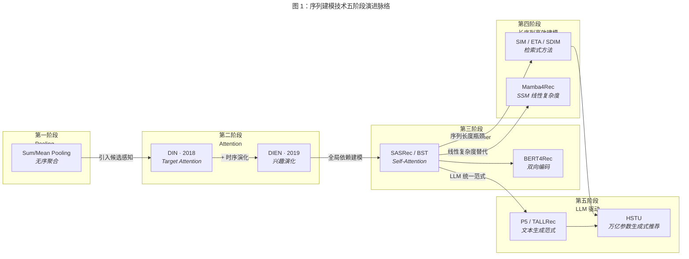

**第一阶段：池化（Pooling）方法。** 早期工作将用户行为序列视为无序集合，通过 sum/average pooling 将行为 embedding 聚合为固定长度的用户表示。这种方法忽略了行为的时序关系和候选相关性，但因其简洁高效而在工业系统中广泛应用。

**第二阶段：注意力（Attention）机制。** DIN [Zhou et al., 2018] 引入 target attention，根据候选物品对历史行为赋予不同权重，首次实现了候选感知的兴趣表示学习。DIEN [Zhou et al., 2019] 进一步引入 GRU 结合注意力机制建模兴趣的时序演化。这一阶段的核心贡献在于建立了 "行为序列中不同行为对当前预测贡献不等" 的建模范式。

**第三阶段：Transformer 架构。** BST [Chen et al., 2019] 将 Transformer 的 self-attention 机制引入用户行为建模，通过捕获行为间的全局依赖关系提升表示能力。SASRec [Kang and McAuley, 2018] 和 BERT4Rec [Sun et al., 2019] 分别从单向和双向自注意力的角度探索了 Transformer 在序列推荐中的应用。然而，Transformer 的 $O(n^2)$ 计算复杂度成为其在超长序列场景中部署的主要瓶颈。

**第四阶段：长序列高效建模。** 面对工业场景中长度达数千至数万的行为序列，研究者发展了两条技术路线：一是基于检索的方法，如 SIM [Pi et al., 2020] 通过两阶段检索从超长序列中筛选相关行为子集，ETA [Chen et al., 2021] 利用局部敏感哈希实现端到端检索；SDIM [Cao et al., 2022] 则通过采样策略降低计算开销。二是引入线性复杂度的新架构，如基于状态空间模型（State Space Model, SSM）的方法。S4 [Gu et al., 2022] 和 Mamba [Gu and Dao, 2023] 等 SSM 架构以线性时间复杂度处理长序列，Mamba4Rec [Liu et al., 2024] 首次将选择性 SSM 引入序列推荐场景。

**第五阶段：大语言模型（LLM）驱动。** 随着大语言模型展现出强大的通用序列理解能力，研究者开始探索 LLM 在推荐系统中的应用。P5 [Geng et al., 2022] 将推荐任务统一为文本生成范式，TALLRec [Bao et al., 2023] 提出了高效的 LLM 微调框架用于推荐对齐。Meta 提出的 HSTU [Zhai et al., 2024] 则从工业规模的角度展示了万亿参数级别的序列转导器在生成式推荐中的潜力。

### 1.4 本综述的贡献

本综述对推荐系统 CTR 预估中的用户行为序列建模技术进行系统性梳理，主要贡献如下：

1. **统一的技术分类体系。** 我们构建了一个涵盖注意力机制、Transformer、状态空间模型、图神经网络和大语言模型五大技术族的分类框架，并在每个类别内进一步细分为具体的技术变体，形成层次化的技术图谱。

2. **跨领域技术借鉴视角。** 本综述不局限于推荐系统领域内部的文献，而是系统性地分析了自然语言处理、计算机视觉和语音处理等领域中序列建模技术向推荐系统迁移的路径与适配挑战，揭示跨界借鉴的机遇与陷阱。

3. **工业部署实践的深度分析。** 我们收集并对比了阿里巴巴、Meta、Google、美团等头部企业在用户行为序列建模方面的工程实践，包括在线服务架构、计算优化策略和 A/B 测试结果，弥合学术研究与工业落地之间的认知鸿沟。

4. **结构化对比与前沿展望。** 通过多维度的对比表格和统一实验框架的分析，我们为研究者提供了模型选择的决策依据，并基于技术趋势提出了若干具有启发性的未来研究方向。

### 1.5 与已有综述的差异化定位

序列推荐领域已有若干综述工作。Wang et al. [2019] 在 IJCAI 上发表了面向序列推荐系统的综述，但主要聚焦于 RNN 时代的方法，未覆盖 Transformer 及后续技术。Wu et al. [2023] 和 Lin et al. [2024] 分别从不同角度综述了 LLM 在推荐系统中的应用，但未深入分析序列建模这一核心子问题的技术演进。

本综述与上述工作的关键差异在于：

- **聚焦于 CTR 预估中的序列建模。** 不同于泛化的序列推荐综述，本文以工业 CTR 预估为锚点，重点分析序列建模组件在完整 CTR 模型中的角色与交互方式，更贴近工业实践需求。
- **覆盖最新技术前沿。** 本文系统覆盖了 2023-2025 年间涌现的 SSM、Mamba 和 LLM 驱动的序列建模方法，填补了现有综述的时效性空白。
- **强调跨界借鉴与工程落地。** 本文独特地增加了跨领域技术迁移分析和工业部署实践两个维度，为研究者和工程师提供更全面的参考。

### 1.6 综述的组织结构

本综述的后续内容组织如下：第 2 章介绍背景知识与问题定义；第 3 章构建序列建模技术的分类体系；第 4-8 章分别深入分析基于注意力机制、Transformer、状态空间模型、图神经网络和 LLM 的序列建模方法；第 9 章讨论跨界技术借鉴；第 10 章总结工业部署实践；第 11 章进行结构化对比分析；第 12 章探讨未来研究方向；第 13 章给出结论。

---

## 2. 背景与问题定义

### 2.1 CTR 预估的形式化定义

点击率预估的目标是：给定一个用户 $u$、一个候选物品（item）$i$ 以及当前的上下文信息 $c$，预测用户点击该物品的概率：

$$\hat{y} = f(u, i, c; \theta) = P(\text{click} = 1 \mid u, i, c)$$

其中 $f(\cdot)$ 为参数化的预测模型，$\theta$ 为模型参数，$\hat{y} \in [0, 1]$ 为预测的点击概率。

在深度 CTR 模型的通用框架下，输入特征通常可以分解为以下几个组成部分：

- **用户画像特征（User Profile Features）：** $\mathbf{x}_u = [x_u^1, x_u^2, \ldots, x_u^{m_u}]$，包括用户 ID、年龄、性别、地理位置等静态属性。
- **物品特征（Item Features）：** $\mathbf{x}_i = [x_i^1, x_i^2, \ldots, x_i^{m_i}]$，包括物品 ID、类目、品牌、价格等属性。
- **上下文特征（Context Features）：** $\mathbf{x}_c = [x_c^1, x_c^2, \ldots, x_c^{m_c}]$，包括时间、设备、请求场景等环境信息。
- **用户行为序列特征（User Behavior Sequence Features）：** $\mathbf{S}_u = [b_1, b_2, \ldots, b_T]$，用户按时间顺序排列的历史行为记录，这是本综述关注的核心输入。

模型的训练目标通常为最小化二元交叉熵（Binary Cross-Entropy）损失：

$$\mathcal{L} = -\frac{1}{N} \sum_{j=1}^{N} \left[ y_j \log \hat{y}_j + (1 - y_j) \log (1 - \hat{y}_j) \right]$$

其中 $N$ 为训练样本数，$y_j \in \{0, 1\}$ 为真实标签。

### 2.2 用户行为序列的数学表示

用户 $u$ 的历史行为序列定义为一个时间有序的行为元组序列：

$$\mathbf{S}_u = [(b_1, t_1, a_1), (b_2, t_2, a_2), \ldots, (b_T, t_T, a_T)]$$

其中：
- $b_t$ 为第 $t$ 个交互的物品标识（item ID）；
- $t_t$ 为该交互发生的时间戳；
- $a_t \in \mathcal{A}$ 为行为类型，$\mathcal{A} = \{\text{click}, \text{add-to-cart}, \text{purchase}, \text{dwell}, \ldots\}$ 为预定义的行为类型集合；
- $T$ 为序列长度。

在实际建模中，每个行为 $b_t$ 通过 embedding 层映射为稠密向量表示：

$$\mathbf{e}_t = \text{Embed}(b_t) \in \mathbb{R}^d$$

其中 $d$ 为 embedding 维度。序列的 embedding 矩阵表示为：

$$\mathbf{E}_u = [\mathbf{e}_1, \mathbf{e}_2, \ldots, \mathbf{e}_T] \in \mathbb{R}^{T \times d}$$

为了编码时序信息，通常还会引入位置编码（Positional Encoding）或时间间隔编码（Time Interval Encoding）：

$$\mathbf{e}_t' = \mathbf{e}_t + \mathbf{p}_t + \mathbf{w}_{a_t}$$

其中 $\mathbf{p}_t$ 为位置或时间编码向量，$\mathbf{w}_{a_t}$ 为行为类型 embedding。

序列建模模块的核心任务是将用户行为序列 $\mathbf{E}_u$ 编码为一个（或多个）兴趣表示向量 $\mathbf{v}_u$：

$$\mathbf{v}_u = g(\mathbf{E}_u, \mathbf{e}_i; \phi)$$

其中 $g(\cdot)$ 为序列编码函数，$\mathbf{e}_i$ 为候选物品的 embedding（在 target-aware 模型中参与编码过程），$\phi$ 为编码模块的参数。该兴趣表示随后与其他特征一起输入到 MLP 等预测层中计算最终的 CTR 预估值。

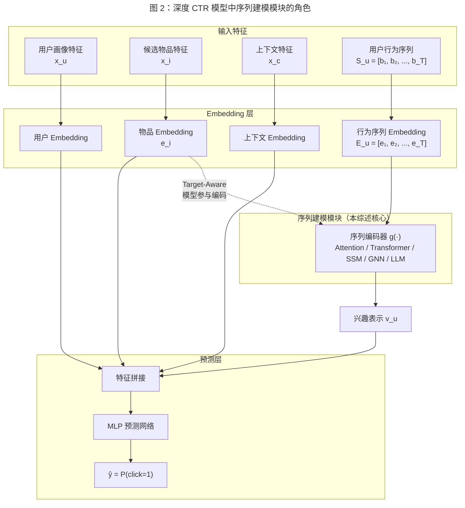

### 2.3 核心挑战

用户行为序列建模面临以下关键技术挑战：

#### 2.3.1 长序列建模的计算瓶颈

在工业级推荐系统中，活跃用户的行为序列长度可达数千甚至数万。例如，阿里巴巴的 SIM [Pi et al., 2020] 报告其系统中用户行为序列最大长度可达 54,000。然而，主流的注意力机制和 Transformer 架构的计算复杂度为 $O(T^2)$（$T$ 为序列长度），在超长序列场景下面临严峻的计算瓶颈。

这一挑战催生了两类解决思路：（1）检索式方法，通过预筛选从长序列中提取与候选物品相关的行为子集，将有效输入长度压缩至可接受范围；（2）线性复杂度的序列模型，如 SSM 和线性注意力（Linear Attention），以 $O(T)$ 复杂度替代 $O(T^2)$ 的全注意力计算。两类方法各有利弊：检索式方法可能丢失全局上下文，而线性模型的表达能力是否足以媲美全注意力仍是开放问题。

#### 2.3.2 行为稀疏性与冷启动

用户行为在物品空间上呈现严重的长尾分布：少量热门物品积累了大量交互，而绝大多数物品的交互记录极为稀疏。对于新用户（冷启动用户），行为序列长度可能不足以支撑有效的兴趣建模。这一问题在实际系统中尤为突出——工业数据集中，超过 50% 的用户可能仅有不到 10 条行为记录。

应对策略包括：利用辅助信息（side information）如物品属性和类目层级构建泛化的行为表示；通过预训练范式在大规模无标注行为数据上学习通用的序列表示；以及借助 LLM 的通用知识增强冷启动场景下的兴趣推断。

#### 2.3.3 实时性约束

工业推荐系统对在线推理延迟有严格要求，通常需要在 10-50 毫秒内完成单次 CTR 预估。这意味着序列建模模块不仅要追求预测精度，还必须满足严格的计算预算限制。

实时性约束对模型设计产生了深远影响：复杂的序列编码器可能在离线评估中表现优异，但因推理延迟过高而无法上线部署。因此，工业界发展出了一系列工程优化策略，包括行为序列的异步预计算与缓存（如 SIM 的 GSU/ESU 两阶段架构）、模型蒸馏与量化、以及专用硬件加速。HSTU [Zhai et al., 2024] 的设计表明，通过简化注意力机制并优化算子实现，可以在保持模型质量的同时大幅提升推理速度（详见第 5 章）。

#### 2.3.4 多行为类型融合

用户的不同行为类型（点击、加购、购买、停留时长等）承载着不同层次的兴趣信号。点击行为反映浅层兴趣和探索意图，购买行为则指示更强的偏好确认。简单地将所有行为类型混合为单一序列会导致信号噪声混杂，而完全独立建模又会忽略不同行为类型之间的协同关系。

多行为融合的难点在于：不同行为类型的频率和分布差异显著（点击远多于购买），且行为间存在复杂的因果和层级关系（浏览 $\to$ 点击 $\to$ 加购 $\to$ 购买）。有效的融合策略需要在不同粒度和强度的信号之间建立合理的权重分配和交互机制。

#### 2.3.5 兴趣的多样性与多粒度性

用户通常同时具有多个不同领域的兴趣，且每个兴趣的活跃程度随时间变化。例如，一个用户可能同时关注 "电子产品"、"图书" 和 "运动健身" 三个品类，但在不同时段的兴趣侧重有所不同。单一向量的兴趣表示难以充分刻画这种多样性，而多兴趣表示（multi-interest representation）则引入了额外的聚合与匹配复杂性。

此外，兴趣存在不同的粒度层次：用户可能在品类级别偏好 "运动鞋"，在品牌级别偏好 "Nike"，在风格级别偏好 "简约设计"。序列建模需要同时捕获这些不同粒度的兴趣模式。

### 2.4 评价指标与实验设置

#### 2.4.1 离线评价指标

CTR 预估模型的离线评估通常采用以下核心指标：

**AUC（Area Under the ROC Curve）。** 衡量模型区分正负样本的能力，是 CTR 预估领域最广泛使用的指标。定义为：

$$\text{AUC} = \frac{\sum_{i \in \mathcal{D}^+} \sum_{j \in \mathcal{D}^-} \mathbb{1}[\hat{y}_i > \hat{y}_j]}{|\mathcal{D}^+| \cdot |\mathcal{D}^-|}$$

其中 $\mathcal{D}^+$ 和 $\mathcal{D}^-$ 分别为正样本集和负样本集。在工业实践中，AUC 提升 0.001（即 0.1%）通常被认为具有统计显著性和业务价值。

**GAUC（Group AUC）。** 针对推荐场景的改进指标，按用户分组计算 AUC 后取加权平均，避免了用户间样本不平衡对全局 AUC 的干扰：

$$\text{GAUC} = \frac{\sum_{u} w_u \cdot \text{AUC}_u}{\sum_{u} w_u}$$

其中 $w_u$ 通常为用户 $u$ 的展示次数或点击次数。

**LogLoss（Binary Cross-Entropy Loss）。** 衡量预测概率的校准（calibration）质量：

$$\text{LogLoss} = -\frac{1}{N} \sum_{j=1}^{N} \left[ y_j \log \hat{y}_j + (1 - y_j) \log (1 - \hat{y}_j) \right]$$

LogLoss 对预测概率的绝对值敏感，是评估模型在竞价排名等需要精确概率估计场景下的重要指标。

在序列推荐任务中，还常用以下排序指标：

- **NDCG@K（Normalized Discounted Cumulative Gain）：** 衡量推荐列表的排序质量，对位置靠前的相关物品赋予更高权重。
- **HR@K（Hit Rate）：** 衡量推荐列表前 K 个位置中是否包含用户实际交互的物品。
- **MRR（Mean Reciprocal Rank）：** 衡量第一个正确推荐出现的位置。

#### 2.4.2 在线评价指标

在工业部署中，模型的最终评判依赖在线 A/B 测试，核心指标包括：

- **CTR 提升（CTR Lift）：** 实验组相对对照组的点击率变化。
- **RPM（Revenue Per Mille）：** 千次展示收入，衡量广告场景的商业收益。
- **GMV（Gross Merchandise Volume）：** 成交总额，衡量电商场景的整体转化效果。
- **用户留存率和使用时长：** 衡量推荐质量对用户长期参与度的影响。

#### 2.4.3 通用实验框架

为确保不同序列建模方法之间的公平比较，本综述推荐以下通用实验设置框架：

**公开基准数据集。** 常用的基准数据集包括：
- **Amazon Product Reviews：** 涵盖多个商品类目的用户评论和评分数据，适用于序列推荐评估，数据集规模适中。
- **MovieLens：** 经典的电影推荐数据集，包含丰富的时间戳信息，适用于时序建模评估。
- **Taobao/Tmall 广告数据集：** 来自阿里巴巴的工业级 CTR 预估数据集，包含真实的用户行为序列和广告展示日志。
- **Kuaishou/KuaiRand：** 来自快手的短视频推荐数据集，包含用户与短视频之间的多种交互行为。

**数据划分协议。** 遵循严格的时间顺序划分原则：训练集、验证集和测试集按时间先后顺序划分，避免数据泄漏。典型的划分方式为：以最后一天或最后一个小时的数据作为测试集，倒数第二天或倒数第二小时作为验证集，其余数据作为训练集。

**基础模型架构。** 为隔离序列建模组件的贡献，建议在统一的 base model 框架（如 Embedding + MLP 骨架）上替换序列编码模块进行对比。需控制的变量包括：embedding 维度、MLP 层数与宽度、优化器配置、正则化策略等。

**效率指标。** 除预测精度外，应同时报告以下效率指标以评估模型的实际部署可行性：
- 模型参数量（Parameter Count）；
- 训练吞吐量（Training Throughput, samples/second）；
- 推理延迟（Inference Latency, P50/P99）；
- 支持的最大序列长度。

## 3. 序列建模技术分类体系

本章构建一个系统的、多维度的序列建模技术分类框架（Taxonomy），为后续各章的深入分析提供全局视角和组织骨架。

### 3.1 分类维度设计

对推荐系统 CTR 预估中的序列建模技术进行分类，需要兼顾**技术原理的正交性**与**工程应用的实用性**。我们提出三个互补的分类维度：

**维度一：序列编码架构（Sequence Encoder Architecture）。** 这是最核心的分类维度，按照序列编码模块所采用的神经网络架构进行划分。该维度直接决定了模型的计算复杂度、序列建模能力和可扩展性。本综述识别出九大技术族（详见 3.2 节）。

**维度二：建模目标与交互范式（Modeling Objective）。** 按照模型对用户行为序列的利用方式进行划分：

- **Target-Aware（候选感知）模型：** 序列编码过程显式依赖于候选物品表示，通过注意力或检索机制提取与候选相关的兴趣子集。代表方法包括 DIN [Zhou et al., 2018]、SIM [Pi et al., 2020]。该范式在 CTR 预估场景中占据主导地位，因为其输出直接服务于候选物品的打分。
- **Target-Agnostic（候选无关）模型：** 独立于候选物品生成用户兴趣表示，通常以 next-item prediction 或 masked-item prediction 为自监督目标。代表方法包括 SASRec [Kang and McAuley, 2018]、BERT4Rec [Sun et al., 2019]。该范式更常见于召回（retrieval）阶段，但也可通过后续的内积或 MLP 层接入排序阶段。
- **生成式（Generative）模型：** 将推荐任务转化为序列生成问题，通过自回归解码直接产出推荐结果。代表方法包括 P5 [Geng et al., 2022]、HSTU [Zhai et al., 2024]。

**维度三：序列长度处理策略（Sequence Length Strategy）。** 按照模型应对不同序列长度的方式进行划分：

- **全序列处理（Full-Sequence）：** 直接对完整序列施加编码，适用于短序列场景（$T \leq 200$）。大多数注意力和 Transformer 方法属于此类。
- **截断/滑窗（Truncation/Sliding Window）：** 通过截取最近 $K$ 个行为或滑动窗口降低输入规模，简单高效但可能丢失长期信号。
- **检索式（Retrieval-based）：** 先从超长序列中检索与候选相关的行为子集，再对子集施加精细编码。SIM [Pi et al., 2020]、ETA [Chen et al., 2021]、SDIM [Cao et al., 2022] 属于此类，专为工业场景中 $T > 1{,}000$ 的超长序列设计。
- **线性复杂度编码（Linear-Complexity）：** 采用 $O(T)$ 复杂度的架构直接处理长序列，如 SSM/Mamba 系列方法。

这三个维度相互正交：一个具体方法可以同时在三个维度上定位。例如，SIM 在维度一上属于 Retrieval-based，在维度二上属于 Target-Aware，在维度三上属于检索式长序列处理。

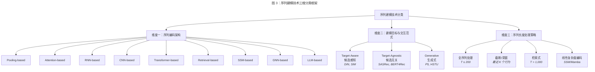

### 3.2 技术族谱：九大序列编码范式

根据序列编码架构维度，我们将现有方法划分为以下九大技术族，每个技术族代表一种独特的序列信息处理范式。

#### 3.2.1 Pooling-based 方法

**核心思想：** 将用户行为序列视为无序集合，通过聚合操作将变长序列压缩为固定维度的向量表示。

**代表方法：**
- **Sum Pooling：** $\mathbf{v}_u = \sum_{t=1}^{T} \mathbf{e}_t$，将所有行为 embedding 求和。被广泛应用于 Wide & Deep [Cheng et al., 2016]、DeepFM [Guo et al., 2017] 等经典 CTR 模型中作为序列特征的默认编码方式。
- **Mean Pooling：** $\mathbf{v}_u = \frac{1}{T} \sum_{t=1}^{T} \mathbf{e}_t$，对序列长度进行归一化。
- **Max Pooling：** $\mathbf{v}_u = \max_{t} \mathbf{e}_t$，按维度取最大值，捕获最显著的特征。

**特点与局限：** Pooling 方法具有 $O(T)$ 的线性复杂度和极高的推理效率，在工业系统中作为 baseline 广泛使用。其核心局限在于完全忽略行为的时序关系和候选相关性——无论行为发生的先后顺序如何，无论当前候选物品是什么，编码结果均相同。

#### 3.2.2 Attention-based 方法

**核心思想：** 引入注意力机制，根据行为与候选物品（或行为与行为）之间的相关性动态分配权重，实现差异化的序列聚合。

**代表方法：**
- **DIN（Deep Interest Network）[Zhou et al., 2018]：** 首次提出 Target Attention 机制，以候选物品为 query 对历史行为计算注意力权重：$\mathbf{v}_u = \sum_{t=1}^{T} \alpha(\mathbf{e}_t, \mathbf{e}_i) \cdot \mathbf{e}_t$，其中 $\alpha(\cdot)$ 为局部激活函数。这一设计使模型能够自适应地关注与当前候选物品相关的历史行为，开创了 CTR 序列建模的新范式。
- **DIEN（Deep Interest Evolution Network）[Zhou et al., 2019]：** 在 DIN 基础上引入兴趣演化建模，通过辅助损失和注意力更新的 GRU（AUGRU）显式捕获兴趣随时间的演化轨迹。DIEN 是注意力方法与 RNN 方法的混合架构。
- **DMIN（Deep Multi-Interest Network）[Xiao et al., 2020]：** 将多头注意力机制引入用户兴趣建模，每个注意力头捕获一个独立的兴趣方向，形成多兴趣表示。

**特点：** Attention-based 方法在 CTR 预估领域具有里程碑意义，DIN 确立了 "target-aware 序列建模" 这一核心范式。但标准注意力的 $O(T)$（target attention）或 $O(T^2)$（self-attention）复杂度限制了其在超长序列上的直接应用。

#### 3.2.3 RNN-based 方法

**核心思想：** 利用循环神经网络的隐状态传递机制，沿时间轴逐步编码序列信息，天然适合建模时序依赖。

**代表方法：**
- **GRU4Rec [Hidasi et al., 2016]：** 将 GRU 引入基于会话的推荐场景，是深度学习应用于序列推荐的开创性工作。通过 session-parallel mini-batch 训练策略和排序损失函数，实现了对用户短期会话行为的有效建模。
- **NARM（Neural Attentive Recommendation Machine）[Li et al., 2017]：** 在 GRU 编码器之上叠加注意力机制，同时捕获序列行为的局部目的和全局偏好，是 RNN+Attention 混合架构的典型代表。
- **DIEN 中的 GRU 组件 [Zhou et al., 2019]：** DIEN 的兴趣演化模块采用带注意力更新门的 GRU（AUGRU），将候选物品的信号注入 GRU 的门控机制中，实现 target-aware 的兴趣演化追踪。

**特点与局限：** RNN 方法具有 $O(T)$ 的时间复杂度，且能编码任意长度的序列历史（通过隐状态压缩）。然而，其顺序计算特性导致训练难以并行化，且在实践中对远距离依赖的捕获能力有限（梯度消失问题）。此外，在工业场景中，RNN 的逐步推理模式对在线延迟也构成挑战。

#### 3.2.4 CNN-based 方法

**核心思想：** 将用户行为序列视为一维（或二维）信号，利用卷积滤波器捕获局部 n-gram 模式和序列中的位置依赖关系。

**代表方法：**
- **Caser（Convolutional Sequence Embedding Recommendation）[Tang and Wang, 2018]：** 将最近 $L$ 个交互物品的 embedding 矩阵视为 "图像"，同时应用水平卷积（捕获 point-level 序列模式）和垂直卷积（捕获 union-level 特征交互），是 CNN 在序列推荐中的开创性应用，发表于 WSDM 2018。
- **NextItNet [Yuan et al., 2019]：** 采用膨胀卷积（dilated convolution）构建深层残差网络，通过指数级增长的感受野捕获长距离依赖，同时保持参数高效。NextItNet 还引入了生成式训练目标，将序列推荐建模为逐步的条件生成过程。

**特点与局限：** CNN 方法的主要优势在于计算可并行化（相比 RNN）且擅长捕获局部模式。但标准卷积的感受野受限于滤波器大小和网络深度，对超长距离的全局依赖建模能力不如 Transformer。在推荐系统领域，CNN 方法的研究热度在 Transformer 兴起后逐渐降低。

#### 3.2.5 Transformer-based 方法

**核心思想：** 利用自注意力（Self-Attention）机制捕获序列中任意两个位置之间的依赖关系，突破了 RNN 的顺序计算限制和 CNN 的局部感受野限制。

**代表方法：**
- **SASRec（Self-Attentive Sequential Recommendation）[Kang and McAuley, 2018]：** 将单向（causal）Transformer 应用于序列推荐，通过 masked self-attention 确保模型仅关注当前位置之前的行为，是 Transformer 在序列推荐中的标志性工作。
- **BERT4Rec [Sun et al., 2019]：** 借鉴 BERT 的双向编码思想，采用 Cloze task（随机 mask 序列中的物品并预测）进行训练，能够利用双向上下文信息进行更丰富的序列理解。
- **BST（Behavior Sequence Transformer）[Chen et al., 2019]：** 将 Transformer 编码器嵌入完整的 CTR 预估框架中，以候选物品拼接行为序列作为输入，在阿里巴巴的工业系统中取得了显著效果。
- **HSTU（Hierarchical Sequential Transduction Unit）[Zhai et al., 2024]：** Meta 提出的面向工业规模的序列转导架构。HSTU 对标准 Transformer 进行了针对性简化——移除 LayerNorm 和 FFN 层，采用 pointwise 聚合替代 softmax attention——在万亿参数规模下实现了显著的推理加速（详见第 5 章），同时支持生成式推荐目标。

**特点与局限：** Transformer 凭借全局感受野和并行训练能力，在序列建模精度上通常优于 RNN 和 CNN。但 $O(T^2)$ 的 self-attention 复杂度是其在超长序列场景中的主要瓶颈。工业实践中通常需要配合序列截断或高效注意力变体使用。

#### 3.2.6 Retrieval-based 方法（长序列专用）

**核心思想：** 面对超长行为序列（$T > 1{,}000$），放弃对全序列的直接编码，转而通过检索机制从长序列中筛选与候选物品最相关的行为子集，再对子集施加精细的序列编码。

**代表方法：**
- **SIM（Search-based Interest Model）[Pi et al., 2020]：** 提出两阶段级联架构——General Search Unit（GSU）负责从超长序列中快速检索候选相关行为（基于类目匹配或向量内积），Exact Search Unit（ESU）对检索结果施加精细的注意力编码。SIM 支持的序列长度详见第 2.3.1 节和第 5.2.1 节，其在阿里巴巴展示广告系统中上线部署，验证了长期行为信号对 CTR 的显著增益。
- **ETA（End-to-end Target Attention）[Chen et al., 2021]：** 针对 SIM 中 GSU 与主模型训练目标不一致的问题，利用局部敏感哈希（Locality-Sensitive Hashing, LSH）实现端到端可训练的行为检索，消除了两阶段方法的 "信息鸿沟"。
- **SDIM（Sampling-based Deep Interest Modeling）[Cao et al., 2022]：** 采用多哈希函数签名匹配策略，通过采样而非显式搜索实现长序列建模，在保持与注意力模型可比精度的同时大幅降低计算开销。

**特点：** Retrieval-based 方法是工业界应对超长序列的主流解决方案，其核心权衡在于检索阶段的信息损失与计算效率之间的平衡。三个方法代表了该方向从离线索引（SIM）到端到端可训练（ETA）再到无需显式搜索（SDIM）的技术演进。

#### 3.2.7 SSM-based 方法（State Space Model）

**核心思想：** 基于状态空间模型的连续时间动力系统框架，将序列建模表述为线性递推过程，实现 $O(T)$ 的线性计算复杂度和 $O(1)$ 的常数推理步长。

**代表方法：**
- **Mamba4Rec [Liu et al., 2024]：** 首次将选择性状态空间模型（Selective SSM / Mamba）引入序列推荐任务。通过输入依赖的选择机制（selection mechanism），Mamba4Rec 能够根据输入内容动态调整状态转移参数，克服了传统线性 SSM 的内容无关局限。实验表明其在效果和效率上均优于 RNN 和注意力基线。
- **其他相关工作：** S4 [Gu et al., 2022] 和 Mamba [Gu and Dao, 2023] 作为 SSM 方向的基础架构，为推荐领域的应用提供了理论和工程基础。学术界正在积极探索 SSM 在推荐系统中更广泛的应用，包括多兴趣 SSM、跨域 SSM 等变体。

**特点与局限：** SSM 方法的核心优势在于线性时间复杂度和理论上无限的序列建模范围，特别适合长序列场景。但作为推荐领域的新兴方向（2024 年起），其在大规模工业系统中的验证仍较有限，选择性机制对推荐任务特有模式（如兴趣突变、多峰分布）的适配性有待深入研究。

#### 3.2.8 GNN-based 方法

**核心思想：** 将用户行为序列转化为图结构（session graph），利用图神经网络在图上传播信息以捕获物品之间的复杂转移关系，突破了纯序列模型对线性时序的假设。

**代表方法：**
- **SR-GNN（Session-based Recommendation with GNN）[Wu et al., 2019]：** 将会话中的物品序列建模为有向图，通过 Gated GNN 在图上传播信息，结合注意力机制生成会话表示。SR-GNN 首次证明了图结构视角对序列推荐的有效性，发表于 AAAI 2019。
- **FGNN [Qiu et al., 2019]：** 提出同时考虑序列中物品的顺序关系和潜在关联关系，通过加权注意力图层和 Readout 函数学习物品与会话的表示，将下一物品推荐建模为图分类问题。
- **GCE-GNN（Global Context Enhanced GNN）[Wang et al., 2020]：** 在 session graph 的基础上引入全局图（global graph），通过聚合跨会话的物品转移模式增强局部会话表示，解决了 SR-GNN 仅建模单会话内信息的局限。

**特点与局限：** GNN 方法的独特优势在于能够建模物品之间的非线性转移关系和高阶连接模式。但图构建和消息传递的计算开销较大，且在 CTR 预估（而非 session-based 推荐）场景中的应用相对有限——大多数 GNN 工作聚焦于 session-based 推荐的 next-item prediction 任务，与 CTR 排序模型的集成方式仍在探索中。

#### 3.2.9 LLM-based 方法

**核心思想：** 利用大语言模型强大的序列理解和生成能力，将推荐任务重新表述为自然语言处理任务，通过文本化的行为序列描述和语言模型推理实现推荐。

**代表方法：**
- **P5 [Geng et al., 2022]：** 将评分预测、序列推荐、解释生成等多种推荐任务统一为 text-to-text 生成范式，基于 T5 架构通过 prompt 模板实现多任务预训练，是 LLM 驱动推荐的开创性工作。
- **TALLRec [Bao et al., 2023]：** 提出轻量级的 LLM 微调框架，通过指令微调（instruction tuning）将 LLaMA 等通用 LLM 对齐到推荐任务，仅需少量样本即可取得有效推荐效果。
- **HSTU 的生成式推荐模式 [Zhai et al., 2024]：** 虽然 HSTU 在架构上属于 Transformer 族，但其万亿参数规模和生成式训练目标使其同时具备 LLM 的特征——通过自回归方式生成用户下一步可能交互的物品，模糊了传统序列推荐与语言模型之间的边界。

**特点与局限：** LLM-based 方法带来了全新的推荐范式——零样本/少样本推荐、跨域知识迁移和自然语言可解释性。但其面临推理效率低（生成式解码远慢于向量内积）、物品空间对齐困难（LLM 的词表与物品 ID 空间不匹配）、以及大规模工业部署成本高昂等挑战。

### 3.3 技术演化时间线

推荐系统序列建模技术的发展呈现出清晰的阶段性特征。以下为关键里程碑节点：

| 年份 | 里程碑模型 | 技术贡献 | 发表会议 |
|------|-----------|---------|---------|
| 2016 | GRU4Rec [Hidasi et al., 2016] | 首次将 RNN/GRU 引入会话推荐，开创深度序列推荐研究 | ICLR Workshop |
| 2017 | NARM [Li et al., 2017] | RNN + Attention 混合架构，同时建模局部目的与全局偏好 | CIKM |
| 2018 | DIN [Zhou et al., 2018] | 提出 Target Attention，开创 CTR 场景的候选感知序列建模 | KDD |
| 2018 | Caser [Tang and Wang, 2018] | CNN 视角的序列推荐，水平与垂直卷积捕获序列模式 | WSDM |
| 2018 | SASRec [Kang and McAuley, 2018] | 单向 Transformer 用于序列推荐，self-attention 取代 RNN | ICDM |
| 2019 | DIEN [Zhou et al., 2019] | 兴趣演化网络，AUGRU 实现 target-aware 的时序演化建模 | AAAI |
| 2019 | BERT4Rec [Sun et al., 2019] | 双向 Transformer + Cloze task，序列推荐的预训练范式 | CIKM |
| 2019 | BST [Chen et al., 2019] | Transformer 嵌入工业 CTR 框架，阿里巴巴线上部署 | DLP-KDD |
| 2019 | SR-GNN [Wu et al., 2019] | 图神经网络视角的会话推荐，物品转移图 + Gated GNN | AAAI |
| 2019 | NextItNet [Yuan et al., 2019] | 膨胀因果卷积用于序列推荐，指数级感受野 | WSDM |
| 2020 | SIM [Pi et al., 2020] | 两阶段检索架构处理超长序列（最大达 54,000），工业部署 | CIKM |
| 2020 | GCE-GNN [Wang et al., 2020] | 全局图增强局部会话图，跨会话信息聚合 | SIGIR |
| 2021 | ETA [Chen et al., 2021] | 基于 LSH 的端到端长序列检索，消除两阶段信息鸿沟 | — |
| 2022 | SDIM [Cao et al., 2022] | 采样替代搜索的长序列建模，哈希签名匹配 | CIKM |
| 2022 | P5 [Geng et al., 2022] | 推荐任务统一为 text-to-text 生成，LLM 驱动推荐的先驱 | RecSys |
| 2023 | TALLRec [Bao et al., 2023] | 轻量级 LLM 微调对齐推荐任务，少样本有效 | RecSys |
| 2024 | HSTU [Zhai et al., 2024] | 万亿参数序列转导器，工业规模生成式推荐 | ICML 2024 |
| 2024 | Mamba4Rec [Liu et al., 2024] | 选择性 SSM 首次应用于序列推荐，线性复杂度 | — |

从时间线可以清晰观察到三个技术浪潮：**2016-2018 年的 RNN/CNN/Attention 奠基期**，以 GRU4Rec、DIN 和 Caser 为代表；**2018-2022 年的 Transformer 主导期**，以 SASRec、BST 和长序列检索方法为代表；**2022 年至今的多范式并行探索期**，LLM、SSM 和工业规模 Transformer 并进。

### 3.4 各范式的适用场景与局限性

下表从多个维度对九大技术范式进行结构化对比：

| 技术范式 | 计算复杂度 | 最佳适用场景 | 核心优势 | 主要局限 | 工业成熟度 |
|---------|-----------|------------|---------|---------|-----------|
| Pooling-based | $O(T)$ | 短序列 baseline、特征工程阶段 | 极致简洁高效，易于部署 | 无时序建模，无候选感知 | 极高 |
| Attention-based | $O(T)$~$O(T^2)$ | CTR 排序中的 target-aware 建模 | Target Attention 精准提取相关兴趣 | 原生方法不适用于超长序列 | 极高 |
| RNN-based | $O(T)$ | 会话推荐、短中序列的时序建模 | 天然编码时序依赖，隐状态压缩历史 | 训练不可并行，长距离依赖弱 | 高（逐步被替代） |
| CNN-based | $O(T \cdot k)$ | 局部模式重要的序列场景 | 并行训练，局部 n-gram 捕获高效 | 全局依赖需深层堆叠，研究活跃度下降 | 中 |
| Transformer-based | $O(T^2)$ | 中等长度序列（$T \leq 200$）的高精度建模 | 全局感受野，并行训练，表达能力强 | 二次复杂度限制长序列，推理开销大 | 高 |
| Retrieval-based | $O(T + K^2)$ | 超长序列（$T > 1{,}000$）的工业 CTR 场景 | 解耦检索与编码，支持万级序列长度 | 检索阶段可能丢失信息，系统复杂度高 | 极高（工业主流） |
| SSM-based | $O(T)$ | 长序列建模，低延迟推理场景 | 线性复杂度，常数推理步长 | 推荐领域验证有限，选择机制适配性待验证 | 低（新兴方向） |
| GNN-based | $O(T \cdot L)$ | 会话推荐、物品转移模式丰富的场景 | 建模非线性转移关系和高阶连接 | 图构建开销大，与 CTR 框架集成不直接 | 中 |
| LLM-based | $O(T \cdot V)$ | 冷启动、跨域推荐、可解释推荐 | 零样本能力，语义理解，跨域迁移 | 推理延迟高，物品空间对齐难，部署成本高 | 低（探索阶段） |

注：$T$ 为序列长度，$K$ 为检索子集大小，$k$ 为卷积核大小，$L$ 为 GNN 层数，$V$ 为词表大小。复杂度为近似表示，忽略了 embedding 维度等常数因子。

### 3.5 范式间的技术传承关系

序列建模各技术范式并非孤立发展，而是存在清晰的技术传承和交叉融合关系（图 4）。

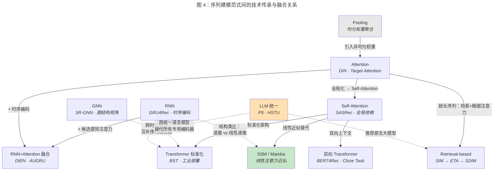

**从 Pooling 到 Attention 的演进。** Pooling 方法对所有行为赋予相同权重，可视为均匀注意力的退化形式。DIN [Zhou et al., 2018] 通过引入候选感知的非均匀权重，实现了从 "无差别聚合" 到 "差异化聚合" 的跨越，本质上是将 Pooling 泛化为 learned weighted sum。

**RNN + Attention 的融合。** DIEN [Zhou et al., 2019] 将 GRU 的时序编码能力与候选感知注意力机制结合，AUGRU 的设计直接将 attention score 注入 GRU 的更新门，是 RNN 和 Attention 两大范式深度耦合的典型案例。NARM [Li et al., 2017] 则在更早期实现了类似的 RNN+Attention 组合。

**从 Self-Attention 到 Transformer 的标准化。** SASRec [Kang and McAuley, 2018] 将 NLP 领域 Transformer [Vaswani et al., 2017] 的 self-attention 层引入推荐，建立了 "multi-head self-attention + position encoding + feedforward network" 的标准序列推荐架构。后续工作在此基础上进行各种改进：BERT4Rec 将训练目标从单向改为双向，BST 将其嵌入完整的 CTR 框架中。

**Attention 到 Retrieval 的扩展。** 当序列长度超过 Attention 的计算预算时，SIM [Pi et al., 2020] 将问题分解为 "检索 + 精细注意力" 两阶段，可以理解为先用低成本的近似注意力（GSU）筛选 top-K 行为，再用标准注意力（ESU）精细编码。ETA [Chen et al., 2021] 通过 LSH 近似实现了端到端的注意力，SDIM [Cao et al., 2022] 则用哈希采样进一步简化检索过程。三者体现了从精确注意力到近似注意力的渐进演化。

**从 Transformer 到 SSM 的范式切换。** SSM/Mamba 可以视为对 Transformer 注意力机制的线性近似替代——用状态递推取代全局注意力，以 $O(T)$ 复杂度实现对长程依赖的隐式建模。Mamba4Rec [Liu et al., 2024] 的选择性机制（selection mechanism）在功能上类似于 attention 的动态权重分配，但通过递推形式实现而非显式的全局计算。

**GNN 与序列方法的互补。** GNN 方法将行为序列视为图结构，本质上是在序列模型的线性时间链之外，增加了跨时间步的边（item-item transition edge）。GCE-GNN [Wang et al., 2020] 的全局图构建可以看作一种跨序列的协同过滤机制，与基于单用户行为序列的方法形成互补。

**LLM 的统一与重构。** LLM-based 方法试图用统一的语言模型取代上述所有专用序列编码器。P5 [Geng et al., 2022] 将推荐重构为文本生成，相当于用 LLM 的 Transformer 替代了专用的序列编码模块，并以自然语言作为统一的物品表示和交互接口。HSTU [Zhai et al., 2024] 则从相反方向出发，保留推荐任务的原生特征表示但将模型规模推向 LLM 量级，代表了 "推荐原生的大模型" 路线。

**总体趋势。** 序列建模技术的演化呈现出三条主线：（1）**表达能力递增**：从 Pooling 的无差别聚合，到 Attention 的加权聚合，到 Transformer 的全局依赖建模，到 LLM 的语义理解，模型对序列信息的刻画越来越精细；（2）**序列长度边界扩展**：从截断到全序列 Attention，到检索式方法处理万级序列，到 SSM 的理论无限长度，支持的序列规模持续增长；（3）**从专用到通用**：从 DIN 等针对 CTR 场景设计的专用模块，到 HSTU、P5 等追求通用推荐能力的大规模模型，技术路线正在从 "为推荐定制" 走向 "通用架构适配推荐"。

## 4. 基于注意力机制的序列建模

注意力机制是推荐系统序列建模领域最具里程碑意义的技术突破之一。从 DIN [Zhou et al., 2018] 首次引入 target attention 开始，注意力范式彻底改变了工业界对用户行为序列的建模方式——从"无差别聚合"走向"差异化、候选感知的兴趣提取"。本章系统梳理基于注意力机制的序列建模方法，涵盖 target attention 范式的建立与演进、多兴趣注意力建模、时间感知注意力机制，以及工业部署中的实践经验。

### 4.1 Target Attention 范式

#### 4.1.1 DIN：局部激活与候选感知注意力

**核心洞察。** 在 DIN [Zhou et al., 2018] 提出之前，工业 CTR 模型普遍采用 sum/average pooling 将用户行为序列编码为固定长度的向量表示。这种做法隐含了一个不合理的假设：用户历史中所有行为对当前候选物品的预测贡献均等。DIN 的核心洞察在于——用户兴趣具有**局部激活**（local activation）特性：当面对不同的候选物品时，只有用户历史行为中的一部分会被"激活"，对当前预测产生显著贡献。例如，一个同时购买过运动鞋和书籍的用户，当候选物品是一双跑步鞋时，其历史中的运动鞋相关行为远比书籍行为重要。

**Activation Unit。** DIN 通过一个精心设计的激活单元（activation unit）实现候选感知的注意力权重计算。给定候选物品 embedding $\mathbf{e}_i$ 和用户历史行为 embedding $\mathbf{e}_t$，注意力权重通过以下方式计算：

$$\alpha_t = \text{MLP}([\mathbf{e}_t; \mathbf{e}_i; \mathbf{e}_t \odot \mathbf{e}_i; \mathbf{e}_t - \mathbf{e}_i])$$

其中 $[\cdot;\cdot]$ 表示向量拼接，$\odot$ 表示逐元素乘积。将原始向量、元素级乘积和差值同时输入一个小型 MLP，能够捕获候选物品与历史行为之间多种粒度的交互模式。最终的用户兴趣表示为：

$$\mathbf{v}_u = \sum_{t=1}^{T} \alpha_t \cdot \mathbf{e}_t$$

值得注意的是，DIN 对注意力权重**不执行 softmax 归一化**。作者认为，softmax 归一化会将注意力权重约束为概率分布（和为 1），从而丢失行为序列整体活跃度的信息。例如，一个高度匹配的行为序列和一个弱匹配的行为序列经归一化后可能产生相似的权重分布，但前者的注意力权重之和应远大于后者。去除 softmax 使模型能够通过注意力权重的绝对大小传递序列整体相关性信号。

**训练优化：Mini-batch Aware Regularization 与 Dice 激活函数。** DIN 还提出了两项重要的工程创新。其一，针对大规模稀疏特征场景中 $\ell_2$ 正则化计算开销过大的问题，提出 mini-batch aware regularization，仅对每个 mini-batch 中出现的特征 embedding 施加正则化，大幅降低计算成本。其二，提出 Dice（Data Adaptive Activation Function）激活函数，根据输入数据的分布自适应调整激活阈值，替代传统的 PReLU，在训练过程中表现出更好的收敛性。

**影响与意义。** DIN 发表于 KDD 2018，是阿里巴巴在 CTR 序列建模领域的奠基性工作。其核心贡献在于确立了 **target-aware 序列建模**这一范式——序列编码过程不再独立于候选物品，而是以候选物品为锚点，从行为序列中自适应地提取相关兴趣。这一范式深刻影响了后续几乎所有工业 CTR 模型的设计，成为 CTR 序列建模的事实标准。

下图对比了 DIN 与 DIEN 的核心架构差异：

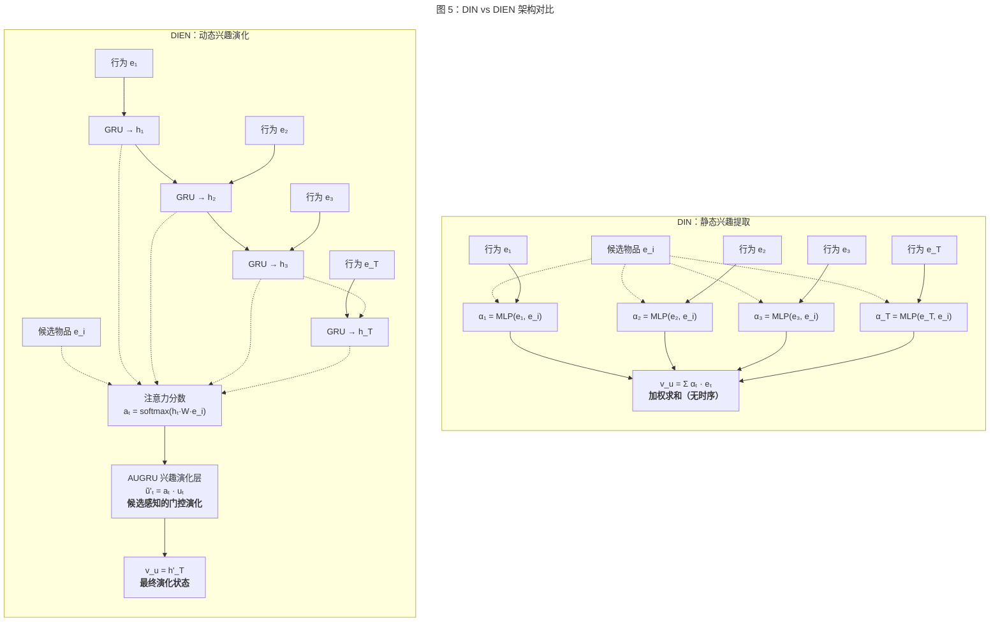

#### 4.1.2 DIEN：兴趣演化建模

**动机。** DIN 虽然实现了候选感知的兴趣提取，但将行为序列视为一个无序集合——注意力权重仅取决于行为与候选物品的相关性，完全忽略了行为发生的时间顺序。DIEN（Deep Interest Evolution Network）[Zhou et al., 2019] 指出，用户兴趣并非静态存在，而是沿时间轴不断演化的动态过程。例如，一个用户可能从关注入门级跑鞋逐步转向专业级跑鞋，这种兴趣演化轨迹蕴含了重要的预测信号。

**三层架构。** DIEN 设计了一个三层的兴趣建模架构：

**（1）行为层（Behavior Layer）。** 将原始行为序列 $[b_1, b_2, \ldots, b_T]$ 映射为 embedding 序列 $[\mathbf{e}_1, \mathbf{e}_2, \ldots, \mathbf{e}_T]$，这一层与 DIN 相同。

**（2）兴趣抽取层（Interest Extractor Layer）。** 使用 GRU 从行为 embedding 序列中抽取兴趣状态序列：

$$\mathbf{h}_t = \text{GRU}(\mathbf{e}_t, \mathbf{h}_{t-1})$$

然而，行为序列中的每一步行为并非用户真实兴趣的精确反映——行为受到曝光位置、随机点击等噪声因素的影响。为此，DIEN 引入**辅助损失（auxiliary loss）**：利用用户在时间步 $t+1$ 的真实点击行为 $b_{t+1}$ 作为正样本，未点击行为作为负样本，对每个时间步的隐状态 $\mathbf{h}_t$ 施加监督信号：

$$\mathcal{L}_{aux} = -\frac{1}{T-1} \sum_{t=1}^{T-1} \left[ \log \sigma(\mathbf{h}_t^{\top} \mathbf{e}_{t+1}^{+}) + \log (1 - \sigma(\mathbf{h}_t^{\top} \mathbf{e}_{t+1}^{-})) \right]$$

其中 $\mathbf{e}_{t+1}^{+}$ 和 $\mathbf{e}_{t+1}^{-}$ 分别为正样本和负样本的 embedding。辅助损失确保每个隐状态 $\mathbf{h}_t$ 确实编码了用户在时间步 $t$ 的真实兴趣，而非仅仅是行为的机械编码。

**（3）兴趣演化层（Interest Evolution Layer）。** 这是 DIEN 最核心的创新。在兴趣抽取层的基础上，DIEN 引入**注意力更新门 GRU（Attention-based GRU with Update gate, AUGRU）**，将候选物品的信号注入 GRU 的演化过程。具体而言，首先计算每个兴趣状态与候选物品的注意力分数：

$$a_t = \frac{\exp(\mathbf{h}_t^{\top} \mathbf{W} \mathbf{e}_i)}{\sum_{j=1}^{T} \exp(\mathbf{h}_j^{\top} \mathbf{W} \mathbf{e}_i)}$$

然后将注意力分数作用于 GRU 的更新门（update gate），使演化过程聚焦于与候选物品相关的兴趣方向：

$$\tilde{u}_t' = a_t \cdot u_t$$
$$\mathbf{h}_t' = (1 - \tilde{u}_t') \odot \mathbf{h}_{t-1}' + \tilde{u}_t' \odot \tilde{\mathbf{h}}_t'$$

其中 $u_t$ 为标准 GRU 的更新门，$a_t$ 为注意力分数。当某个时间步的兴趣与候选物品无关时（$a_t \approx 0$），更新门几乎关闭，演化状态保持不变；当兴趣高度相关时（$a_t \approx 1$），更新门打开，演化状态大幅更新。这一设计使兴趣演化过程**仅沿与候选物品相关的方向**推进，过滤掉无关的兴趣分支。

DIEN 作者在论文中对比了三种候选感知演化机制：AIGRU（直接用注意力分数缩放输入）、AGRU（替换 GRU 更新门为注意力分数）和 AUGRU（注意力分数与更新门相乘）。实验表明 AUGRU 效果最佳，因为它在保留 GRU 原有门控机制的同时融入了候选感知信号，实现了更平滑的兴趣演化建模。

**影响。** DIEN 发表于 AAAI 2019，在 DIN 的基础上将序列建模从"静态兴趣提取"推进到"动态兴趣演化追踪"。其辅助损失和 AUGRU 的设计思想被后续大量工作借鉴。DIEN 也是注意力机制与 RNN 深度耦合的经典范例——注意力不再仅用于序列聚合，而是被嵌入到序列编码器的内部状态更新过程中。

### 4.2 多兴趣注意力

#### 4.2.1 从单兴趣到多兴趣表示

DIN 和 DIEN 将用户行为序列编码为单一的兴趣向量 $\mathbf{v}_u$，隐含假设用户在某一时刻仅有一个活跃兴趣。然而，真实场景中用户通常同时具有多个独立的兴趣方向。例如，一个用户可能在上午浏览电子产品，下午关注图书，晚上查看运动装备——这些兴趣彼此独立，将其压缩为单一向量会导致信息损失和兴趣干扰。多兴趣表示（multi-interest representation）通过将用户行为序列编码为多个兴趣向量 $\{\mathbf{v}_u^1, \mathbf{v}_u^2, \ldots, \mathbf{v}_u^K\}$，每个向量捕获一个独立的兴趣方向，从而更准确地刻画用户兴趣的多样性。

#### 4.2.2 MIND：胶囊网络驱动的多兴趣提取

MIND（Multi-Interest Network with Dynamic Routing）[Li et al., 2019] 是多兴趣建模的开创性工作，发表于 CIKM 2019。MIND 创新性地将胶囊网络（capsule network）的动态路由（dynamic routing）机制引入用户兴趣建模。

**核心机制。** MIND 将用户行为 embedding 视为低层胶囊（low-level capsules），将用户兴趣视为高层胶囊（high-level capsules）。通过 Sabour et al. [2017] 提出的动态路由算法，行为 embedding 被迭代地聚合到 $K$ 个兴趣胶囊中：

$$\mathbf{v}_u^k = \text{squash}\left(\sum_{t=1}^{T} c_{t,k} \cdot \mathbf{W}_k \mathbf{e}_t\right), \quad k = 1, 2, \ldots, K$$

其中 $c_{t,k}$ 为动态路由系数，表示行为 $t$ 分配给兴趣 $k$ 的概率权重；$\mathbf{W}_k$ 为变换矩阵；$\text{squash}(\cdot)$ 为胶囊网络的非线性压缩函数，将向量长度归一化到 $(0,1)$ 区间以表示胶囊的激活概率。

路由系数 $c_{t,k}$ 通过迭代更新获得：初始化为均匀分布，然后根据行为 embedding 与兴趣胶囊之间的一致性（agreement）反复调整，使相似的行为自动聚合到同一兴趣胶囊中。这一过程无需外部监督信号，完全由行为之间的相似性驱动。

**候选感知的兴趣选择。** 在获得 $K$ 个兴趣向量后，MIND 通过候选物品与各兴趣向量的内积选择最相关的兴趣用于最终预测：

$$\mathbf{v}_u = \mathbf{v}_u^{k^*}, \quad k^* = \arg\max_{k} \, \mathbf{v}_u^{k\top} \mathbf{e}_i$$

在召回阶段，MIND 为每个兴趣向量独立检索 top-N 候选物品，合并后去重排序，实现了多路召回的统一框架。

#### 4.2.3 ComiRec：可控的多兴趣推荐

ComiRec [Cen et al., 2020] 在 MIND 的基础上进一步探索了多兴趣表示的可控性和多样性。ComiRec 提出了两种多兴趣提取机制：

**ComiRec-DR（Dynamic Routing）。** 沿用 MIND 的胶囊网络动态路由机制，但在训练和推理流程上进行了优化。

**ComiRec-SA（Self-Attention）。** 将多头自注意力（multi-head self-attention）作为多兴趣提取器。每个注意力头通过独立的 query 向量从行为序列中提取一个兴趣表示，$K$ 个注意力头对应 $K$ 个兴趣向量。具体而言：

$$\alpha_t^k = \frac{\exp(\mathbf{q}_k^{\top} \mathbf{e}_t)}{\sum_{j=1}^{T} \exp(\mathbf{q}_k^{\top} \mathbf{e}_j)}, \quad \mathbf{v}_u^k = \sum_{t=1}^{T} \alpha_t^k \cdot \mathbf{e}_t$$

其中 $\mathbf{q}_k$ 为第 $k$ 个注意力头的可学习 query 向量。

**聚合与多样性控制。** ComiRec 的另一关键贡献是引入了可控的聚合模块，通过调节多样性与准确性之间的平衡，控制最终推荐列表的多样性。在推理阶段，ComiRec 采用基于贪心的多样性感知聚合策略，确保不同兴趣向量检索的结果在最终推荐列表中得到均衡体现。

#### 4.2.4 DMIN：基于多头注意力的深度多兴趣网络

DMIN（Deep Multi-Interest Network）[Xiao et al., 2020] 发表于 CIKM 2020，从一个不同的角度解决多兴趣建模问题。与 MIND 使用胶囊网络不同，DMIN 直接利用多头注意力（multi-head attention）实现多兴趣提取，每个注意力头被视为一个独立的兴趣通道。

**行为级别的细粒度注意力。** DMIN 的核心特点在于，它不仅在兴趣提取阶段使用多头注意力，还在行为表示学习阶段引入了位置编码和行为间的自注意力交互，使每个行为的表示能够融合其上下文信息。随后，多个注意力头并行地从增强后的行为表示中提取不同方向的兴趣：

$$\text{head}_k = \text{Attention}(\mathbf{Q}_k, \mathbf{K}, \mathbf{V})$$

其中 $\mathbf{Q}_k$ 为第 $k$ 个兴趣方向的 query 矩阵，$\mathbf{K}$ 和 $\mathbf{V}$ 来自增强后的行为表示。每个 head 的输出经过独立的变换后形成一个兴趣向量。

**与 target attention 的结合。** DMIN 在获得多个兴趣向量后，通过候选物品对多兴趣进行 target-aware 的加权聚合，使最终的用户表示既保留了兴趣的多样性，又具备候选感知能力。

#### 4.2.5 多兴趣方法的对比与讨论

三种多兴趣方法在兴趣提取机制上存在本质差异：MIND 基于胶囊网络的竞争性路由，行为被软分配到不同兴趣胶囊中，路由过程具有迭代收敛的特性；ComiRec-SA 基于可学习的 query 向量驱动的自注意力，每个兴趣的提取相互独立，计算效率更高；DMIN 基于多头注意力的并行提取，同时融入了行为间的上下文交互。

从实践角度看，ComiRec-SA 的自注意力机制因其简洁性和可并行性在工业系统中更易部署，而 MIND 的胶囊路由虽然理论上更具表达力，但迭代路由过程增加了计算开销和实现复杂度。兴趣数量 $K$ 的选择是所有多兴趣方法面临的共同超参数调优问题——$K$ 过小无法充分覆盖用户兴趣，$K$ 过大则引入冗余甚至噪声。实验表明，$K$ 通常在 4 到 8 之间取得最佳效果，但最优值因数据集和应用场景而异。

### 4.3 时间感知注意力

用户行为序列本质上是一条时间标注的事件流，行为发生的时间信息蕴含着重要的兴趣衰减和周期性信号。标准注意力机制（如 DIN）仅通过行为 embedding 与候选物品的相似度计算权重，未显式利用时间信息。时间感知注意力（time-aware attention）通过多种方式将时间信号融入注意力计算，提升模型对用户兴趣动态变化的刻画能力。

#### 4.3.1 时间衰减机制

最直观的时间感知策略是引入时间衰减（temporal decay）函数，基于行为发生的时间与当前时刻的时间间隔 $\Delta t = t_{now} - t_j$ 调整注意力权重。常见的衰减函数包括：

**指数衰减：** $w_t^{time} = \exp(-\lambda \Delta t)$，其中 $\lambda > 0$ 为衰减速率参数。指数衰减假设兴趣随时间呈指数级递减，较近的行为获得更高权重。

**幂律衰减：** $w_t^{time} = (\Delta t + 1)^{-\beta}$，衰减速度慢于指数衰减，更适合存在长期兴趣的场景。

**可学习衰减：** 将时间间隔映射为可学习的权重，$w_t^{time} = \sigma(\mathbf{w}^{\top} \phi(\Delta t) + b)$，其中 $\phi(\cdot)$ 为时间间隔的特征变换（如分桶离散化或对数变换），允许模型从数据中自适应地学习衰减模式。

时间衰减权重通常与内容注意力权重相乘，形成时间感知的注意力分数：

$$\alpha_t^{final} = \alpha_t^{content} \cdot w_t^{time}$$

这一方式的优势在于解耦了内容相关性和时间效应，便于模型分别学习"什么行为重要"和"何时的行为重要"。

#### 4.3.2 位置编码 vs 时间间隔编码

在 Transformer 范式的影响下，推荐系统中的时间信息编码形成了两种主流方案：

**位置编码（Positional Encoding）。** 沿用 Transformer [Vaswani et al., 2017] 的做法，为行为序列中的每个位置分配一个位置 embedding。位置编码假设行为的时序关系可以通过其在序列中的相对位置来近似。BST [Chen et al., 2019] 和 SASRec [Kang and McAuley, 2018] 均采用可学习的位置 embedding。位置编码的优势在于实现简单且与 Transformer 架构天然兼容，但其局限在于——它仅编码行为的**序列顺序**，无法区分两个相邻行为是间隔一分钟还是一个月。

**时间间隔编码（Time Interval Encoding）。** 直接将行为之间的时间间隔编码为向量表示。TiSASRec（Time Interval aware Self-Attention for Sequential Recommendation）[Li et al., 2020b] 提出将行为间的绝对时间间隔离散化后映射为 embedding，替代标准位置编码。具体而言，对于行为 $i$ 和行为 $j$，其时间间隔 $\Delta t_{ij} = |t_i - t_j|$ 经分桶离散化后映射为向量 $\mathbf{r}_{ij}$，并融入 self-attention 的 key-query 点积和 value 加权中：

$$\text{Attention}(Q, K, V)_{ij} = \frac{(\mathbf{q}_i^{\top} \mathbf{k}_j + \mathbf{q}_i^{\top} \mathbf{r}_{ij}^K)}{\sqrt{d}} \cdot (\mathbf{v}_j + \mathbf{r}_{ij}^V)$$

其中 $\mathbf{r}_{ij}^K$ 和 $\mathbf{r}_{ij}^V$ 分别为时间间隔在 key 空间和 value 空间的编码向量。这一设计使注意力权重直接感知行为间的真实时间距离，而非仅仅是序列位置距离。

**混合编码。** 实践中，一些方法同时使用位置编码和时间间隔编码，或将绝对时间戳、相对时间间隔和序列位置多种信号融合。例如，将时间戳的小时、星期几等周期性特征也编入行为表示中，以捕获用户行为的周期性规律（如工作日和周末的不同兴趣模式）。

#### 4.3.3 时间感知注意力的挑战

时间感知注意力面临两个主要挑战。第一，**时间间隔的分布高度不均**：用户行为的时间间隔可能从秒级（连续浏览）到月级（低频用户回归）跨越数个数量级，离散化分桶策略的桶边界设计需要精心调优。第二，**时间信号与内容信号的交互建模**：简单的乘性或加性融合可能无法捕获复杂的时间-内容交互模式（如"一周前购买的互补品"与"刚浏览过的同类品"对当前预测的不同影响方式）。这些挑战仍是活跃的研究方向。

### 4.4 工业实践

#### 4.4.1 DIN/DIEN 在阿里巴巴的部署

DIN 和 DIEN 均源自阿里巴巴的广告推荐团队，从论文发表之初即伴随着大规模工业部署的实践验证。

**DIN 的部署实践。** DIN 在阿里妈妈（Alibaba Advertising）的展示广告系统中上线，服务于数亿日活用户的 CTR 预估。在线 A/B 测试表明，相较于 sum pooling baseline，DIN 将 CTR 提升了约 10%，RPM 提升超过 3%。DIN 的 activation unit 本质上是一个轻量 MLP，在线推理时对每条候选物品需遍历用户行为序列计算注意力权重，计算开销与序列长度成正比。在工业系统中，通过将用户行为序列长度截断至合理范围（如最近 50-200 条行为）并利用 GPU/TPU 的向量化计算，DIN 的在线延迟可控制在可接受水平。

**DIEN 的部署挑战与优化。** 相比 DIN，DIEN 的部署面临更大挑战——AUGRU 的顺序计算特性使其难以在长序列上高效并行。阿里团队在工程实践中采取了多项优化措施：（1）**序列预计算**：将兴趣抽取层（GRU + 辅助损失）的计算移至离线或近线（near-line）流程，在线推理时仅执行兴趣演化层的 AUGRU 计算，减少在线延迟；（2）**序列长度约束**：将输入序列长度控制在 50 条以内，超长序列通过预筛选（SIM 的思路）或截断处理；（3）**算子优化**：针对 AUGRU 的特殊结构开发定制 CUDA 核函数，减少内存访问开销。

#### 4.4.2 计算效率分析

注意力机制在序列建模中的计算效率可以从以下几个维度分析：

**时间复杂度。** DIN 的 target attention 计算复杂度为 $O(T \cdot d)$，其中 $T$ 为序列长度，$d$ 为 embedding 维度。这是线性于序列长度的，在短中序列场景下（$T \leq 200$）计算开销可控。DIEN 的 AUGRU 由于顺序依赖，时间复杂度同样为 $O(T \cdot d)$，但无法并行化，实际运行时间显著长于 DIN。多兴趣方法（如 MIND、ComiRec）的计算复杂度为 $O(K \cdot T \cdot d)$，其中 $K$ 为兴趣数量，但 $K$ 通常较小（4-8），额外开销有限。

**空间复杂度。** 注意力机制的参数量主要集中在 activation unit 的 MLP 参数上，与序列长度无关。DIEN 额外引入了 GRU 的参数，但其规模与 embedding 维度相关，在整个 CTR 模型的参数总量中占比极小。因此，基于注意力的序列建模模块在参数效率上表现出色。

**延迟瓶颈。** 在工业在线推理场景中，序列建模的延迟瓶颈通常不在于计算量本身，而在于**内存访问**。用户行为序列的 embedding 查找涉及大量不规则的内存访问（gathering），尤其是在行为 embedding 存储于分布式参数服务器中时，网络通信开销可能远超计算开销。为此，工业系统普遍采用行为序列 embedding 的预计算与缓存策略，在用户行为发生变更时异步更新缓存，而非在每次请求时实时查找。

**与 Transformer 的对比。** 相较于基于 self-attention 的 Transformer 方法（$O(T^2 \cdot d)$ 复杂度），DIN 的 target attention 在计算效率上具有显著优势——它仅计算候选物品与行为序列之间的注意力，而非行为与行为之间的全局注意力。这使得 DIN 在排序阶段（每个候选物品需独立打分）的实际推理效率远高于 Transformer。这也是 DIN/DIEN 范式在工业 CTR 排序中仍占据主导地位的重要原因之一。

### 4.5 小结

本章系统梳理了基于注意力机制的序列建模方法，涵盖从 DIN 的 target attention 到 DIEN 的兴趣演化建模，从 MIND 的多兴趣提取到时间感知注意力的多种设计。这些方法共同构成了推荐系统 CTR 预估中序列建模的技术基石。

从技术演进的角度审视，注意力范式的发展呈现出三条清晰的主线：

**从无序到有序。** DIN 将行为序列视为无序集合通过注意力加权聚合，DIEN 引入 GRU 显式编码时序依赖，时间感知注意力进一步将真实时间信息融入模型——对行为时序信息的利用越来越精细。

**从单一到多元。** DIN/DIEN 将用户兴趣压缩为单一向量，MIND、ComiRec 和 DMIN [Xiao et al., 2020] 转向多兴趣表示——对用户兴趣多样性的刻画越来越充分。

**从学术到工业的双向驱动。** 注意力范式的核心方法（DIN、DIEN、MIND）均诞生于工业实验室（阿里巴巴），从立项之初即以工业部署为目标。这种工业驱动的研究模式确保了方法的实际可部署性，但也意味着方法设计在很大程度上受限于特定的工业约束（如延迟预算、系统架构）。后续的学术工作（如 ComiRec、DMIN [Xiao et al., 2020]）则在更广泛的实验设置下验证和拓展了这些思想。

展望而言，注意力范式面临的核心挑战在于**序列长度的可扩展性**。当用户行为序列长度从百级增长至千级乃至万级时，注意力机制的计算开销线性甚至二次增长，迫使工业系统引入检索式方法（第 3 章已述的 SIM/ETA/SDIM）或转向线性复杂度的新架构（第 6 章的 SSM 方法）。如何在保留注意力机制精细建模能力的同时实现亚线性的计算扩展，仍是开放的研究问题。

## 5. 基于 Transformer 的序列建模

Transformer [Vaswani et al., 2017] 的出现是序列建模领域最具影响力的范式变革之一。凭借 self-attention 机制对任意位置对之间依赖关系的直接建模能力和高度可并行的训练特性，Transformer 迅速从自然语言处理领域扩散至推荐系统，成为序列推荐和 CTR 预估中最主流的序列编码架构。本章系统梳理 Transformer 在推荐系统序列建模中的应用，从基础的 self-attention 序列推荐模型出发，延伸至长序列场景下的效率优化、工业规模的架构创新，以及预训练与微调范式的探索。

### 5.1 Self-Attention 在序列推荐中的应用

#### 5.1.1 SASRec：单向自注意力序列推荐

SASRec（Self-Attentive Sequential Recommendation）[Kang and McAuley, 2018] 是将 Transformer 架构引入序列推荐的标志性工作，发表于 ICDM 2018。SASRec 的核心设计理念在于：利用 self-attention 机制替代 RNN 和 CNN，直接建模用户行为序列中任意两个位置之间的依赖关系，同时通过 causal masking 确保预测的自回归性质。

**模型架构。** SASRec 采用标准的 Transformer decoder 架构（不包含 encoder-decoder cross-attention），核心组件包括：

（1）**Embedding 层。** 将物品 ID 映射为稠密向量表示 $\mathbf{e}_t \in \mathbb{R}^d$，并叠加可学习的位置 embedding $\mathbf{p}_t \in \mathbb{R}^d$：

$$\hat{\mathbf{e}}_t = \mathbf{e}_t + \mathbf{p}_t$$

位置 embedding 的引入使模型能够感知行为的序列顺序——这是 self-attention 机制本身不具备的归纳偏置。

（2）**因果自注意力层（Causal Self-Attention）。** SASRec 的关键设计在于使用因果掩码（causal mask）约束注意力的计算范围：位置 $t$ 的表示仅能关注位置 $1, 2, \ldots, t$ 的行为，不能"看到"未来的行为。这一约束通过在 attention score 矩阵的上三角部分填充 $-\infty$ 实现：

$$\text{Attention}(\mathbf{Q}, \mathbf{K}, \mathbf{V}) = \text{softmax}\left(\frac{\mathbf{Q}\mathbf{K}^{\top}}{\sqrt{d}} + \mathbf{M}\right)\mathbf{V}$$

其中 $\mathbf{M}_{ij} = 0$（若 $i \geq j$）或 $\mathbf{M}_{ij} = -\infty$（若 $i < j$）。因果掩码的设计使 SASRec 在训练阶段可以利用序列中每个位置作为监督信号——位置 $t$ 的输出用于预测位置 $t+1$ 的物品——从而实现高效的 next-item prediction 训练。

（3）**前馈网络与残差连接。** 每个 self-attention 层之后接一个逐位置的前馈网络（point-wise FFN），包含两层线性变换和 ReLU 激活。self-attention 和 FFN 均配备残差连接和 Layer Normalization，稳定深层网络的训练。

**训练目标与推理。** SASRec 采用 next-item prediction 作为训练目标：给定用户行为序列的前 $t$ 个物品，预测第 $t+1$ 个物品。训练使用二元交叉熵损失，对每个正样本（真实的下一个物品）随机采样一个负样本。推理时，取序列最后一个位置的输出表示与候选物品 embedding 计算内积得分。

**与 RNN/CNN 的对比优势。** SASRec 的实验表明，在 Amazon 和 MovieLens 等基准数据集上，2 层的 self-attention 模型即可超越 GRU4Rec [Hidasi et al., 2016] 和 Caser [Tang and Wang, 2018] 等 RNN/CNN 基线。其优势来源于两方面：一是 self-attention 的全局感受野使模型能够直接捕获远距离依赖，而非依赖 RNN 的逐步传递或 CNN 的层层堆叠；二是训练阶段的完全并行化大幅提升了训练效率。然而，SASRec 的论文也指出，当行为序列较短（$T < 20$）时，简单的 Markov Chain 基线有时可与之媲美，这暗示 self-attention 的优势在长序列中更为显著。

#### 5.1.2 BERT4Rec：双向自注意力与 Cloze Task

BERT4Rec [Sun et al., 2019] 发表于 CIKM 2019，是将 BERT [Devlin et al., 2019] 的双向预训练思想引入序列推荐的开创性工作。BERT4Rec 对 SASRec 的单向建模范式提出了本质性的反思：**用户的下一步行为不仅取决于过去的行为，还与行为序列的整体上下文相关**——双向注意力能够提供更丰富的序列理解。

**核心设计：Masked Item Prediction。** BERT4Rec 摒弃了 SASRec 的因果掩码和 next-item prediction 目标，转而采用 Cloze task（完形填空任务）：训练时随机 mask 序列中一定比例（通常为 15%-20%）的物品，模型需根据剩余的上下文（包括被 mask 物品前后的行为）预测被 mask 的物品。具体而言：

$$P(b_t = v \mid \mathbf{S}_u \backslash b_t) = \text{softmax}(\mathbf{h}_t^{\top} \mathbf{E})$$

其中 $\mathbf{h}_t$ 为双向 Transformer 在位置 $t$ 的输出表示，$\mathbf{E}$ 为物品 embedding 矩阵。由于不使用因果掩码，位置 $t$ 的表示可以同时融合来自位置 $1, \ldots, t-1$ 和 $t+1, \ldots, T$ 的信息。

**推理策略。** 由于训练目标（predict masked item）与推理目标（predict next item）存在不一致，BERT4Rec 在推理时将一个特殊的 [MASK] token 追加到序列末尾，将 next-item prediction 转化为对 [MASK] 位置的完形填空预测。这一策略巧妙地弥合了训练与推理之间的 gap，但也引入了一个技术限制——推理时 [MASK] 位置的表示虽然可以"看到"所有历史行为（双向注意力），但这些历史行为之间的交互模式是在有 mask 噪声的训练过程中学习的，而非在无噪声的完整序列上学习的。

**BERT4Rec vs SASRec 的设计哲学对比。** 这两个工作代表了序列推荐中两种根本不同的建模哲学：

| 维度 | SASRec（单向） | BERT4Rec（双向） |
|------|---------------|-----------------|
| 注意力方向 | 单向（causal masking） | 双向（无方向约束） |
| 训练目标 | Next-item prediction | Masked item prediction（Cloze） |
| 信息利用 | 仅利用历史上下文 | 利用双向上下文 |
| 训练效率 | 序列中每个位置均可作为训练样本 | 仅 mask 位置提供监督信号 |
| 推理一致性 | 训练与推理目标一致 | 需要 [MASK] token 桥接 |
| 适用场景 | 严格时序预测、在线实时推荐 | 行为序列补全、离线召回 |

从信息论的角度看，双向注意力能够利用更多的上下文信息，理论上具有更强的表示能力。然而，后续研究 [Petrov and Macdonald, 2022] 对 BERT4Rec 的实验进行了严格的可复现性检验，发现在控制超参数搜索和评估协议后，BERT4Rec 相对于 SASRec 的优势并不如原始论文中报告的那样显著。这一发现引发了学术界对序列推荐中双向建模必要性的深入讨论。

从工业应用的角度看，SASRec 的单向架构更适合在线推荐场景——因果掩码天然契合"基于过去预测未来"的实时推理需求，且支持增量推理（新行为发生时仅需计算新位置的表示，无需重新编码整个序列）。BERT4Rec 的双向架构则更适合离线场景，如行为序列的表示学习和召回阶段的向量生成。

#### 5.1.3 BST：Transformer 在工业 CTR 预估中的实践

BST（Behavior Sequence Transformer）[Chen et al., 2019] 发表于 DLP-KDD 2019 Workshop，是 Transformer 在工业级 CTR 预估框架中成功应用的标志性工作。BST 来自阿里巴巴搜索推荐团队，其核心贡献不在于提出新的注意力机制，而在于**验证了将标准 Transformer encoder 嵌入完整 CTR 预估流水线的可行性与有效性**。

**架构设计。** 与 SASRec/BERT4Rec 聚焦于独立的序列推荐任务不同，BST 将 Transformer 作为 CTR 预估模型中的一个子模块。其整体架构遵循经典的 Embedding + Sequence Encoder + MLP 框架：

（1）**输入构造。** BST 将候选物品 embedding 拼接在用户行为序列的末尾，形成 $[\mathbf{e}_1, \mathbf{e}_2, \ldots, \mathbf{e}_T, \mathbf{e}_{target}]$。这一设计使 Transformer 的 self-attention 能够在候选物品与历史行为之间建立直接的交互——候选物品可以直接"关注"行为序列中的相关行为，行为也可以被候选物品"激活"。从这个意义上说，BST 将 DIN 的 target-aware attention 理念与 Transformer 的 self-attention 架构进行了统一。

（2）**Transformer 层。** BST 使用 1 层（或少量几层）标准 Transformer encoder，包含 multi-head self-attention 和 position-wise FFN。在工业部署中，层数通常被限制为 1-2 层，以控制在线推理延迟。

（3）**特征融合与 MLP。** Transformer 的输出（通常取候选物品位置的表示或对行为序列做 pooling）与其他特征（用户画像、物品属性、上下文特征等）拼接后输入多层 MLP，输出最终的 CTR 预估值。

**工业部署效果。** BST 在淘宝搜索的 CTR 预估任务上进行了大规模在线 A/B 测试。相较于 DIN baseline，BST 在离线 AUC 上提升了约 0.003，在线 CTR 提升了约 3%，验证了 Transformer self-attention 在工业 CTR 场景中相对于简单 target attention 的增量价值。BST 的成功部署也推动了工业界对 Transformer 在推荐系统中更广泛应用的探索。

**BST 的工业设计取舍。** BST 的设计体现了工业 CTR 模型的典型权衡：（1）使用 1 层而非多层 Transformer，优先保证推理延迟而非最大化模型容量；（2）将候选物品拼接到行为序列中参与 self-attention 计算，虽然增加了计算量，但实现了 target-aware 建模；（3）保留了完整的 CTR 预估框架（Embedding + MLP），Transformer 仅替代序列编码子模块，降低了工程改动风险。

#### 5.1.4 其他 Transformer 变体

在 SASRec、BERT4Rec 和 BST 之后，研究者从多个角度对 Transformer 在序列推荐中的应用进行了扩展：

**FDSA（Feature-level Deeper Self-Attention）[Zhang et al., 2019]。** 在物品级别的 self-attention 之外，增加了特征级别（feature-level）的 self-attention，对物品的各属性特征（类目、品牌、价格等）之间的交互关系进行建模，形成双层 Transformer 架构。

**SSE-PT（Stochastic Shared Embeddings with Personalized Transformer）[Wu et al., 2020]。** 引入用户个性化的 embedding，通过随机共享 embedding 策略减少参数量，并在 Transformer 的 attention 计算中融入用户维度的偏好信号。

这些变体工作虽然在特定数据集上取得了增量改进，但其核心架构设计仍然建立在 SASRec/BERT4Rec 奠定的 self-attention 序列推荐框架之上，印证了该范式的通用性和可扩展性。

### 5.2 长序列 Transformer 的效率优化

Transformer 的 $O(T^2)$ self-attention 计算复杂度在短序列场景（$T \leq 200$）下可控，但在工业级推荐系统中，用户行为序列长度常达数千甚至数万条。直接对如此长的序列施加全注意力在计算和内存上均不可行。本节梳理应对这一挑战的三类技术路线：检索式方法、线性注意力和稀疏注意力。

#### 5.2.1 检索式方法

检索式方法的核心思路是：**不在全序列上计算注意力，而是先从超长序列中检索与候选物品最相关的行为子集，再对子集施加精细的注意力编码**。这一思路将 $O(T^2)$ 的注意力计算分解为 $O(T)$ 的检索阶段和 $O(K^2)$ 的编码阶段（$K \ll T$），实现了对超长序列的高效处理。

**SIM（Search-based Interest Model）[Pi et al., 2020]。** SIM 是检索式方法的奠基性工作，发表于 CIKM 2020，来自阿里巴巴定向广告团队。SIM 提出了 GSU+ESU 两阶段级联架构：

- **General Search Unit（GSU）：** 负责从超长行为序列（长度规模见第 2.3 节）中快速检索与候选物品相关的行为子集。GSU 提供了两种检索策略——（a）硬检索（hard search）：基于物品类目的精确匹配，仅保留与候选物品同类目的历史行为，计算复杂度 $O(T)$，无需训练但可能遗漏跨类目的兴趣关联；（b）软检索（soft search）：基于物品 embedding 的内积相似度，通过 maximum inner product search（MIPS）检索 top-K 相关行为，可以捕获跨类目的语义相关性，但需要维护实时更新的 embedding 索引。
- **Exact Search Unit（ESU）：** 对 GSU 检索得到的 top-K 行为子集（通常 $K = 50 \sim 200$）施加精细的 multi-head target attention 编码，生成用户兴趣表示。ESU 的注意力计算量仅与 $K$ 相关，与原始序列长度 $T$ 无关。

SIM 的核心洞察在于：用户超长行为序列中与当前候选物品直接相关的行为通常只占极小比例，绝大多数行为可以被安全过滤。在线 A/B 测试验证了长期行为信号对 CTR 预估的显著增益（具体效果见第 10 章工业实践部分）。

**ETA（End-to-end Target Attention）[Chen et al., 2021]。** SIM 的两阶段架构存在一个固有缺陷：GSU 的检索目标（embedding 相似性）与 ESU 的编码目标（CTR 预估）并非完全一致，这种"信息鸿沟"可能导致 GSU 过滤掉对 CTR 预估有价值但 embedding 相似度不高的行为。

ETA 通过局部敏感哈希（Locality-Sensitive Hashing, LSH）实现了端到端可训练的行为检索，消除了两阶段方法的目标不一致问题。具体而言，ETA 使用 SimHash 将物品 embedding 映射为二值哈希码，通过 Hamming 距离高效计算候选物品与所有历史行为的近似相似度，筛选 top-K 相关行为后送入标准 attention 编码。关键在于，哈希映射所依赖的 embedding 在主模型的 CTR 损失下端到端优化，确保检索阶段与最终预测目标的一致性。ETA 的计算复杂度为 $O(T \cdot r + K^2 \cdot d)$，其中 $r$ 为哈希码长度（通常远小于 embedding 维度 $d$），在保持与 SIM 可比精度的同时实现了更低的在线延迟。

**SDIM（Sampling-based Deep Interest Modeling）[Cao et al., 2022]。** SDIM 发表于 CIKM 2022，提出了一种与 SIM/ETA 截然不同的长序列建模思路——**用多哈希函数的采样匹配替代显式搜索**。SDIM 的核心机制为：

（1）使用 $m$ 个独立的哈希函数将候选物品和每个历史行为映射为哈希签名（hash signature）；
（2）对于每个哈希函数，收集与候选物品哈希签名匹配的历史行为；
（3）将所有哈希函数命中的行为取并集，作为有效行为子集；
（4）对有效子集执行注意力编码。

SDIM 的数学本质是用多哈希的碰撞概率来近似注意力权重——哈希碰撞次数越多的行为，与候选物品的相似度越高，被选中的概率越大。这一设计避免了 SIM 的显式 top-K 排序和 ETA 的全序列 Hamming 距离计算，计算复杂度降至 $O(T \cdot m)$，其中 $m$ 为哈希函数数量（通常 $m = 3 \sim 5$）。

**三种检索式方法的技术演进。** SIM、ETA 和 SDIM 代表了检索式长序列建模从离线两阶段（SIM）到端到端可训练（ETA）再到无需显式搜索（SDIM）的渐进式简化（图 6）。

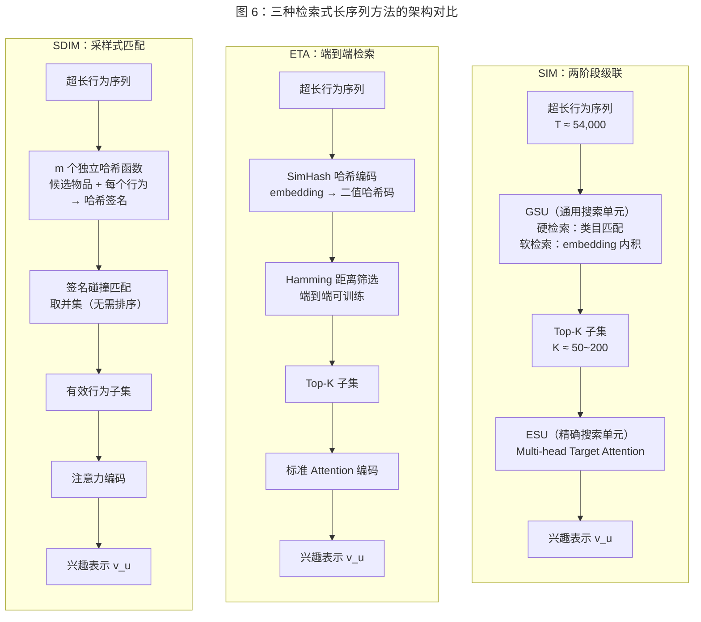

三者的核心权衡在于：SIM 的硬检索最为高效但可能丢失跨类目信号；ETA 的 LSH 检索实现了端到端优化但仍需全序列的哈希计算；SDIM 通过采样最大限度地降低了计算量但引入了采样噪声。工业实践中，SIM 和 ETA 已在阿里巴巴上线验证，SDIM 已在美团搜索系统中部署，SIM 因其工程实现的简洁性仍是最广泛采用的方案。

#### 5.2.2 线性注意力

检索式方法从数据层面缩减了注意力计算的输入规模，而线性注意力（Linear Attention）则从算法层面降低注意力计算本身的复杂度。标准 softmax attention 的 $O(T^2)$ 复杂度源于需要显式计算 $T \times T$ 的注意力矩阵。线性注意力通过核函数近似避免了这一显式计算。

**核心思想。** Linear Transformer [Katharopoulos et al., 2020] 将 softmax attention 中的 $\exp(\mathbf{q}^{\top}\mathbf{k}/\sqrt{d})$ 替换为核函数 $\phi(\mathbf{q})^{\top}\phi(\mathbf{k})$，其中 $\phi(\cdot)$ 为特征映射函数。通过利用矩阵乘法的结合律，计算顺序从 $(QK^{\top})V$（$O(T^2d)$）变为 $Q(K^{\top}V)$（$O(Td^2)$）。当 $d \ll T$ 时，复杂度降至 $O(T)$。

**在推荐系统中的应用探索。** 线性注意力在推荐系统中的直接应用研究尚处于早期阶段。其在推荐场景面临的独特挑战包括：（1）推荐序列的 embedding 维度 $d$ 通常较大（64-256），$d^2$ 可能接近甚至超过 $T^2$，削弱了线性注意力的效率优势；（2）softmax attention 的锐化效应（sharpening effect）——将注意力权重集中在少数最相关行为上——对推荐任务中的精准兴趣提取至关重要，核函数近似可能导致注意力分布过于平滑。近期有研究尝试结合 gated linear attention 和推荐任务特点进行适配，但大规模工业验证仍然缺乏。

#### 5.2.3 稀疏注意力

稀疏注意力（Sparse Attention）是介于全注意力和线性注意力之间的折中方案：不计算完整的 $T \times T$ 注意力矩阵，而是限制每个位置仅关注序列中的部分位置，形成稀疏的注意力模式。

**局部窗口注意力。** 最直接的稀疏化策略是将注意力限制在局部窗口内：每个位置仅关注其前后 $w$ 个位置，计算复杂度降至 $O(T \cdot w)$。Longformer [Beltagy et al., 2020] 在 NLP 领域提出了将局部窗口注意力与全局 token 注意力相结合的方案——少量预设的全局 token 可以关注所有位置，所有位置也可以关注全局 token，从而在保持局部细粒度建模的同时维持全局信息流通。

**在推荐系统中的适配挑战。** 稀疏注意力在推荐序列建模中的应用面临一个概念性挑战：NLP 中的局部性假设（相邻 token 语义相关）在推荐序列中并不总是成立——用户可能在短时间内跨越多个兴趣领域（如先浏览电子产品，再查看图书，然后购买食品），使得基于位置邻近性的局部窗口可能切断有意义的兴趣关联。因此，推荐领域中更有前景的稀疏化方向可能是**基于语义相似性而非位置邻近性**的稀疏注意力模式，即每个行为仅关注语义最相关的其他行为——这本质上与检索式方法（5.2.1 节）的思路殊途同归。

### 5.3 HSTU：工业规模的 Transformer 实践

#### 5.3.1 背景与动机

HSTU（Hierarchical Sequential Transduction Unit）[Zhai et al., 2024] 由 Meta 提出，发表于 ICML 2024，是迄今为止推荐系统领域最大规模的 Transformer 实践。HSTU 的核心命题是：**通过针对推荐任务特性对 Transformer 进行深度定制化简化，实现万亿参数规模下的高效训练和推理，并将序列推荐重新定义为生成式任务**。

HSTU 的设计动机源于 Meta 对标准 Transformer 在推荐场景中低效性的深刻洞察：推荐系统的输入特征（高维稀疏 ID 特征、异构行为类型）与 NLP 的密集文本 token 在数据特性上存在根本差异，直接沿用 NLP Transformer 的架构设计（如 LayerNorm、两层 FFN、softmax attention）会引入大量冗余计算。

#### 5.3.2 核心架构创新

HSTU 对标准 Transformer 进行了三项关键的架构简化（图 7）：

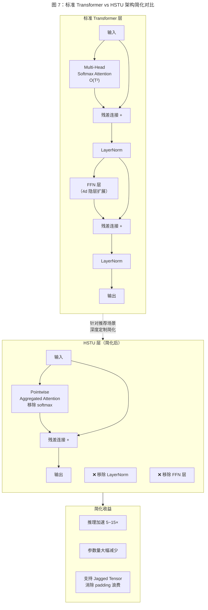

**（1）Pointwise Aggregated Attention。** HSTU 用 pointwise 聚合操作替代标准的 softmax attention。具体而言，HSTU 将 attention 计算中的 softmax 归一化移除，代之以逐元素的非线性激活和缩放操作：

$$\mathbf{o}_t = \sum_{j=1}^{t} f(\mathbf{q}_t, \mathbf{k}_j) \cdot \mathbf{v}_j$$

其中 $f(\cdot)$ 为 pointwise 激活函数（如 ReLU 或 SELU），替代了传统的 $\text{softmax}(\mathbf{q}^{\top}\mathbf{k}/\sqrt{d})$。移除 softmax 归一化的理由在于：推荐场景中行为序列的长度变化剧烈（从几条到数万条），softmax 的归一化效应使注意力权重的绝对大小与序列长度耦合，阻碍了模型在不同长度序列间的泛化。Pointwise 聚合则保留了注意力权重的绝对大小信息，与 DIN [Zhou et al., 2018] 去除 softmax 的设计理念一脉相承。

**（2）移除 LayerNorm 和 FFN。** 标准 Transformer 中，每个 attention 层后接 LayerNorm 和两层 FFN（含 4 倍维度的隐层扩展）。HSTU 发现，在推荐场景中这些组件的贡献可以被适当的初始化和 embedding normalization 替代，同时移除它们可以大幅减少计算量和参数量。在工业推理中，FFN 的两次线性变换和 LayerNorm 的归一化计算占据了 Transformer 推理延迟的相当比例（尤其是在 batch size 较大时），移除这些组件使 HSTU 在相同参数预算下实现了 5-15 倍的推理加速。

**（3）特征去除（Feature Removal）。** HSTU 在输入特征工程上采取了激进的简化策略——去除传统 CTR 模型中大量的手工构造特征（如统计特征、交叉特征），仅保留物品 ID、行为类型和时间戳等基础特征。HSTU 的设计哲学是：当模型规模足够大（万亿参数级别）时，模型自身的表示学习能力可以替代人工特征工程。实验表明，特征去除后配合更大的模型规模，HSTU 的效果反而优于使用复杂特征的小模型，这与 NLP 领域"scaling law"的经验一致。

#### 5.3.3 万亿参数规模的工程挑战

HSTU 的工程贡献在于展示了推荐系统 Transformer 向万亿参数规模扩展的可行路径。其关键工程创新包括：

**Jagged Tensor。** 推荐系统中，同一 batch 内不同用户的行为序列长度差异极大（从几条到数万条），标准的 padding 策略会浪费大量计算。HSTU 提出 jagged tensor（锯齿张量）表示——将同一 batch 内不同长度的序列紧密排列在连续内存中，配合定制化的 attention kernel，避免了 padding 带来的无效计算。Jagged tensor 使 HSTU 在处理异构长度序列时的计算效率提升了数倍。

**分布式训练策略。** 万亿参数规模的 HSTU 需要大规模的模型并行和数据并行。其 embedding 表（物品 ID embedding）通过行并行（row-wise parallelism）分布在数百台机器上，而 Transformer 层则通过张量并行（tensor parallelism）分布在多个 GPU 上。训练和推理均在 Meta 的定制化硬件集群上进行。

**在线推理优化。** HSTU 通过 KV-cache 增量计算和自定义 CUDA kernel 实现了工业级的在线推理延迟。当新行为发生时，仅需计算新位置的 attention 和输出，无需对整个序列重新编码。

#### 5.3.4 生成式推荐范式

HSTU 的另一核心贡献在于将序列推荐从判别式任务（discriminative, 即对给定候选物品计算 CTR 分数）重新定义为**生成式任务**（generative, 即基于历史行为序列自回归地生成下一个交互物品）。这一范式转变意味着：

$$P(b_{T+1} \mid b_1, b_2, \ldots, b_T) = \text{HSTU}(b_1, b_2, \ldots, b_T)$$

模型直接在物品空间上生成概率分布，而非对预设的候选物品逐一打分。这与 GPT 系列模型在语言空间上自回归生成 token 的范式完全类似，模糊了推荐模型与语言模型之间的边界。

生成式推荐范式的潜在优势在于：（1）消除了传统推荐系统中召回、粗排、精排的多阶段流水线，统一为单模型的端到端生成；（2）通过自回归训练目标，模型可以自然地建模物品之间的条件依赖关系（如购买 A 之后更可能购买 B）；（3）模型规模的扩展（scaling）能够直接转化为推荐质量的提升，遵循类似 LLM 的 scaling law。

然而，生成式推荐在工业落地中面临显著挑战：物品空间（通常百万到亿级）远大于语言模型的词表空间（通常数万到十万级），全物品空间上的 softmax 计算代价极高，需要通过负采样或层次化 softmax 等近似策略降低计算量。

### 5.4 预训练与微调范式

受 NLP 领域 BERT、GPT 预训练范式成功的启发，研究者开始探索推荐系统序列建模中的预训练与微调（pre-train and fine-tune）策略。核心思想是：**在大规模行为数据上预训练通用的序列表示模型，然后在特定下游任务或域上进行微调，实现知识迁移和冷启动缓解**。

#### 5.4.1 UniSRec：统一序列推荐表示

UniSRec [Hou et al., 2022] 发表于 KDD 2022，提出了面向跨域序列推荐的统一表示学习框架。UniSRec 的核心挑战在于：不同推荐域（如电子产品、图书、服饰）的物品 ID 空间完全不重叠，传统的 ID embedding 无法跨域迁移。

UniSRec 的解决方案是使用预训练语言模型（如 BERT）的文本 embedding 替代物品 ID embedding。具体而言，每个物品通过其文本描述（标题、类目等）经由冻结的预训练语言模型编码为稠密向量，这些向量在不同域之间共享语义空间。在此统一表示的基础上，UniSRec 使用 Transformer encoder 对行为序列进行编码，并通过两阶段训练实现跨域迁移：

- **预训练阶段：** 在多个源域的混合数据上训练 Transformer 序列编码器，学习通用的序列模式。
- **微调阶段：** 在目标域数据上微调序列编码器，适配域特有的用户行为模式。

为了使预训练的文本 embedding 适配推荐任务的需求，UniSRec 引入了轻量级的 adapter 层（MoE-enhanced adaptor），通过少量可训练参数将文本语义空间映射到推荐交互空间。

#### 5.4.2 VQ-Rec：向量量化驱动的表示对齐

VQ-Rec [Hou et al., 2023] 在 UniSRec 的基础上进一步解决了文本 embedding 与推荐 embedding 之间的语义鸿沟问题。UniSRec 直接使用语言模型的连续 embedding 作为物品表示，但语言模型的语义空间是为文本理解任务优化的，与推荐交互模式可能存在分布偏差。

VQ-Rec 引入向量量化（Vector Quantization, VQ）作为文本语义与推荐交互之间的桥梁：将预训练语言模型的文本 embedding 通过 VQ 映射为离散的 code，再将 code 映射为推荐任务优化的 embedding。VQ 的离散瓶颈迫使模型学习更具判别性的物品表示，同时 codebook 可以在跨域数据上共享，实现知识迁移。

#### 5.4.3 跨域预训练的挑战

推荐系统中的预训练与微调范式面临若干独特挑战，这些挑战使其难以像 NLP 领域那样取得普遍成功：

**物品表示的异构性。** NLP 中的 token 共享统一的词表和 embedding 空间，而推荐系统中不同域的物品 ID 空间完全独立。即使通过文本描述实现了语义层面的统一表示（如 UniSRec），不同域中用户行为模式的差异（如电商的浏览-购买漏斗 vs 短视频的连续消费模式）仍然难以通过简单的微调弥合。

**分布漂移。** 推荐系统中的数据分布随时间快速变化——新物品不断上架、用户偏好随季节和趋势变化、平台策略调整影响行为分布。预训练模型在历史数据上学习的模式可能迅速过时，要求频繁的重训练或增量更新。

**ID 特征 vs 语义特征的权衡。** 工业实践表明，在单域场景下，基于物品 ID 的协同过滤信号通常强于基于文本语义的内容信号。预训练范式为了实现跨域迁移而放弃 ID 特征，可能在单域精度上有所牺牲。如何在保留 ID 特征的判别力的同时引入跨域语义知识，是一个未解决的核心问题。

### 5.5 小结

本章系统梳理了 Transformer 在推荐系统序列建模中的应用，从基础架构到效率优化，从学术探索到工业实践，从单域模型到跨域预训练。Transformer 范式在序列推荐领域的影响可以从以下三个层次总结：

**在建模能力层面，** Transformer 通过 self-attention 的全局感受野和多头注意力的多子空间建模，实现了对行为序列中复杂依赖关系的精细刻画。SASRec 和 BERT4Rec 分别从单向和双向两个维度验证了 self-attention 相对于 RNN/CNN 的精度优势。BST 则证明了 Transformer 在完整 CTR 预估框架中的有效性。

**在效率与可扩展性层面，** $O(T^2)$ 的复杂度瓶颈催生了检索式（SIM/ETA/SDIM）、线性注意力和稀疏注意力等多条技术路线。其中，检索式方法因其与推荐系统"候选筛选"范式的天然契合，在工业界获得了最广泛的采纳。HSTU [Zhai et al., 2024] 则从另一方向证明，通过深度定制化的架构简化（去除 LayerNorm/FFN、pointwise attention、jagged tensor），Transformer 可以在万亿参数规模下高效运行，为推荐系统的 scaling 打开了新的空间。

**在范式演进层面，** Transformer 的应用正在推动推荐系统从"判别式排序"向"生成式推荐"的范式转变。HSTU 的生成式训练目标、UniSRec/VQ-Rec 的预训练-微调框架，都预示着推荐系统正在沿着 NLP 领域"从专用模型到通用基础模型"的路径演进。然而，推荐系统固有的特性——物品空间的异构性、数据分布的快速漂移、工业系统的严格延迟约束——使这一演进过程面临着 NLP 中不曾遇到的独特挑战。

展望而言，Transformer 在推荐序列建模中的核心开放问题包括：（1）如何在保持全注意力建模精度的同时实现真正的亚二次复杂度；（2）如何设计推荐原生的 scaling law，指导模型规模与数据规模的最优配比；（3）如何在生成式推荐范式下高效处理百万至亿级的物品空间。这些问题的回答将决定 Transformer 在推荐系统中的长期地位——是继续作为主导架构演进，还是被更适合推荐任务特性的新范式（如 SSM，见第 6 章）所替代。

## 6. 基于状态空间模型的序列建模

状态空间模型（State Space Model, SSM）是近年来序列建模领域最引人注目的新兴范式之一。SSM 源自控制理论中的连续时间动力系统框架，通过将序列建模表述为线性状态递推过程，实现了 $O(T)$ 的线性时间复杂度和理论上无限的序列建模范围。S4 [Gu et al., 2022] 奠定了结构化状态空间模型的理论基础，Mamba [Gu and Dao, 2023] 通过引入输入依赖的选择性机制突破了线性 SSM 的表达能力瓶颈，而 Mamba4Rec [Liu et al., 2024] 则首次将选择性 SSM 引入序列推荐任务。本章系统梳理 SSM 的数学基础、核心架构创新及其在推荐系统中的应用前景。

### 6.1 SSM 基础

#### 6.1.1 连续时间状态空间模型

SSM 的数学根基可追溯至控制理论中的线性时不变（Linear Time-Invariant, LTI）系统。一个连续时间的状态空间模型由以下微分方程组定义：

$$\mathbf{h}'(t) = \mathbf{A}\mathbf{h}(t) + \mathbf{B}x(t)$$
$$y(t) = \mathbf{C}\mathbf{h}(t) + \mathbf{D}x(t)$$

其中 $x(t) \in \mathbb{R}$ 为输入信号，$y(t) \in \mathbb{R}$ 为输出信号，$\mathbf{h}(t) \in \mathbb{R}^N$ 为隐状态向量（$N$ 为状态维度），$\mathbf{A} \in \mathbb{R}^{N \times N}$ 为状态转移矩阵，$\mathbf{B} \in \mathbb{R}^{N \times 1}$ 为输入投影矩阵，$\mathbf{C} \in \mathbb{R}^{1 \times N}$ 为输出投影矩阵，$\mathbf{D} \in \mathbb{R}$ 为直接传递项（通常可忽略或视为残差连接）。

这一数学框架的核心特征在于其**线性性**：状态转移矩阵 $\mathbf{A}$ 和投影矩阵 $\mathbf{B}$、$\mathbf{C}$ 均为固定参数，不随输入内容变化。线性性赋予了 SSM 两个关键的计算优势：一是递推计算的高效性（每步仅需矩阵-向量乘法），二是可以通过卷积形式实现并行训练。

#### 6.1.2 离散化：从连续到离散

实际的序列数据（如用户行为序列）是离散的时间步序列，因此需要将连续时间 SSM 离散化。给定采样间隔 $\Delta$，通过零阶保持（Zero-Order Hold, ZOH）离散化，连续参数 $(\mathbf{A}, \mathbf{B})$ 被转换为离散参数 $(\bar{\mathbf{A}}, \bar{\mathbf{B}})$：

$$\bar{\mathbf{A}} = \exp(\Delta \mathbf{A})$$
$$\bar{\mathbf{B}} = (\Delta \mathbf{A})^{-1}(\exp(\Delta \mathbf{A}) - \mathbf{I}) \cdot \Delta \mathbf{B}$$

离散化后的状态递推公式为：

$$\mathbf{h}_t = \bar{\mathbf{A}} \mathbf{h}_{t-1} + \bar{\mathbf{B}} x_t$$
$$y_t = \mathbf{C} \mathbf{h}_t$$

这一递推形式与 RNN 的隐状态更新在结构上高度类似，但存在本质差异：SSM 的状态转移是线性的（$\bar{\mathbf{A}}$ 为固定矩阵），而 RNN 通过非线性门控（如 GRU 的 reset/update gate）实现状态更新。线性递推虽然限制了单步的表达能力，但使得 SSM 能够利用卷积等代数结构实现高效的并行训练。

#### 6.1.3 卷积视角与并行训练

离散化 SSM 的一个关键性质是：其输入-输出映射可以展开为全局卷积形式。将递推公式展开可得：

$$y_t = \mathbf{C}\bar{\mathbf{A}}^t\mathbf{h}_0 + \sum_{k=0}^{t} \mathbf{C}\bar{\mathbf{A}}^{t-k}\bar{\mathbf{B}} x_k$$

忽略初始状态项，输出 $y$ 可以表示为输入 $x$ 与卷积核 $\bar{\mathbf{K}}$ 的因果卷积：

$$\bar{\mathbf{K}} = (\mathbf{C}\bar{\mathbf{B}}, \mathbf{C}\bar{\mathbf{A}}\bar{\mathbf{B}}, \mathbf{C}\bar{\mathbf{A}}^2\bar{\mathbf{B}}, \ldots)$$
$$y = \bar{\mathbf{K}} * x$$

这一卷积形式意味着 SSM 在训练阶段可以通过快速傅里叶变换（FFT）实现 $O(T \log T)$ 的并行计算，避免了 RNN 式逐步递推的串行瓶颈。而在推理阶段，SSM 可以切换回递推形式，以 $O(1)$ 的常数步长逐步生成输出——这一训练-推理的双模态特性是 SSM 相较于 Transformer 的独特优势。

#### 6.1.4 S4：结构化状态空间与 HiPPO 初始化

S4（Structured State Spaces for Sequence Modeling）[Gu et al., 2022] 发表于 ICLR 2022，是 SSM 方向的奠基性工作。S4 解决了朴素 SSM 在实践中面临的两大核心难题：

**难题一：长程依赖的状态表示。** 朴素 SSM 的状态转移矩阵 $\mathbf{A}$ 若随机初始化，模型难以学习捕获长距离依赖——状态信息在多步递推后迅速衰减或爆炸。S4 的核心创新在于引入 **HiPPO（High-order Polynomial Projection Operators）** 初始化 [Gu et al., 2020]。HiPPO 理论证明，通过将状态矩阵 $\mathbf{A}$ 初始化为特定的结构化矩阵（如 HiPPO-LegS 矩阵），隐状态 $\mathbf{h}_t$ 能够最优地压缩和记忆历史输入信号——具体而言，$\mathbf{h}_t$ 的各分量对应于历史输入在 Legendre 多项式基函数上的投影系数，从而实现了对历史信息的最优多项式近似。HiPPO 初始化使 S4 能够有效建模长度超过数千步的序列依赖，在 Long Range Arena 基准测试 [Tay et al., 2021] 上大幅超越 Transformer 变体。

**难题二：高效的卷积核计算。** 计算卷积核 $\bar{\mathbf{K}}$ 需要求解 $\mathbf{A}$ 的矩阵幂 $\bar{\mathbf{A}}^t$，对于一般的 $N \times N$ 矩阵，这一计算复杂度为 $O(N^2 T)$，在状态维度 $N$ 较大时不可接受。S4 通过将 $\mathbf{A}$ 约束为**对角加低秩（diagonal plus low-rank, DPLR）** 结构，将卷积核的计算复杂度降至 $\tilde{O}(N + T)$，使大状态维度的 SSM 成为实际可行的模型。后续的 S4D [Gu et al., 2022b] 进一步将 $\mathbf{A}$ 简化为纯对角矩阵，在保持效果的同时大幅降低了实现复杂度。

**S4 的影响。** S4 在长序列建模基准（Long Range Arena、语音分类、像素级图像分类等）上取得了突破性结果，首次证明 SSM 架构在长序列任务上可以显著超越 Transformer。S4 的成功激发了 SSM 方向的大量后续研究，为 Mamba 等选择性 SSM 的出现奠定了基础。

### 6.2 选择性 SSM 与 Mamba

#### 6.2.1 线性 SSM 的内容无关局限

S4 及其变体（S4D、S5、H3 等）虽然在长序列建模上表现出色，但它们共享一个根本性的局限：**内容无关性（content-independent）**。具体而言，S4 的状态转移矩阵 $\bar{\mathbf{A}}$ 和输入投影矩阵 $\bar{\mathbf{B}}$ 在离散化后为固定参数，不随输入内容变化——无论当前输入 token 是什么，状态的更新方式完全相同。

这一局限在推荐场景中尤为突出。考虑一个用户行为序列 $[\text{手机壳}, \text{手机膜}, \text{小说}, \text{跑步鞋}, \text{运动袜}]$，当预测下一个行为时，模型应当对不同行为赋予不同的关注度——例如，如果当前候选物品是 "运动短裤"，则 "跑步鞋" 和 "运动袜" 的重要性应远高于 "小说"。但线性 SSM 的固定参数无法实现这种输入依赖的动态筛选，本质上类似于一个固定滤波器，对所有输入信号施加相同的处理方式。

从信息论的角度看，Transformer 的 self-attention 机制之所以强大，正是因为其 **content-aware** 的特性——注意力权重完全由输入内容决定，能够根据当前上下文动态选择性地聚焦于序列中的关键信息。线性 SSM 缺乏这一能力，成为其表达能力的瓶颈。

#### 6.2.2 Mamba：选择性状态空间模型

Mamba [Gu and Dao, 2023] 的核心创新在于将 SSM 的固定参数改为**输入依赖（input-dependent）** 的动态参数，从而赋予 SSM 内容感知的选择性能力。具体而言，Mamba 将离散化步长 $\Delta$、输入投影 $\mathbf{B}$ 和输出投影 $\mathbf{C}$ 从固定参数改为输入的函数：

$$\Delta_t = \text{softplus}(\mathbf{W}_\Delta x_t + b_\Delta)$$
$$\mathbf{B}_t = \text{Linear}_B(x_t)$$
$$\mathbf{C}_t = \text{Linear}_C(x_t)$$

其中 $x_t$ 为当前时间步的输入。这一设计使得：

- **$\Delta_t$ 控制信息的遗忘与保留**：当 $\Delta_t$ 较大时，$\bar{\mathbf{A}}_t = \exp(\Delta_t \mathbf{A})$ 趋近于零矩阵（取决于 $\mathbf{A}$ 的特征值），意味着模型倾向于 "遗忘" 之前的状态，"重置" 为当前输入；当 $\Delta_t$ 较小时，状态被大部分保留，当前输入的影响被抑制。这一机制类似于 RNN 中门控机制的作用，但通过连续时间动力系统的离散化自然实现。
- **$\mathbf{B}_t$ 控制输入的选择性写入**：不同输入通过不同的 $\mathbf{B}_t$ 映射到状态空间，决定了哪些输入特征被写入隐状态。
- **$\mathbf{C}_t$ 控制输出的选择性读取**：不同时间步通过不同的 $\mathbf{C}_t$ 从隐状态中读取信息，决定了哪些状态分量对输出产生贡献。

**选择性机制与 Attention 的类比。** Mamba 的选择性机制在功能上类似于 Transformer 的 attention 机制——两者都实现了输入依赖的动态信息路由。然而，关键区别在于：Attention 通过显式计算 $T \times T$ 的成对相关性矩阵实现全局选择（$O(T^2)$ 复杂度），而 Mamba 通过递推状态的动态参数化实现隐式选择（$O(T)$ 复杂度）。这一差异使 Mamba 在保持内容感知能力的同时维持了线性的计算效率。

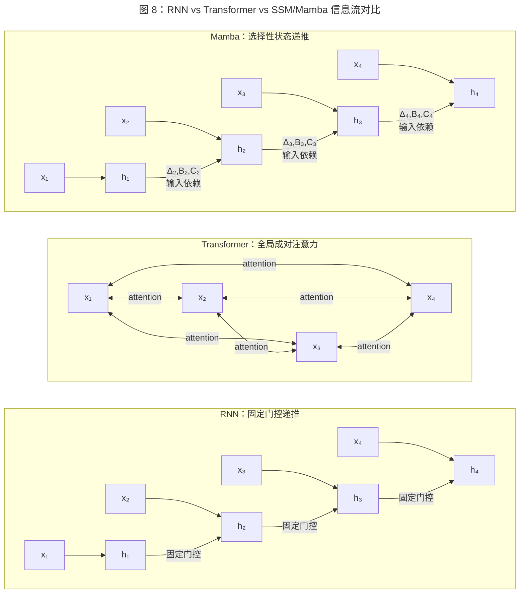

#### 6.2.3 硬件感知的并行扫描算法

参数的输入依赖性带来了一个计算挑战：由于 $\bar{\mathbf{A}}_t$ 和 $\bar{\mathbf{B}}_t$ 随时间步变化，S4 中通过固定卷积核实现并行训练的技巧不再适用。朴素实现下，选择性 SSM 退化为类似 RNN 的逐步递推，丧失了并行训练的能力。

Mamba 通过**硬件感知的并行扫描（hardware-aware parallel scan）** 算法解决了这一挑战。并行扫描（也称 prefix sum）是一种经典的并行计算原语，能够将长度为 $T$ 的递推计算分解为 $O(\log T)$ 轮并行操作。Mamba 将线性递推 $\mathbf{h}_t = \bar{\mathbf{A}}_t \mathbf{h}_{t-1} + \bar{\mathbf{B}}_t x_t$ 表述为结合律操作的累积扫描，利用 GPU 的大规模并行计算能力实现了高效的训练。

在工程实现上，Gu and Dao [2023] 针对 GPU 的存储层次结构（HBM、SRAM）进行了深度优化：

- **Kernel fusion**：将离散化、状态递推和输出投影融合为单一 CUDA kernel，减少 HBM 访问次数。
- **内存重计算**：训练时不存储中间状态 $\mathbf{h}_t$（节省 $O(T \cdot N \cdot d)$ 的内存），而在反向传播时通过重计算恢复。
- **SRAM 分块**：将状态递推的计算分块到 GPU SRAM 中执行，利用 SRAM 的高带宽降低延迟。

这些优化使 Mamba 在 A100 GPU 上的实际吞吐量达到了优化 Transformer 实现的 3-5 倍（在相同序列长度下），且随序列长度的增长保持线性扩展。

#### 6.2.4 Mamba 架构的整体设计

Mamba 的完整模型架构采用了类似于 Transformer decoder 的堆叠设计，但用选择性 SSM 层替代了 self-attention 层。每一层的计算流程为：

$$\mathbf{x}' = \sigma(\text{Linear}_1(\mathbf{x})) \odot \text{SSM}(\text{Conv1D}(\text{Linear}_2(\mathbf{x})))$$

其中 $\text{Linear}_1$ 和 $\text{Linear}_2$ 为线性投影层，$\text{Conv1D}$ 为局部卷积（kernel size 通常为 3-4），$\text{SSM}(\cdot)$ 为选择性状态空间模块，$\sigma(\cdot)$ 为 SiLU 激活函数，$\odot$ 为门控乘法。局部卷积的引入使模型能够捕获短距离的局部模式，与 SSM 的长距离建模能力形成互补。

在语言建模基准上，Mamba-3B 的性能与 Transformer-3B 相当，但推理速度提升了约 5 倍（得益于 $O(1)$ 的递推推理，无需维护和扩展 KV-cache）。这一结果标志着 SSM 首次在大规模语言建模任务上与 Transformer 达到同等水平。

### 6.3 SSM 在序列推荐中的应用

#### 6.3.1 Mamba4Rec：选择性 SSM 的推荐应用

Mamba4Rec [Liu et al., 2024] 是将选择性状态空间模型引入序列推荐的代表性工作。Mamba4Rec 的核心动机在于：传统序列推荐模型（SASRec、BERT4Rec）基于 Transformer 的 $O(T^2)$ self-attention，在用户行为序列较长时面临计算瓶颈，而 Mamba 的线性复杂度为长序列推荐提供了天然的效率优势。

**模型架构。** Mamba4Rec 采用与 SASRec 类似的整体框架：将物品 ID 映射为 embedding，叠加位置编码后输入多层选择性 SSM 编码器，最后通过最后一个位置的输出表示进行 next-item prediction。具体而言：

（1）**Embedding 层。** 物品 embedding $\mathbf{e}_t \in \mathbb{R}^d$ 与可学习的位置 embedding $\mathbf{p}_t$ 相加，形成输入表示 $\hat{\mathbf{e}}_t = \mathbf{e}_t + \mathbf{p}_t$。

（2）**选择性 SSM 层。** 将 Mamba 的选择性 SSM 层作为序列编码器的核心组件，替代 SASRec 中的 self-attention 层。每一层包含局部卷积、选择性 SSM 和门控投影，通过残差连接和 Layer Normalization 稳定训练。

（3）**预测层。** 取最后一个时间步的输出表示 $\mathbf{h}_T$ 与候选物品 embedding 计算内积得分，训练目标为二元交叉熵损失。

**实验结果。** Mamba4Rec 在 Amazon Beauty、Amazon Sports、MovieLens-1M 等公开数据集上进行了实验。结果显示：

- 在推荐精度方面，Mamba4Rec 在多数数据集上与 SASRec 表现相当或略优，在长序列场景中优势更为明显。
- 在计算效率方面，随着序列长度增长，Mamba4Rec 的训练和推理速度优势逐渐显现——当序列长度超过 200 时，Mamba4Rec 的推理延迟显著低于 SASRec。
- 在参数效率方面，Mamba4Rec 在相同效果下所需的参数量少于 Transformer 基线，得益于 SSM 的参数共享特性（状态转移矩阵在序列维度上共享）。

#### 6.3.2 其他 SSM-based 推荐工作

Mamba4Rec 之后，学术界涌现了多项将 SSM 应用于推荐系统的探索性工作：

**EchoMamba4Rec [Wang et al., 2024]。** EchoMamba4Rec 在 Mamba 架构的基础上引入了双向 SSM 编码，借鉴 BERT4Rec 的双向建模思想。具体而言，EchoMamba4Rec 对行为序列分别进行正向和反向的 Mamba 编码，再将两个方向的隐状态进行融合，使模型能够同时利用前向和后向的上下文信息。双向 Mamba 编码是 EchoMamba4Rec 的核心贡献，在 masked item prediction 和 next-item prediction 任务上均取得了优于单向 Mamba4Rec 的效果。

**RecMamba [Yang et al., 2024]。** RecMamba 聚焦于终身序列推荐（lifelong sequential recommendation）场景，针对用户超长行为序列的高效建模问题。RecMamba 利用 Mamba 的线性复杂度优势直接处理完整的用户终身行为序列，避免了传统方法对长序列的截断或检索预处理，在保持推荐精度的同时显著提升了长序列场景下的计算效率。

**SSM 与 Attention 的混合架构。** 部分工作尝试将 SSM 与注意力机制结合，发挥两者的互补优势。例如，在低层使用 SSM 层编码长距离依赖，在高层使用 self-attention 层进行精细的候选感知建模，或在 SSM 的输出上叠加 target attention 实现候选物品的感知。这类混合架构试图在 SSM 的线性效率和 Attention 的精细建模能力之间取得平衡。

#### 6.3.3 SSM vs Transformer 在推荐场景的对比

SSM 与 Transformer 在序列推荐中的对比可以从多个维度展开：

| 维度 | SSM（Mamba） | Transformer（SASRec） |
|------|-------------|---------------------|
| 计算复杂度 | $O(T)$（线性） | $O(T^2)$（二次） |
| 推理模式 | 递推式，$O(1)$ 每步 | 需要 KV-cache，$O(T)$ 每步 |
| 长序列建模 | 天然支持，无长度瓶颈 | 需检索/稀疏化/截断 |
| 全局依赖捕获 | 隐式（通过状态压缩） | 显式（成对注意力） |
| Target-aware 能力 | 需额外设计 | 天然支持（拼接候选物品） |
| 工业验证程度 | 初步（2024 年起） | 成熟（BST/SIM 已大规模部署） |
| 可解释性 | 较弱（状态不透明） | 较强（注意力权重可视化） |

从上表可以看出，SSM 在效率维度上具有显著优势，但在工业验证程度和 target-aware 建模能力上仍需追赶 Transformer。特别值得注意的是，SSM 的状态压缩机制意味着其对历史信息的保留是**有损的**——长度为 $T$ 的序列被压缩为固定维度 $N$ 的状态向量，而 Transformer 通过 KV-cache 保留了所有历史 token 的完整表示。在推荐场景中，用户行为序列中的关键行为可能出现在任意位置，SSM 的有损压缩是否会丢失关键兴趣信号，仍是一个需要深入验证的问题。

### 6.4 SSM 的工业部署前景

#### 6.4.1 线性复杂度对长序列的优势

SSM 对工业推荐系统最具吸引力的特性是其**线性时间复杂度**。如第 5 章所述，工业场景中活跃用户的行为序列长度可达数万条。当前主流的检索式方法（SIM/ETA/SDIM）虽然有效，但引入了额外的系统复杂性（索引维护、两阶段流水线）和信息损失风险（检索阶段的过滤可能遗漏相关行为）。

SSM 提供了一种更优雅的替代路径：直接以 $O(T)$ 复杂度处理完整的超长行为序列，无需检索阶段的信息丢弃。理论上，SSM 可以将当前工业系统中 "截断 + 检索 + 精细编码" 的多阶段流水线简化为单一的端到端序列编码，降低系统架构复杂度并消除检索阶段的信息瓶颈。

#### 6.4.2 推理时的状态缓存

SSM 在推理阶段的另一核心优势在于其**状态缓存（state caching）机制**，这与 Transformer 的 KV-cache 形成鲜明对比。

**Transformer 的 KV-cache。** Transformer 在自回归推理时需要维护 KV-cache，存储所有历史 token 的 key 和 value 向量。KV-cache 的大小与序列长度成正比：每个 attention 层需要 $O(T \cdot d)$ 的存储空间。当用户行为序列较长时，KV-cache 占用大量 GPU 内存，限制了并发推理的用户数量。

**SSM 的状态缓存。** SSM 在推理时仅需维护固定维度的隐状态 $\mathbf{h} \in \mathbb{R}^N$，其大小与序列长度无关。当新的用户行为发生时，仅需执行一步状态更新 $\mathbf{h}_t = \bar{\mathbf{A}}_t \mathbf{h}_{t-1} + \bar{\mathbf{B}}_t x_t$，无需重新处理整个历史序列。这一特性在推荐系统的在线推理场景中具有显著的工程优势：

- **内存效率**：每个用户的状态缓存为固定大小的向量，与行为序列长度无关，使系统能够同时为更多用户提供服务。
- **增量更新**：新行为的到来仅触发一步状态更新，计算开销为 $O(N \cdot d)$，远低于 Transformer 需要重新计算注意力的开销。
- **缓存友好**：固定大小的状态向量可以高效地存储在分布式缓存系统中，便于实现用户状态的异步预计算和实时更新。

#### 6.4.3 当前局限与挑战

尽管 SSM 在理论效率上优势显著，其在推荐系统的工业落地仍面临多方面挑战：

**挑战一：Target-aware 建模的缺失。** 当前的 SSM 推荐模型（如 Mamba4Rec）采用 target-agnostic 的编码方式——序列编码过程独立于候选物品，这与工业 CTR 场景中 target-aware 建模的核心需求不符。DIN/DIEN 的成功经验表明，候选物品感知是 CTR 预估中不可或缺的建模要素。如何在 SSM 的递推框架中优雅地引入候选物品信号，是一个尚未完全解决的设计问题。

**挑战二：大规模工业验证缺乏。** 截至目前，SSM 在推荐系统中的验证主要集中在学术基准数据集上，尚无头部互联网公司公开报告 SSM 在大规模生产系统中的 A/B 测试结果。学术数据集的序列长度（通常 50-200）和数据规模无法充分体现 SSM 的线性复杂度优势，也无法验证其在真实工业负载下的稳定性和效果。

**挑战三：与现有系统的集成难度。** 工业推荐系统经过多年迭代，已形成成熟的基于 Transformer/Attention 的技术栈（包括训练框架、推理引擎、特征工程管线等）。引入 SSM 意味着需要重新适配整个技术栈，包括自定义 CUDA 算子的集成、模型并行策略的调整、以及推理引擎的改造。这种系统级的切换成本是 SSM 工业落地的重要障碍。

**挑战四：选择性机制对推荐模式的适配性。** Mamba 的选择性机制最初为语言建模设计，其对推荐系统特有的行为模式（如兴趣的突变、多峰兴趣分布、行为类型的异构性）的适配性仍不明确。推荐序列与文本序列在统计特性上存在显著差异——推荐序列中的 "token"（物品 ID）空间远大于语言词表，且物品之间的转移模式受用户意图、上下文和平台策略等多重因素影响。

### 6.5 小结

本章系统梳理了基于状态空间模型的序列建模技术，从 SSM 的数学基础（连续时间动力系统、离散化、卷积视角）出发，深入分析了 S4 [Gu et al., 2022] 的结构化状态空间和 HiPPO 初始化，以及 Mamba [Gu and Dao, 2023] 的选择性机制和硬件感知优化，并梳理了以 Mamba4Rec [Liu et al., 2024] 为代表的 SSM 推荐应用。

SSM 范式的核心价值在于提供了一种**效率与能力兼顾**的序列建模新路径：线性时间复杂度突破了 Transformer 的二次瓶颈，选择性机制弥补了传统线性 SSM 的表达能力缺陷，递推推理模式则为在线服务提供了优于 KV-cache 的内存效率。然而，SSM 在推荐领域仍处于早期探索阶段（2024 年起），其在大规模工业系统中的实际表现——特别是在 target-aware CTR 预估、超长行为序列建模和多行为类型融合等核心场景中的效果——仍有待系统性验证。

展望而言，SSM 最可能的工业落地路径并非完全替代 Transformer，而是在特定场景中与现有技术互补：例如，在超长序列场景中替代检索式方法的第一阶段（用 SSM 编码替代 SIM 的 GSU 检索），或在低延迟要求的场景中替代 Transformer 作为轻量级序列编码器。SSM 与 Attention 的混合架构——在 SSM 的线性效率基础上叠加候选感知的 target attention——也是一条值得深入探索的技术路线。

## 7. 基于图神经网络的序列建模

图神经网络（Graph Neural Network, GNN）为序列建模提供了一种独特的结构化视角：将用户行为序列从线性时间链转化为图结构，通过图上的消息传递机制捕获物品之间的复杂转移关系和高阶连接模式。SR-GNN [Wu et al., 2019] 首次将 GNN 引入会话推荐，证明了图结构对序列推荐的有效性；后续工作从全局-局部图融合、GNN 与序列模型的混合架构等多个方向推进了这一技术路线。本章系统梳理基于 GNN 的序列建模方法，分析其独特优势和面临的挑战。

### 7.1 会话图建模

#### 7.1.1 SR-GNN：会话图与门控图神经网络

SR-GNN（Session-based Recommendation with Graph Neural Networks）[Wu et al., 2019] 发表于 AAAI 2019，是将图神经网络引入序列推荐的开创性工作。SR-GNN 的核心洞察在于：传统的序列模型（RNN、CNN）将用户行为视为严格的线性链，只能捕获相邻行为之间的直接转移关系，而忽略了更丰富的物品间结构化依赖。

**会话图的构建。** SR-GNN 将每个用户会话（session）中的行为序列转化为有向图 $\mathcal{G}_s = (\mathcal{V}_s, \mathcal{E}_s)$。具体构建规则为：

- **节点集 $\mathcal{V}_s$**：会话中出现的所有去重物品，每个物品对应一个节点。
- **有向边集 $\mathcal{E}_s$**：对于会话序列 $[v_1, v_2, \ldots, v_n]$ 中相邻的物品对 $(v_t, v_{t+1})$，构建一条从 $v_t$ 指向 $v_{t+1}$ 的有向边。如果同一物品对出现多次，则对应边的权重累加。

例如，会话序列 $[A, B, A, C, B]$ 构建的有向图包含节点 $\{A, B, C\}$，边 $\{A \to B, B \to A, A \to C, C \to B\}$。注意，图中同时包含正向边（$A \to B$）和反向边（$B \to A$），这使得消息可以沿两个方向传播。

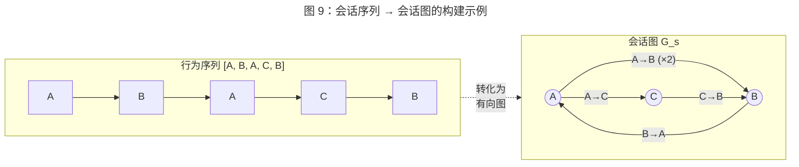

**Gated GNN 编码。** SR-GNN 采用 Gated Graph Neural Network（GGNN）[Li et al., 2016] 作为图编码器。GGNN 通过多轮消息传递更新节点表示：

$$\mathbf{a}_v^{(l)} = \mathbf{A}_v [\mathbf{h}_1^{(l-1)}, \ldots, \mathbf{h}_n^{(l-1)}]^{\top} + \mathbf{b}$$
$$\mathbf{z}_v^{(l)} = \sigma(\mathbf{W}_z \mathbf{a}_v^{(l)} + \mathbf{U}_z \mathbf{h}_v^{(l-1)})$$
$$\mathbf{r}_v^{(l)} = \sigma(\mathbf{W}_r \mathbf{a}_v^{(l)} + \mathbf{U}_r \mathbf{h}_v^{(l-1)})$$
$$\tilde{\mathbf{h}}_v^{(l)} = \tanh(\mathbf{W}_o \mathbf{a}_v^{(l)} + \mathbf{U}_o (\mathbf{r}_v^{(l)} \odot \mathbf{h}_v^{(l-1)}))$$
$$\mathbf{h}_v^{(l)} = (1 - \mathbf{z}_v^{(l)}) \odot \mathbf{h}_v^{(l-1)} + \mathbf{z}_v^{(l)} \odot \tilde{\mathbf{h}}_v^{(l)}$$

其中 $\mathbf{A}_v$ 为节点 $v$ 的邻接向量（从图的邻接矩阵中提取），$\mathbf{z}_v$ 和 $\mathbf{r}_v$ 分别为更新门和重置门（类似 GRU 的门控机制），$l$ 为消息传递的轮次。通过多轮消息传递，每个节点的表示能够融合其多跳邻居的信息。

**会话表示的生成。** 在获得 GNN 编码后的节点表示后，SR-GNN 通过注意力机制将所有节点表示聚合为会话级表示。具体而言，以最后一个交互物品 $v_n$ 的表示 $\mathbf{h}_n$ 为 query，对所有节点表示计算注意力权重，加权求和得到全局会话表示 $\mathbf{s}_g$：

$$\alpha_i = \mathbf{q}^{\top} \sigma(\mathbf{W}_1 \mathbf{h}_n + \mathbf{W}_2 \mathbf{h}_i + \mathbf{c})$$
$$\mathbf{s}_g = \sum_{i=1}^{|\mathcal{V}_s|} \alpha_i \mathbf{h}_i$$

最终的会话表示为局部表示 $\mathbf{h}_n$（最后一个物品，反映短期意图）和全局表示 $\mathbf{s}_g$（全会话聚合，反映整体偏好）的融合：

$$\mathbf{s}_h = \mathbf{W}_3 [\mathbf{s}_g; \mathbf{h}_n]$$

**核心贡献。** SR-GNN 首次证明了图结构视角对序列推荐的有效性。相比于 GRU4Rec [Hidasi et al., 2016] 和 NARM [Li et al., 2017] 等纯序列模型，SR-GNN 在 Diginetica 和 Yoochoose 数据集上取得了显著的效果提升。其关键优势在于：图结构允许物品之间的信息通过非线性路径传播——例如，在序列 $[A, B, C, A]$ 中，节点 $A$ 可以通过边 $A \to B \to C$ 间接获取 $C$ 的信息，而 RNN 需要跨越多个时间步才能传递这种远距离依赖。

#### 7.1.2 FGNN：特征门控图网络

FGNN（Feature-gated Graph Neural Network）[Qiu et al., 2019] 从另一个角度增强了会话图的建模能力。FGNN 的核心创新包括两个方面：

**加权注意力图（Weighted Attention Graph）。** 与 SR-GNN 仅基于相邻转移构建图不同，FGNN 提出了一种更灵活的图构建方式：通过学习物品 embedding 之间的注意力权重来确定图的边权重。具体而言，任意两个物品之间的边权重由注意力函数计算：

$$e_{ij} = \text{LeakyReLU}(\mathbf{a}^{\top} [\mathbf{W}\mathbf{h}_i \| \mathbf{W}\mathbf{h}_j])$$

这种基于注意力的图构建方式突破了 SR-GNN 仅依赖物理相邻关系的限制，允许模型自动发现物品之间的潜在关联（如互补品或替代品之间的隐式关系），即使这些物品在行为序列中并不相邻。

**图级别的 Readout 函数。** FGNN 将 next-item prediction 任务重新表述为**图分类问题**——给定一个会话图，判断下一个交互的物品类别。为此，FGNN 设计了专用的 readout 函数，将节点级表示聚合为图级表示。Readout 函数采用 Set2Set [Vinyals et al., 2016] 机制，通过多步注意力迭代生成排列不变的图表示，比简单的 mean/sum pooling 具有更强的表达能力。

#### 7.1.3 会话图的构建方式与局限

会话图的构建方式是 GNN 序列建模方法的关键设计选择，现有方法主要采用以下几种策略：

**相邻转移图（Adjacent Transition Graph）。** SR-GNN 采用的方法，仅在行为序列中相邻物品之间构建有向边。优点是构建简单、图稀疏，缺点是无法捕获非相邻物品之间的直接关联。

**全连接图（Fully Connected Graph）。** 在会话内所有物品对之间构建边，权重由注意力或相似度决定。优点是不遗漏任何物品间关系，缺点是图稠密，计算开销与会话长度的平方成正比，且可能引入大量噪声边。

**$k$-hop 扩展图。** 在相邻转移图的基础上，将边的范围扩展到 $k$-hop 邻居（如，在序列 $[A, B, C]$ 中，$k=2$ 时增加 $A \to C$ 的边）。这在计算效率和信息覆盖之间取得了折中。

会话图建模的固有局限在于：**图结构是从行为序列中构建的，本质上是序列信息的一种重新组织，并不引入新的信息来源**。GNN 的优势在于通过消息传递机制更高效地传播和融合这些信息，但当序列本身较短或物品重复率较低时，会话图趋于退化为简单的线性链，GNN 的图结构优势无法充分发挥。

### 7.2 全局-局部图融合

#### 7.2.1 GCE-GNN：全局上下文增强

GCE-GNN（Global Context Enhanced Graph Neural Network）[Wang et al., 2020] 发表于 SIGIR 2020，针对 SR-GNN 仅建模单会话内物品转移关系的局限，提出了**全局图（global graph）与局部会话图（local session graph）相结合**的双图架构。

**局限分析。** SR-GNN 和 FGNN 的图构建范围限制在单个会话内部，这意味着：（1）短会话（仅包含 2-3 个物品）构建的图过于稀疏，GNN 的消息传递几乎退化为简单的嵌入查找；（2）不同会话中重复出现的物品转移模式（如 "手机 $\to$ 手机壳" 这一跨会话的高频转移）无法被单会话图捕获；（3）冷启动会话缺乏足够的图结构支持有效的 GNN 编码。

**全局图的构建。** GCE-GNN 在训练集的所有会话上构建一个全局物品转移图 $\mathcal{G}_g = (\mathcal{V}_g, \mathcal{E}_g)$：

- **节点集 $\mathcal{V}_g$**：训练集中出现的所有物品。
- **边集 $\mathcal{E}_g$**：对于所有会话中出现的相邻物品对 $(v_t, v_{t+1})$，在全局图中构建一条有向边，边权重为该转移在所有会话中出现的频次。

全局图聚合了所有用户的行为模式，提供了物品间转移关系的**群体先验**。对于每个目标会话，GCE-GNN 从全局图中提取与会话物品相关的子图，通过 GNN 编码获取全局级别的物品表示。

**局部-全局表示融合。** GCE-GNN 分别在局部会话图和全局子图上运行独立的 GNN 编码器，获得每个物品的局部表示 $\mathbf{h}_v^{local}$ 和全局表示 $\mathbf{h}_v^{global}$。两者通过门控机制融合：

$$\beta = \sigma(\mathbf{W}_g [\mathbf{h}_v^{local}; \mathbf{h}_v^{global}] + \mathbf{b}_g)$$
$$\mathbf{h}_v = \beta \odot \mathbf{h}_v^{local} + (1 - \beta) \odot \mathbf{h}_v^{global}$$

门控系数 $\beta$ 由模型自适应学习，控制在局部会话信息和全局先验之间的平衡。对于长会话（局部图结构丰富），模型倾向于信赖局部信息；对于短会话或冷启动场景，模型自动倾斜向全局先验。

**实验验证。** GCE-GNN 在 Diginetica、Tmall 和 Nowplaying 三个数据集上均显著优于 SR-GNN，验证了跨会话全局信息对会话推荐的增益。消融实验表明，全局图的贡献在短会话（长度 < 5）上最为显著，这与其设计初衷一致。

#### 7.2.2 跨会话信息利用

GCE-GNN 开创的全局-局部融合范式启发了一系列跨会话信息利用的后续工作：

**TAGNN [Yu et al., 2020]。** TAGNN（Target Attentive Graph Neural Network）在 SR-GNN 的基础上引入了 target-aware 的注意力机制。具体而言，TAGNN 使用候选物品的表示作为 query，对 GNN 编码后的会话节点表示计算注意力权重，实现了类似 DIN [Zhou et al., 2018] 的候选感知建模。这一设计将 GNN 方法从 target-agnostic（SR-GNN）扩展到 target-aware 范式，使其更适合排序阶段的 CTR 预估。

**跨会话图的挑战。** 全局图的构建和维护面临工程挑战：（1）全局图的规模随物品数量和会话数量增长，可能包含数百万节点和数十亿条边，GNN 在如此大规模图上的训练和推理效率成为瓶颈；（2）全局图需要随新会话数据的积累不断更新，动态图的增量维护增加了系统复杂度；（3）全局图中的边权重反映历史统计，对新物品和低频转移的覆盖不足，可能引入流行度偏差。

### 7.3 GNN 与序列模型的融合

#### 7.3.1 GNN + Attention 混合架构

GNN 和注意力机制各有侧重：GNN 擅长建模物品间的结构化转移关系，而注意力机制擅长捕获输入依赖的动态相关性。将两者结合可以发挥各自的优势。

**GNN 编码 + Attention 聚合。** 最常见的融合方式是：先用 GNN 在会话图上传播信息，获得结构增强的物品表示，再用注意力机制将增强后的表示聚合为会话级表示。SR-GNN [Wu et al., 2019] 本身即采用了这一范式——GGNN 编码后通过注意力聚合生成会话表示。GCE-GNN [Wang et al., 2020] 的局部-全局融合也依赖注意力机制进行最终的节点聚合。

**GNN + Self-Attention。** 部分工作尝试在 GNN 编码的物品表示上叠加 Transformer 式的 self-attention 层，利用 self-attention 的全局建模能力弥补 GNN 受限于图拓扑的局部传播范围。例如，先通过 GNN 在会话图上编码物品的局部结构信息，再通过 self-attention 在完整序列上建模全局依赖，形成 "局部结构 + 全局序列" 的双通道建模。LESSR（Lossless Edge-order preserving aggregation and Shortcut graph attention for Session-based Recommendation）[Chen and Wong, 2020] 是这一方向的代表性工作。LESSR 指出传统 GNN 将会话序列转化为图时存在信息丢失问题——标准图构建方法会丢弃边的顺序信息和重复边信息。为此，LESSR 提出了两项改进：（1）无损边序保持聚合（EOPA），通过保留边的时序信息避免图构建中的信息损失；（2）捷径图注意力（SGAT），在 GNN 层间引入跨层捷径连接，类似 Transformer 中的残差路径，使远端节点的信息能够以更短的路径传播。LESSR 在 Diginetica 和 Gowalla 数据集上的实验验证了上述设计的有效性，其核心启示在于：GNN 与 Transformer 的融合不仅可以在模型层面实现（GNN 编码 + self-attention 聚合），也可以在机制层面实现——将 Transformer 的残差连接、跨层信息传播等设计思想融入 GNN 架构本身。

**GNN + Target Attention（TAGNN）。** TAGNN [Yu et al., 2020] 是 GNN 与 target-aware 注意力融合的代表性工作。在 SR-GNN 的 GGNN 编码基础上，TAGNN 引入候选物品作为 query 对图编码后的节点表示计算 target-aware 注意力权重，使得会话表示能够根据不同候选物品动态调整。这一设计弥补了 SR-GNN 生成固定会话表示的局限，将 GNN 方法从 next-item prediction（target-agnostic）扩展到了 CTR 预估兼容的 target-aware 范式。TAGNN 在 Diginetica 和 Yoochoose 数据集上相比 SR-GNN 取得了一致的效果提升，验证了图结构编码与候选感知注意力的协同增益。

**GCE-GNN 的双图融合架构。** GCE-GNN [Wang et al., 2020]（详见第 7.2 节）本质上也是一种混合架构：局部会话图通过 GNN 捕获会话内的物品转移结构，全局图通过 GNN 引入跨会话的群体先验，两者通过门控注意力机制自适应融合。这种 "局部 GNN + 全局 GNN + 门控融合" 的多层次架构思路，启发了后续将 GNN 编码与其他序列模型（如 Transformer self-attention）在不同粒度上组合的研究方向。

**融合架构的设计原则。** 从上述工作中可以归纳出 GNN 与序列模型融合的三条设计原则：（1）**职责分离**——GNN 负责建模物品间的结构化转移关系，序列模型负责捕获时序动态性和全局依赖，两者各司其职；（2）**表示增强而非替代**——GNN 编码的结构增强表示作为序列模型的输入，而非替代序列模型的输出，保持了序列建模的完整性；（3）**信息源互补**——会话图提供物品间的拓扑结构信息，序列模型提供时序位置信息，两类信息源的融合比单一信息源更具表达力。

#### 7.3.2 图结构对序列模式的互补性

GNN 与纯序列模型之间的互补性可以从信息传播路径的角度理解：

**序列模型的线性传播。** RNN、Transformer 等纯序列模型沿时间轴的线性链传播信息。对于序列 $[A, B, C, D]$，信息从 $A$ 传递到 $D$ 需要经过 $B$ 和 $C$ 的中间步骤（RNN）或通过全局注意力直接连接（Transformer）。

**GNN 的图结构传播。** GNN 在构建的会话图上传播信息，允许非相邻物品之间通过图的拓扑结构直接通信。例如，如果序列 $[A, B, C, A, D]$ 构建的会话图中存在边 $A \to B$、$A \to D$，则 $B$ 和 $D$ 可以通过共享邻居 $A$ 在 2-hop 内交换信息，而无需跨越整个序列。

**互补的具体体现。** 图结构对序列模式的互补性在以下场景中尤为突出：

- **重复访问模式**：用户在同一会话中多次访问某个物品（如反复比较几个候选商品），图结构将这些重复访问合并为单一节点上的自环或多条入边，使 GNN 能够集中建模该物品的关键特征，而非像 RNN 那样将重复信息逐步稀释。
- **非线性跳转模式**：用户在不同兴趣方向之间来回切换（如浏览手机 → 查看耳机 → 回到手机配件），图结构能够捕获 "手机" 和 "手机配件" 之间的直接关联，而纯序列模型需要跨越中间的 "耳机" 行为。
- **群体行为先验**：通过全局图引入的跨会话转移统计（如 GCE-GNN），为单个会话的推荐提供群体级别的协同过滤信号，这是纯序列模型无法直接获取的信息来源。

### 7.4 GNN 方法在推荐中的局限

#### 7.4.1 图构建的计算开销

GNN 方法的第一个显著局限在于**图构建和维护的计算开销**。对于每个用户会话，需要：（1）遍历行为序列构建邻接矩阵（$O(T)$）；（2）在图上执行多轮消息传递（每轮 $O(|\mathcal{E}| \cdot d)$，其中 $|\mathcal{E}|$ 为边数，$d$ 为表示维度）；（3）对于全局图方法，还需从大规模全局图中提取子图（$O(|\mathcal{V}_g| + |\mathcal{E}_g|)$）。

在工业在线推理场景中，图构建的开销尤其成问题。Transformer 和 Attention 方法的输入是向量序列，可以直接利用矩阵运算的高度并行性在 GPU 上高效处理；而 GNN 的消息传递涉及不规则的图拓扑结构和稀疏矩阵运算，GPU 利用率往往低于稠密矩阵计算。此外，不同会话构建的图拓扑各不相同，难以在 batch 内统一处理，增加了工程实现的复杂度。

#### 7.4.2 动态图更新的挑战

推荐系统中的用户行为序列是持续增长的——每一次新的用户交互都可能改变图的拓扑结构。对于局部会话图，新行为的加入需要增量更新邻接矩阵和重新执行 GNN 编码；对于全局图，新会话数据的积累可能引入新的节点和边，需要全局图的增量维护和重新索引。

动态图更新在工业场景中面临的挑战包括：

- **实时性要求**：在线推荐系统需要在用户新行为发生后毫秒级别内更新推荐结果，而 GNN 的重新编码开销可能难以满足这一延迟要求。
- **图的版本一致性**：在分布式系统中，全局图的更新需要保证所有服务节点看到一致的图版本，分布式图的一致性维护增加了系统复杂度。
- **冷启动边的稀疏性**：新物品在图中缺乏足够的边连接，GNN 的消息传递对新物品的表示学习效果有限，冷启动问题在图方法中可能比纯序列模型更为突出。

#### 7.4.3 与 Transformer 方法的收敛性能对比

从模型效果的角度看，GNN 方法在会话推荐（session-based recommendation）任务上表现优异，但与 Transformer 方法相比存在一些性能差距：

**会话推荐中的优势。** 在经典的会话推荐基准（Diginetica、Yoochoose）上，SR-GNN、GCE-GNN 等方法在 BERT4Rec 和 SASRec 提出之初展现了竞争力甚至优势。GNN 方法在短会话（物品数 < 10）上的表现尤其突出，因为图结构能够在有限的物品间建立更丰富的连接。

**长序列场景的劣势。** 当行为序列较长时，会话图的规模增长导致 GNN 的消息传递轮次和计算开销快速上升。同时，大规模图上的 over-smoothing 问题（多层 GNN 后节点表示趋于同质化）限制了 GNN 对长序列中精细兴趣模式的刻画能力。相比之下，Transformer 的 self-attention 对序列长度的扩展更为自然（虽然复杂度为 $O(T^2)$，但在工程实现上更成熟）。

**CTR 预估场景的适配性。** GNN 方法主要在 session-based recommendation 的 next-item prediction 任务上进行验证，与工业 CTR 预估的任务设置存在显著差异：CTR 预估需要对给定的候选物品计算点击概率（target-aware），而 session-based recommendation 通常是在全物品空间上预测下一个交互物品（target-agnostic）。将 GNN 方法集成到 CTR 预估框架中需要额外的设计——如引入 target attention（TAGNN [Yu et al., 2020]）或将 GNN 编码的会话表示作为特征输入到 CTR 模型的 MLP 层中。

**总体趋势。** 近年来，随着 Transformer 方法在序列推荐中的全面主导（SASRec、BERT4Rec 的广泛应用），以及长序列场景中检索式方法和 SSM 的兴起，GNN 在序列推荐中的研究热度有所回落。GNN 的核心价值——结构化的物品转移建模——正在被 Transformer 的全局注意力以更简洁的方式实现。然而，GNN 在特定场景中仍具有不可替代的优势，特别是在需要显式建模物品间关系拓扑的任务中（如知识图谱增强推荐、社交网络推荐）。

### 7.5 小结

本章系统梳理了基于图神经网络的序列建模方法，从 SR-GNN [Wu et al., 2019] 的会话图建模出发，到 FGNN [Qiu et al., 2019] 的特征门控图构建，到 GCE-GNN [Wang et al., 2020] 的全局-局部图融合，再到 GNN 与 Attention/Transformer 的混合架构。

GNN 范式的核心贡献在于为序列推荐引入了**结构化视角**——将行为序列从线性时间链重新组织为图结构，使模型能够通过消息传递机制捕获物品之间的非线性转移关系、高阶连接模式和跨会话的群体先验。这一视角与纯序列模型（RNN/Transformer）的线性传播机制形成了有益的互补。

然而，GNN 方法在工业推荐系统中的大规模应用面临多重挑战：图构建和消息传递的计算开销、动态图更新的实时性要求、以及与 CTR 预估框架集成的适配成本。从技术趋势看，GNN 在序列推荐中的角色正在从独立的序列编码器转向与其他模型的辅助组件——例如，作为 Transformer 的预处理模块提供结构化的物品关系先验，或在知识图谱增强推荐等需要显式关系建模的场景中发挥独特优势。

展望而言，GNN 在推荐系统中最有前景的发展方向可能不在于替代 Transformer 作为序列编码器，而在于与其他范式的深度融合：（1）用 GNN 编码物品的静态关系图谱（类目层级、共现网络、知识图谱），为序列模型提供结构化的先验知识注入；（2）在多模态推荐中利用 GNN 建模不同模态（文本、图像、行为）之间的跨模态关系；（3）将 GNN 的图结构学习与 Transformer 的序列建模统一在一个可微分的框架中，实现图结构的端到端自适应学习。

## 8. LLM 驱动的序列建模

大语言模型（Large Language Model, LLM）的兴起为推荐系统序列建模带来了范式级的变革。传统序列推荐模型（SASRec、BERT4Rec 等）将物品视为离散 ID，通过协同过滤信号学习行为模式；而 LLM 驱动的方法试图利用语言模型强大的世界知识、语义理解和序列推理能力，从根本上重新定义推荐任务的建模方式。本章从 LLM 作为推荐器、LLM 增强序列推荐、生成式推荐范式和工业部署挑战四个维度，系统梳理 LLM 在序列建模中的应用前沿。

### 8.1 LLM 作为推荐器

#### 8.1.1 P5：统一的文本到文本推荐范式

P5（Pretrain, Personalized Prompt, and Predict Paradigm）[Geng et al., 2022] 发表于 RecSys 2022，是 LLM 驱动推荐的奠基性工作。P5 的核心创新在于将多种推荐任务——包括评分预测（rating prediction）、序列推荐（sequential recommendation）、解释生成（explanation generation）、评论摘要（review summarization）和直接推荐（direct recommendation）——统一表述为 text-to-text 的生成任务，基于 T5 [Raffel et al., 2020] 架构通过自然语言 prompt 模板实现多任务联合训练。

**Prompt 模板设计。** P5 为每种推荐任务设计了多组 prompt 模板。以序列推荐为例，一个典型的 prompt 为：

> *"User\_23 has purchased item\_45, item\_102, item\_78 in order. Predict the next item for the user."*

模型的输出为下一个物品的文本标识（如 "item\_56"）。通过将物品 ID 转化为文本 token，P5 将推荐任务完全纳入语言模型的生成框架中。这一设计的深刻意义在于：推荐不再需要专用的 embedding 层和特征交叉模块，而是被归约为语言模型已经擅长的条件文本生成任务。

**多任务预训练。** P5 在多种推荐任务的混合数据上联合预训练，不同任务通过不同的 prompt 模板区分。这种多任务学习使模型能够在任务间共享知识——例如，评论中的语义信息可以辅助评分预测，解释生成能力可以增强模型对用户偏好的理解。

**局限与启示。** P5 的主要局限在于：（1）物品以 ID 字符串表示（如 "item\_45"），缺乏语义信息，模型难以泛化到未见过的物品；（2）基于 T5-base（约 2.2 亿参数）的模型规模有限，世界知识和推理能力受限；（3）生成式推理的延迟远高于向量内积检索，难以直接用于在线服务。尽管如此，P5 确立了"推荐即语言生成"的研究范式，为后续工作奠定了方向性基础。

#### 8.1.2 TALLRec：面向推荐的 LLM 高效对齐

TALLRec（Tuning LLMs for ALignment with Recommendation）[Bao et al., 2023] 发表于 RecSys 2023，针对 P5 等从头预训练方法的高成本问题，提出了一种轻量级的 LLM 微调框架，通过指令微调（instruction tuning）将通用 LLM（如 LLaMA [Touvron et al., 2023]）快速对齐到推荐任务。

**两阶段训练。** TALLRec 采用两阶段训练策略：第一阶段在通用指令数据上进行指令微调，赋予模型遵循指令的基本能力；第二阶段在推荐任务的指令数据上进行推荐对齐（recommendation alignment），使模型学习推荐特有的判断模式。推荐指令的格式为：

> *"Based on the user's purchase history: [item A, item B, item C], will the user like [item D]? Answer: Yes/No."*

**参数高效微调。** TALLRec 采用 LoRA（Low-Rank Adaptation）[Hu et al., 2022] 进行参数高效微调，仅训练约 0.1% 的模型参数，大幅降低了训练成本。实验表明，仅需不到 100 条推荐样本（fewer than 100 samples）的微调，TALLRec 即可在电影和图书推荐任务上达到竞争力的效果，展现了 LLM 在推荐领域的少样本学习（few-shot learning）潜力。

**与 P5 的对比。** TALLRec 与 P5 代表了 LLM 推荐的两条技术路线：P5 从小型语言模型出发，通过多任务预训练学习推荐能力；TALLRec 则利用大型通用 LLM 已具备的世界知识和推理能力，通过轻量微调适配推荐任务。后者的优势在于更低的训练成本、更强的零样本/少样本能力和更好的可解释性（LLM 可以用自然语言解释推荐理由），但面临推理成本更高的挑战。

#### 8.1.3 InstructRec：指令驱动的推荐

InstructRec [Zhang et al., 2023] 进一步探索了用自然语言指令灵活表达用户推荐需求的可能性。不同于 TALLRec 的简单 yes/no 判断，InstructRec 允许用户以开放式自然语言描述其需求偏好，例如：

> *"I recently enjoyed sci-fi movies like Interstellar and The Martian. I'm looking for something similar but with more focus on AI themes."*

InstructRec 基于 Flan-T5 [Chung et al., 2022] 构建，通过将用户的历史行为序列和自然语言偏好描述联合编码，生成个性化的推荐结果。其核心贡献在于证明了 LLM 可以作为灵活的推荐接口（recommendation interface），将用户意图的表达从隐式的行为信号扩展到显式的语言描述，为对话式推荐（conversational recommendation）的发展提供了技术基础。

下图总结了 LLM 在推荐系统中的三种应用范式及其权衡：

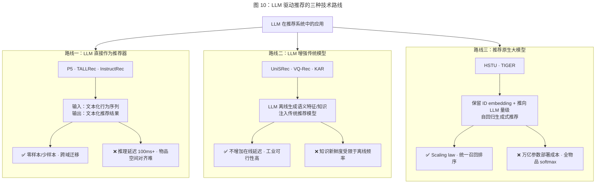

#### 8.1.4 LLM 作为推荐器的核心挑战

将 LLM 直接用作推荐器面临若干根本性挑战：

**物品空间对齐问题。** LLM 的输出空间是自然语言 token 的词表（通常 32K-128K），而推荐系统的物品空间可达百万甚至亿级。如何将 LLM 的生成概率分布映射到物品空间上是核心难题。P5 通过将物品 ID 编码为文本 token 解决这一问题，但这种做法使 ID 丧失了语义信息；另一种方案是使用物品的文本描述（标题、类目等）作为生成目标，但文本描述的歧义性和不完整性限制了推荐精度。

**位置偏差与顺序敏感性。** 研究表明，LLM 对输入中物品的排列顺序高度敏感——仅改变行为序列中物品的呈现顺序即可显著影响推荐结果 [Hou et al., 2024]。这种位置偏差（positional bias）与推荐系统追求的排列不变性（permutation invariance，即行为集合相同时推荐结果应一致）存在冲突。

**协同过滤信号的缺失。** LLM 的知识来源于预训练语料中的文本语义，而推荐系统的核心信号——用户-物品交互的协同过滤（collaborative filtering）模式——并不天然存在于文本数据中。纯粹依赖 LLM 的语义理解进行推荐，可能丢失传统协同过滤方法所捕获的群体行为信号。

### 8.2 LLM 增强序列推荐

与 8.1 节将 LLM 直接用作推荐器不同，另一条更具工业可行性的技术路线是：**保留传统的序列推荐模型架构，利用 LLM 作为辅助组件增强其能力**。这一路线避免了 LLM 推理延迟过高的问题，同时引入了 LLM 的语义知识和推理能力。

#### 8.2.1 特征增强：LLM 作为特征提取器

最直接的 LLM 增强方式是利用 LLM 为物品和用户生成丰富的语义特征（semantic features），作为传统推荐模型的额外输入。

**物品文本 embedding 增强。** 利用预训练语言模型（如 BERT [Devlin et al., 2019]、Sentence-BERT [Reimers and Gurevych, 2019]）或大型 LLM 将物品的文本描述编码为稠密语义向量。这些语义向量与传统的 ID embedding 拼接或融合后输入序列推荐模型，为模型提供超越协同过滤的内容理解能力。UniSRec [Hou et al., 2022] 和 VQ-Rec [Hou et al., 2023]（见第 5.4 节）即采用了这一思路，利用预训练语言模型的文本 embedding 实现跨域序列推荐。

**LLM 生成的用户兴趣摘要。** 另一种方式是利用 LLM 分析用户的历史行为序列，生成结构化的用户兴趣摘要（user interest profile），例如：

> *"该用户主要关注科技类产品，近期偏好智能家居设备，价格敏感度中等，品牌偏好倾向于小米和华为。"*

这种兴趣摘要可以作为额外的文本特征输入到推荐模型中，为模型提供高层次的用户理解。这一方式的优势在于 LLM 的推理在离线批处理中完成，不影响在线推理延迟。

#### 8.2.2 知识注入：弥合语义鸿沟

LLM 增强序列推荐的另一重要方向是**知识注入（knowledge injection）**——利用 LLM 蕴含的世界知识弥补推荐系统在语义理解上的不足。

**物品关系推理。** LLM 可以推理物品之间的语义关系（互补品、替代品、搭配关系等），这些关系在传统的协同过滤框架中需要通过大量交互数据才能隐式学习。例如，LLM 知道"手机壳"和"手机"是互补品，"iPhone"和"Samsung Galaxy"是替代品，这些知识可以用于增强序列推荐模型对物品转移模式的理解。

**冷启动场景的知识补充。** 对于新物品或新用户，行为数据极为稀缺，传统协同过滤方法难以提供有效推荐。LLM 可以基于物品的文本描述推断其属性和目标用户群，基于用户的少量行为推理其兴趣偏好，从而在冷启动场景中提供合理的推荐依据。KAR [Xi et al., 2024] 提出利用 LLM 生成的知识作为推荐模型的辅助信号，在保持传统推荐架构不变的前提下显著提升冷启动性能。

**特征增强 vs 端到端 LLM 推荐的权衡。** 特征增强方式相比端到端的 LLM 推荐（8.1 节）具有显著的工程优势：LLM 的推理仅在离线阶段执行（生成特征或知识），在线推理仍由高效的传统推荐模型完成，因此不引入额外的在线延迟。这一特性使其成为当前工业界最具可行性的 LLM 推荐落地方案。

### 8.3 生成式推荐范式

#### 8.3.1 从判别式到生成式的范式转变

传统推荐系统采用**判别式（discriminative）** 建模范式：给定候选物品，模型输出用户对该物品的点击/购买概率。这一范式的核心操作是对候选物品逐一打分并排序，模型不直接"生成"推荐结果，而是在预设的候选集上进行选择。

生成式推荐（generative recommendation）则采用根本不同的思路：**模型直接在物品空间上生成推荐结果**，无需预设候选集。类比于语言模型从词表中自回归地生成下一个 token，生成式推荐模型从物品空间中自回归地生成用户可能交互的下一个物品：

$$P(b_{T+1} \mid b_1, b_2, \ldots, b_T) = \text{Model}(b_1, b_2, \ldots, b_T)$$

这一范式转变的潜在优势在于：（1）统一了召回和排序阶段，消除了传统多阶段流水线中的信息损失；（2）通过自回归目标，模型可以自然地建模物品间的条件依赖关系；（3）模型规模的扩展可以直接转化为推荐质量的提升。

#### 8.3.2 自回归物品生成

自回归物品生成的核心技术挑战在于：如何在百万至亿级的物品空间上高效地定义和计算生成概率分布。

**基于物品 ID 的直接生成。** 最直接的方式是将物品 ID 视为"词表"中的 token，通过 softmax 层在全物品空间上计算概率分布。然而，当物品数量达到百万级时，全量 softmax 的计算代价极高。为此，研究者提出了层次化 softmax（hierarchical softmax）和采样 softmax（sampled softmax）等近似策略，以降低计算复杂度。

**基于语义 ID 的层次化生成。** TIGER [Rajput et al., 2023] 提出了语义 ID（Semantic ID）的概念：利用 RQ-VAE（Residual-Quantized Variational AutoEncoder）将物品的语义 embedding 量化为多级离散 code，每个物品被表示为一个 code 序列（如 [c1, c2, c3]）。推荐模型通过自回归地逐级生成 code，实现层次化的物品生成。这一设计将物品空间的 softmax 从百万级降至每级数千的 codebook 大小，大幅提升了生成效率，同时 semantic ID 保留了物品的语义相似性结构——语义相近的物品共享 code 前缀。

#### 8.3.3 HSTU 与工业规模生成式推荐

HSTU [Zhai et al., 2024]（架构细节见第 5.3 节）是生成式推荐范式在工业规模上的标志性实践。HSTU 将序列推荐定义为：基于用户的完整行为历史，自回归地预测下一个交互物品。其万亿参数规模和针对推荐任务深度定制的 Transformer 架构，展示了推荐原生大模型的可行路径。

HSTU 的核心启示在于：**推荐系统的大模型路线不一定需要借助通用 LLM**。通过保留推荐任务的原生特征表示（ID embedding 而非文本 token）并将模型规模推向 LLM 量级，HSTU 实现了比通用 LLM 更高的推理效率和更好的推荐效果。这一"推荐原生的大模型"路线与 P5/TALLRec 等"通用 LLM 适配推荐"的路线形成了有益的对比和互补。

HSTU 的实验表明，生成式推荐的效果随模型规模的增长而持续提升，呈现出类似于 LLM 领域的 scaling law 特性。这一发现暗示：推荐系统也可能存在"涌现能力"——当模型规模超过某个阈值时，推荐质量可能出现阶跃式提升。然而，推荐场景的 scaling law 是否与语言建模的 scaling law 具有相同的函数形式，仍是开放的研究问题。

### 8.4 工业部署挑战

尽管 LLM 驱动的序列建模在学术研究中展现了巨大潜力，其在工业推荐系统中的大规模落地仍面临多方面的严峻挑战。

#### 8.4.1 推理成本与延迟

推理成本是 LLM 推荐工业落地的首要障碍。工业 CTR 预估系统要求单次推理延迟在 10-50 毫秒以内，而 LLM 的自回归生成——即使是 7B 参数规模的模型——单次生成延迟通常在百毫秒至秒级。这一量级的差距使端到端的 LLM 推荐在在线排序阶段几乎不可行。

当前的应对策略包括：（1）**离线/近线推理**：将 LLM 的推理从在线请求链路中移除，改为离线批量处理或近线异步计算，生成的结果（如用户兴趣摘要、物品语义特征）存入缓存供在线模型调用；（2）**模型压缩**：通过知识蒸馏（knowledge distillation）将 LLM 的能力迁移到小型模型中，在保持效果的同时大幅降低推理成本；（3）**推测解码（speculative decoding）**：利用小型 draft model 加速大型 LLM 的自回归生成过程。

#### 8.4.2 蒸馏与量化

知识蒸馏和模型量化是降低 LLM 推荐部署成本的两条关键技术路线。

**知识蒸馏。** 以大型 LLM（teacher model）的输出或中间表示为监督信号，训练轻量级的推荐模型（student model）。蒸馏可以在多个层面进行：（1）**输出层蒸馏**：让 student 模型学习模仿 teacher 的推荐分布；（2）**特征层蒸馏**：让 student 模型的中间表示对齐 teacher 的隐层表示；（3）**知识蒸馏**：将 LLM 生成的文本知识（如物品关系、用户画像）转化为结构化特征输入到 student 模型中。实践表明，通过蒸馏可以将 LLM 级别的推荐能力压缩到参数量减少 100 倍以上的小模型中，同时保留 70%-90% 的效果增益。

**模型量化。** 将 LLM 的浮点参数从 FP16/BF16 量化为 INT8 甚至 INT4，可以将模型的存储空间和推理延迟降低 2-4 倍。GPTQ [Frantar et al., 2023] 和 AWQ [Lin et al., 2024b] 等后训练量化（post-training quantization）方法已在通用 LLM 上取得了成功，在推荐领域的适用性正在被积极探索。量化对推荐模型的影响与对语言模型的影响存在差异：推荐模型中高维稀疏的 ID embedding 对量化精度更为敏感，过度量化可能导致协同过滤信号的严重损失。

#### 8.4.3 幻觉与可靠性

LLM 的"幻觉"（hallucination）问题在推荐场景中具有特殊的风险。

**推荐幻觉的表现形式。** LLM 可能生成不存在的物品 ID 或物品描述（"编造"物品）、推荐已下架或不可获取的物品、或生成与用户实际偏好不符但"看起来合理"的推荐理由。这些幻觉在对话式推荐中尤为突出——当用户追问推荐理由时，LLM 可能编造虚假的物品属性或用户行为来"自圆其说"。

**缓解策略。** 应对推荐幻觉的策略包括：（1）**约束解码（constrained decoding）**：将 LLM 的生成空间约束在有效物品集合内，确保生成的推荐结果对应真实存在的物品；（2）**检索增强生成（Retrieval-Augmented Generation, RAG）**：在 LLM 生成推荐结果前，先从物品库中检索相关候选物品，将检索结果作为上下文输入 LLM，减少幻觉风险；（3）**后验验证**：对 LLM 生成的推荐结果进行后处理验证，过滤掉不存在或不可用的物品。

**可靠性与一致性。** 除幻觉外，LLM 推荐的可靠性还面临输出一致性的挑战。由于 LLM 的随机采样特性，相同的输入可能产生不同的推荐结果，这与传统推荐系统的确定性输出形成对比。在广告竞价等需要精确概率估计的场景中，LLM 的随机性可能导致收入波动和系统不稳定。

### 8.5 小结

本章系统梳理了 LLM 驱动的序列建模方法，涵盖四条主要技术路线：

**LLM 作为推荐器。** P5 [Geng et al., 2022] 确立了"推荐即文本生成"的范式，TALLRec [Bao et al., 2023] 展示了通用 LLM 通过轻量微调适配推荐任务的可行性，InstructRec [Zhang et al., 2023] 探索了自然语言指令驱动的灵活推荐接口。这一路线的核心优势在于零样本/少样本能力和跨域知识迁移，但面临推理效率和物品空间对齐的瓶颈。

**LLM 增强序列推荐。** 通过将 LLM 作为离线特征提取器或知识注入源，在保留传统推荐模型高效推理的同时引入语义知识。这是当前工业界最具可行性的 LLM 推荐落地方案，UniSRec [Hou et al., 2022]、VQ-Rec [Hou et al., 2023] 和 KAR [Xi et al., 2024] 等工作从不同角度验证了这一路线的有效性。

**生成式推荐范式。** HSTU [Zhai et al., 2024] 从工业规模的角度展示了推荐原生大模型的潜力，TIGER [Rajput et al., 2023] 通过语义 ID 实现了高效的层次化物品生成。生成式范式试图统一推荐系统的多阶段流水线，其 scaling law 特性暗示推荐系统也可能通过持续增大模型规模实现质量跃升。

**工业部署挑战。** 推理成本、蒸馏量化和幻觉可靠性构成了 LLM 推荐落地的三大核心障碍。当前最务实的落地路径是：LLM 在离线链路中提供知识增强，传统高效模型在在线链路中承担实时推理，两者通过特征或知识接口解耦。

展望而言，LLM 驱动的序列建模正处于从学术探索向工业验证过渡的关键阶段。其长期发展路径可能呈现分化：一方面，以 HSTU 为代表的"推荐原生大模型"路线将继续推进推荐系统的规模化（scaling），探索推荐领域的 scaling law 和涌现能力；另一方面，以 LLM 增强为代表的"混合架构"路线将成为工业落地的主流方案，通过 LLM 的离线知识蒸馏持续提升传统推荐模型的上限。两条路线最终可能走向融合——在推荐原生的大模型架构中，融入 LLM 的语义理解能力和世界知识，构建兼具协同过滤信号和语义理解的统一推荐基础模型。

## 9. 跨界技术借鉴

推荐系统序列建模的技术演进并非在领域内部自发完成——从 Transformer 到对比学习，从 Diffusion Model 到 Mamba，几乎每一次重大技术突破都源自对其他领域成果的跨界借鉴与适配。本章系统分析自然语言处理（NLP）、计算机视觉（CV）、语音/时序分析等领域的关键技术向推荐系统迁移的路径、适配挑战和成功经验，并提出跨界迁移的通用评估框架。这种跨领域视角是理解推荐系统技术演进内在逻辑的关键线索，也是预判未来技术方向的重要依据。

### 9.1 NLP 领域的序列建模技术迁移

NLP 是推荐系统序列建模技术最主要的借鉴来源。从 Attention 机制到 Transformer 架构，从预训练范式到 Prompt Engineering，NLP 的核心技术几乎无一例外地被引入推荐系统，但每一次迁移都伴随着深层的适配挑战。

#### 9.1.1 Transformer 从 NLP 到推荐的适配

Transformer [Vaswani et al., 2017] 最初为机器翻译任务设计，其 self-attention 机制假设输入是一个由语义 token 组成的有序序列。当这一架构被迁移到推荐系统时，面临三个层面的本质差异：

**位置编码的语义差异。** 在 NLP 中，位置编码用于表示 token 在句子中的语法位置，相邻 token 之间通常存在强语义关联（如 "the cat sat" 中相邻词的语法依赖）。而在推荐序列中，相邻行为之间的关联更多由用户意图驱动而非结构性语法——用户可能在连续的两次点击之间完全切换兴趣方向。SASRec [Kang and McAuley, 2018] 直接沿用了可学习的位置 embedding，这在短序列上表现良好，但未能充分利用推荐序列特有的时间间隔信息。TiSASRec [Li et al., 2020b] 通过引入时间间隔编码替代纯位置编码，是针对推荐场景进行位置编码适配的典型案例。BST [Chen et al., 2019] 则实验了多种位置编码方案，发现在工业 CTR 场景中，简单的位置编码与复杂的时间编码效果差异不大，暗示工业系统中其他特征（如物品属性、上下文信息）可能已部分补偿了时间信息的缺失。

**序列语义的差异。** NLP 序列中的 token 来自固定且相对较小的词表（通常 32K-128K），每个 token 携带丰富的预训练语义；推荐序列中的 "token"（物品 ID）来自极大的物品空间（百万至亿级），且 ID 本身不携带语义信息，完全依赖从交互数据中学习的 embedding。这一差异导致 NLP 中 Transformer 的许多设计假设在推荐场景中失效。例如，NLP Transformer 中的 softmax attention 假设 query-key 点积的分布相对集中，但推荐场景中大量未交互物品对的点积分布可能极度稀疏和不规则。HSTU [Zhai et al., 2024] 正是基于这一观察，用 pointwise 聚合替代 softmax attention，移除了 LayerNorm 和 FFN 层，实现了推荐原生的 Transformer 架构。

**注意力模式的差异。** NLP 中的注意力模式通常呈现出明显的局部性和结构性（如动词关注其主语和宾语），而推荐序列中的注意力模式更加分散和任务依赖——用户的兴趣可能跳跃性地分布在序列的不同位置。DIN [Zhou et al., 2018] 的 target attention 正是对这一差异的直接回应：NLP 的 self-attention 关注序列内部的 token-token 关系，而 DIN 关注的是外部候选物品与序列内行为的关系（target-aware attention），这种建模范式在 NLP 中并不存在自然对应物。

#### 9.1.2 GPT/BERT 预训练范式的迁移

NLP 领域的预训练范式向推荐系统的迁移形成了一条清晰的技术脉络：

**BERT → BERT4Rec（双向预训练）。** BERT [Devlin et al., 2019] 的 Masked Language Modeling（MLM）目标被 BERT4Rec [Sun et al., 2019] 直接适配为 Masked Item Prediction——随机 mask 序列中的物品并预测。这一迁移在技术实现上较为直接，但存在一个隐含的假设偏差：MLM 假设被 mask 的 token 与上下文之间存在强语义约束（"The [MASK] sat on the mat" 中被 mask 词几乎唯一确定），而推荐序列中被 mask 物品的候选空间通常极大（用户在任意位置都可能交互数万种物品），预测的不确定性远高于文本补全。

**GPT → SASRec / P5（自回归生成）。** GPT [Radford et al., 2018] 的自回归预训练目标被 SASRec [Kang and McAuley, 2018] 适配为 next-item prediction，被 P5 [Geng et al., 2022] 进一步推广为多任务的 text-to-text 生成。P5 的迁移更为激进——它不仅借鉴了 GPT 的架构，还借鉴了 T5 [Raffel et al., 2020] 的 "将一切任务统一为文本生成" 的思想，将评分预测、序列推荐、解释生成等多种推荐任务统一为 text-to-text 范式。

**指令微调 → TALLRec / InstructRec。** ChatGPT 引发的指令微调（instruction tuning）浪潮迅速被推荐领域吸收。TALLRec [Bao et al., 2023] 通过 LoRA [Hu et al., 2022] 对 LLaMA 进行推荐任务的指令微调，仅需不到 100 条样本即可实现有效推荐。InstructRec [Zhang et al., 2023] 则探索了用自然语言指令灵活表达推荐需求。从 P5 到 TALLRec 再到 InstructRec，可以观察到推荐领域对 NLP 预训练范式的追随间隔正在缩短——从 BERT 到 BERT4Rec 间隔约一年，而从 ChatGPT 到 TALLRec 仅数月。

**迁移中的关键挑战。** 预训练范式迁移的核心障碍在于 **token 空间的根本差异**。NLP 的词表是封闭的、语义丰富的、跨任务共享的；推荐的物品空间是开放的（新物品不断上架）、语义稀疏的（ID 无内在含义）、域特定的（不同推荐域的物品空间完全不重叠）。UniSRec [Hou et al., 2022] 和 VQ-Rec [Hou et al., 2023] 通过利用预训练语言模型的文本 embedding 作为物品表示，试图弥合这一鸿沟，但文本表示的推荐判别力是否能匹配 ID embedding 的协同过滤信号，仍是开放问题。

#### 9.1.3 Prompt Engineering 在推荐中的应用

NLP 领域 Prompt Engineering 的兴起启发了推荐系统中的一系列 prompt-based 方法。核心思想是：通过设计合适的 prompt 模板，将推荐任务转化为 LLM 已经擅长的文本理解或生成任务。

**Hard Prompt（离散模板）。** P5 [Geng et al., 2022] 为每种推荐任务手工设计了多组 prompt 模板，例如序列推荐的 prompt："User\_23 has purchased item\_45, item\_102 in order. Predict the next item."。这类 hard prompt 的效果高度依赖模板的设计质量，且物品以 ID 字符串表示丢失了语义信息。

**Soft Prompt（连续向量）。** 受 NLP 领域 prompt tuning [Lester et al., 2021] 的启发，部分推荐工作探索了用可学习的连续向量替代离散文本 prompt。这些 soft prompt 在 LLM 的 embedding 空间中优化，能够编码推荐任务特有的信号（如协同过滤模式），突破了自然语言 prompt 的表达局限。

**Prompt 迁移的根本挑战。** 推荐场景中 Prompt Engineering 面临的独特困难在于：NLP 的 prompt 操作的是 LLM 已经理解的自然语言概念，而推荐 prompt 需要操作的是 LLM 预训练数据中可能从未出现过的物品 ID 和交互模式。这意味着推荐 prompt 不仅需要激活 LLM 的推理能力，还需要向 LLM 注入全新的领域知识——这超出了标准 Prompt Engineering 的能力范围，通常需要配合微调或知识注入等额外手段。

### 9.2 CV 领域的借鉴

计算机视觉领域的多项核心技术也被创造性地引入推荐系统序列建模，其中对比学习和 Diffusion Model 的迁移尤为值得关注。

#### 9.2.1 ViT 的 Patch Embedding 思想与行为序列分段

Vision Transformer（ViT）[Dosovitskiy et al., 2021] 的核心创新在于将图像分割为固定大小的 patch，每个 patch 经线性投影后作为 Transformer 的输入 token。这一 "将非序列数据序列化" 的思想对推荐系统产生了间接但深远的启发。

**行为序列的分段思想。** 类比 ViT 将图像分割为 patch，推荐系统中也有工作探索将长行为序列分割为 "行为片段"（behavior segments）。每个片段对应用户在某一时间窗口或某一兴趣主题下的连续行为子集，片段内部通过细粒度模型编码，片段之间通过粗粒度模型聚合。这种层次化的分段策略在思想上与 ViT 的 patch 机制异曲同工：都是通过将原始输入分割为可管理的单元，降低序列长度从而缓解 Transformer 的 $O(T^2)$ 复杂度瓶颈。SIM [Pi et al., 2020] 的两阶段检索可以看作一种极端的 "分段"——GSU 将超长序列按相关性分为 "相关片段" 和 "不相关片段"，仅对前者施加精细编码。

**Embedding 投影的思想迁移。** ViT 对 patch 的线性投影本质上是将原始像素空间映射到 Transformer 的隐空间。这一思想在推荐系统中对应于物品 embedding 的设计——将高维稀疏的物品特征（ID、属性、文本描述）投影为低维稠密的向量表示。UniSRec [Hou et al., 2022] 中通过预训练语言模型将物品的文本描述投影为通用语义向量的做法，在精神上与 ViT 的线性投影一致：都是将异构的原始输入统一映射到 Transformer 可处理的稠密向量空间。

#### 9.2.2 Diffusion Model 在推荐中的探索

Diffusion Model 在图像生成领域取得突破性成功（DALL-E 2 [Ramesh et al., 2022]、Stable Diffusion [Rombach et al., 2022]）后，研究者开始探索其在推荐系统中的应用。

**DiffRec [Wang et al., 2023]。** DiffRec 是将 Diffusion Model 引入推荐系统的代表性工作。其核心思想是将用户-物品交互矩阵的生成过程建模为一个扩散-去噪过程：前向过程逐步向交互向量添加高斯噪声，使其退化为纯噪声；反向过程（去噪过程）学习从噪声中恢复用户的真实交互偏好。这一范式在概念上将推荐问题重新定义为 "从噪声中恢复用户真实兴趣" 的信号恢复问题。

**DreamRec [Yang et al., 2023]。** DreamRec 进一步将 Diffusion 应用于序列推荐场景。它将用户行为序列编码为条件信号，通过条件扩散过程在物品 embedding 空间中生成用户可能感兴趣的物品表示，实现了 "在 embedding 空间中生成推荐" 的新范式。

**迁移的可行性分析。** Diffusion Model 从 CV 到推荐的迁移面临数据特性的根本差异：图像数据是连续的高维信号，Diffusion 的加噪-去噪过程在连续空间中自然定义；而推荐系统的物品交互数据本质上是离散的（点击/未点击），且极度稀疏（用户仅交互了物品空间中极小比例的物品）。DiffRec 通过在连续的交互向量空间中操作部分缓解了离散性问题，但稀疏性仍是挑战——加噪过程可能破坏本已微弱的交互信号。此外，Diffusion Model 的多步去噪推理在计算效率上远逊于传统推荐模型的单次前向传播，限制了其在在线推荐系统中的部署可行性。

#### 9.2.3 对比学习从 SimCLR/MoCo 到 CL4SRec/CoSeRec

对比学习（Contrastive Learning）是 CV 领域自监督表示学习的核心方法。SimCLR [Chen et al., 2020a] 和 MoCo [He et al., 2020] 通过最大化同一图像不同数据增强视图之间的一致性，学习具有判别力的视觉表示。这一思想被创造性地迁移到推荐系统的序列建模中。

**CL4SRec [Xie et al., 2022]。** CL4SRec（Contrastive Learning for Sequential Recommendation）是将对比学习引入序列推荐的代表性工作。CL4SRec 借鉴 SimCLR 的对比学习框架，提出了三种行为序列的数据增强策略：（1）**Crop**：随机裁剪序列的一个连续子序列；（2）**Mask**：随机 mask 序列中的部分物品；（3）**Reorder**：随机打乱序列中一个子序列的顺序。同一用户序列经不同增强产生的两个视图作为正对（positive pair），不同用户序列作为负对（negative pair），通过 InfoNCE 损失最大化正对的一致性：

$$\mathcal{L}_{CL} = -\log \frac{\exp(\text{sim}(\mathbf{z}_i, \mathbf{z}_j) / \tau)}{\sum_{k=1}^{2N} \mathbb{1}_{[k \neq i]} \exp(\text{sim}(\mathbf{z}_i, \mathbf{z}_k) / \tau)}$$

其中 $\mathbf{z}_i$ 和 $\mathbf{z}_j$ 为同一序列两个增强视图的表示，$\tau$ 为温度超参数。对比损失与主任务的推荐损失联合优化，对比学习作为辅助自监督信号增强序列表示的质量。

**CoSeRec [Liu et al., 2021]。** CoSeRec（Contrastive Self-supervised Sequential Recommendation）提出了更精细的数据增强策略——基于物品的共现关系和类目信息生成增强序列，而非简单的随机操作。例如，用高频共现的物品替换序列中的某个物品，或插入与序列主题一致的新物品。这种语义感知的数据增强产生了更高质量的正对，使对比学习的监督信号更为有效。

**迁移中的适配挑战。** 从 CV 到推荐的对比学习迁移面临数据增强策略设计的核心差异：图像的数据增强（裁剪、旋转、颜色扰动等）基于图像语义在空间变换下具有不变性的先验知识；行为序列的数据增强则缺乏如此清晰的不变性假设。CL4SRec 的 crop/mask/reorder 增强隐含假设序列的语义在这些操作下大致不变，但这一假设并非总是成立——例如，删除用户行为序列中一个关键的购买行为可能根本改变用户的兴趣表示。如何设计既保持语义一致性又引入足够变化性的推荐序列增强策略，仍是活跃的研究方向。

#### 9.2.4 数据增强策略的跨界借鉴

除对比学习外，CV 领域丰富的数据增强思想也对推荐系统产生了广泛影响：

**Mixup [Zhang et al., 2018] → 推荐中的序列混合。** Mixup 通过在两个训练样本之间进行线性插值生成新样本。在推荐领域，类似的思想被用于在 embedding 空间中对不同用户的行为序列表示进行插值，生成虚拟的 "混合用户" 训练样本，缓解数据稀疏性问题。

**Cutout/CutMix → 序列 Dropout。** CV 中 Cutout [DeVries and Taylor, 2017] 随机遮盖图像区域的做法，启发了推荐系统中序列 dropout 和 embedding dropout 的设计——随机丢弃行为序列中的部分物品或 embedding 的部分维度，作为正则化手段防止过拟合。

### 9.3 语音/时序领域的借鉴

#### 9.3.1 SSM/Mamba 从语音/时序到推荐的路径

状态空间模型（SSM）的发展路径横跨多个领域：S4 [Gu et al., 2022] 最初在语音分类和长序列基准（Long Range Arena [Tay et al., 2021]）上展示了突破性效果；Mamba [Gu and Dao, 2023] 在语言建模上达到了与 Transformer 同等的性能水平。SSM 向推荐系统的迁移（Mamba4Rec [Liu et al., 2024]）可以视为这一技术在多个领域验证后的自然扩散。

**迁移的技术路径。** SSM 从语音/时序到推荐的迁移路径可概括为：连续时间动力系统（控制理论）→ 长序列音频/时序建模（S4）→ 语言建模（Mamba）→ 序列推荐（Mamba4Rec）。每个迁移步骤都伴随着关键的适配创新：S4 引入 HiPPO 初始化解决长程记忆问题，Mamba 引入选择性机制克服内容无关局限，Mamba4Rec 则在推荐任务特有的训练目标（next-item prediction）和评估指标（NDCG、HR）下验证了架构的有效性。

**时序预测技术的借鉴。** 值得注意的是，SSM 在时序预测（Time Series Forecasting）领域也取得了显著进展。时序预测中的长期依赖建模（如气象预测、金融市场分析）与推荐系统中的长期用户兴趣建模在数学结构上具有相似性——两者都需要从历史观测序列中提取对未来状态有预测力的模式。时序预测领域发展的 Informer [Zhou et al., 2021]（稀疏注意力）、Autoformer [Wu et al., 2021b]（自相关分解）等技术在概念上与推荐系统中的长序列高效注意力方法相呼应，但两者的直接技术迁移仍较为有限，主要原因在于数据特性的差异：时序预测处理的是连续数值信号，而推荐序列是离散事件流。

#### 9.3.2 音频处理中的流式推理与推荐的实时性

语音识别和音频处理领域对流式推理（streaming inference）的需求——在音频流持续输入时实时产出识别结果——与推荐系统的实时序列更新需求高度相似。两者都要求模型能够在新输入到达时以极低延迟增量更新输出，而非对整个历史序列重新计算。

SSM/Mamba 的递推推理模式天然满足这一需求：每步仅需执行 $O(1)$ 的状态更新即可融入新输入，这一特性在语音处理中被广泛利用，也是 Mamba 对推荐系统在线推理场景最具吸引力的特性之一。相比之下，Transformer 的 KV-cache 机制虽然也支持增量推理，但其缓存大小随序列长度线性增长，在超长行为序列场景中的内存开销远高于 SSM 的固定大小状态缓存。

### 9.4 跨界迁移的通用挑战与框架

#### 9.4.1 数据特性差异

跨界技术迁移面临的最根本挑战在于源领域与推荐领域之间的数据特性差异。我们将这些差异归纳为四个维度：

**连续 vs 离散。** NLP 的 embedding 和 CV 的像素值都是连续信号，许多数学操作（插值、加噪、梯度传播）在连续空间中自然定义。推荐系统的核心数据——用户-物品交互——本质上是离散的二值事件（交互/未交互），且物品 ID 空间是离散的。这一差异影响了 Diffusion Model（依赖连续空间的加噪-去噪）、数据增强（连续空间的 Mixup vs 离散空间的替换/删除）等技术的直接迁移。

**稠密 vs 稀疏。** 文本序列中每个位置都有有意义的 token，图像中每个像素都携带视觉信息——数据是稠密的。推荐系统中，用户仅与物品空间中极小比例的物品产生过交互（通常 < 0.1%），数据极度稀疏。稀疏性使得许多在稠密数据上有效的表示学习方法（如标准的对比学习负采样策略）需要针对推荐场景进行调整。

**封闭词表 vs 开放物品空间。** NLP 的词表是预定义的、固定的，新词出现的频率极低；推荐系统的物品空间是持续变化的——新物品不断上架、旧物品下架。这一差异使得依赖固定词表的预训练方法（如 BERT 的词嵌入）在推荐场景中面临冷启动挑战：预训练阶段未见过的新物品无法获得有效的表示。

**序列长度与分布。** NLP 中序列长度通常在数十到数千 token 之间，分布相对集中；推荐序列的长度跨度极大——从新用户的几条行为到活跃用户的数万条行为，长度分布呈严重的长尾形态。这种异构性要求模型同时适应短序列和超长序列，是 NLP 模型通常不需要面对的挑战。

#### 9.4.2 任务目标差异

除数据特性外，源领域和推荐领域的任务目标也存在本质差异：

**NLP 的语义理解 vs 推荐的行为预测。** NLP 任务（翻译、问答、摘要）的核心目标是语义理解和生成，评估标准聚焦于语义准确性。推荐任务的核心目标是预测用户的未来行为（点击、购买），评估标准聚焦于排序质量（AUC、NDCG）和商业指标（CTR、GMV）。这一差异意味着，在 NLP 中有效的语义表示不一定是推荐任务中最优的行为预测特征。

**CV 的视觉不变性 vs 推荐的时序敏感性。** CV 中的表示学习追求对空间变换（旋转、缩放、裁剪）的不变性，而推荐序列建模强调对时间顺序的敏感性——同一组行为以不同时间顺序出现可能指示完全不同的用户意图。

**全局优化 vs 个体优化。** NLP/CV 模型通常在全局数据集上优化统一目标，而推荐系统需要在群体模式和个体偏好之间取得平衡——过度拟合群体模式会牺牲个性化，过度拟合个体会导致数据稀疏下的过拟合。

#### 9.4.3 迁移可行性评估框架

基于上述分析，我们提出一个评估跨界技术迁移可行性的三维框架：

**维度一：数据兼容性（Data Compatibility）。** 评估源领域技术对数据类型的假设与推荐数据特性的匹配程度。Transformer 的 self-attention 对数据类型无强假设（仅要求向量序列），数据兼容性高；Diffusion Model 假设连续空间和稠密数据，数据兼容性低。

**维度二：归纳偏置适配性（Inductive Bias Alignment）。** 评估源技术的核心归纳偏置是否与推荐任务的建模需求一致。SSM 的递推归纳偏置与推荐序列的时序特性天然契合；CV 中的空间不变性假设与推荐序列的时序敏感性存在冲突。

**维度三：工程迁移成本（Engineering Transfer Cost）。** 评估将源技术适配到推荐系统技术栈的工程改动量。Attention 机制的迁移仅需修改序列编码模块，工程成本低；LLM 全栈推荐需要重构从特征工程到在线服务的整个流水线，工程成本极高。

| 迁移技术 | 数据兼容性 | 归纳偏置适配性 | 工程迁移成本 | 迁移成功度 |
|---------|-----------|--------------|------------|-----------|
| Self-Attention (NLP→Rec) | 高 | 中（需适配位置编码） | 低 | 极高（SASRec/BST） |
| BERT MLM (NLP→Rec) | 高 | 中（离散空间不确定性高） | 低 | 高（BERT4Rec） |
| 对比学习 (CV→Rec) | 中（增强策略需重新设计） | 中（不变性假设需调整） | 低 | 高（CL4SRec/CoSeRec） |
| SSM/Mamba (语音→Rec) | 高 | 高（时序递推契合） | 中（自定义算子） | 中（早期验证中） |
| Diffusion Model (CV→Rec) | 低（连续vs离散） | 低（生成范式不匹配） | 高 | 低（探索阶段） |
| LLM 全栈 (NLP→Rec) | 低（token空间不匹配） | 中（序列能力强但推荐知识弱） | 极高 | 低-中（仍在探索） |

### 9.5 小结

本章系统分析了 NLP、CV、语音/时序等领域的核心技术向推荐系统序列建模迁移的路径与挑战。跨界技术借鉴是推荐系统技术演进的核心驱动力，但每一次成功的迁移都伴随着深层的适配工程——从 Transformer 的位置编码适配到对比学习的数据增强重新设计，从 SSM 的选择性机制到 LLM 的物品空间对齐。

从技术迁移的历史模式中，可以提炼出三条经验法则：

**第一，架构迁移易于目标迁移。** Transformer 的 self-attention 架构几乎原封不动地迁移到了推荐系统（SASRec/BST），而 BERT 的预训练目标（MLM）在推荐场景中的适配则需要更多的领域特定设计。架构是通用的计算模式，而训练目标编码了任务特有的先验知识。

**第二，轻量级借鉴优先于全栈替代。** 从工业成功案例看，最有效的跨界迁移通常是将源领域的核心思想作为推荐模型的一个子模块引入（如 DIN 的 attention、BST 的 Transformer 层、CL4SRec 的对比损失），而非试图用源领域的完整方法论替代推荐系统的整个技术栈（如 P5 的全文本化推荐）。

**第三，数据特性决定迁移上限。** 推荐系统与源领域之间的数据特性差异（离散vs连续、稀疏vs稠密、开放vs封闭空间）是迁移可行性的根本约束。数据兼容性高的技术（如 self-attention、SSM）迁移成功率显著高于数据兼容性低的技术（如 Diffusion Model）。

展望而言，下一波跨界借鉴可能来自以下方向：（1）多模态大模型（如 GPT-4V、Gemini）的统一表示能力向多模态推荐的迁移；（2）强化学习中的 Decision Transformer 向交互式推荐的迁移；（3）神经架构搜索（NAS）技术向推荐模型自动化设计的应用。

## 10. 工业部署实践

学术研究与工业落地之间存在深刻的鸿沟：一个在离线评估中 AUC 领先 0.5% 的模型，可能因推理延迟超标或系统复杂度过高而无法上线。本章从在线服务架构、计算优化策略、典型企业实践和 A/B 测试效果四个维度，系统总结推荐系统序列建模的工业部署经验，为研究者理解 "什么样的模型能真正上线" 提供实证依据。

### 10.1 在线服务架构

#### 10.1.1 行为序列的实时更新与存储

在工业推荐系统中，用户行为序列的实时更新与高效存储是序列建模上线的基础设施前提。

**实时行为收集管线。** 用户的每一次交互（点击、加购、购买等）通过事件流系统（如 Kafka、Flink）被实时捕获，经清洗和特征提取后写入用户行为存储。行为数据通常需要在秒级延迟内被推荐系统可见，以确保模型使用的序列信息足够 "新鲜"。阿里巴巴的实践表明，行为序列的更新延迟从分钟级降至秒级可以带来可观的 CTR 提升 [Pi et al., 2020]。

**行为序列的存储架构。** 用户行为序列的存储面临读写效率与空间成本的权衡：
- **KV 存储（如 Redis、Tair）**：将用户 ID 作为 key，行为序列（通常以序列化的 protobuf 格式）作为 value。优点是读取延迟极低（亚毫秒级），适合在线推理时的实时查询；缺点是内存成本高，超长序列的存储空间开销显著。
- **列式存储（如 HBase、TiKV）**：适合存储完整的历史行为序列（数万条），支持按时间范围高效查询。通常用于离线训练数据的构建和长序列模型的预计算阶段。
- **分层存储策略**：工业系统普遍采用分层策略——近期行为（最近 50-200 条）存储在高速 KV 存储中供在线实时使用，完整历史行为存储在列式存储中供离线训练和长序列模型的预检索使用。SIM [Pi et al., 2020] 的 GSU 阶段即从列式存储中检索长期行为子集。

**行为 Embedding 的预计算与缓存。** 在线推理的延迟瓶颈往往不在序列编码模型本身的计算量，而在于行为 embedding 的查询。每个行为物品的 embedding 需要从分布式参数服务器中读取，涉及大量不规则的内存访问和网络通信。为此，工业系统普遍采用行为 embedding 的预计算策略：在用户行为序列发生变化时异步计算并缓存行为 embedding 向量，在线推理时直接从缓存中读取已计算好的 embedding，避免实时的参数服务器查询。

#### 10.1.2 序列建模在召回/粗排/精排各阶段的角色

工业推荐系统通常采用多阶段级联架构（multi-stage cascade），序列建模在各阶段扮演不同的角色（图 11）：

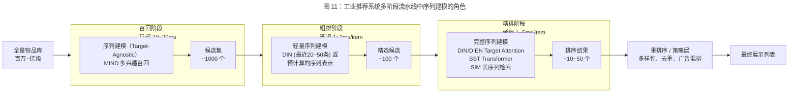

**召回阶段（Retrieval）。** 从百万至亿级的候选物品库中初步筛选数百到数千个候选物品。序列建模在召回阶段通常以 target-agnostic 的方式使用——将用户行为序列编码为一个或多个兴趣向量（如 MIND [Li et al., 2019] 的多兴趣召回），通过向量内积从物品库中检索最相关的候选物品。召回阶段对延迟的容忍度相对较高（通常 10-20 毫秒），但需要处理海量候选物品的匹配，因此模型通常较为轻量。

**粗排阶段（Pre-ranking）。** 从召回结果中进一步精选数百个候选物品。粗排阶段通常使用简化版的序列建模——例如仅使用最近 20-50 条行为的 DIN target attention，或预计算好的序列表示向量。粗排的核心约束是吞吐量（需在极短时间内处理数百个候选物品的打分）。

**精排阶段（Ranking）。** 对粗排后的数十到数百个候选物品进行精细排序，输出最终的推荐列表。精排阶段是序列建模最充分施展的环节——可以使用 DIN/DIEN 的完整 target attention、BST 的 Transformer 编码、甚至 SIM 的长序列检索编码。精排阶段对单个候选物品的打分延迟通常限制在 1-5 毫秒以内，但候选数量较少，可以承受更复杂的模型计算。

#### 10.1.3 预计算 vs 实时计算的权衡

序列建模的在线部署面临预计算（pre-computation）与实时计算（real-time computation）之间的核心权衡：

**预计算模式。** 将序列编码的部分或全部计算移至离线/近线流程。典型策略包括：（1）定期（如每小时或每次行为更新后）预计算用户的序列表示向量并缓存；（2）SIM 的 GSU 检索结果可以预计算并缓存，在线推理时仅执行 ESU 的精细编码。预计算的优势在于将在线延迟降至最低，但代价是序列表示可能存在一定的 "陈旧度"——在两次预计算之间发生的新行为无法被模型感知。

**实时计算模式。** 在每次推理请求时实时执行完整的序列编码。实时计算确保模型使用最新的行为信息，但对在线计算资源和延迟有严格要求。DIN 的 target attention 因其 $O(T \cdot d)$ 的线性复杂度和高度可并行性，是目前最适合实时计算的序列编码方式。

**混合模式。** 工业系统通常采用混合策略：将序列编码中与候选物品无关的部分（如 DIEN 的兴趣抽取层）预计算，仅在在线推理时执行与候选物品相关的部分（如 DIEN 的 AUGRU 兴趣演化层、DIN 的 target attention）。SIM 的 GSU+ESU 两阶段架构本身就是混合模式的典型代表——GSU 的检索可以预计算或近线计算，ESU 的注意力编码在线实时执行。

### 10.2 计算优化策略

#### 10.2.1 GPU Kernel Fusion 与算子优化

序列建模的在线推理在 GPU 上执行时，算子之间的内存读写开销（memory-bound）往往超过计算本身的开销（compute-bound）。Kernel fusion 通过将多个连续的算子融合为单一 CUDA kernel，减少中间结果在 GPU HBM（High Bandwidth Memory）和 SRAM 之间的往返传输，是最有效的推理优化手段之一。

**HSTU 的算子优化实践。** HSTU [Zhai et al., 2024] 的推理加速（如第 5 章所述的架构简化）相当一部分来自算子级优化。移除 LayerNorm 和 FFN 层后，attention 的 QKV 投影、pointwise 聚合和输出投影可以融合为更少的 kernel 调用。此外，HSTU 的 jagged tensor 实现避免了 padding 产生的无效计算——同一 batch 内不同长度的序列被紧密排列在连续内存中，配合变长 attention 的定制 kernel，GPU 计算利用率大幅提升。

**Mamba 的硬件感知优化。** Mamba [Gu and Dao, 2023] 的 selective scan kernel 将离散化参数计算、状态递推和输出投影融合在 GPU SRAM 中完成，避免了中间状态写回 HBM 的开销。训练时采用 recomputation 策略——前向传播不存储中间状态，反向传播时重新计算，以内存节省换取计算增加。这些优化使 Mamba 在 A100 GPU 上实现了优于同参数量 Transformer 3-5 倍的吞吐量。

#### 10.2.2 序列截断与动态填充

**序列截断策略。** 工业系统通常对用户行为序列施加最大长度限制：精排阶段取最近 50-200 条行为，粗排阶段取最近 20-50 条行为。截断策略的选择直接影响模型效果和推理效率的权衡——截断越短，推理越快但丢失的长期信号越多。SIM 的工业实验（详见第 5 章及本章 10.3 节）有力证明了扩展序列长度对 CTR 的显著增益。

**动态填充优化。** 同一 batch 内不同用户的行为序列长度差异悬殊，标准做法是将所有序列 padding 到 batch 内的最大长度。这一做法在 batch 内序列长度差异较大时浪费大量计算。动态填充（dynamic padding）策略通过以下方式优化：（1）**Batch 内排序**：按序列长度对 batch 内的样本排序，使长度相近的样本聚集在一起，减少 padding 浪费；（2）**Bucket 分桶**：将样本按序列长度分桶（如 0-50、50-100、100-200），不同桶使用不同的 padding 长度；（3）**Jagged tensor**：如 HSTU 采用的锯齿张量，完全消除 padding。

#### 10.2.3 模型压缩

**知识蒸馏（Knowledge Distillation）。** 将大型序列模型（teacher）的知识迁移到轻量级模型（student），是平衡效果与效率的主流策略。典型的蒸馏设置包括：（1）将多层 Transformer 的序列编码蒸馏到单层或双层的轻量 Transformer；（2）将 DIEN 的 AUGRU 兴趣演化蒸馏到 DIN 的 target attention，保留兴趣演化的知识但避免 RNN 的顺序计算开销；（3）将 LLM 生成的语义知识蒸馏到传统推荐模型的 embedding 中。工业实践表明，通过蒸馏通常可以保留 teacher 模型 80%-95% 的效果增益，同时将推理延迟降低 2-10 倍。

**量化（Quantization）。** 将模型参数和/或激活值从 FP32/FP16 降低到 INT8 或更低精度。在推荐模型中，embedding 表占据了绝大部分参数量（通常 > 99%），其量化收益尤为显著。INT8 量化可以将 embedding 表的存储空间减半，推理速度提升 1.5-2 倍。但需要注意的是，推荐模型中高维稀疏 embedding 的量化敏感度高于稠密参数——低频物品的 embedding 在量化后可能严重失真。混合精度策略（高频物品保持高精度、低频物品使用低精度）是一种实用的折中方案。

**剪枝（Pruning）。** 移除模型中对最终输出贡献较小的参数或结构。在序列建模中，常见的剪枝策略包括：减少 Transformer 的注意力头数量（head pruning）、减少 FFN 层的隐层维度、以及移除贡献较小的特征交叉。HSTU [Zhai et al., 2024] 直接移除 FFN 层和 LayerNorm 的做法可以视为一种极端的结构化剪枝——这些组件在推荐场景中的贡献不足以证明其计算开销的合理性。

### 10.3 典型企业实践

#### 10.3.1 阿里巴巴：DIN → DIEN → SIM → ETA 的演进路线

阿里巴巴是推荐系统序列建模工业实践的标杆企业，其技术演进路线清晰地展示了从简单注意力到超长序列建模的完整脉络。

**DIN（2018, KDD）。** 阿里妈妈展示广告系统的首个序列建模方法。引入 target attention 替代 sum pooling（A/B 测试效果详见第 4 章）[Zhou et al., 2018]。DIN 的工业意义不仅在于模型创新，更在于证明了 "行为序列中不同行为对当前预测贡献不等" 这一洞察的商业价值。

**DIEN（2019, AAAI）。** 在 DIN 基础上引入兴趣演化建模（AUGRU）和辅助损失。在线 A/B 测试显示 CTR 在 DIN 基础上进一步提升约 5.6%，验证了时序兴趣演化信号的增量价值 [Zhou et al., 2019]。DIEN 的部署面临 RNN 顺序计算的工程挑战，阿里团队通过序列预计算和定制 CUDA 算子等优化手段将在线延迟控制在可接受范围。

**SIM（2020, CIKM）。** 将用户行为序列从 50 条扩展到超长序列规模（序列长度详见第 5.2.1 节），通过 GSU+ESU 两阶段级联架构实现超长序列建模。在线 A/B 测试显示，相较于仅使用近期 50 条行为的 DIN baseline，SIM 的 CTR 提升了 7.1%，RPM 提升了 4.4% [Pi et al., 2020]。SIM 首次在工业规模上证明了长期行为信号对 CTR 预估的显著增益，推动了业界对超长序列建模的关注。

**ETA（2021）。** 通过 LSH 实现端到端可训练的长序列检索，消除 SIM 中 GSU 与 ESU 之间的目标不一致问题。ETA 在阿里巴巴的搜索广告系统中上线部署，在保持与 SIM 可比精度的同时进一步降低了在线推理延迟 [Chen et al., 2021]。

**BST（2019, DLP-KDD）。** 阿里巴巴搜索推荐团队在淘宝搜索中部署 Transformer 编码器替代 DIN 的 target attention（A/B 测试效果详见第 5 章）[Chen et al., 2019]。BST 验证了 Transformer self-attention 在 CTR 预估中相对于简单 target attention 的增量价值。

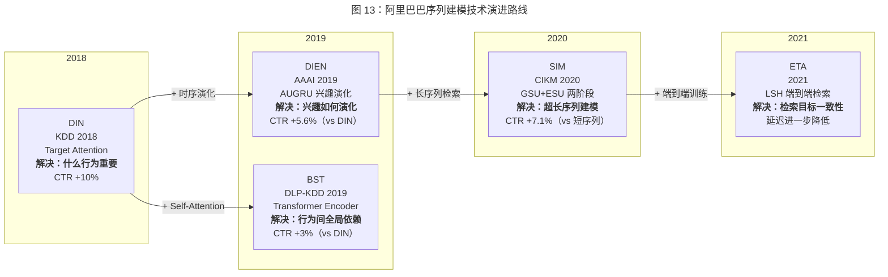

**演进规律。** 阿里巴巴的技术演进呈现出清晰的阶段性：DIN 解决了 "什么行为重要"（target attention），DIEN 解决了 "兴趣如何演化"（AUGRU），SIM/ETA 解决了 "如何利用更多历史行为"（长序列检索），BST 解决了 "如何捕获行为间的全局依赖"（self-attention）。每一步都是在前一步的基础上解决一个新的核心建模挑战，同时满足工业系统的延迟和资源约束。

#### 10.3.2 Meta：HSTU 的万亿参数实践

Meta（原 Facebook）的 HSTU [Zhai et al., 2024] 代表了推荐系统序列建模在模型规模上的极致实践。

**规模与效果。** HSTU 将推荐模型规模推向万亿参数级别（主要来自物品 ID 的 embedding 表），在 Meta 的多个产品（包括 Facebook、Instagram）的推荐系统中进行了大规模验证。HSTU 的实验表明，模型效果随参数规模的增长持续提升，呈现出类似于 LLM 的 scaling law 特性。通过第 5 章所述的架构简化策略，HSTU 在相同参数预算下实现了显著的推理加速，使万亿参数规模的在线部署成为可能 [Zhai et al., 2024]。

**工程创新。** HSTU 的工业化部署依赖多项工程创新：（1）Jagged tensor 消除了 padding 浪费，在序列长度高度异构的推荐场景中尤为关键；（2）大规模模型并行——embedding 表通过行并行分布在数百台机器上，Transformer 层通过张量并行分布在多个 GPU 上；（3）KV-cache 增量推理——新行为发生时仅需计算新位置的表示，无需对整个序列重新编码。

**生成式推荐范式。** HSTU 将序列推荐定义为自回归生成任务，通过在物品空间上直接生成概率分布替代传统的候选物品逐一打分。这一范式在概念上统一了召回和排序阶段，但在工程上面临物品空间极大（百万至亿级）导致 softmax 计算代价高昂的挑战。Meta 通过负采样和层次化 softmax 等近似策略在实践中缓解了这一问题。

#### 10.3.3 其他企业实践

**美团。** 美团在外卖和到店推荐场景中广泛应用序列建模技术。公开的技术博客和论文显示，美团的 CTR 模型采用了 DIN/DIEN 范式的序列建模模块，并结合业务特点进行了多项适配：（1）多行为类型融合——将用户的搜索、浏览、下单等不同行为类型通过独立的序列编码器分别建模，再融合为统一的用户表示；（2）地理位置感知——将用户的地理位置信息编码到序列建模中，捕获 "附近消费" 的局部兴趣模式。

**快手。** 快手在短视频推荐场景中面临独特的序列建模挑战：用户的行为序列极为密集（一次会话可能包含数十到数百次滑动），且行为信号的质量差异显著（主动搜索 vs 被动刷到的短暂曝光）。快手公开的技术文章提及了多兴趣建模和长短期兴趣分离等序列建模策略的应用。快手还发布了 KuaiRand 等公开数据集，为学术界提供了具有真实短视频推荐特征的实验基准。

**Google。** Google 在搜索广告和 YouTube 推荐中长期应用序列建模技术。YouTube 的 Deep Neural Network 推荐系统 [Covington et al., 2016] 是深度学习应用于大规模推荐系统的标志性工作。近年来，Google Research 在序列推荐领域贡献了 TIGER [Rajput et al., 2023]（语义 ID 的层次化生成推荐），展示了 Google 在生成式推荐范式上的探索。

### 10.4 A/B 测试与线上效果

A/B 测试是验证序列建模方法工业价值的金标准。下表汇总了主要序列建模方法在论文中报告的在线 A/B 测试结果：

| 模型 | 企业 | 应用场景 | 基线模型 | CTR 提升 | 其他指标 | 来源 |
|------|------|---------|---------|---------|---------|------|
| DIN | 阿里巴巴 | 展示广告 | Sum Pooling | ~10% | RPM +3% | [Zhou et al., 2018] |
| DIEN | 阿里巴巴 | 展示广告 | DIN | ~5.6% | — | [Zhou et al., 2019] |
| BST | 阿里巴巴 | 淘宝搜索 | DIN | ~3% | AUC +0.003 | [Chen et al., 2019] |
| SIM | 阿里巴巴 | 展示广告 | DIN (50行为) | +7.1% | RPM +4.4% | [Pi et al., 2020] |
| HSTU | Meta | 多产品线 | 内部基线 | 显著提升 | 推理加速 5-15x | [Zhai et al., 2024] |

**A/B 测试结果的解读注意事项。**

第一，**基线差异。** 不同论文使用的基线模型各不相同，直接比较不同论文报告的 CTR 提升百分比是不合理的。例如，DIN 相对于 Sum Pooling 的 10% 提升与 DIEN 相对于 DIN 的 5.6% 提升并不意味着 DIEN 的增量价值低于 DIN——后者的基线本身已经很强。

第二，**场景差异。** 不同企业的推荐场景（电商 vs 短视频 vs 广告）在数据分布、用户行为模式和商业目标上差异显著，跨场景的效果迁移不具有必然性。

第三，**系统耦合效应。** 线上 A/B 测试的效果不仅取决于序列建模组件的改进，还受到整个推荐系统其他组件（召回策略、特征工程、排序公式等）的影响。同一序列建模方法在不同的系统环境中可能表现出不同的增量效果。

第四，**时效性。** 推荐系统领域的技术迭代极为快速，论文发表时报告的 A/B 测试结果可能已被后续的技术改进所超越。上述数据应被视为各方法在其发表时点的代表性效果，而非当前最优水平。

### 10.5 小结

本章从在线服务架构、计算优化策略、企业实践和 A/B 测试效果四个维度，总结了推荐系统序列建模的工业部署经验。

从工业实践中可以提炼出以下关键洞察：

**第一，延迟约束是模型设计的硬性约束。** 工业 CTR 预估系统要求单次推理延迟在 10-50 毫秒以内，这一约束直接决定了序列建模方法的上线可行性。DIN 的 target attention 因其线性复杂度和高度可并行性，至今仍是工业 CTR 排序中最广泛采用的序列编码方式。Transformer self-attention 需配合序列截断或检索式预处理（SIM/ETA）才能满足延迟要求。LLM 和复杂的生成式模型在当前技术条件下主要用于离线/近线环节。

**第二，系统架构的创新与模型创新同样重要。** SIM 的 GSU+ESU 两阶段架构、HSTU 的 jagged tensor、行为 embedding 的预计算与缓存——这些系统层面的创新使原本不可部署的复杂模型变得实际可行。工程优化（kernel fusion、动态填充、混合精度）带来的推理加速往往与模型架构改进带来的效果提升同等重要。

**第三，长期行为信号具有显著的工业价值。** SIM 的 A/B 测试结果（详见第 10.3 节）有力证明了长期行为信号对 CTR 预估的重要性。工业系统正在从使用最近 50-200 条行为的 "短记忆" 模式，向使用数千乃至数万条行为的 "长记忆" 模式演进。SSM/Mamba 的线性复杂度特性使其成为这一趋势中值得关注的新技术方向。

**第四，阿里巴巴和 Meta 代表了两条不同的技术路线。** 阿里巴巴的路线是 "注意力为基、检索扩展"——以 DIN/DIEN 的 target attention 为基础，通过 SIM/ETA 的检索机制扩展到长序列，模型复杂度适中但系统架构精巧。Meta 的路线是 "规模制胜"——通过 HSTU 将模型规模推向万亿参数，用模型容量替代手工特征工程和复杂的系统流水线。两条路线反映了不同的工程哲学和资源禀赋，但都证明了序列建模在工业推荐系统中的核心价值。

## 11. 结构化对比分析

前述各章分别深入分析了基于注意力机制、Transformer、状态空间模型、图神经网络和大语言模型的序列建模方法。本章从全局视角出发，通过多维度的结构化对比表格、技术路线的系统性分析和实验方法论的批判性反思，为研究者提供模型选择的决策框架和未来研究的方法论指引。

### 11.1 多维度模型对比表

下表对本综述覆盖的 18 个代表性序列建模方法进行八维度结构化对比。对比维度的选取兼顾了学术研究（架构设计、建模能力）和工业实践（效率、部署状态）两个视角。

| 模型 | 序列编码架构 | 时间复杂度 | Target-Aware | 最大序列长度 | 预训练支持 | 公开数据集典型效果 | 工业部署状态 | 推理延迟量级 |
|------|------------|-----------|-------------|------------|-----------|------------------|------------|------------|
| DIN [Zhou et al., 2018] | Target Attention | $O(T \cdot d)$ | 是 | ~200 | 否 | Amazon Beauty HR@10≈0.35 | 已部署（阿里巴巴） | ~1ms |
| DIEN [Zhou et al., 2019] | AUGRU + Target Attn | $O(T \cdot d)$ 串行 | 是 | ~200 | 否 | Amazon Beauty HR@10≈0.37 | 已部署（阿里巴巴） | ~3-5ms |
| MIND [Li et al., 2019] | 胶囊网络动态路由 | $O(K \cdot T \cdot d)$ | 是（选择阶段） | ~200 | 否 | Amazon Books HR@20≈0.06 | 已部署（阿里巴巴召回） | ~2ms |
| SASRec [Kang and McAuley, 2018] | Causal Self-Attention | $O(T^2 \cdot d)$ | 否 | ~200 | 否 | ML-1M HR@10≈0.81, NDCG@10≈0.58 | 实验阶段 | ~2-5ms |
| BERT4Rec [Sun et al., 2019] | Bidirectional Self-Attn | $O(T^2 \cdot d)$ | 否 | ~200 | 是（MLM） | ML-1M HR@10≈0.82, NDCG@10≈0.59 | 实验阶段 | ~3-8ms |
| BST [Chen et al., 2019] | Transformer Encoder | $O(T^2 \cdot d)$ | 是（拼接候选） | ~50-150 | 否 | 淘宝 AUC≈0.643 | 已部署（阿里巴巴） | ~3-5ms |
| SIM [Pi et al., 2020] | 检索 + Target Attn | $O(T + K^2 \cdot d)$ | 是 | 54,000 | 否 | 工业数据 CTR +7.1% | 已部署（阿里巴巴） | ~5-10ms |
| ETA [Chen et al., 2021] | LSH检索 + Attn | $O(T \cdot r + K^2 \cdot d)$ | 是 | ~10,000+ | 否 | 工业数据 效果≈SIM | 已部署（阿里巴巴） | ~3-8ms |
| SDIM [Cao et al., 2022] | 哈希采样 + Attn | $O(T \cdot m)$ | 是 | ~10,000+ | 否 | 工业数据 效果≈SIM | 已部署（美团） | ~2-5ms |
| GRU4Rec [Hidasi et al., 2016] | GRU | $O(T \cdot d)$ 串行 | 否 | ~200 | 否 | ML-1M HR@10≈0.68, NDCG@10≈0.42 | 已部署（早期） | ~1-2ms |
| SR-GNN [Wu et al., 2019] | Gated GNN + Attn | $O(|\mathcal{E}| \cdot L \cdot d)$ | 否 | ~50 (session) | 否 | Diginetica MRR@20≈0.178 | 实验阶段 | ~5-10ms |
| GCE-GNN [Wang et al., 2020] | 局部+全局 GNN | $O((|\mathcal{E}_l|+|\mathcal{E}_g|) \cdot L \cdot d)$ | 否 | ~50 (session) | 否 | Diginetica MRR@20≈0.194 | 实验阶段 | ~10-20ms |
| Mamba4Rec [Liu et al., 2024] | Selective SSM | $O(T \cdot N \cdot d)$ | 否 | 理论无限 | 否 | Amazon Beauty HR@10≈0.36, NDCG@10≈0.22 | 实验阶段 | ~1-3ms |
| EchoMamba4Rec [Wang et al., 2024] | 双向 SSM | $O(T \cdot N \cdot d)$ | 否 | 理论无限 | 否 | Amazon Beauty HR@10≈0.38 | 实验阶段 | ~2-4ms |
| RecMamba [Yang et al., 2024] | Selective SSM (终身) | $O(T \cdot N \cdot d)$ | 否 | 理论无限 | 否 | 长序列场景效果优于SASRec | 实验阶段 | ~1-3ms |
| P5 [Geng et al., 2022] | T5 Encoder-Decoder | $O(T^2 \cdot d)$ | 否（生成式） | ~512 (token) | 是（多任务） | ML-1M HR@5≈0.03 (zero-shot低) | 实验阶段 | ~100ms+ |
| TALLRec [Bao et al., 2023] | LLaMA (LoRA微调) | $O(T^2 \cdot d)$ | 否（生成式） | ~2048 (token) | 是（指令微调） | MovieLens Acc≈0.72 | 实验阶段 | ~500ms+ |
| HSTU [Zhai et al., 2024] | Pointwise Attn (定制) | $O(T \cdot d)$ | 是（pointwise） | 10,000+ | 是（自回归） | 工业规模，scaling law验证 | 已部署（Meta） | ~5-15ms (优化后) |

**表注：** $T$ 为序列长度，$d$ 为 embedding 维度（通常 64-256），$K$ 为检索子集大小（通常 50-200），$N$ 为 SSM 状态维度（通常 16-64），$r$ 为哈希码长度，$m$ 为哈希函数数量（通常 3-5），$L$ 为 GNN 层数或消息传递轮次，$|\mathcal{E}|$ 为图的边数。公开数据集效果数据来源于各论文原始报告或 Petrov and Macdonald [2022] 的复现研究，不同论文的实验设置（数据划分、负采样策略、embedding 维度等）存在差异，数值仅供量级参考，不宜直接进行跨论文的精确比较。推理延迟为单样本在 GPU 上的估计量级，实际值取决于硬件配置、batch size 和实现优化程度。

**对比表的关键发现：**

**发现一：Target-aware 与工业部署高度相关。** 在已实现工业部署的 7 个模型中，有 6 个具备 target-aware 能力（DIN、DIEN、MIND、BST、SIM/ETA/SDIM、HSTU）。唯一的例外是早期的 GRU4Rec，但其已逐步被 target-aware 方法替代。这一观察有力地验证了第 4 章的论断：target-aware 建模是 CTR 预估场景中序列模型上线的近乎必要条件。

**发现二：效率-效果的 Pareto 前沿正在被重塑。** 传统上，DIN 的 target attention（$O(T \cdot d)$，target-aware）和 SASRec 的 self-attention（$O(T^2 \cdot d)$，更强表达力）代表了效率-效果权衡的两个极端。SSM 方法（$O(T \cdot N \cdot d)$，线性复杂度但非 target-aware）和 HSTU（$O(T \cdot d)$，线性复杂度且 target-aware）正在试图突破这一权衡——前者以线性效率实现接近 Transformer 的表达能力，后者通过架构定制在线性复杂度下保持 target-aware 能力。

**发现三：LLM 方法在推理延迟上存在量级差距。** P5 和 TALLRec 的推理延迟（100ms-500ms+）比工业 CTR 模型（1-10ms）高出 1-2 个数量级。这一差距决定了 LLM 方法在可预见的未来难以直接用于在线 CTR 排序阶段，其主要价值在于离线知识增强和特定场景（如冷启动、对话式推荐）的应用。

### 11.2 技术路线对比分析

#### 11.2.1 Attention vs Transformer vs SSM：表达能力-效率权衡

三种序列编码范式形成了一个清晰的表达能力-计算效率权衡谱系（图 12）：

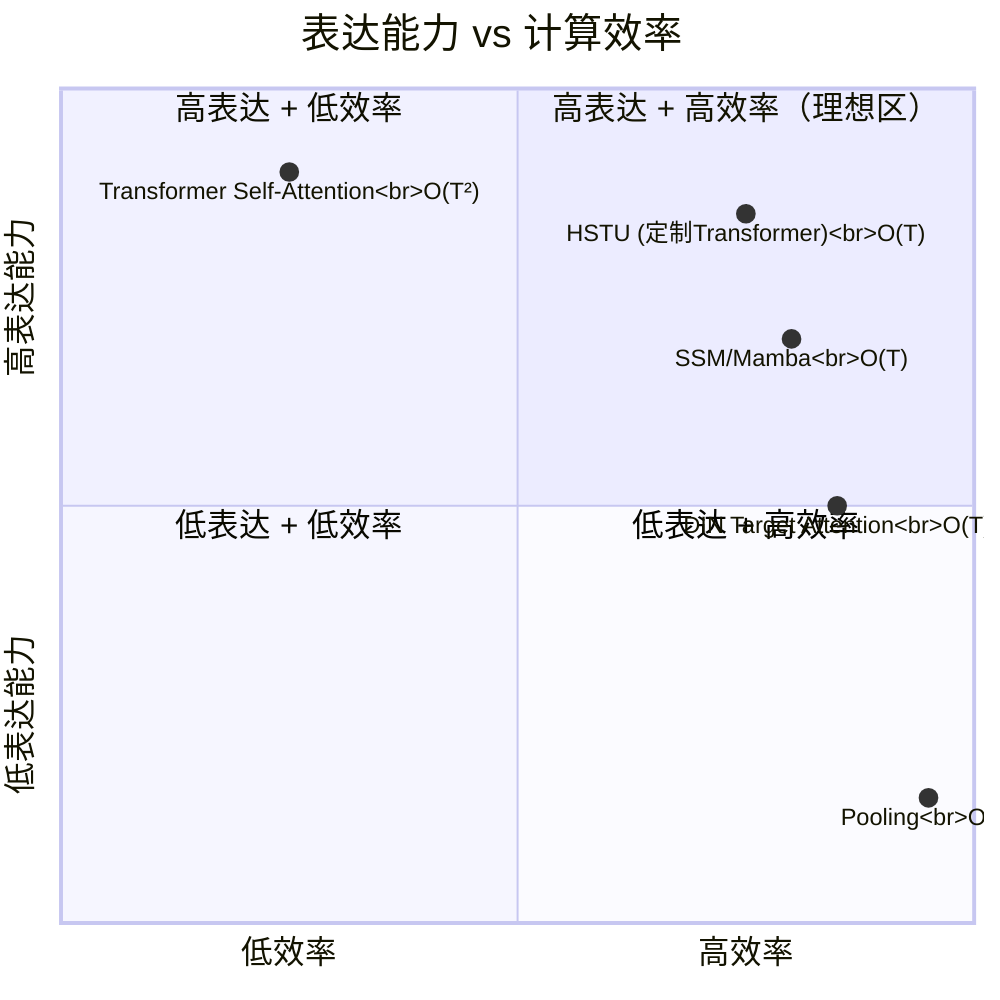

**DIN-style Target Attention。** 计算复杂度 $O(T \cdot d)$，仅建模候选物品与历史行为之间的一阶相关性，不捕获行为之间的交互。这种 "对候选做软检索" 的建模方式在概念上最为简洁，也最为高效。其局限在于：当用户兴趣的表达依赖于多个行为的组合模式（如 "先浏览手机再浏览手机壳" 暗示手机配件需求）时，独立的行为-候选注意力无法捕获这种组合信号。

**Transformer Self-Attention。** 计算复杂度 $O(T^2 \cdot d)$，建模所有行为对之间的二阶交互，具有最强的表达能力。Self-attention 的全局感受野使其能够捕获任意距离的行为依赖和复杂的行为组合模式。但二次复杂度在超长序列场景下构成根本性瓶颈。BST [Chen et al., 2019] 通过将候选物品拼接入序列实现了 target-aware 的 self-attention，但代价是每个候选物品需独立执行一次完整的 self-attention 计算。

**SSM/Mamba。** 计算复杂度 $O(T \cdot N \cdot d)$（其中 $N$ 为固定状态维度），通过状态递推隐式编码长程依赖。Mamba 的选择性机制赋予了 SSM 内容感知的选择性能力，使其在功能上接近 attention 的动态信息路由，但通过递推形式实现而非显式的全局计算。SSM 的核心局限在于：（1）隐状态的有限维度意味着历史信息被有损压缩，理论上可能丢失关键兴趣信号；（2）缺乏天然的 target-aware 机制，需要额外的设计（如在 SSM 输出上叠加 target attention）才能适配 CTR 场景。

**三者的互补性与融合前景。** 从计算理论的角度看，这三种范式本质上是在不同的计算-存储权衡点上操作：Target attention 不存储行为间关系（$O(1)$ 存储），Transformer 显式存储所有行为对关系（$O(T^2)$ 存储），SSM 通过固定维度的状态向量隐式压缩所有历史信息（$O(N)$ 存储）。一种有前景的融合思路是层次化组合——在底层使用 SSM 进行线性复杂度的序列预编码（捕获长程趋势），在顶层使用 target attention 或轻量 self-attention 进行候选感知的精细建模（捕获局部相关性）。这种层次化架构在理论上可以同时获得 SSM 的效率和 attention 的精度，但其实际效果仍需大规模实验验证。

#### 11.2.2 ID-based vs Content-based vs Hybrid：表示学习范式

序列建模方法在物品表示学习上形成了三种范式，其选择对模型的泛化能力、冷启动表现和跨域迁移能力产生深远影响。

**ID-based 表示（协同过滤路线）。** 以 DIN、SASRec、SIM 等为代表，物品通过 ID embedding 表示，embedding 完全从交互数据中学习。优势在于：ID embedding 能够编码丰富的协同过滤信号——相似用户群体共同交互的物品在 embedding 空间中自然聚集，即使这些物品在内容上看似无关（如购买尿布的用户群体也常购买啤酒）。局限在于：ID embedding 无法泛化到未见过的物品（冷启动问题），且不同推荐域的 ID 空间完全不重叠，无法实现跨域迁移。

**Content-based 表示（语义理解路线）。** 以 UniSRec [Hou et al., 2022]、P5、TALLRec 为代表，物品通过文本描述的语义 embedding 表示。优势在于：语义表示具有天然的泛化能力——新物品只要有文本描述即可获得有意义的表示，且不同域的物品在同一语义空间中可比较。局限在于：语义相似性不等于交互相似性——两个描述相似的物品可能面向完全不同的用户群体（如面向儿童和面向成人的同类书籍），纯语义表示可能丢失协同过滤信号。

**Hybrid 表示（融合路线）。** 以 VQ-Rec [Hou et al., 2023]、KAR [Xi et al., 2024] 为代表，同时利用 ID embedding 和语义 embedding，通过门控机制或 adapter 层进行融合。VQ-Rec 通过向量量化将文本语义离散化后映射到推荐交互空间，HSTU [Zhai et al., 2024] 在保留 ID embedding 的同时将模型规模推至 LLM 量级以隐式获取语义理解能力。

**范式选择的决策框架。** 在单域、数据充裕的场景下，ID-based 表示通常优于 content-based 表示，因为协同过滤信号的判别力在成熟平台上远强于语义信号。在跨域迁移、冷启动或数据稀疏的场景下，content-based 或 hybrid 表示更具优势。工业实践中，主流方案是以 ID-based 表示为主体，辅以 content 特征作为补充信号——这也是 DIN、BST 等工业模型的标准做法。

#### 11.2.3 Discriminative vs Generative：预测范式

序列建模的预测范式正在经历从判别式到生成式的范式演进，两者在建模目标、计算模式和系统架构上存在根本差异。

**判别式范式（Discriminative）。** 以 DIN、BST、SIM 为代表，给定候选物品，模型输出该物品的点击概率 $P(\text{click} \mid \text{user sequence}, \text{candidate})$。这一范式的核心操作是对预设候选集中的每个物品逐一评分并排序。优势在于：（1）评分函数明确，概率校准（calibration）容易控制，适合广告竞价等需要精确概率估计的场景；（2）推理高效——DIN 的 target attention 评分单个候选物品仅需 $O(T \cdot d)$ 计算；（3）系统架构成熟——多阶段级联流水线（召回→粗排→精排）已在工业系统中运行多年。

**生成式范式（Generative）。** 以 HSTU、P5、TIGER [Rajput et al., 2023] 为代表，模型在物品空间上直接生成概率分布 $P(b_{T+1} \mid b_1, \ldots, b_T)$，无需预设候选集。优势在于：（1）理论上统一了召回和排序，消除了多阶段流水线的信息损失；（2）自回归目标天然建模了物品间的条件依赖（购买 A 后更可能购买 B）；（3）模型规模的扩展可直接转化为推荐质量的提升（scaling law）。局限在于：（1）全物品空间的 softmax 计算代价极高（百万级物品空间）；（2）概率校准困难——生成式概率难以直接对应广告竞价所需的精确点击率；（3）系统架构需要重构——现有的多阶段流水线需要被单模型替代。

**当前的工业现实。** 截至目前，判别式范式仍是工业 CTR 预估的绝对主流。HSTU 虽然采用了生成式训练目标，但在工业部署中仍需配合候选物品的评分排序流程。纯生成式推荐（如 P5）的工业部署案例极为有限。两种范式的融合——用生成式目标预训练获取通用序列理解能力，再用判别式目标微调适配特定的 CTR 排序任务——可能是更为务实的过渡路径。

### 11.3 实验方法论反思

#### 11.3.1 数据集选择偏差

推荐系统序列建模领域的实验评估存在严重的数据集选择偏差，这一问题影响了研究结论的可靠性和泛化性。

**小规模学术数据集的过度使用。** Amazon Product Reviews（Beauty、Sports 等子集）和 MovieLens-1M 是使用频率最高的基准数据集。这些数据集的用户数量通常在数千到数万级别，物品数量在数千到数万级别，用户行为序列长度通常在 10-100 之间。而工业推荐系统面对的是数亿用户、数百万至数十亿物品、以及长度从几条到数万条的异构行为序列。在如此悬殊的规模差异下，学术数据集上的实验结论能否泛化到工业场景，存在根本性的疑问。

**数据集特性的单一性。** Amazon 和 MovieLens 均为电商/评分场景，用户行为类型单一（评分或购买），行为密度相对较高。而工业推荐系统面临的是多行为类型（浏览、点击、加购、购买、停留、滑动等）、极端稀疏（interaction rate < 0.01%）、以及强时效性（新闻、短视频场景的内容半衰期极短）等更复杂的数据特性。缺乏对这些工业特性的覆盖，限制了实验评估的实用价值。

**建议。** 未来研究应（1）在多个不同特性的数据集上验证方法的泛化性，包括不同领域（电商、短视频、新闻）、不同规模和不同行为密度的数据集；（2）更多地使用工业级公开数据集（如 Taobao 广告数据集、KuaiRand 短视频数据集）；（3）明确报告数据集的关键统计特性（平均/中位序列长度、稀疏度、物品空间大小等），便于读者判断结论的适用范围。

#### 11.3.2 评价指标的局限性

**离线指标与在线效果的脱节。** 学术论文普遍使用 HR@K、NDCG@K、MRR 等排序指标评估序列推荐方法。然而，工业实践表明，离线排序指标与在线商业指标（CTR、GMV、用户留存）之间的相关性远非完美。一个在 NDCG@10 上领先 2% 的模型，在线 A/B 测试中可能表现持平甚至更差——因为离线评估无法捕获实时数据分布漂移、位置偏差、反馈循环等在线环境的复杂因素。

**负采样策略对指标的敏感性。** HR@K 和 NDCG@K 的数值高度依赖于负采样策略。SASRec 的原始论文使用每个正样本配 100 个随机负样本的评估协议，而部分后续工作使用全物品空间排序或不同数量的负样本。Petrov and Macdonald [2022] 的研究表明，不同负采样策略下模型的相对排名可能发生显著变化。这一发现意味着，仅比较不同论文报告的绝对数值是不可靠的，必须在统一的评估协议下进行公平对比。

**时序评估的特殊性。** 序列推荐任务的评估必须严格遵守时间顺序——训练数据不能包含测试时间段的信息（temporal leakage）。然而，部分工作在数据划分时未严格执行时间划分（而是随机划分），或在交叉验证中未保持时间一致性，导致评估结果过于乐观。标准化的时序评估协议（如 leave-one-out with temporal ordering）的广泛采纳对保证评估的公正性至关重要。

#### 11.3.3 公平对比的缺失

序列建模领域存在严重的公平对比缺失问题，这在一定程度上阻碍了技术进步的准确衡量。

**超参数搜索不统一。** 不同论文对其提出方法和基线方法所投入的超参数搜索力度通常不对等——提出方法经过精细调优，而基线方法可能使用默认参数或粗略搜索。Petrov and Macdonald [2022] 对 BERT4Rec 的复现研究揭示了这一问题的严重性：在统一超参数搜索后，BERT4Rec 相对于 SASRec 的优势大幅缩小，在部分数据集上甚至逆转。这一发现对 "新方法必然优于旧方法" 的默认假设提出了严肃的质疑。

**实现细节的不透明。** 即使论文提供了开源代码，实现中的细微差异（如数据预处理方式、embedding 初始化、学习率调度策略、早停条件等）也可能显著影响最终结果。缺乏标准化的实验框架使得不同论文的结果难以直接比较。

**Petrov and Macdonald [2022] 的系统性启示。** 该工作对序列推荐领域的可复现性进行了迄今最系统的审查。其核心发现包括：（1）许多论文报告的基线结果显著低于这些基线在精心调优后的实际表现；（2）公平对比后，方法间的效果差距远小于原始论文所报告的水平；（3）简单方法（如精心调优的 SASRec）的表现常常被低估。这些发现对整个领域的实验规范产生了深远影响，推动了社区对标准化评估协议的重视。

**改进建议。** 为促进公平对比，我们建议：（1）采用统一的实验框架（如 RecBole [Zhao et al., 2021]）进行基线对比，确保所有方法在相同的数据预处理、超参数搜索空间和评估协议下比较；（2）报告多次独立实验的均值和标准差，而非单次最优结果；（3）同时报告模型的计算开销（参数量、训练时间、推理延迟），而非仅关注预测精度。

### 11.4 小结

本章从三个层面对推荐系统序列建模技术进行了结构化的对比与反思。

**多维度模型对比表** 揭示了三个关键发现：target-aware 能力与工业部署高度相关、SSM/HSTU 正在重塑效率-效果的 Pareto 前沿、LLM 方法在推理延迟上存在量级差距。这些发现为研究者和工程师提供了模型选择的实证依据。

**技术路线对比分析** 从表达能力-效率权衡（Attention vs Transformer vs SSM）、表示学习范式（ID vs Content vs Hybrid）和预测范式（Discriminative vs Generative）三个维度进行了系统性的路线分析。每条路线在特定场景下具有独特优势，不存在普遍最优的单一方案——技术路线的选择应由具体的业务场景、数据特性和系统约束共同决定。

**实验方法论反思** 指出了当前研究中数据集选择偏差、评价指标局限和公平对比缺失等系统性问题。Petrov and Macdonald [2022] 的可复现性研究为领域敲响了方法论的警钟——在追求新模型架构创新的同时，实验方法论的严谨性同等重要。未来工作应在标准化的实验框架下进行公平对比，并在多样化的数据集上验证方法的泛化性。

---

## 12. 未来研究方向与创新 Idea

基于前述章节对序列建模技术的系统梳理和第 11 章的对比分析，本章提出若干具有前瞻性的未来研究方向。每个方向包含问题定义、技术路线、预期贡献和潜在挑战的完整分析，力求为后续研究提供可操作的启发。

我们将未来方向划分为三类：架构创新方向（A 类）、范式创新方向（B 类）和工业落地方向（C 类）。

### 12.1 架构创新方向

#### 12.1.1 SSM-Attention 自适应混合架构

**问题定义。** 第 11.2.1 节的分析表明，SSM 和 Attention 在表达能力-效率权衡上处于不同的最优点：SSM 擅长线性复杂度的长程依赖捕获但缺乏 target-aware 能力，Attention 擅长精细的候选感知建模但面临二次复杂度瓶颈。现有工作要么单独使用一种范式，要么简单地堆叠两种模块（如底层 SSM + 顶层 Attention）。然而，用户行为序列中不同区段对预测的贡献模式不同——远期行为更适合 SSM 的压缩编码，近期行为更适合 Attention 的精细建模——因此，一种能够根据序列内容和位置自适应选择编码策略的混合架构是更为理想的方案。

**技术路线。** 提出一种 Adaptive SSM-Attention 混合架构，核心创新在于引入一个轻量级的路由网络（router network），为序列的每个位置动态决定使用 SSM 编码还是 Attention 编码：

$$g_t = \sigma(\mathbf{W}_r [\mathbf{e}_t; \mathbf{e}_{target}; \phi(\Delta t)] + b_r)$$

其中 $g_t \in [0, 1]$ 为路由门控值，$\Delta t$ 为行为 $t$ 距当前时刻的时间间隔，$\mathbf{e}_{target}$ 为候选物品 embedding。当 $g_t$ 接近 1 时，位置 $t$ 的编码使用 Attention 模块；接近 0 时使用 SSM 模块。路由网络的输入同时依赖行为内容（$\mathbf{e}_t$）、候选物品（$\mathbf{e}_{target}$）和时间距离（$\phi(\Delta t)$），使路由决策具备内容感知和候选感知的能力。

进一步地，可以引入稀疏约束（如 top-$k$ 选择或 Gumbel-Softmax）确保大部分位置使用高效的 SSM 编码，仅对少数关键位置启用 Attention 编码，从而在整体上维持接近线性的计算复杂度。

**预期贡献。** （1）在效率-效果权衡上突破现有方法的 Pareto 前沿，实现接近 SSM 的效率和接近 Transformer 的精度；（2）路由决策的可视化可以揭示序列中哪些区段对预测贡献最大，提供一种新的可解释性维度；（3）自适应路由机制使模型能够根据输入序列的特性（长度、主题集中度、时间分布）自动调整计算分配，无需人工设定序列截断阈值。

**潜在挑战。** （1）路由网络的训练稳定性——离散的路由决策可能导致梯度估计偏差，需要仔细设计松弛策略；（2）SSM 和 Attention 模块的隐空间对齐——两种编码器的输出表示需要在同一语义空间中可比较；（3）路由决策在训练早期可能陷入退化模式（如全选 SSM 或全选 Attention），需要适当的正则化或课程学习策略。

#### 12.1.2 统一序列-图混合建模

**问题定义。** 第 7 章的分析表明，GNN 和序列模型分别从图结构视角和时序视角对用户行为进行建模，两者捕获的信息具有互补性。然而，现有工作要么独立使用一种视角，要么简单地将两者串行连接（如先 GNN 编码再 Transformer 聚合）。这种松散的组合未能充分利用时序信息和图结构信息之间的深层交互——例如，图中的边权重应受时序信息调制（近期发生的转移应获得更高权重），序列编码也应受图结构信息增强（在全局物品转移图中频繁共现的行为对应更强的依赖关系）。

**技术路线。** 提出一种 Temporal Graph Transformer（TGT）架构，核心思想是将时序信息编码到图的边权重中，将图结构信息编码到序列 Transformer 的注意力偏置中，实现双向深度融合。

具体而言：（1）**时序感知的动态图构建**——将用户行为序列转化为动态图，其中边权重不仅取决于物品对的共现频率，还取决于共现的时间间隔和时间趋势：$w(v_i, v_j, t) = f_{co}(v_i, v_j) \cdot \exp(-\lambda |t_i - t_j|) \cdot g_{trend}(t_i, t_j)$；（2）**图结构增强的注意力偏置**——在 Transformer 的 self-attention 计算中，引入从图结构衍生的注意力偏置项，使模型能够在全局注意力之外利用图的局部结构信息：$\text{Attention}_{ij} = \text{softmax}(\frac{q_i^T k_j}{\sqrt{d}} + b_{ij}^{graph})$，其中 $b_{ij}^{graph}$ 由物品 $i$ 和 $j$ 在全局转移图中的最短路径距离或图注意力分数决定。

**预期贡献。** （1）实现图结构和时序信息的深度融合，而非现有工作的浅层串接；（2）动态图的时序感知机制可以自然处理用户兴趣的时间演化——近期形成的物品关联获得更高的图权重；（3）图结构增强的注意力偏置为 Transformer 引入了物品关系的先验知识，可能在数据稀疏场景下显著提升泛化性。

**潜在挑战。** （1）动态图的构建和维护在工业场景中的计算开销需要精心控制；（2）全局转移图的规模可能极大（百万节点、十亿级边），需要高效的图采样或子图提取策略；（3）图结构偏置与内容注意力的联合训练可能存在优化不稳定性。

#### 12.1.3 硬件感知的弹性序列模型

**问题定义。** 工业推荐系统中，不同阶段（召回、粗排、精排）和不同服务时段（高峰/低峰）的推理预算差异悬殊——精排阶段允许 5-10ms 的序列编码延迟，粗排阶段仅允许 1-2ms，而低峰期可能有更多的计算冗余。现有方法为每个阶段部署不同的模型（如粗排用 DIN、精排用 BST），带来了多模型维护的工程负担和模型间不一致的风险。

**技术路线。** 提出一种 Elastic Sequence Model（ESM），核心创新是一个单一的序列编码模型可以在推理时根据可用的计算预算动态调整其编码深度和精度，输出与预算匹配的 "any-budget" 序列表示。

技术方案包含三个关键组件：（1）**早退机制（Early Exit）**——模型包含 $L$ 层序列编码器，每层的输出均可作为有效的序列表示（通过辅助损失在每层施加监督）。推理时，根据延迟预算选择在第 $l \leq L$ 层退出，浅层输出粗粒度但快速的表示，深层输出精细但耗时的表示；（2）**自适应宽度（Adaptive Width）**——每层的注意力头数和 SSM 状态维度可以动态缩减。通过重要性评分对注意力头和状态维度排序，推理时按预算保留 top-$k$ 个维度；（3）**预算感知训练（Budget-Aware Training）**——训练时随机采样不同的退出层和宽度配置，确保模型在各种预算约束下均能输出高质量的表示。

**预期贡献。** （1）用单一模型替代多阶段的多模型部署，降低工程复杂度和维护成本；（2）模型可以在推理时动态适应计算预算的波动，提升系统的资源利用效率；（3）不同预算下的序列表示来自同一模型，保证了跨阶段的表示一致性。

**潜在挑战。** （1）浅层退出的表示质量与深层退出的差距需要控制在可接受范围内——如果浅层表示过差，则无法在粗排等低预算场景中使用；（2）自适应宽度的动态推理在 GPU 上的实现效率需要优化，避免不规则的计算模式导致 GPU 利用率下降；（3）预算感知训练的搜索空间较大，训练成本可能显著高于固定架构。

#### 12.1.4 频域驱动的兴趣分离与序列建模

**问题定义。** 用户行为序列本质上是多种兴趣信号在时间轴上的叠加：长期稳定偏好（如始终关注电子产品）表现为低频分量，短期冲动兴趣（如临时搜索礼物）表现为高频脉冲，周期性行为（如周末购物、季节性需求）表现为特定频段的振荡，随机点击和曝光噪声则表现为高频白噪声。现有序列建模方法——无论是 Attention、Transformer 还是 SSM——均在时域中直接处理这些混叠的异构信号，缺乏对不同 "兴趣频率" 的显式分离和差异化建模能力。

这一观察与信号处理中的基本原理形成精确类比：当多种频率的信号叠加在一起时，直接在时域中提取某一特定频率的分量既困难又低效；而将信号投影到频域后，不同频率的分量自然分离，可以独立处理后再逆变换回时域。推荐序列中不同类目/兴趣的出现模式确实可以用频谱分析来刻画：

$$\text{序列}: [\text{手机}, \text{手机壳}, \text{小说}, \text{跑步鞋}, \text{手机膜}, \text{散文集}, \text{运动袜}, \text{手机充电器}]$$

按类目分解后，各类目的出现模式构成不同频率的离散信号——电子类呈现持续但有间断的中低频模式，图书类和运动类呈现交替出现的特定频率模式。对这些 "类目出现信号" 施加离散傅里叶变换（DFT），可以直接提取出每种兴趣的活跃周期和强度。

**已有工作。** 频域分析在序列建模中的应用已有初步探索，但在推荐领域仍属于前沿方向。

FEARec（Frequency Enhanced Attention for Sequential Recommendation）[Du et al., 2023] 是将频域分析引入序列推荐的代表性工作。FEARec 对行为 embedding 序列沿时间轴执行离散傅里叶变换（DFT），在频域中执行注意力计算，再通过逆变换回到时域。其核心发现是：频域中的低频分量编码了用户的全局偏好模式，高频分量编码了局部的兴趣波动和噪声，频域注意力能够更高效地捕获这两类信号的差异化贡献。FEARec 在 Amazon 和 MovieLens 等基准数据集上取得了优于 SASRec 和 BERT4Rec 的效果，验证了频域视角对序列推荐的有效性。

FNet [Lee-Thorp et al., 2021] 在 NLP 领域提出用 FFT 完全替代 Transformer 的 self-attention，以 $O(T \log T)$ 复杂度实现了标准 Transformer 90% 以上的效果。FNet 的成功证明了频域变换作为序列 token 间信息混合机制的可行性，为推荐领域的频域建模提供了技术基础。

此外，S4/SSM 系列（第 6 章）与频域存在天然的数学联系——S4 的卷积视角在训练阶段通过 FFT 实现 $O(T \log T)$ 的并行计算，HiPPO 初始化本质上是将历史信号投影到正交多项式基上，这在数学上类似于频域分解。Autoformer [Wu et al., 2021b] 在时序预测领域引入的自相关分解机制，也可以视为一种隐式的频域操作。

然而，上述工作要么仅在频域中执行单一操作（FEARec 的频域注意力），要么并非针对推荐场景设计（FNet、Autoformer）。缺乏一种系统性的框架将频域分析的完整工具箱——滤波、子带分解、自适应频率选择——引入推荐序列建模，实现对不同 "兴趣频率" 的显式分离和差异化编码。

**技术路线。** 我们提出一种 Frequency-Domain Interest Separation（FDIS）框架，核心创新在于将用户行为序列投影到频域，通过可学习的频域滤波器将混叠的兴趣信号分离为多个子带（sub-band），对不同子带施加差异化的编码策略，最终在时域中融合为候选感知的兴趣表示。

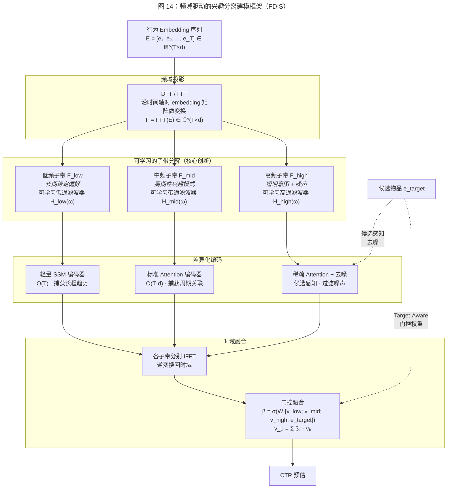

FDIS 框架包含四个关键技术组件：

**（1）频域投影与子带分解。** 对行为 embedding 矩阵 $\mathbf{E} \in \mathbb{R}^{T \times d}$ 沿时间轴对每个 embedding 维度执行离散傅里叶变换：$\mathbf{F} = \text{DFT}(\mathbf{E}) \in \mathbb{C}^{T \times d}$。随后，通过 $K$ 个可学习的频域滤波器 $\{H_k(\omega)\}_{k=1}^K$ 将频谱分解为 $K$ 个子带：

$$\mathbf{F}_k = H_k(\omega) \odot \mathbf{F}, \quad k = 1, 2, \ldots, K$$

其中 $H_k(\omega) \in \mathbb{R}^{T}$ 为第 $k$ 个频域滤波器的频率响应函数，$\odot$ 表示逐频率点乘。滤波器参数通过端到端训练学习，使模型能够自动发现数据中最有意义的频率分界——而非依赖人工预设的频率截断阈值。为确保子带覆盖完整频谱且不重叠，可以引入正则化约束 $\sum_{k=1}^K H_k(\omega) = 1, \forall \omega$（类似于正交滤波器组的完美重建条件）。

**（2）差异化子带编码。** 不同频率子带对应不同的兴趣模式，应采用不同复杂度的编码器：

- **低频子带（长期偏好）**：信号变化缓慢、信息冗余度高，适合用轻量级的 SSM 编码器以 $O(T)$ 线性复杂度处理，重点捕获长程趋势。
- **中频子带（周期性兴趣）**：包含用户兴趣的周期性波动模式（如工作日与周末的不同消费模式），适合用标准 attention 编码器捕获周期内的行为关联。
- **高频子带（短期意图 + 噪声）**：混合了有价值的短期兴趣突变和无意义的随机噪声。此处引入候选感知的稀疏 attention——以候选物品为 query 从高频信号中选择性提取与当前预测相关的短期意图信号，同时抑制噪声。

这种差异化编码策略的本质是**根据信号特性自适应分配计算预算**——对信息密度低但重要的低频信号用高效编码器，对信息密度高但噪声大的高频信号用精细编码器加去噪。

**（3）候选感知的频域门控融合。** 各子带经 IFFT 逆变换回时域后，通过候选感知的门控机制融合为最终的用户兴趣表示：

$$\boldsymbol{\beta} = \text{softmax}(\mathbf{W}_g [\mathbf{v}_{low}; \mathbf{v}_{mid}; \mathbf{v}_{high}; \mathbf{e}_{target}])$$
$$\mathbf{v}_u = \sum_{k=1}^{K} \beta_k \cdot \mathbf{v}_k$$

其中 $\mathbf{v}_k$ 为第 $k$ 个子带编码后的兴趣表示，$\mathbf{e}_{target}$ 为候选物品 embedding。门控权重 $\boldsymbol{\beta}$ 依赖于候选物品，使模型能够根据候选物品的类型自适应调整不同频率兴趣的贡献——例如，当候选物品是用户长期关注品类中的新品时，低频子带的权重增大；当候选物品与用户近期的突发兴趣相关时，高频子带的权重增大。

**（4）非平稳适配：短时傅里叶变换与小波变换。** 标准 DFT 假设信号是全局平稳的，但用户兴趣明显是非平稳的——兴趣的频率结构随时间变化（上个月的高频兴趣可能变成本月的低频偏好）。为此，FDIS 提供两种非平稳适配方案：

- **短时傅里叶变换（STFT）**：将行为序列划分为重叠的时间窗口，在每个窗口内独立执行 DFT，生成时频联合表示（spectrogram）。STFT 使模型能够捕获兴趣频率随时间的演化轨迹，但时频分辨率受限于窗口大小（短窗口时间分辨率高但频率分辨率低，反之亦然）。
- **离散小波变换（DWT）**：通过多分辨率分析（multi-resolution analysis），在不同尺度上同时提供时间和频率信息。小波变换在时频两域都有局部性，特别适合用户兴趣中的突变检测（如兴趣突然转向）和多尺度模式提取。离散小波变换的计算复杂度为 $O(T)$，甚至优于 FFT 的 $O(T \log T)$。

**预期贡献。** （1）首次提出将频域子带分解作为推荐序列建模中多兴趣分离的核心机制。相比 MIND [Li et al., 2019] 的胶囊路由和 ComiRec [Cen et al., 2020] 的多头注意力，频域分离具有更强的物理直觉（不同兴趣 = 不同频率）和数学保证（正交滤波器组的完美重建性质确保信息无损分离）。（2）差异化子带编码策略实现了计算预算的信号自适应分配——低频用 SSM、高频用 Attention——在整体效率和建模精度之间取得比单一编码器更优的权衡。（3）频域表示天然具有能量集中性（大部分信息集中在少数主要频率分量上），截断弱能量的频率分量即可实现有损但保留核心信息的序列压缩，为超长序列提供一种新的压缩编码路径。（4）频域分解的结果具有良好的可解释性——低频子带直接对应用户的长期偏好画像，高频子带对应近期兴趣波动，中频周期分量可以揭示用户行为的时间规律性。

**潜在挑战。** （1）**非平稳性**：用户兴趣的频率结构随时间变化，全局 DFT 的平稳性假设不成立。STFT 和小波变换可以缓解但不能完全解决这一问题——需要探索自适应时频分析方法（如 Hilbert-Huang 变换）在推荐序列中的适用性。（2）**离散事件序列的时间不均匀性**：用户行为是离散事件而非等间隔采样的连续信号，相邻行为的时间间隔差异悬殊（从秒级到天级）。直接对不均匀采样序列施加标准 DFT 可能产生频谱混叠（spectral aliasing）。解决方案包括：先将序列重采样到均匀时间网格上（插值或分桶），或采用非均匀离散傅里叶变换（NUDFT）直接处理不等间隔数据。（3）**高维 embedding 的频域解释性**：对 $d$ 维 embedding 的每个维度独立做 DFT 丢失了维度间的相关性。可以考虑先通过 PCA 或可学习的线性投影降维到主成分空间，在主成分空间中执行频域分析，或采用多维傅里叶变换同时处理时间和 embedding 维度。（4）**滤波器设计的退化风险**：可学习的频域滤波器在训练早期可能退化为全通滤波器（所有子带相同）或单一窄带滤波器（只有一个子带有效），需要通过正交性约束、信息瓶颈正则化或分阶段训练策略防止退化。（5）**与 target-aware 范式的集成**：频域操作本质上是对序列整体的全局变换，如何在频域中优雅地引入候选物品的感知信号（而非仅在时域融合阶段引入），是一个需要深入探索的设计问题。

### 12.2 范式创新方向

#### 12.2.1 多模态行为序列建模

**问题定义。** 现有序列建模工作几乎完全聚焦于离散的点击/购买行为，忽略了用户行为中蕴含的丰富多模态信号。真实场景中，用户的每一次交互伴随着多种可观测信号：停留时长（反映兴趣深度）、滑动速度和方向（反映浏览意图）、视频播放进度（反映内容匹配度）、以及文本评论（反映显式反馈）。这些异构的行为信号在时间轴上交织，构成了一条多模态的行为事件流。将行为简化为二值点击信号，丢失了大量对兴趣建模有价值的细粒度信息。

**技术路线。** 提出一种 Multi-Modal Behavioral Sequence Transformer（MMBS-T），核心创新在于设计一种统一的多模态行为 token 化方案和跨模态注意力机制。

（1）**行为 token 化。** 将每次用户交互事件表示为一个多模态 token：$\mathbf{e}_t = [\mathbf{e}_t^{item}; \mathbf{e}_t^{dwell}; \mathbf{e}_t^{gesture}; \mathbf{e}_t^{action}]$，其中 $\mathbf{e}_t^{item}$ 为物品 embedding，$\mathbf{e}_t^{dwell}$ 为停留时长的编码（通过分桶离散化或对数变换），$\mathbf{e}_t^{gesture}$ 为滑动轨迹的编码（通过 1D CNN 或 RNN 提取），$\mathbf{e}_t^{action}$ 为行为类型的 embedding（点击、加购、购买、收藏等）。

（2）**跨模态因果注意力。** 设计一种结构化的注意力掩码，使不同模态的信号在注意力计算中遵循合理的因果和信息流规则。例如，停留时长信号应仅影响后续行为的表示（用户在浏览某物品后的停留时长影响后续兴趣），而不应被未来行为反向影响。

（3）**多模态兴趣聚合。** 在最终的用户表示生成阶段，通过模态感知的注意力聚合——不同模态对候选物品的预测贡献不同，模型自适应地学习各模态的权重。例如，对于高价值商品，停留时长信号可能比点击信号更有预测力；对于短视频推荐，播放进度可能是最关键的兴趣指示器。

**预期贡献。** （1）首次将多模态行为信号统一到序列建模框架中，挖掘被现有方法忽略的细粒度兴趣信号；（2）跨模态注意力机制提供了一种新的行为理解维度——模型不仅知道用户"点击了什么"，还知道用户"如何交互"；（3）在广告质量评估、短视频推荐等对用户参与深度敏感的场景中，可能带来显著的预测精度提升。

**潜在挑战。** （1）多模态行为数据的采集、对齐和标准化在工程上具有相当复杂度——不同平台的行为信号定义和粒度差异显著；（2）部分模态信号（如滑动轨迹）的噪声水平较高，可能引入更多噪声而非有效信号；（3）多模态 token 的维度增大可能导致模型参数量和计算开销的显著增加，需要高效的多模态融合策略。

#### 12.2.2 因果推断驱动的序列建模

**问题定义。** 当前序列建模方法本质上学习的是行为之间的统计相关性——"购买 A 的用户倾向于随后购买 B"。然而，相关性不等于因果性。用户行为序列中的许多相关模式可能源自混淆因素（confounders）而非真实的因果关系。例如，"购买雨伞→购买雨鞋" 的序列模式可能是由天气（混淆因素）同时驱动的，而非雨伞购买导致了雨鞋购买。基于相关性的模型在数据分布发生变化时（如季节变化、促销活动结束）可能严重失效，因为它们无法区分稳健的因果关系和脆弱的虚假相关。

**已有工作。** 因果推断在推荐系统中的应用已有一定探索。CauseRec [Zhang et al., 2021] 从反事实数据合成的角度出发，通过识别行为序列中的可替代（dispensable）和不可替代（indispensable）概念，合成反事实用户序列用于对比学习，从而提升用户表示的稳健性。DICE [Zheng et al., 2021] 则从因果嵌入的角度，将用户的兴趣（interest）和从众（conformity）两种交互动因解耦为独立的 embedding 空间，利用因果推断中的碰撞效应（collider effect）获取因果特异性训练数据，在多个推荐模型上取得了显著的效果提升。然而，这些工作主要聚焦于静态的因果解耦或单步反事实增强，尚未将因果推断的结构化假设系统性地融入序列建模的动态过程中。

**技术路线。** 在上述工作的基础上，我们提出一种 Causal Sequential Recommendation（CaSR）框架，核心创新在于将因果推断的结构化假设引入序列建模的训练目标和模型架构中，实现从静态因果解耦到动态因果序列建模的跃升。

（1）**因果图建模。** 在行为序列的生成过程中引入显式的因果图（Causal DAG）假设：用户的下一步行为 $b_{T+1}$ 由历史行为的子集（直接原因）和未观测的混淆因素（如用户意图、外部环境）共同决定。模型的目标不仅是预测 $P(b_{T+1} \mid b_1, \ldots, b_T)$，更是估计因果效应 $P(b_{T+1} \mid do(b_t))$——即如果 "干预性地" 让用户执行行为 $b_t$，其后续行为的分布如何变化。

（2）**去混淆的序列编码。** 借鉴因果推断中的后门调整（backdoor adjustment）和前门调整（frontdoor adjustment），设计去混淆的序列编码策略。具体而言，引入一个隐变量 $z_t$ 表示每个时间步的用户潜在意图（混淆因素的代理），通过变分推断估计 $P(z_t \mid b_1, \ldots, b_T)$，然后在条件于 $z_t$ 的情况下估计行为间的因果效应。

（3）**反事实数据增强。** 利用因果模型生成反事实样本——"如果用户没有点击物品 A，其后续行为序列会如何变化？" 反事实样本为模型提供了超越观测数据的训练信号，帮助模型学习更稳健的因果关系而非表面的统计相关。

**预期贡献。** （1）从根本上提升序列建模的分布外（Out-of-Distribution）泛化能力——因果关系在数据分布变化时保持稳定，而虚假相关则不会；（2）为推荐系统的可解释性提供因果层面的解释——"推荐 B 是因为用户购买了 A"（因果解释）比 "购买 A 的用户也常买 B"（相关解释）更有说服力和可操作性；（3）在促销活动、季节变化等数据分布剧烈变动的场景下，因果模型有望表现出更强的稳健性。

**潜在挑战。** （1）真实推荐场景中的因果结构极为复杂，构建合理的因果图假设需要领域知识和仔细验证；（2）因果效应的估计在观测数据中面临不可识别性（identifiability）问题——部分因果量在纯观测数据中无法一致估计；（3）反事实数据的生成依赖于因果模型的正确性，模型误设（model misspecification）可能导致有偏的反事实样本。

#### 12.2.3 终身用户建模：跨平台持续学习

**问题定义。** 现有序列建模方法通常在单一平台的封闭数据中训练，对用户的建模局限于该平台上的行为。然而，真实用户的兴趣图谱是跨平台演化的——同一个用户可能在淘宝购物、抖音刷视频、微信阅读文章、美团点外卖。每个平台仅能观测到用户兴趣的一个切面，形成了 "盲人摸象" 式的局部建模。更为根本的挑战是，用户的兴趣在长时间尺度上持续演化（从学生到职场新人到新手父母），模型需要在不遗忘旧知识的前提下持续吸收新的行为信号。

**技术路线。** 提出一种 Lifelong User Modeling（LUM）框架，核心创新在于设计一种跨平台的用户兴趣表示对齐机制和抗遗忘的持续学习策略。

（1）**跨平台兴趣表示对齐。** 不同平台的物品空间完全不重叠（淘宝的商品 ID 与抖音的视频 ID 无法对应），但用户兴趣的语义空间是共享的。借鉴 UniSRec [Hou et al., 2022] 的文本 embedding 思路，利用预训练语言模型将不同平台的物品映射到统一的语义空间。在此基础上，引入对抗训练（adversarial training）确保来自不同平台的行为表示在统一空间中具有域不变性——模型应无法仅从行为表示判断行为来自哪个平台。

（2）**多时间尺度的兴趣记忆。** 设计一种层次化的兴趣记忆模块，包含短期记忆（session 级，捕获当前意图）、中期记忆（周级，捕获近期偏好）和长期记忆（月/年级，捕获稳定人格特征）。不同层次的记忆采用不同的更新频率和衰减速率，模拟人类记忆的多层存储结构。

（3）**弹性权重巩固（Elastic Weight Consolidation）的序列建模适配。** 借鉴持续学习中的 EWC [Kirkpatrick et al., 2017] 策略，在模型参数更新时对 "对旧知识重要" 的参数施加更强的正则化约束，防止新行为数据的训练覆盖模型对历史兴趣的记忆。针对推荐场景的特点，我们设计一种用户级的弹性约束——不同用户的参数重要性由其历史行为的丰富度和稳定性决定。

**预期贡献。** （1）突破单平台建模的信息瓶颈，利用跨平台行为信号构建更完整的用户兴趣画像；（2）解决推荐系统中的灾难性遗忘问题——模型在吸收新行为模式的同时保留对历史兴趣的记忆；（3）多时间尺度的兴趣记忆架构可以自然地融合用户的长期偏好和短期意图。

**潜在挑战。** （1）跨平台数据的获取受隐私法规和商业壁垒的严格限制，实际可获得的跨平台数据极为有限；（2）不同平台的行为语义差异（电商的购买意味着强兴趣，短视频的播放可能仅是被动消费）使跨平台行为的直接对齐具有语义偏差风险；（3）持续学习中的稳定性-可塑性困境——过强的遗忘约束导致模型无法适应新趋势，过弱的约束导致旧知识快速消失。

### 12.3 工业落地方向

#### 12.3.1 Session 内实时兴趣感知与更新

**问题定义。** 当前工业推荐系统的序列建模通常以 "请求级" 为粒度——每次推荐请求时，模型基于用户截至当前的行为序列生成推荐。但在一个会话（session）内，用户的兴趣可能随交互动态变化：用户可能从浏览手机转向搜索手机壳，或在看了几个不感兴趣的推荐后改变浏览方向。现有方法无法捕获这种 session 内的实时兴趣漂移——模型的序列表示在 session 内是 "冻结" 的，直到用户的新行为被收集、入库并触发下一次模型推理。

**技术路线。** 提出一种 Real-Time Interest Perception（RTIP）机制，核心创新在于设计一种轻量级的 session 内兴趣更新模块，在不触发完整模型推理的前提下，根据用户在当前 session 内的即时反馈（点击/跳过/停留时长）实时更新兴趣表示。

（1）**轻量级兴趣更新器。** 设计一个参数极少（~10K 参数）的兴趣更新网络，输入为用户对当前推荐结果的即时反馈信号（点击 $\to$ 正向更新、跳过 $\to$ 负向更新、停留 $\to$ 按时长加权更新），输出为兴趣表示的增量修正 $\Delta \mathbf{v}_u$。兴趣更新器的计算开销极低（~0.1ms），可以在每次用户交互后即时执行。

（2）**增量更新的 SSM 状态。** 利用 SSM 的递推特性，将 session 内的新行为直接通过一步状态更新融入用户的兴趣状态：$\mathbf{h}_{new} = \bar{\mathbf{A}} \mathbf{h}_{old} + \bar{\mathbf{B}} \mathbf{e}_{feedback}$。SSM 的 $O(1)$ 增量更新特性使其成为 session 内实时更新的天然选择。

（3）**兴趣漂移检测与重建。** 当 session 内的累积反馈信号表明用户兴趣发生了显著漂移（如连续跳过多个推荐、主动搜索新品类）时，触发完整的模型重新推理，重建用户兴趣表示。这一机制在 "轻量增量更新" 和 "完整模型推理" 之间实现了自适应切换。

**预期贡献。** （1）将推荐系统的兴趣响应粒度从 "请求级" 提升到 "交互级"，显著缩短用户兴趣变化到推荐响应之间的延迟；（2）利用 SSM 的递推特性实现高效的 session 内状态更新，无需重新编码完整的行为序列；（3）在用户兴趣快速变化的场景（如新闻推荐、直播推荐）中可能带来显著的用户体验提升。

**潜在挑战。** （1）session 内的反馈信号极为有限（通常仅几次到十几次交互），基于如此稀疏的信号更新兴趣表示可能引入较大噪声；（2）频繁的兴趣更新可能导致推荐结果的不稳定——用户可能感知到推荐内容的 "跳变"，影响体验；（3）在线系统中高频触发的兴趣更新对基础设施（缓存一致性、状态同步）提出了严格的要求。

#### 12.3.2 大小模型协同的序列建模框架

**问题定义。** 第 8 章的分析表明，LLM 拥有强大的语义理解和世界知识，但推理延迟（100ms+）远超工业 CTR 系统的要求（1-10ms）。而传统轻量模型（DIN、SASRec）推理高效但缺乏深层语义理解。如何设计一种大小模型协同框架，使 LLM 的知识能够低延迟、低成本地流入在线轻量模型，是一个具有重大工业价值的开放问题。

**技术路线。** 提出一种 LLM-Light Model Synergy（LLS）框架，超越简单的知识蒸馏，实现大小模型在不同时间尺度上的动态协同。

（1）**离线知识蒸馏层：LLM 作为 "知识编译器"。** LLM 定期（如每日）对物品库进行深度语义分析，生成结构化的物品知识图谱（类目层级、属性关系、使用场景等），以及对用户行为序列的高层兴趣摘要（"该用户近期关注智能家居设备，偏好高性价比品牌"）。这些知识以结构化特征的形式注入在线轻量模型的 embedding 空间。

（2）**近线知识更新层：中等规模模型作为 "知识翻译器"。** 部署一个中等规模的模型（如 1B 参数的 encoder-only 模型），以分钟级频率更新用户的语义兴趣表示。该模型的输入为用户的近期行为序列和 LLM 生成的知识特征，输出为压缩的用户语义向量（如 128 维），存入在线缓存供轻量模型查询。

（3）**在线轻量推理层：轻量模型作为 "即时决策器"。** 在线推理时，轻量 CTR 模型（如 DIN + MLP）接收实时的用户行为 embedding、预计算的语义向量和候选物品特征，以 1-5ms 的延迟输出 CTR 预估。轻量模型通过一个 cross-attention 层从 LLM 知识向量和中间模型的语义向量中提取与当前候选物品最相关的知识信号。

**预期贡献。** （1）在不增加在线推理延迟的前提下，将 LLM 的语义知识注入 CTR 预估模型，实现 "离线智能、在线高效" 的目标；（2）三层级的协同架构在知识新鲜度和计算效率之间实现了精细的平衡——LLM 提供深度知识（日级更新），中间模型提供语义表示（分钟级更新），轻量模型提供实时决策（毫秒级推理）；（3）框架的模块化设计使各层级可以独立升级——更强的 LLM、更高效的中间模型或更精细的轻量模型的改进可以独立部署。

**潜在挑战。** （1）三层级架构的系统复杂度较高，离线-近线-在线的数据流水线需要精心设计以保证端到端的一致性；（2）LLM 生成的知识特征的质量控制——幻觉和错误知识可能通过蒸馏传播到在线模型中；（3）不同层级的模型更新频率不同步可能导致知识的 "版本不一致"，需要设计优雅的版本管理和回滚机制。

#### 12.3.3 隐私保护下的联邦序列建模

**问题定义。** 用户行为序列包含丰富的个人隐私信息——从浏览记录可以推断用户的健康状况、政治倾向、经济水平等敏感属性。GDPR、CCPA 等隐私法规对用户数据的收集、存储和使用施加了日益严格的限制。在部分场景下（如跨平台推荐、端侧推荐），用户行为数据可能完全无法集中收集，模型必须在数据不出域的约束下完成训练和推理。

**技术路线。** 提出一种 Federated Sequential Recommendation with Differential Privacy（FedSeqDP）框架，核心创新在于设计一种针对序列建模特点优化的联邦学习和差分隐私机制。

（1）**联邦序列编码器训练。** 将序列编码模型的训练分解为两个组件：全局共享的序列编码器参数（Transformer/SSM 的权重矩阵）在中央服务器上通过联邦平均（FedAvg [McMahan et al., 2017]）聚合，用户私有的行为 embedding 保留在本地设备上不上传。每轮通信中，客户端仅上传模型参数的梯度更新（而非原始行为数据），并在上传前施加差分隐私噪声。

（2）**序列感知的差分隐私。** 标准差分隐私对每条记录施加相同强度的噪声保护，但序列数据的敏感度在不同位置可能差异显著——近期行为通常比远期行为更敏感（反映当前兴趣），高价值交易比低价值浏览更敏感。提出一种 "序列感知的差分隐私"（Sequence-Aware DP）机制，对序列中不同位置和不同行为类型施加差异化的噪声强度，在保证整体隐私预算（$\epsilon$-DP）的前提下最大化序列建模的信噪比。

（3）**端侧的轻量序列推理。** 在用户设备上部署轻量级的序列编码器（如 2 层 SSM），直接在本地处理用户行为序列并生成兴趣表示。兴趣表示（而非原始行为数据）上传至服务器进行候选物品匹配。SSM 的常数大小状态向量特别适合在资源受限的移动设备上运行。

**预期贡献。** （1）在满足隐私法规要求的前提下实现有效的序列推荐，为推荐系统在强隐私约束场景下的部署提供技术方案；（2）序列感知的差分隐私机制相比标准差分隐私实现更优的隐私-效用权衡——在相同隐私预算下保留更多的序列建模信号；（3）端侧序列推理结合 SSM 的轻量特性，为移动端推荐提供了一条可行的隐私保护路径。

**潜在挑战。** （1）联邦学习中的通信效率——序列模型的参数量可能较大，频繁的参数通信对移动网络带宽构成压力；（2）差分隐私噪声对序列建模精度的影响——序列模型对微小的 embedding 扰动可能比较敏感，过大的噪声可能严重降低推荐质量；（3）联邦环境下的异构性——不同用户的行为序列长度、活跃度和设备算力差异悬殊，联邦训练需要适应这种高度异构的客户端分布；（4）差分隐私的可组合性——多轮联邦训练的隐私预算消耗需要仔细管理，避免总体隐私保护水平低于预期。

### 12.4 研究方向总览与优先级分析

下表总结了上述十个研究方向的关键特征和优先级评估：

| 方向 | 类别 | 技术可行性 | 工业价值 | 学术新颖性 | 推荐优先级 |
|------|------|-----------|---------|-----------|-----------|
| SSM-Attention 自适应混合架构 | A-架构 | 高 | 高 | 中-高 | ★★★★★ |
| 统一序列-图混合建模 | A-架构 | 中 | 中 | 高 | ★★★★ |
| 硬件感知弹性序列模型 | A-架构 | 中-高 | 极高 | 中 | ★★★★ |
| 频域驱动的兴趣分离建模 | A-架构 | 中-高 | 高 | 极高 | ★★★★★ |
| 多模态行为序列建模 | B-范式 | 中 | 高 | 高 | ★★★★★ |
| 因果推断驱动的序列建模 | B-范式 | 低-中 | 中 | 极高 | ★★★ |
| 终身用户建模 | B-范式 | 低 | 中-高 | 高 | ★★★ |
| Session 内实时兴趣更新 | C-工业 | 高 | 极高 | 中 | ★★★★★ |
| 大小模型协同框架 | C-工业 | 高 | 极高 | 中 | ★★★★★ |
| 隐私保护联邦序列建模 | C-工业 | 中 | 高 | 高 | ★★★★ |

**优先级最高的方向（★★★★★）** 是 SSM-Attention 混合架构、频域驱动的兴趣分离建模、多模态行为序列建模、session 内实时兴趣更新和大小模型协同框架。这五个方向兼具较高的技术可行性和工业价值：前三者分别从架构融合、信号分解和数据维度拓展序列建模的能力边界，后两者直接回应工业系统的核心痛点。其中，频域兴趣分离方向以极高的学术新颖性见长——将信号处理的成熟理论体系引入推荐序列建模，提供了与现有方法正交的全新视角。

**中高优先级方向（★★★★）** 的统一序列-图混合建模、硬件感知弹性序列模型和隐私保护联邦序列建模在各自维度上具有独特的价值，但面临实现难度或应用范围的约束。

**探索性方向（★★★）** 的因果推断和终身用户建模在学术新颖性上最为突出，但技术可行性的不确定性较高——因果推断在观测数据中的可识别性问题、跨平台数据的获取壁垒等挑战短期内难以完全克服。这些方向更适合作为长期的基础研究投入。

### 12.5 小结

本章提出了十个面向推荐系统序列建模未来发展的研究方向，涵盖架构创新、范式创新和工业落地三个层面。每个方向的提出基于前述章节的技术分析和第 11 章的对比反思，具有明确的问题动机和可操作的技术路线。

从宏观视角审视，这些方向共同指向序列建模技术的四大演进趋势：

**趋势一：从单一架构走向自适应融合。** SSM-Attention 混合架构、序列-图混合建模和弹性序列模型都体现了 "不同架构各有所长，自适应融合优于单一方案" 的思想。未来的序列建模方法可能不再是一种固定架构，而是根据输入特性和计算预算动态组合的可配置系统。

**趋势二：从时域到频域的表示空间拓展。** 频域驱动的兴趣分离建模揭示了一个被推荐系统领域长期忽视的信号处理视角——用户行为序列中不同兴趣的叠加本质上是多频信号的混合，频域变换为兴趣分离、噪声去除和序列压缩提供了有坚实数学基础的全新工具箱。这一方向与 SSM 的频域数学联系（卷积定理、HiPPO 的正交投影）形成了理论上的呼应，暗示频域可能是统一多种序列建模范式的更本质的表示空间。

**趋势三：从离散行为到多维交互理解。** 多模态行为序列建模和因果推断驱动的序列建模都试图超越 "点击/未点击" 的二值行为信号，走向对用户交互行为更深层、更多维的理解——包括交互方式（停留、滑动）、交互因果（为什么交互）和交互语境（在什么情境下交互）。

**趋势四：从模型创新到系统级创新。** Session 内实时更新、大小模型协同和隐私保护联邦学习都超越了单纯的模型架构改进，涉及在线服务架构、多模型协同流水线和隐私计算基础设施的系统级创新。这反映了序列建模技术从学术探索走向工业成熟的必然路径——模型创新需要与系统创新协同推进，才能最终转化为实际的产品价值。

## 13. 结论

本综述对推荐系统 CTR 预估中的用户行为序列建模技术进行了系统性梳理，覆盖了从 2016 年 GRU4Rec 开创深度序列推荐至 2024 年 HSTU 实现万亿参数生成式推荐的完整技术演进历程。回顾全文，我们的核心发现可以从以下四个维度总结。

**第一，统一的技术分类体系揭示了序列建模的内在结构。** 我们构建的九大技术族谱（Pooling、Attention、RNN、CNN、Transformer、Retrieval-based、SSM、GNN、LLM）和三维分类框架（编码架构、建模目标、长度策略）为理解这一领域提供了全局视角。技术演进并非线性替代，而是呈现出多范式并行、交叉融合的复杂图谱——注意力机制与 RNN 的耦合（DIEN）、Transformer 与检索机制的级联（SIM/ETA）、SSM 与注意力的互补潜力，均体现了不同范式之间的深层互补性。

**第二，跨领域技术借鉴是推动推荐序列建模演进的核心引擎。** 从 NLP 的 Transformer 和预训练范式，到 CV 的对比学习和 Diffusion Model，再到控制理论的状态空间模型，几乎每一次重大突破都源于跨界迁移。我们提出的三维迁移评估框架（数据兼容性、归纳偏置适配性、工程迁移成本）为评估未来跨界技术的迁移可行性提供了结构化工具。实证分析表明，架构迁移易于目标迁移，轻量级借鉴优先于全栈替代，数据特性兼容性是迁移成功的根本约束。

**第三，工业部署实践与学术研究之间的鸿沟正在被系统性地弥合。** 阿里巴巴从 DIN 到 SIM 的演进路线和 Meta 的 HSTU 万亿参数实践展示了两条各具特色的工业化路径（详见第 10 章）。Target-aware 建模能力是 CTR 序列模型上线的近乎必要条件，延迟约束是模型设计的硬性边界，系统架构创新与模型创新同等重要。长期行为信号的工业价值已被多项 A/B 测试证实，推动了超长序列建模从学术课题走向工业刚需。

**第四，结构化对比分析为模型选择提供了实证依据，实验方法论反思则为领域的健康发展敲响了警钟。** 18 个代表性模型的八维度对比表揭示了效率-效果 Pareto 前沿正在被 SSM 和 HSTU 重塑，LLM 方法在推理延迟上存在量级差距。Petrov and Macdonald [2022] 的可复现性研究提醒我们：在追求新架构的同时，实验的公平性和可复现性同样不可忽视。

**技术发展趋势。** 序列建模技术正沿三条主线演进：（1）从单一架构走向自适应融合——SSM-Attention 混合、序列-图混合等方向试图打破单一范式的局限；（2）从离散行为到多维交互理解——多模态行为信号、因果推断等方向旨在挖掘被当前方法忽略的深层用户意图；（3）从模型创新到系统级创新——session 内实时更新、大小模型协同、隐私保护联邦学习等方向反映了技术从学术走向工业成熟的必然路径。

**关键技术洞察。** 纵览全文的技术脉络，我们提炼出以下对领域理解至关重要的深层洞察：

- **Target-aware 是 CTR 序列建模的分水岭。** 从 DIN 的局部激活到 DIEN 的 AUGRU，再到 TAGNN 在 GNN 中引入候选感知，target-aware 建模能力已被证明是序列模型从学术基准走向工业部署的近乎必要条件。在第 11 章的 18 模型对比中，7 个已部署模型中有 6 个具备 target-aware 能力，唯一的例外（GRU4Rec）已被后续 target-aware 方法替代。

- **序列长度是架构选择的核心决策变量。** 短序列（$T < 50$）场景下，简单的 target attention（DIN）即可提供高性价比；中等长度（$50 < T < 1{,}000$）适合 Transformer self-attention（SASRec/BST）；超长序列（$T > 1{,}000$）需要检索式方法（SIM/ETA/SDIM）或线性复杂度模型（SSM/Mamba）。这一梯度化的架构选择策略是本综述对工业实践的核心贡献之一。

- **跨界迁移的成功率与归纳偏置的匹配度正相关。** Transformer 从 NLP 到推荐的迁移极为成功，因为自然语言和行为序列共享序列结构的归纳偏置；而 Diffusion Model 从 CV 到推荐的迁移仍处于探索阶段，因为连续像素空间与离散物品空间之间存在根本性的数据类型差异。

- **效率-效果的 Pareto 前沿正在被重塑。** 传统认知中 "更精确的模型 = 更高的计算开销" 的权衡关系正在被 SSM 和 HSTU 打破。SSM 以线性复杂度 $O(T)$ 逼近甚至匹配 Transformer 的 $O(T^2)$ 建模精度；HSTU 通过移除 FFN 和 LayerNorm 等组件在推荐场景中实现了 "更快且更好" 的效果。这提示我们，针对推荐数据特性的定制化架构设计比通用架构的简单套用更有价值。

- **多范式融合是未来主导趋势而非单一架构替代。** 纵观本综述梳理的技术演进历程，每一代新架构并未完全淘汰前代方法，而是在特定场景中与之共存甚至融合。DIEN 将 RNN 与注意力耦合，SIM 将检索与 Transformer 级联，LESSR 将 Transformer 的残差思想引入 GNN，这些实践表明，推荐系统序列建模的最终形态更可能是一个根据数据特性和业务约束动态组合多种范式的自适应框架，而非某一单一架构的全面胜出。

**面向不同应用场景的模型选择建议。** 基于本综述的系统分析，我们为不同应用场景提供具体的模型选择指南：

- **电商 CTR 排序（延迟敏感，$<$ 10ms）：** DIN/DIEN 的 target attention 范式仍是最稳健的基线。当行为序列长度超过千级时，SIM/ETA/SDIM 的检索式架构是经过充分验证的工业方案，其中 SDIM 因免去显式搜索结构而在工程实现上更为简洁。

- **会话推荐（短序列，冷启动频繁）：** GNN 方法（SR-GNN、GCE-GNN）在短会话场景下具有结构化优势，特别是当物品重复访问频繁时。GCE-GNN 的全局图先验可有效缓解冷启动会话的稀疏性问题。

- **内容推荐（视频/新闻，序列长度中等）：** SASRec/BERT4Rec 的 self-attention 框架在中等长度序列上表现优异。若需预训练跨域迁移，UniSRec 和 VQ-Rec 提供了成熟的解决方案。

- **生成式推荐与长期兴趣建模：** SSM/Mamba 系列（Mamba4Rec、RecMamba）凭借 $O(T)$ 线性复杂度和常数推理步长，在长序列终身推荐场景中展现出独特优势，但仍需大规模工业验证。HSTU 的万亿参数实践则代表了推荐原生大模型路线的前沿探索。

- **离线知识增强与冷启动：** LLM（P5、TALLRec、InstructRec）的价值当前主要体现在离线环节——通过自然语言描述增强物品表示、为冷启动用户生成初始兴趣画像、以及利用通用知识弥补行为数据的稀疏性。在线推理延迟仍是 LLM 直接上线的主要障碍。

上述建议并非绝对的技术判定，而是基于当前文献和工业实践的经验性总结。实际系统中的模型选择还需结合具体的数据规模、特征体系、在线服务架构和业务优化目标进行综合权衡。

**学术界与工业界的协作展望。** 本综述揭示了学术研究与工业实践之间既存在鸿沟又正在加速融合的双重态势。一方面，学术界在新架构探索（SSM、GNN）、新范式提出（生成式推荐、因果推断）和理论分析（可复现性研究）上持续引领创新方向；另一方面，工业界在系统工程（HSTU 的 jagged tensor、SIM 的两阶段架构）、大规模验证（万亿参数训练、A/B 测试）和部署优化（量化、剪枝、蒸馏）上积累了不可替代的实践经验。未来，学术-工业协作的深化有望从以下方面加速领域发展：（1）工业界开放更多真实场景的基准数据集和评估协议，缩小离线指标与在线效果之间的差距；（2）学术界更多地将工业约束（延迟、内存、QPS）纳入模型设计的初始目标，而非作为事后优化的附加条件；（3）双方共同推进实验方法论的规范化，建立可比较、可复现的评估标准，避免 Petrov and Macdonald [2022] 揭示的可复现性危机。

**展望。** 推荐系统的序列建模正站在一个关键的十字路口。一方面，以 HSTU 为代表的推荐原生大模型路线正在探索推荐领域的 scaling law，暗示推荐系统也可能通过持续增大模型规模实现质量跃升。另一方面，SSM、多模态建模和因果推断等新范式正在从不同角度拓展序列建模的能力边界。值得特别关注的是，序列建模技术的下一个突破点可能不在于单纯的模型架构创新，而在于三个层面的系统性进步：（1）**数据层面**——从单一行为序列扩展到融合多模态信号（文本评论、图像浏览、视频观看时长）的多维行为理解；（2）**评估层面**——建立兼顾离线指标与在线效果、覆盖公平性与多样性的综合评估体系；（3）**系统层面**——实现模型训练与在线服务的深度协同，使序列模型能够在用户实时交互中持续进化。我们相信，未来最成功的方案不会是某一单一技术的胜出，而是在统一的框架下实现多种范式的自适应融合——根据数据特性、计算预算和业务目标，动态组合最适合的序列编码策略。本综述所构建的分类体系、对比框架和研究路线图，希望能为这一目标的实现提供有价值的参考。

## 14. 参考文献

- [Bao et al., 2023] Keqin Bao, Jizhi Zhang, Yang Zhang, Wenjie Wang, Fuli Feng, Xiangnan He. "TALLRec: An Effective and Efficient Tuning Framework to Align Large Language Model with Recommendation." RecSys, 2023.

- [Beltagy et al., 2020] Iz Beltagy, Matthew E. Peters, Arman Cohan. "Longformer: The Long-Document Transformer." arXiv:2004.05150, 2020.

- [Cao et al., 2022] Yue Cao, XiaoJiang Zhou, Jiaqi Feng, Peihao Huang, Yao Xiao, Dayao Chen, Sheng Chen. "Sampling Is All You Need on Modeling Long-Term User Behaviors for CTR Prediction." CIKM, 2022.

- [Cen et al., 2020] Yukuo Cen, Jianwei Zhang, Xu Zou, Chang Zhou, Hongxia Yang, Jie Tang. "Controllable Multi-Interest Framework for Recommendation." KDD, 2020.

- [Chen et al., 2019] Qiwei Chen, Huan Zhao, Wei Li, Pipei Huang, Wenwu Ou. "Behavior Sequence Transformer for E-commerce Recommendation in Alibaba." DLP-KDD Workshop, 2019.

- [Chen and Wong, 2020] Tianwen Chen, Raymond Chi-Wing Wong. "Handling Information Loss of Graph Neural Networks for Session-based Recommendation." KDD, 2020.

- [Chen et al., 2020a] Ting Chen, Simon Kornblith, Mohammad Norouzi, Geoffrey Hinton. "A Simple Framework for Contrastive Learning of Visual Representations." ICML, 2020.

- [Chen et al., 2021] Qiwei Chen, Changhua Pei, Shanshan Lv, Chao Li, Junfeng Ge, Wenwu Ou. "End-to-End User Behavior Retrieval in Click-Through Rate Prediction Model." arXiv:2108.04468, 2021.

- [Cheng et al., 2016] Heng-Tze Cheng, Levent Koc, Jeremiah Harmsen, Tal Shaked, Tushar Chandra, Hrishi Aradhye, Glen Anderson, Greg Corrado, Wei Chai, Mustafa Ispir, Rohan Anil, Zakaria Haque, Lichan Hong, Vihan Jain, Xiaobing Liu, Hemal Shah. "Wide & Deep Learning for Recommender Systems." DLRS Workshop at RecSys, 2016.

- [Chung et al., 2022] Hyung Won Chung, Le Hou, Shayne Longpre, Barret Zoph, Yi Tay, William Fedus, Yunxuan Li, Xuezhi Wang, Mostafa Dehghani, Siddhartha Brahma, Albert Webson, Shixiang Shane Gu, Zhuyun Dai, Mirac Suzgun, Xinyun Chen, Aakanksha Chowdhery, Alex Castro-Ros, Marie Pellat, Kevin Robinson, Dasha Valter, Sharan Narang, Gaurav Mishra, Adams Yu, Vincent Zhao, Yanping Huang, Andrew Dai, Hongkun Yu, Slav Petrov, Ed H. Chi, Jeff Dean, Jacob Devlin, Adam Roberts, Denny Zhou, Quoc V. Le, Jason Wei. "Scaling Instruction-Finetuned Language Models." arXiv:2210.11416, 2022.

- [Covington et al., 2016] Paul Covington, Jay Adams, Emre Sargin. "Deep Neural Networks for YouTube Recommendations." RecSys, 2016.

- [DeVries and Taylor, 2017] Terrance DeVries, Graham W. Taylor. "Improved Regularization of Convolutional Neural Networks with Cutout." arXiv:1708.04552, 2017.

- [Devlin et al., 2019] Jacob Devlin, Ming-Wei Chang, Kenton Lee, Kristina Toutanova. "BERT: Pre-training of Deep Bidirectional Transformers for Language Understanding." NAACL, 2019.

- [Dosovitskiy et al., 2021] Alexey Dosovitskiy, Lucas Beyer, Alexander Kolesnikov, Dirk Weissenborn, Xiaohua Zhai, Thomas Unterthiner, Mostafa Dehghani, Matthias Minderer, Georg Heigold, Sylvain Gelly, Jakob Uszkoreit, Neil Houlsby. "An Image is Worth 16x16 Words: Transformers for Image Recognition at Scale." ICLR, 2021.

- [Du et al., 2023] Xinyu Du, Huanhuan Yuan, Pengpeng Zhao, Jianfeng Qu, Fuzhen Zhuang, Guanfeng Liu, Yanchi Liu, Victor S. Sheng. "Frequency Enhanced Hybrid Attention Network for Sequential Recommendation." SIGIR, 2023.

- [Frantar et al., 2023] Elias Frantar, Saleh Ashkboos, Torsten Hoefler, Dan Alistarh. "GPTQ: Accurate Post-Training Quantization for Generative Pre-trained Transformers." ICLR, 2023.

- [Geng et al., 2022] Shijie Geng, Shuchang Liu, Zuohui Fu, Yingqiang Ge, Yongfeng Zhang. "Recommendation as Language Processing (RLP): A Unified Pretrain, Personalized Prompt & Predict Paradigm (P5)." RecSys, 2022.

- [Gu and Dao, 2023] Albert Gu, Tri Dao. "Mamba: Linear-Time Sequence Modeling with Selective State Spaces." arXiv:2312.00752, 2023.

- [Gu et al., 2020] Albert Gu, Tri Dao, Stefano Ermon, Atri Rudra, Christopher Ré. "HiPPO: Recurrent Memory with Optimal Polynomial Projections." NeurIPS, 2020.

- [Gu et al., 2022] Albert Gu, Karan Goel, Christopher Ré. "Efficiently Modeling Long Sequences with Structured State Spaces." ICLR, 2022.

- [Gu et al., 2022b] Albert Gu, Ankit Gupta, Karan Goel, Christopher Ré. "On the Parameterization and Initialization of Diagonal State Space Models." NeurIPS, 2022.

- [Guo et al., 2017] Huifeng Guo, Ruiming Tang, Yunming Ye, Zhenguo Li, Xiuqiang He. "DeepFM: A Factorization-Machine based Neural Network for CTR Prediction." IJCAI, 2017.

- [He et al., 2020] Kaiming He, Haoqi Fan, Yuxin Wu, Saining Xie, Ross Girshick. "Momentum Contrast for Unsupervised Visual Representation Learning." CVPR, 2020.

- [Hidasi et al., 2016] Balázs Hidasi, Alexandros Karatzoglou, Linas Baltrunas, Domonkos Tikk. "Session-based Recommendations with Recurrent Neural Networks." ICLR Workshop, 2016.

- [Hou et al., 2022] Yupeng Hou, Shanlei Mu, Wayne Xin Zhao, Yaliang Li, Bolin Ding, Ji-Rong Wen. "Towards Universal Sequence Representation Learning for Recommender Systems." KDD, 2022.

- [Hou et al., 2023] Yupeng Hou, Zhankui He, Julian McAuley, Wayne Xin Zhao. "Learning Vector-Quantized Item Representation for Transferable Sequential Recommenders." WWW, 2023.

- [Hou et al., 2024] Yupeng Hou, Junjie Zhang, Zihan Lin, Hongyu Lu, Ruobing Xie, Julian McAuley, Wayne Xin Zhao. "Large Language Models are Zero-Shot Rankers for Recommender Systems." ECIR, 2024.

- [Hu et al., 2022] Edward J. Hu, Yelong Shen, Phillip Wallis, Zeyuan Allen-Zhu, Yuanzhi Li, Shean Wang, Lu Wang, Weizhu Chen. "LoRA: Low-Rank Adaptation of Large Language Models." ICLR, 2022.

- [Kang and McAuley, 2018] Wang-Cheng Kang, Julian McAuley. "Self-Attentive Sequential Recommendation." ICDM, 2018.

- [Katharopoulos et al., 2020] Angelos Katharopoulos, Apoorv Vyas, Nikolaos Pappas, François Fleuret. "Transformers are RNNs: Fast Autoregressive Transformers with Linear Attention." ICML, 2020.

- [Kirkpatrick et al., 2017] James Kirkpatrick, Razvan Pascanu, Neil Rabinowitz, Joel Veness, Guillaume Desjardins, Andrei A. Rusu, Kieran Milan, John Quan, Tiago Ramalho, Agnieszka Grabska-Barwinska, Demis Hassabis, Claudia Clopath, Dharshan Kumaran, Raia Hadsell. "Overcoming Catastrophic Forgetting in Neural Networks." PNAS, 2017.

- [Lee-Thorp et al., 2021] James Lee-Thorp, Joshua Ainslie, Ilya Eckstein, Santiago Ontanon. "FNet: Mixing Tokens with Fourier Transforms." arXiv:2105.03824, 2021.

- [Lester et al., 2021] Brian Lester, Rami Al-Rfou, Noah Constant. "The Power of Scale for Parameter-Efficient Prompt Tuning." EMNLP, 2021.

- [Li et al., 2016] Yujia Li, Daniel Tarlow, Marc Brockschmidt, Richard Zemel. "Gated Graph Sequence Neural Networks." ICLR, 2016.

- [Li et al., 2017] Jing Li, Pengjie Ren, Zhumin Chen, Zhaochun Ren, Tao Lian, Jun Ma. "Neural Attentive Session-based Recommendation." CIKM, 2017.

- [Li et al., 2019] Chao Li, Zhiyuan Liu, Mengmeng Wu, Yuchi Xu, Huan Zhao, Pipei Huang, Guoliang Kang, Qiwei Chen, Wei Li, Dik Lun Lee. "Multi-Interest Network with Dynamic Routing for Recommendation at Tmall." CIKM, 2019.

- [Li et al., 2020b] Jiacheng Li, Yujie Wang, Julian McAuley. "Time Interval Aware Self-Attention for Sequential Recommendation." WSDM, 2020.

- [Lin et al., 2024] Jianghao Lin, Xinyi Dai, Yunjia Xi, Weiwen Liu, Bo Chen, Hao Zhang, Yong Liu, Chuhan Wu, Xiangyang Li, Chenxu Zhu, Huifeng Guo, Yong Yu, Ruiming Tang, Weinan Zhang. "How Can Recommender Systems Benefit from Large Language Models: A Survey." ACM TOIS, 2024.

- [Lin et al., 2024b] Ji Lin, Jiaming Tang, Haotian Tang, Shang Yang, Wei-Ming Chen, Wei-Chen Wang, Guangxuan Xiao, Ligeng Zhu, Chuang Gan, Song Han. "AWQ: Activation-aware Weight Quantization for LLM Compression and Acceleration." MLSys, 2024.

- [Liu et al., 2021] Zhiwei Liu, Yongjun Chen, Jia Li, Philip S. Yu, Julian McAuley, Caiming Xiong. "Contrastive Self-Supervised Sequential Recommendation with Robust Augmentation." arXiv:2108.06479, 2021.

- [Liu et al., 2024] Chengkai Liu, Jianghao Lin, Jianling Wang, Hanzhou Liu, James Caverlee. "Mamba4Rec: Towards Efficient Sequential Recommendation with Selective State Space Models." arXiv:2403.03900, 2024.

- [McMahan et al., 2017] Brendan McMahan, Eider Moore, Daniel Ramage, Seth Hampson, Blaise Agüera y Arcas. "Communication-Efficient Learning of Deep Networks from Decentralized Data." AISTATS, 2017.

- [Petrov and Macdonald, 2022] Aleksandr V. Petrov, Craig Macdonald. "A Systematic Review and Replicability Study of BERT4Rec for Sequential Recommendation." RecSys, 2022.

- [Pi et al., 2020] Qi Pi, Guorui Zhou, Yujing Zhang, Zhe Wang, Lejian Ren, Ying Fan, Xiaoqiang Zhu, Kun Gai. "Search-based User Interest Modeling with Lifelong Sequential Behavior Data for Click-Through Rate Prediction." CIKM, 2020.

- [Qiu et al., 2019] Ruihong Qiu, Jingjing Li, Zi Huang, Hongzhi Yin. "Rethinking the Item Order in Session-based Recommendation with Graph Neural Networks." CIKM, 2019.

- [Radford et al., 2018] Alec Radford, Karthik Narasimhan, Tim Salimans, Ilya Sutskever. "Improving Language Understanding by Generative Pre-Training." OpenAI Technical Report, 2018.

- [Raffel et al., 2020] Colin Raffel, Noam Shazeer, Adam Roberts, Katherine Lee, Sharan Narang, Michael Matena, Yanqi Zhou, Wei Li, Peter J. Liu. "Exploring the Limits of Transfer Learning with a Unified Text-to-Text Transformer." JMLR, 2020.

- [Rajput et al., 2023] Shashank Rajput, Nikhil Mehta, Anima Singh, Raghunandan H. Keshavan, Trung Vu, Lukasz Heldt, Lichan Hong, Yi Tay, Vinh Q. Tran, Jonah Samost, Maciej Kula, Ed H. Chi, Maheswaran Sathiamoorthy. "Recommender Systems with Generative Retrieval." NeurIPS, 2023.

- [Ramesh et al., 2022] Aditya Ramesh, Prafulla Dhariwal, Alex Nichol, Casey Chu, Mark Chen. "Hierarchical Text-Conditional Image Generation with CLIP Latents." arXiv:2204.06125, 2022.

- [Reimers and Gurevych, 2019] Nils Reimers, Iryna Gurevych. "Sentence-BERT: Sentence Embeddings using Siamese BERT-Networks." EMNLP, 2019.

- [Rombach et al., 2022] Robin Rombach, Andreas Blattmann, Dominik Lorenz, Patrick Esser, Björn Ommer. "High-Resolution Image Synthesis with Latent Diffusion Models." CVPR, 2022.

- [Sabour et al., 2017] Sara Sabour, Nicholas Frosst, Geoffrey E. Hinton. "Dynamic Routing Between Capsules." NeurIPS, 2017.

- [Sun et al., 2019] Fei Sun, Jun Liu, Jian Wu, Changhua Pei, Xiao Lin, Wenwu Ou, Peng Jiang. "BERT4Rec: Sequential Recommendation with Bidirectional Encoder Representations from Transformer." CIKM, 2019.

- [Tang and Wang, 2018] Jiaxi Tang, Ke Wang. "Personalized Top-N Sequential Recommendation via Convolutional Sequence Embedding." WSDM, 2018.

- [Tay et al., 2021] Yi Tay, Mostafa Dehghani, Samira Abnar, Yikang Shen, Dara Bahri, Philip Pham, Jinfeng Rao, Liu Yang, Sebastian Ruder, Donald Metzler. "Long Range Arena: A Benchmark for Efficient Transformers." ICLR, 2021.

- [Touvron et al., 2023] Hugo Touvron, Thibaut Lavril, Gautier Izacard, Xavier Martinet, Marie-Anne Lachaux, Timothée Lacroix, Baptiste Rozière, Naman Goyal, Eric Hambro, Faisal Azhar, Aurelien Rodriguez, Armand Joulin, Edouard Grave, Guillaume Lample. "LLaMA: Open and Efficient Foundation Language Models." arXiv:2302.13971, 2023.

- [Vaswani et al., 2017] Ashish Vaswani, Noam Shazeer, Niki Parmar, Jakob Uszkoreit, Llion Jones, Aidan N. Gomez, Łukasz Kaiser, Illia Polosukhin. "Attention Is All You Need." NeurIPS, 2017.

- [Vinyals et al., 2016] Oriol Vinyals, Samy Bengio, Meire Kudlur. "Order Matters: Sequence to Sequence for Sets." ICLR, 2016.

- [Wang et al., 2019] Shoujin Wang, Liang Hu, Yan Wang, Longbing Cao, Quan Z. Sheng, Mehmet Orgun. "Sequential Recommender Systems: Challenges, Progress and Prospects." IJCAI Survey Track, 2019.

- [Wang et al., 2020] Ziyang Wang, Wei Wei, Gao Cong, Xiao-Li Li, Xian-Ling Mao, Minghui Qiu. "Global Context Enhanced Graph Neural Networks for Session-based Recommendation." SIGIR, 2020.

- [Wang et al., 2021] Ruoxi Wang, Rakesh Shivanna, Derek Cheng, Sagar Jain, Dong Lin, Lichan Hong, Ed Chi. "DCN V2: Improved Deep & Cross Network and Practical Lessons for Web-scale Learning to Rank Systems." WWW, 2021.

- [Wang et al., 2023] Wenjie Wang, Yiyan Xu, Fuli Feng, Xinyu Lin, Xiangnan He, Tat-Seng Chua. "Diffusion Recommender Model." SIGIR, 2023.

- [Wang et al., 2024] Yuda Wang, Xuxin He, Shengxin Zhu. "EchoMamba4Rec: Harmonizing Bidirectional State Space Models with Spectral Filtering for Advanced Sequential Recommendation." arXiv:2406.02638, 2024.

- [Wu et al., 2019] Shu Wu, Yuyuan Tang, Yanqiao Zhu, Liang Wang, Xing Xie, Tieniu Tan. "Session-based Recommendation with Graph Neural Networks." AAAI, 2019.

- [Wu et al., 2020] Liwei Wu, Shuqing Li, Cho-Jui Hsieh, James Sharpnack. "SSE-PT: Sequential Recommendation Via Personalized Transformer." RecSys, 2020.

- [Wu et al., 2021b] Haixu Wu, Jiehui Xu, Jianmin Wang, Mingsheng Long. "Autoformer: Decomposition Transformers with Auto-Correlation for Long-Term Series Forecasting." NeurIPS, 2021.

- [Wu et al., 2023] Likang Wu, Zhi Zheng, Zhaopeng Qiu, Hao Wang, Hongchao Gu, Tingjia Shen, Chuan Qin, Chen Zhu, Hengshu Zhu, Qi Liu, Hui Xiong, Enhong Chen. "A Survey on Large Language Models for Recommendation." arXiv:2305.19860, 2023.

- [Xi et al., 2024] Yunjia Xi, Weiwen Liu, Jianghao Lin, Xiaoling Cai, Hong Zhu, Jieming Zhu, Bo Chen, Ruiming Tang, Weinan Zhang, Rui Zhang, Yong Yu. "Towards Open-World Recommendation with Knowledge Augmentation from Large Language Models." arXiv:2306.10933, 2024.

- [Xiao et al., 2020] Zhibo Xiao, Luwei Yang, Wen Jiang, Yi Wei, Yi Hu, Hao Wang. "Deep Multi-Interest Network for Click-Through Rate Prediction." CIKM, 2020.

- [Xie et al., 2022] Xu Xie, Fei Sun, Zhaoyang Liu, Shiwen Wu, Jinyang Gao, Jiandong Zhang, Bolin Ding, Bin Cui. "Contrastive Learning for Sequential Recommendation." ICDE, 2022.

- [Yang et al., 2023] Zhengyi Yang, Jiancan Wu, Zhicai Wang, Xiang Wang, Yancheng Yuan, Xiangnan He. "Generate What You Prefer: Reshaping Sequential Recommendation via Guided Diffusion." NeurIPS, 2023.

- [Yang et al., 2024] Jiyuan Yang, Yuanzi Li, Jingyu Zhao, Hanbing Wang, Muyang Ma, Jun Ma, Zhaochun Ren, Mengqi Zhang, Xin Xin, Zhumin Chen, Pengjie Ren. "RecMamba: Uncovering Selective State Space Model's Capabilities in Lifelong Sequential Recommendation." arXiv:2403.16371, 2024.

- [Yu et al., 2020] Feng Yu, Yanqiao Zhu, Qiang Liu, Shu Wu, Liang Wang, Tieniu Tan. "TAGNN: Target Attentive Graph Neural Networks for Session-based Recommendation." SIGIR, 2020.

- [Yuan et al., 2019] Fajie Yuan, Alexandros Karatzoglou, Ioannis Arapakis, Joemon M. Jose, Xiangnan He. "A Simple Convolutional Generative Network for Next Item Recommendation." WSDM, 2019.

- [Zhai et al., 2024] Jiaqi Zhai, Lucy Liao, Xing Liu, Yueming Wang, Rui Li, Xuan Cao, Leon Gao, Zhaojie Gong, Fangda Gu, Michael He, Yinghai Lu, Yu Shi. "Actions Speak Louder than Words: Trillion-Parameter Sequential Transducers for Generative Recommendations." ICML, 2024.

- [Zhang et al., 2018] Hongyi Zhang, Moustapha Cisse, Yann N. Dauphin, David Lopez-Paz. "mixup: Beyond Empirical Risk Minimization." ICLR, 2018.

- [Zhang et al., 2019] Tingting Zhang, Pengpeng Zhao, Yanchi Liu, Victor S. Sheng, Jiajie Xu, Deqing Wang, Guanfeng Liu, Xiaofang Zhou. "Feature-level Deeper Self-Attention Network for Sequential Recommendation." IJCAI, 2019.

- [Zhang et al., 2021] Shengyu Zhang, Dong Yao, Zhou Zhao, Tat-Seng Chua, Fei Wu. "CauseRec: Counterfactual User Sequence Synthesis for Sequential Recommendation." SIGIR, 2021.

- [Zhang et al., 2023] Junjie Zhang, Ruobing Xie, Yupeng Hou, Wayne Xin Zhao, Leyu Lin, Ji-Rong Wen. "Recommendation as Instruction Following: A Large Language Model Empowered Recommendation Approach." arXiv:2305.07001, 2023.

- [Zhao et al., 2021] Wayne Xin Zhao, Shanlei Mu, Yupeng Hou, Zihan Lin, Yushuo Chen, Xingyu Pan, Kaiyuan Li, Yujie Lu, Hui Wang, Changxin Tian, Yingqian Min, Zhichao Feng, Xinyan Fan, Xu Chen, Pengfei Wang, Wendi Ji, Yaliang Li, Xiaoling Wang, Ji-Rong Wen. "RecBole: Towards a Unified, Comprehensive and Efficient Framework for Recommendation Algorithms." CIKM, 2021.

- [Zhou et al., 2018] Guorui Zhou, Xiaoqiang Zhu, Chenru Song, Ying Fan, Han Zhu, Xiao Ma, Yanghui Yan, Junqi Jin, Han Li, Kun Gai. "Deep Interest Network for Click-Through Rate Prediction." KDD, 2018.

- [Zhou et al., 2019] Guorui Zhou, Na Mou, Ying Fan, Qi Pi, Weijie Bian, Chang Zhou, Xiaoqiang Zhu, Kun Gai. "Deep Interest Evolution Network for Click-Through Rate Prediction." AAAI, 2019.

- [Zheng et al., 2021] Yu Zheng, Chen Gao, Xiang Li, Xiangnan He, Depeng Jin, Yong Li. "Disentangling User Interest and Conformity for Recommendation with Causal Embedding." WWW, 2021.

- [Zhou et al., 2021] Haoyi Zhou, Shanghang Zhang, Jieqi Peng, Shuai Zhang, Jianxin Li, Hui Xiong, Wancai Zhang. "Informer: Beyond Efficient Transformer for Long Sequence Time-Series Forecasting." AAAI, 2021.

