## 摘要

美团作为中国领先的本地生活服务平台，其广告业务覆盖到店（餐饮、休闲娱乐、酒旅等）和到家（外卖、闪购等）两大核心场景。美团广告系统面临的技术挑战与传统电商或信息流广告有显著差异：基于LBS（Location Based Services）的地理约束导致候选集稀疏、用户行为具有强时空依赖性、O2O（Online to Offline）业务链路涉及线上点击与线下消费的多目标联合优化。本文系统梳理美团广告团队在CTR/CVR预估、多目标/多任务学习、用户建模与行为序列、竞价与机制设计、创意优化、特征工程与Embedding、在线学习与系统架构、大模型应用等八个核心技术方向的研究进展，结合美团技术博客（tech.meituan.com）公开文章及在KDD、SIGIR、CIKM、ICDE、WWW、RecSys等顶级会议发表的学术论文进行综合分析，并与阿里妈妈、字节跳动、腾讯广告、快手、百度凤巢及Google/Meta的广告系统进行对比，总结美团广告算法的发展路径、核心关注点及未来方向。

**关键词**：广告算法、CTR预估、多任务学习、本地生活服务、LBS广告、生成式推荐、Scaling Law

---

## 目录

1. [引言](#1-引言)
2. [CTR/CVR预估](#2-ctrcvr预估)
3. [多目标/多任务学习](#3-多目标多任务学习)
4. [用户建模与行为序列](#4-用户建模与行为序列)
5. [竞价与机制设计](#5-竞价与机制设计)
6. [创意优化](#6-创意优化)
7. [特征工程与Embedding](#7-特征工程与embedding)
8. [在线学习与系统架构](#8-在线学习与系统架构)
9. [大模型在广告中的应用](#9-大模型在广告中的应用)
10. [业界对比分析](#10-业界对比分析)
11. [结论与展望](#11-结论与展望)
12. [参考文献](#12-参考文献)

---

## 1. 引言

### 1.1 美团广告业务背景

美团（Meituan）成立于2010年，经过十余年发展已成为中国最大的本地生活服务平台，业务涵盖餐饮外卖、到店餐饮、酒店旅游、休闲娱乐、美容美发等多个垂直领域。根据美团2023年年度报告及公开财报数据，截至2023年底美团年交易用户约7亿，合作商户超过900万[^meituan_annual_report]。广告业务作为美团核心营收来源之一，服务于平台内海量商户的流量获取和营销需求。

美团广告系统的主要形态包括：

- **搜索广告（Sponsored Search）**：用户在美团/大众点评App搜索框中输入关键词后，在搜索结果页展示的竞价广告，以CPC（Cost Per Click）为主要计费模式。
- **推荐广告（Display/Feed Ads）**：首页信息流、频道页等场景下基于用户画像和上下文的智能投放广告。
- **品牌广告（Brand Ads）**：开屏广告、品牌专区等以曝光为目标的展示类广告。
- **DSP外投广告**：通过需求方平台向外部媒体（如抖音、微信等）投放美团商户广告[^meituan_dsp]。

### 1.2 广告系统技术全景

下图展示美团广告系统的核心技术模块及其关系，本综述围绕这些模块展开：

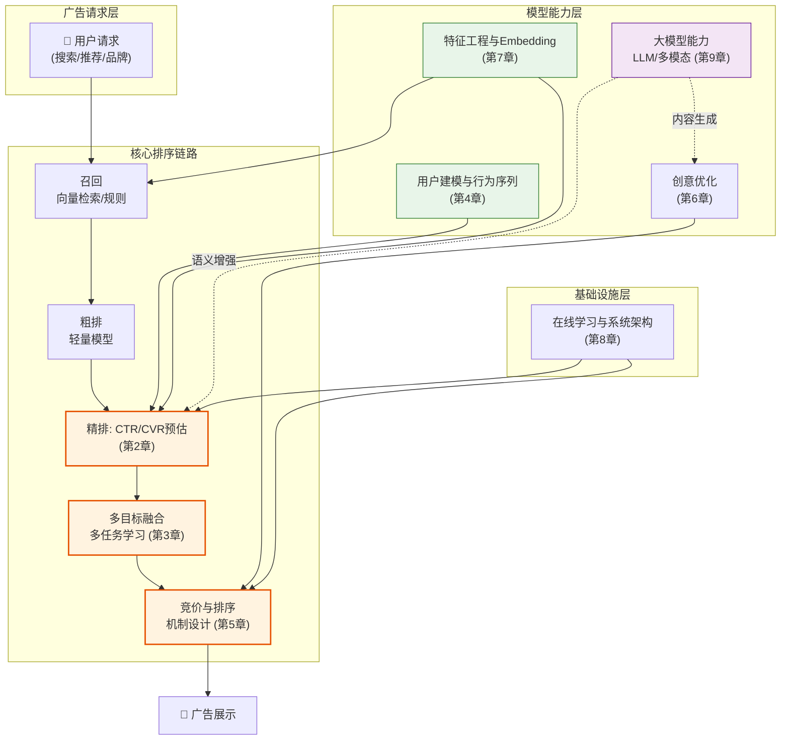
```mermaid
graph TB
    subgraph 广告请求层
        A["👤 用户请求<br/>(搜索/推荐/品牌)"]
    end

    subgraph 核心排序链路
        B["召回<br/>向量检索/规则"]
        C["粗排<br/>轻量模型"]
        D["精排: CTR/CVR预估<br/>(第2章)"]
        E["多目标融合<br/>多任务学习 (第3章)"]
        F["竞价与排序<br/>机制设计 (第5章)"]
    end

    subgraph 模型能力层
        G["用户建模与行为序列<br/>(第4章)"]
        H["特征工程与Embedding<br/>(第7章)"]
        I["创意优化<br/>(第6章)"]
        J["大模型能力<br/>LLM/多模态 (第9章)"]
    end

    subgraph 基础设施层
        K["在线学习与系统架构<br/>(第8章)"]
    end

    A --> B --> C --> D --> E --> F
    G --> D
    H --> D
    H --> B
    I --> F
    J -.->|"语义增强"| D
    J -.->|"内容生成"| I
    K --> D
    K --> F
    F --> L["📱 广告展示"]

    style D fill:#FFF3E0,stroke:#E65100,stroke-width:2px
    style E fill:#FFF3E0,stroke:#E65100,stroke-width:2px
    style F fill:#FFF3E0,stroke:#E65100,stroke-width:2px
    style G fill:#E8F5E9,stroke:#2E7D32
    style H fill:#E8F5E9,stroke:#2E7D32
    style J fill:#F3E5F5,stroke:#6A1B9A
```

### 1.3 本地生活广告系统的独特挑战

与传统电商广告（如淘宝、京东）和信息流广告（如抖音、快手）相比，美团广告系统面临若干独特挑战：

**1) LBS约束下的候选集稀疏问题**：本地生活服务具有强地理属性，用户只能消费一定距离范围内的商户服务。这导致在某些品类和区域下，广告候选集可能仅有约150个门店级候选[^meituan_mixedrank]，远少于电商广告动辄数十万候选的规模。候选集的稀疏性严重制约了排序系统的潜力空间。

**2) 时空依赖性**：用户的本地消费行为受时间（工作日/周末、午餐/晚餐）、空间（家、公司、出差目的地）双重因素影响，行为模式比纯线上场景更加复杂。这要求广告系统具备时空感知的用户建模能力[^meituan_ctr_deep]。

**3) O2O多目标优化**：用户从看到广告到完成消费，需经历完整的O2O转化链路：


```mermaid
graph LR
    E["曝光<br/>Impression"] --> CL["点击<br/>Click<br/>(CTR)"]
    CL --> CV["到店/下单<br/>Conversion<br/>(CVR)"]
    CV --> HX["核销<br/>Fulfill"]
    HX --> GMV["交易金额<br/>GMV"]

    style E fill:#E3F2FD,stroke:#1565C0
    style CL fill:#BBDEFB,stroke:#1565C0
    style CV fill:#90CAF9,stroke:#1565C0
    style HX fill:#64B5F6,stroke:#1565C0
    style GMV fill:#42A5F5,stroke:#1565C0,color:#fff
```

用户从看到广告到完成消费，需经历曝光→点击→到店/下单→核销的完整链路。广告系统不仅需要预估CTR（Click-Through Rate），还需预估CVR（Conversion Rate）、交易金额等线下指标，形成多目标联合优化问题[^meituan_ctr_deep]。

**4) 异构广告形态混排**：美团同一搜索结果页中可能同时存在门店级广告和商品级广告（如团购套餐、代金券），两者在展示形态、特征空间和用户交互模式上存在显著差异，需要设计专门的异构混排方案[^meituan_mixedrank]。

### 1.3 综述范围与方法

本综述的资料来源包括：（1）美团技术博客（tech.meituan.com）公开发表的广告与推荐算法相关技术文章；（2）美团团队在KDD、SIGIR、CIKM、ICDE、WWW、RecSys、NeurIPS、AAAI等顶级学术会议及期刊发表的论文；（3）行业其他公司（阿里、字节、腾讯、快手、百度、Google、Meta）的公开技术分享和论文，用于对比分析。综述按照广告系统的核心技术方向组织，每个方向首先介绍美团的技术实践，然后与业界方案进行对比讨论。

---

## 2. CTR/CVR预估

CTR/CVR预估是广告系统的核心模块，直接决定广告的排序和收入优化。美团在该方向的技术演进经历了从传统机器学习到深度学习、从单一模型到系统化建模的完整路径。

### 2.1 模型演进路径：从GBDT到深度模型

美团广告CTR预估的模型演进大致经历了以下阶段[^meituan_ctr_deep]：

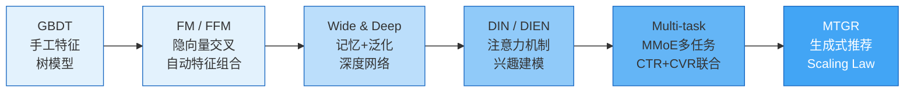
```mermaid
graph LR
    A["GBDT<br/>手工特征<br/>树模型"] --> B["FM / FFM<br/>隐向量交叉<br/>自动特征组合"]
    B --> C["Wide & Deep<br/>记忆+泛化<br/>深度网络"]
    C --> D["DIN / DIEN<br/>注意力机制<br/>兴趣建模"]
    D --> E["Multi-task<br/>MMoE多任务<br/>CTR+CVR联合"]
    E --> F["MTGR<br/>生成式推荐<br/>Scaling Law"]

    style A fill:#E3F2FD,stroke:#1565C0
    style B fill:#E3F2FD,stroke:#1565C0
    style C fill:#BBDEFB,stroke:#1565C0
    style D fill:#90CAF9,stroke:#1565C0
    style E fill:#64B5F6,stroke:#1565C0
    style F fill:#42A5F5,stroke:#1565C0,color:#fff
```

- **GBDT阶段**：早期采用Gradient Boosting Decision Tree（Friedman, 2001[^friedman2001]）作为基础模型，利用手工特征和树模型的非线性建模能力。
- **FM/FFM阶段**：引入Factorization Machines（Rendle, 2010[^rendle2010]），通过隐向量内积自动学习特征交叉，缓解了人工特征工程的瓶颈。
- **Wide & Deep阶段**：参考Google的Wide & Deep Learning框架（Cheng et al., 2016[^cheng2016]），结合wide部分的记忆能力和deep部分的泛化能力。
- **DIN/DIEN阶段**：引入阿里的Deep Interest Network（Zhou et al., KDD 2018[^zhou2018din]）思想，通过注意力机制建模用户历史行为与候选广告的相关性。
- **Multi-task阶段**：采用MMoE（Ma et al., KDD 2018[^ma2018mmoe]）等多任务框架，同时优化CTR与CVR。

下图对比了传统 Embedding+MLP 与 DIN 的核心区别——DIN 引入注意力机制，使不同历史行为对当前候选广告的贡献权重不同（与候选相关的行为获得更高权重），而非将所有历史行为等权求和：

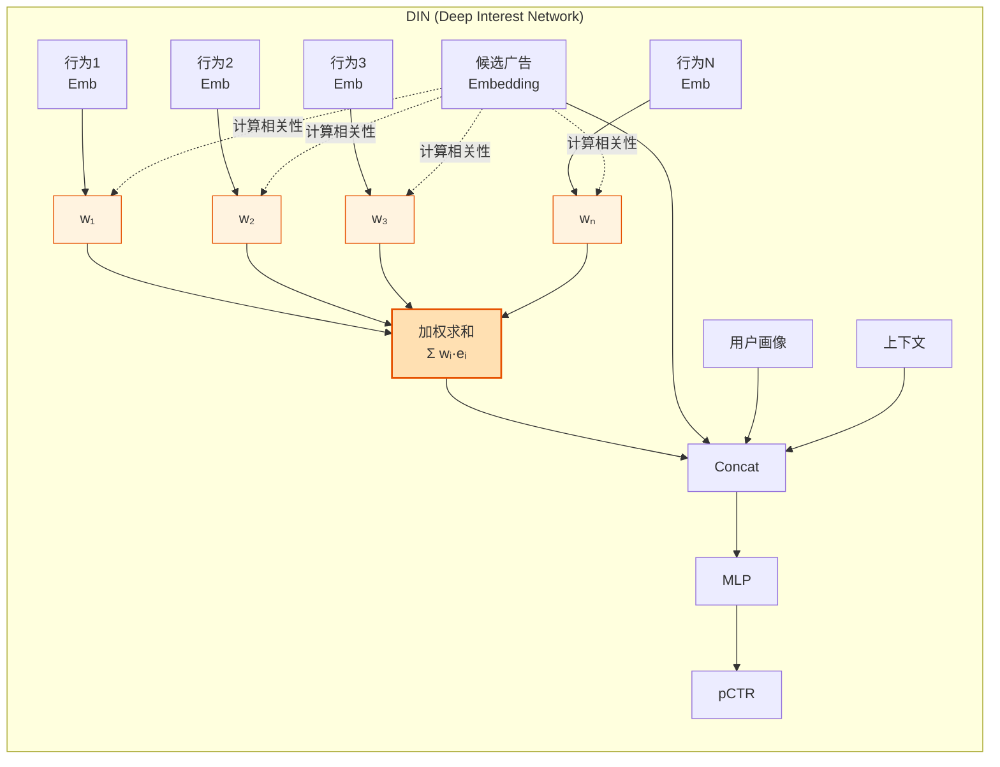
```mermaid
graph TB
    subgraph "DIN (Deep Interest Network)"
        direction TB
        C_AD["候选广告<br/>Embedding"]
        B1["行为1<br/>Emb"] --> ATT1["w₁"]
        B2["行为2<br/>Emb"] --> ATT2["w₂"]
        B3["行为3<br/>Emb"] --> ATT3["w₃"]
        BN["行为N<br/>Emb"] --> ATTN["wₙ"]
        C_AD -.->|"计算相关性"| ATT1
        C_AD -.->|"计算相关性"| ATT2
        C_AD -.->|"计算相关性"| ATT3
        C_AD -.->|"计算相关性"| ATTN
        ATT1 --> WSUM["加权求和<br/>Σ wᵢ·eᵢ"]
        ATT2 --> WSUM
        ATT3 --> WSUM
        ATTN --> WSUM
        WSUM --> CONCAT["Concat"]
        C_AD --> CONCAT
        UP["用户画像"] --> CONCAT
        CTX2["上下文"] --> CONCAT
        CONCAT --> MLP2["MLP"]
        MLP2 --> OUT2["pCTR"]
    end

    style ATT1 fill:#FFF3E0,stroke:#E65100
    style ATT2 fill:#FFF3E0,stroke:#E65100
    style ATT3 fill:#FFF3E0,stroke:#E65100
    style ATTN fill:#FFF3E0,stroke:#E65100
    style WSUM fill:#FFE0B2,stroke:#E65100,stroke-width:2px
```

### 2.2 位置偏差感知预估：DPIN

在到店广告场景中，广告展示位置对用户点击行为有显著影响（位置偏差）。传统做法是在模型中简单加入position feature或在推理时进行debias，但这些方法未能充分建模位置与其他特征之间的交互关系。

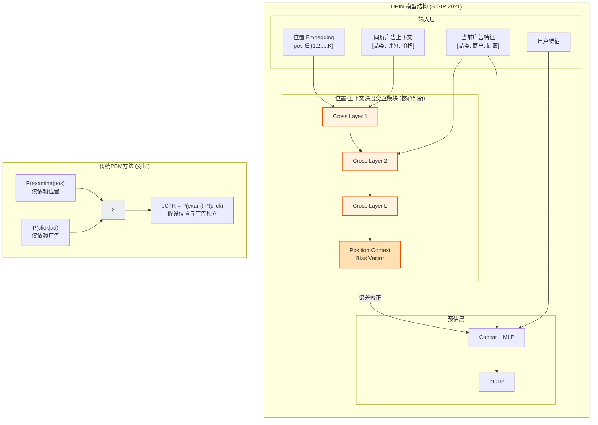
```mermaid
graph TB
    subgraph "DPIN 模型结构 (SIGIR 2021)"
        direction TB
        subgraph 输入层
            POS["位置 Embedding<br/>pos ∈ {1,2,...,K}"]
            CTX_ADS["同屏广告上下文<br/>[品类, 评分, 价格]"]
            AD_FEAT["当前广告特征<br/>[品类, 商户, 距离]"]
            USER["用户特征"]
        end

        subgraph "位置-上下文深度交互模块 (核心创新)"
            POS --> CROSS1["Cross Layer 1"]
            CTX_ADS --> CROSS1
            CROSS1 --> CROSS2["Cross Layer 2"]
            AD_FEAT --> CROSS2
            CROSS2 --> CROSS3["Cross Layer L"]
            CROSS3 --> PBIAS["Position-Context<br/>Bias Vector"]
        end

        subgraph 预估层
            USER --> FC["Concat + MLP"]
            AD_FEAT --> FC
            PBIAS -->|"偏差修正"| FC
            FC --> PCTR_OUT["pCTR"]
        end
    end

    subgraph "传统PBM方法 (对比)"
        P_EXAM["P(examine|pos)<br/>仅依赖位置"] --> MUL["×"]
        P_CLICK["P(click|ad)<br/>仅依赖广告"] --> MUL
        MUL --> PCTR_TRAD["pCTR = P(exam)·P(click)<br/>假设位置与广告独立"]
    end

    style CROSS1 fill:#FFF3E0,stroke:#E65100,stroke-width:2px
    style CROSS2 fill:#FFF3E0,stroke:#E65100,stroke-width:2px
    style CROSS3 fill:#FFF3E0,stroke:#E65100,stroke-width:2px
    style PBIAS fill:#FFE0B2,stroke:#E65100,stroke-width:2px
    style MUL fill:#ECEFF1,stroke:#78909C
```

美团广告团队提出了**DPIN（Deep Position-wise Interaction Network）**（Huang et al., SIGIR 2021[^dpin2021]），核心创新在于将位置信息与上下文特征进行深度交互建模，而非简单的加性偏差。DPIN通过位置组合的上下文偏差感知机制，在离线AUC和在线CTR指标上均取得了显著提升。该工作体现了美团团队对LBS场景下位置偏差问题的深入理解——在本地生活搜索中，排名位置对用户决策的影响模式与传统电商搜索有本质区别[^meituan_ctr_deep]。

### 2.3 时空行为建模与长序列预估

针对LBS场景下用户行为的强时空依赖性，美团团队提出了**Trilateral Spatiotemporal Attention Network**，发表于CIKM 2021（Qi, Yi et al., 2021[^qi2021cikm]）。该模型从三个维度（用户侧、商户侧、时空上下文侧）构建注意力网络，捕捉用户在不同时间、不同地点的行为偏好变化模式。

在长序列建模方面，美团参考了阿里SIM（Search-based Interest Model）的思路[^pi2020sim]，针对用户生命周期内的超长行为序列（数千甚至上万条历史行为），通过检索式的两阶段架构——先从长序列中检索出与候选广告相关的子序列，再进行精细的注意力建模——在保证推理效率的同时捕捉用户的长期兴趣演化[^meituan_ctr_deep]。

### 2.4 搜索广告相关性预估：MT-BERT

搜索广告的一个核心子问题是Query-Ad相关性判断。美团搜索广告团队基于预训练语言模型MT-BERT构建了完整的语义匹配方案（美团技术博客, 2021[^meituan_pretrain]）。下图展示从教师模型（Cross-Encoder）到线上部署的双塔模型之间的 VIRT 知识蒸馏流程：

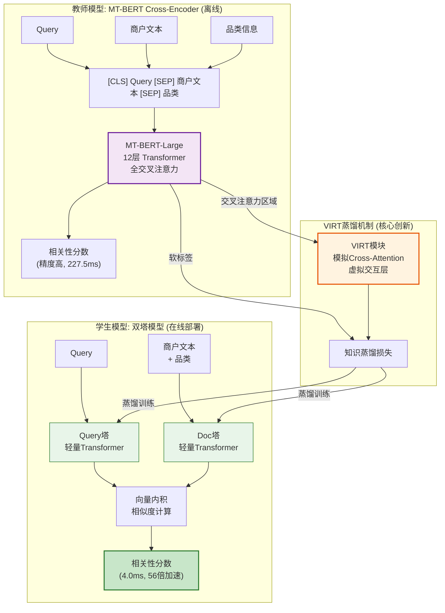
```mermaid
graph TB
    subgraph "教师模型: MT-BERT Cross-Encoder (离线)"
        Q1["Query"] --> JOINT["[CLS] Query [SEP] 商户文本 [SEP] 品类"]
        D1["商户文本"] --> JOINT
        CAT1["品类信息"] --> JOINT
        JOINT --> BERT_T["MT-BERT-Large<br/>12层 Transformer<br/>全交叉注意力"]
        BERT_T --> SCORE_T["相关性分数<br/>(精度高, 227.5ms)"]
    end

    subgraph "VIRT蒸馏机制 (核心创新)"
        BERT_T -->|"软标签"| KD["知识蒸馏损失"]
        BERT_T -->|"交叉注意力区域"| VIRT["VIRT模块<br/>模拟Cross-Attention<br/>虚拟交互层"]
        VIRT --> KD
    end

    subgraph "学生模型: 双塔模型 (在线部署)"
        Q2["Query"] --> ENC_Q["Query塔<br/>轻量Transformer"]
        D2["商户文本<br/>+ 品类"] --> ENC_D["Doc塔<br/>轻量Transformer"]
        ENC_Q --> SIM["向量内积<br/>相似度计算"]
        ENC_D --> SIM
        SIM --> SCORE_S["相关性分数<br/>(4.0ms, 56倍加速)"]
    end

    KD -->|"蒸馏训练"| ENC_Q
    KD -->|"蒸馏训练"| ENC_D

    style BERT_T fill:#F3E5F5,stroke:#6A1B9A,stroke-width:2px
    style VIRT fill:#FFF3E0,stroke:#E65100,stroke-width:2px
    style ENC_Q fill:#E8F5E9,stroke:#2E7D32
    style ENC_D fill:#E8F5E9,stroke:#2E7D32
    style SCORE_S fill:#C8E6C9,stroke:#2E7D32,stroke-width:2px
```

- **预训练阶段**：将BERT的NSP任务替换为搜索广告点击预测任务，使用约6000万条搜索点击日志进行领域自适应预训练。同时引入三段式输入编码（Query、商户文本、品类信息），通过独立的segment embedding防止品类信息与查询/文档表征产生交叉干扰。
- **数据增强**：设计了三级难度的负样本构建策略——全局随机负样本（跨品类）、同一级品类负样本、同三级品类负样本（最难），并通过采样平滑防止模型忽略中长尾query。
- **知识蒸馏**：提出VIRT（Virtual Interaction）机制，在蒸馏过程中模拟cross-encoder的交叉注意力区域，将交互式教师模型的知识迁移到双塔学生模型，在不增加推理计算量的前提下弥合cross-encoder与bi-encoder之间的精度差距。最终双塔模型实现了相比MT-BERT-Large **56倍推理加速**（4.0ms vs 227.5ms），AUC回收至83.31%。
- **在线效果**：CTR提升1.0%，Badcase@5降低2.2个百分点，NDCG提升2.0个百分点。

### 2.5 预训练增强CTR预估：SRP4CTR

在CIKM 2024上，美团团队进一步提出了**SRP4CTR（Sequential Recommendation Pre-training for CTR）**框架[^srp4ctr2024]，系统性分析了将预训练模型整合到CTR预估中的推理成本问题——这是此前工作普遍忽略的关键因素。

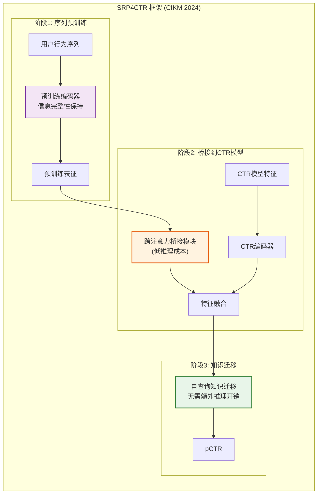
```mermaid
graph TB
    subgraph "SRP4CTR 框架 (CIKM 2024)"
        direction TB
        subgraph "阶段1: 序列预训练"
            SEQ["用户行为序列"] --> PT_ENC["预训练编码器<br/>信息完整性保持"]
            PT_ENC --> PT_REP["预训练表征"]
        end

        subgraph "阶段2: 桥接到CTR模型"
            PT_REP --> BRIDGE["跨注意力桥接模块<br/>(低推理成本)"]
            CTR_FEAT["CTR模型特征"] --> CTR_ENC["CTR编码器"]
            BRIDGE --> FUSE["特征融合"]
            CTR_ENC --> FUSE
        end

        subgraph "阶段3: 知识迁移"
            FUSE --> SELF_Q["自查询知识迁移<br/>无需额外推理开销"]
            SELF_Q --> PRED["pCTR"]
        end
    end

    style PT_ENC fill:#F3E5F5,stroke:#6A1B9A
    style BRIDGE fill:#FFF3E0,stroke:#E65100,stroke-width:2px
    style SELF_Q fill:#E8F5E9,stroke:#2E7D32,stroke-width:2px
```

SRP4CTR提出了保持信息完整性的预训练方法、低成本的跨注意力桥接模块以及高效的自查询知识迁移技术，实现了预训练增益与推理效率的平衡。

### 2.6 与业界CTR方案对比

| 维度 | 美团 | 阿里妈妈 | 字节跳动 | 腾讯广告 |
|------|------|----------|----------|----------|
| 核心模型 | DPIN + MT-BERT | DIN/DIEN/SIM → COLD | 基于Transformer的大规模模型 | DCAF/OPAL |
| 位置偏差 | DPIN显式建模 | PAL（Position-Aware Learning） | 位置注意力机制 | PBM解耦 |
| 预训练范式 | MT-BERT + VIRT蒸馏 | BERT4Rec / CoLT | - | 通用预训练 |
| 独特挑战 | LBS稀疏候选 | 海量候选+长尾 | 视频场景多模态 | 社交场景 |

---

## 3. 多目标/多任务学习

### 3.1 问题背景

美团广告需要同时优化多个业务目标：CTR（点击率）、CVR（转化率）、交易金额、用户体验指标等。这些目标之间既存在正相关（如点击是转化的前序事件），也存在竞争关系（如过度优化CTR可能引入低质量流量，损害CVR）。此外，美团的多业务场景（到店餐饮、外卖、酒旅等）进一步增加了多任务建模的复杂度。

### 3.2 MMoE与PLE的实践

美团广告系统早期采用了Google提出的MMoE（Multi-gate Mixture-of-Experts，Ma et al., KDD 2018[^ma2018mmoe]）框架进行多任务学习，通过多个共享Expert网络和任务特定的Gating网络实现任务间的知识共享与差异化建模。

随后，美团参考了腾讯PCG提出的PLE（Progressive Layered Extraction，Tang et al., RecSys 2020[^tang2020ple]）架构，在MMoE基础上引入任务特定的Expert网络和逐层提取机制，进一步缓解了多任务学习中的跷跷板问题（seesaw problem）——即一个任务指标的提升以另一个任务指标的下降为代价。

下图对比 MMoE 与 PLE(CGC) 的结构差异——PLE 在 MMoE 的共享 Expert 基础上增加了任务专属 Expert，逐层提取减少任务间干扰：

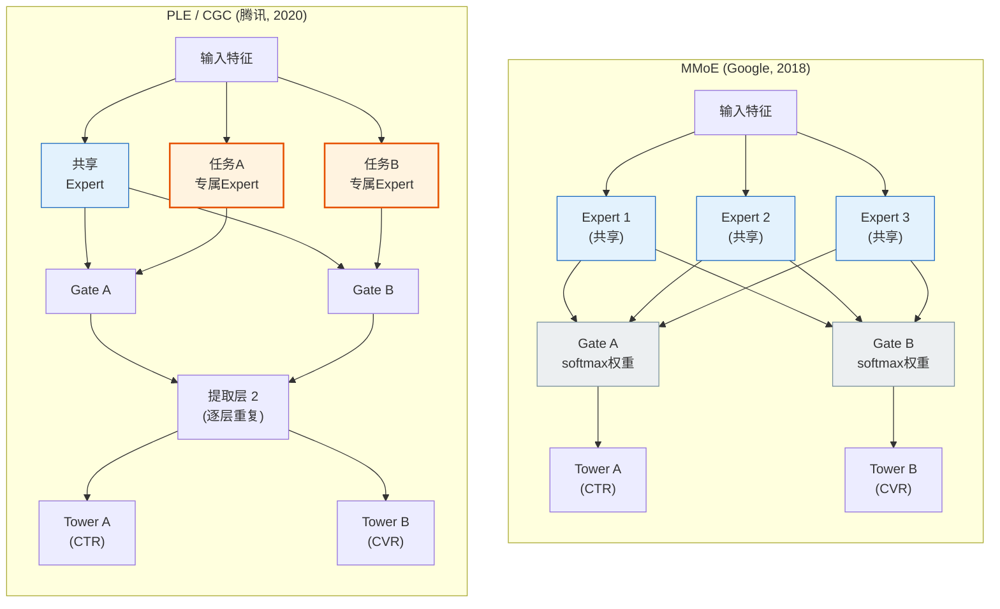
```mermaid
graph TB
    subgraph "MMoE (Google, 2018)"
        direction TB
        IN1["输入特征"] --> E1_1["Expert 1<br/>(共享)"]
        IN1 --> E1_2["Expert 2<br/>(共享)"]
        IN1 --> E1_3["Expert 3<br/>(共享)"]
        E1_1 --> G1_A["Gate A<br/>softmax权重"]
        E1_2 --> G1_A
        E1_3 --> G1_A
        E1_1 --> G1_B["Gate B<br/>softmax权重"]
        E1_2 --> G1_B
        E1_3 --> G1_B
        G1_A --> T1_A["Tower A<br/>(CTR)"]
        G1_B --> T1_B["Tower B<br/>(CVR)"]
    end

    subgraph "PLE / CGC (腾讯, 2020)"
        direction TB
        IN2["输入特征"] --> E2_S["共享<br/>Expert"]
        IN2 --> E2_A["任务A<br/>专属Expert"]
        IN2 --> E2_B["任务B<br/>专属Expert"]
        E2_S --> G2_A["Gate A"]
        E2_A --> G2_A
        E2_S --> G2_B["Gate B"]
        E2_B --> G2_B
        G2_A --> EXT2["提取层 2<br/>(逐层重复)"]
        G2_B --> EXT2
        EXT2 --> T2_A["Tower A<br/>(CTR)"]
        EXT2 --> T2_B["Tower B<br/>(CVR)"]
    end

    style E1_1 fill:#E3F2FD,stroke:#1565C0
    style E1_2 fill:#E3F2FD,stroke:#1565C0
    style E1_3 fill:#E3F2FD,stroke:#1565C0
    style E2_S fill:#E3F2FD,stroke:#1565C0
    style E2_A fill:#FFF3E0,stroke:#E65100,stroke-width:2px
    style E2_B fill:#FFF3E0,stroke:#E65100,stroke-width:2px
    style G1_A fill:#ECEFF1,stroke:#78909C
    style G1_B fill:#ECEFF1,stroke:#78909C
```

### 3.3 HiNet：多场景多任务层次化建模

美团到店餐饮团队在ICDE 2023上发表了**HiNet（Hierarchical Information Extraction Network）**[^hinet2023]，提出了一种两层层次化信息提取框架，创新性地将场景级信息提取和任务级信息提取解耦到不同的特征空间：

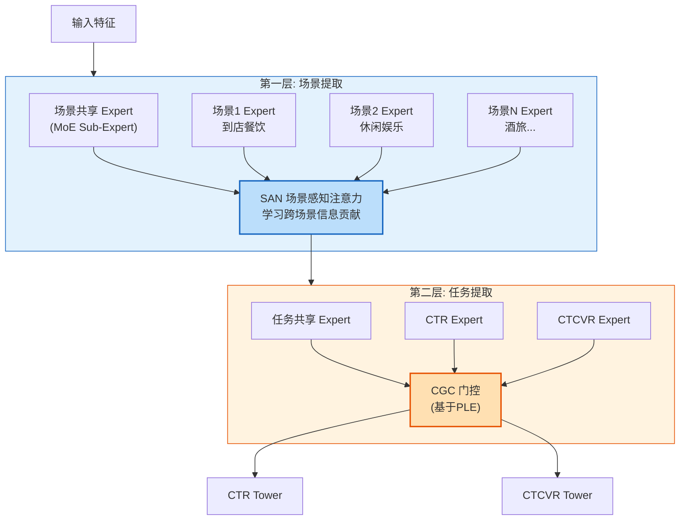
```mermaid
graph TB
    INPUT["输入特征"] --> SEL["场景提取层<br/>Scenario Extraction Layer"]

    subgraph SEL["第一层: 场景提取"]
        direction TB
        SE_SHARED["场景共享 Expert<br/>(MoE Sub-Expert)"]
        SE_S1["场景1 Expert<br/>到店餐饮"]
        SE_S2["场景2 Expert<br/>休闲娱乐"]
        SE_SN["场景N Expert<br/>酒旅..."]
        SAN["SAN 场景感知注意力<br/>学习跨场景信息贡献"]
        SE_SHARED --> SAN
        SE_S1 --> SAN
        SE_S2 --> SAN
        SE_SN --> SAN
    end

    SAN --> TEL

    subgraph TEL["第二层: 任务提取"]
        direction TB
        TE_SHARED["任务共享 Expert"]
        TE_CTR["CTR Expert"]
        TE_CVR["CTCVR Expert"]
        CGC["CGC 门控<br/>(基于PLE)"]
        TE_SHARED --> CGC
        TE_CTR --> CGC
        TE_CVR --> CGC
    end

    CGC --> OUT_CTR["CTR Tower"]
    CGC --> OUT_CVR["CTCVR Tower"]

    style SEL fill:#E3F2FD,stroke:#1565C0
    style TEL fill:#FFF3E0,stroke:#E65100
    style SAN fill:#BBDEFB,stroke:#1565C0,stroke-width:2px
    style CGC fill:#FFE0B2,stroke:#E65100,stroke-width:2px
```

- **场景提取层（Scenario Extraction Layer）**：包含三个组件——
  - 场景共享Expert网络（基于MoE的Sub-Expert Integration模块）
  - 场景特定Expert网络
  - **场景感知注意力网络（SAN）**：通过注意力机制显式学习其他场景对当前场景的信息贡献
  
- **任务提取层（Task Extraction Layer）**：基于PLE的CGC（Customized Gate Control）模块，包含任务共享和任务特定Expert

HiNet在美团到店餐饮6个推荐场景上进行了实验，在CTR和CTCVR两个任务的AUC指标上均超过了Shared Bottom、MMoE、PLE、HMoE、STAR等基线方法。消融实验表明，去除层次化结构导致所有指标严重下降，SAN模块在多个场景上贡献了显著增益。线上A/B测试中，HiNet在大流量场景上的CTR和CTCVR均有提升，已全量部署于美团到店餐饮推荐系统。

### 3.4 AdaScene：自适应多场景建模

在DSP外投广告场景中，美团面临更极端的多场景挑战——媒体、时段、App、展示位置的组合产生了十万量级的子场景[^meituan_dsp]。美团DSP团队提出了**AdaScene（Adaptive Scenario Model）**：

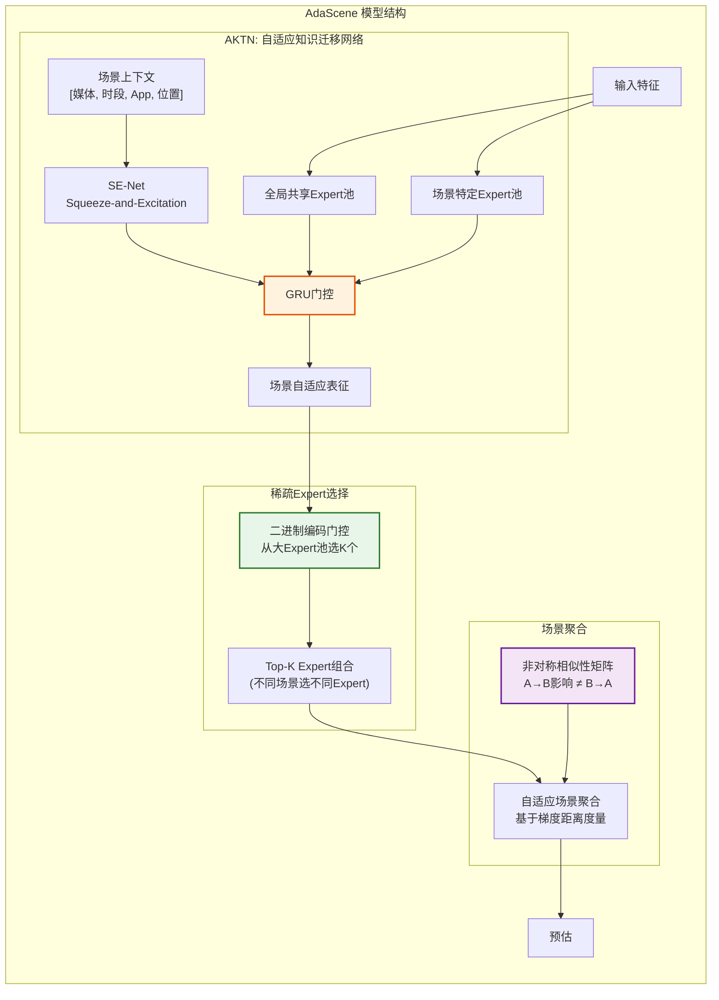
```mermaid
graph TB
    subgraph "AdaScene 模型结构"
        direction TB
        IN["输入特征"] --> GLOBAL["全局共享Expert池"]
        IN --> SCENE["场景特定Expert池"]
        
        subgraph "AKTN: 自适应知识迁移网络"
            CTX_S["场景上下文<br/>[媒体, 时段, App, 位置]"]
            CTX_S --> SE["SE-Net<br/>Squeeze-and-Excitation"]
            SE --> GRU_G["GRU门控"]
            GLOBAL --> GRU_G
            SCENE --> GRU_G
            GRU_G --> AKTN_OUT["场景自适应表征"]
        end

        subgraph "稀疏Expert选择"
            AKTN_OUT --> SPARSE["二进制编码门控<br/>从大Expert池选K个"]
            SPARSE --> TOP_K["Top-K Expert组合<br/>(不同场景选不同Expert)"]
        end

        subgraph "场景聚合"
            TOP_K --> AGG["自适应场景聚合<br/>基于梯度距离度量"]
            SIM["非对称相似性矩阵<br/>A→B影响 ≠ B→A"] --> AGG
        end

        AGG --> PRED_A["预估"]
    end

    style GRU_G fill:#FFF3E0,stroke:#E65100,stroke-width:2px
    style SPARSE fill:#E8F5E9,stroke:#2E7D32,stroke-width:2px
    style SIM fill:#F3E5F5,stroke:#6A1B9A,stroke-width:2px
```

- **自适应知识迁移网络（AKTN）**：基于SE-Net（Squeeze-and-Excitation Network）和GRU门控单元，通过场景上下文信息控制全局共享Expert与场景特定Expert之间的知识流动。AKTN可分层堆叠，实现渐进式的场景自适应。
  
- **稀疏Expert选择机制**：从大规模Expert池中选择K个Expert（基于二进制编码的门控网络），可视化分析证实不同场景确实选择了不同的Expert组合。

- **自适应场景聚合**：通过梯度距离度量场景间相似性，采用Meta-Learning启发的加权方案计算场景关联系数，生成非对称的场景相似性矩阵——揭示了场景间影响的方向性（如场景A对场景B的影响可能不等于B对A的影响）。

### 3.5 与业界多任务方案对比

| 方案 | 提出方 | 核心思想 | 美团实践关系 |
|------|--------|----------|-------------|
| Shared Bottom | 经典方法 | 底层共享+顶层分离 | 作为基线 |
| MMoE | Google, 2018 | 多门控专家混合 | 早期采用 |
| PLE | 腾讯PCG, 2020 | 渐进式分层提取 | 任务提取层基础 |
| STAR | 阿里, 2021 | 星型拓扑多场景 | HiNet对比基线 |
| HiNet | 美团, ICDE 2023 | 层次化场景+任务解耦 | 到店餐饮部署 |
| AdaScene | 美团DSP | 自适应知识迁移+稀疏Expert | 外投广告部署 |
| AITM | 阿里, KDD 2021 | 自适应信息迁移 | 多目标序列建模 |
| MetaBalance | 字节, 2022 | 梯度平衡的多任务优化 | 梯度级任务平衡 |

---

## 4. 用户建模与行为序列

### 4.1 LBS场景下的用户行为特性

美团用户的行为模式与传统电商用户有显著差异。LBS服务场景下，用户的兴趣和需求高度依赖当前时空上下文：同一用户在工作日午餐时段和周末休闲时段、在公司附近和商业中心的行为模式可能完全不同。此外，本地生活消费具有较强的"重复消费"属性（如用户频繁回购同一家外卖店），这与电商领域更强调"新品发现"的用户行为形成对比。

### 4.2 时空注意力网络

美团团队在CIKM 2021发表的Trilateral Spatiotemporal Attention Network[^qi2021cikm]从三个维度构建用户表征：

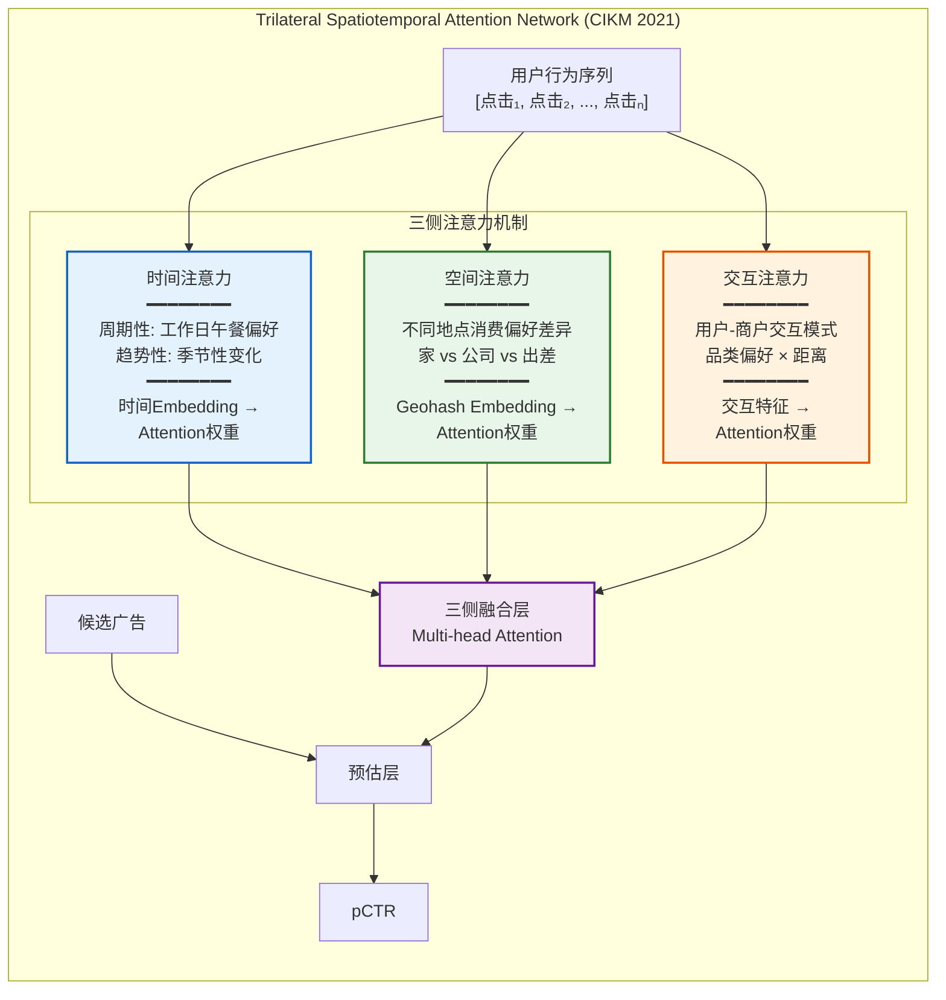
```mermaid
graph TB
    subgraph "Trilateral Spatiotemporal Attention Network (CIKM 2021)"
        direction TB
        SEQ["用户行为序列<br/>[点击₁, 点击₂, ..., 点击ₙ]"]

        subgraph "三侧注意力机制"
            direction LR
            T_ATT["时间注意力<br/>━━━━━━━━<br/>周期性: 工作日午餐偏好<br/>趋势性: 季节性变化<br/>━━━━━━━━<br/>时间Embedding →<br/>Attention权重"]
            S_ATT["空间注意力<br/>━━━━━━━━<br/>不同地点消费偏好差异<br/>家 vs 公司 vs 出差<br/>━━━━━━━━<br/>Geohash Embedding →<br/>Attention权重"]
            U_ATT["交互注意力<br/>━━━━━━━━<br/>用户-商户交互模式<br/>品类偏好 × 距离<br/>━━━━━━━━<br/>交互特征 →<br/>Attention权重"]
        end

        SEQ --> T_ATT
        SEQ --> S_ATT
        SEQ --> U_ATT

        T_ATT --> FUSE["三侧融合层<br/>Multi-head Attention"]
        S_ATT --> FUSE
        U_ATT --> FUSE

        AD["候选广告"] --> PRED["预估层"]
        FUSE --> PRED
        PRED --> OUT["pCTR"]
    end

    style T_ATT fill:#E3F2FD,stroke:#1565C0,stroke-width:2px
    style S_ATT fill:#E8F5E9,stroke:#2E7D32,stroke-width:2px
    style U_ATT fill:#FFF3E0,stroke:#E65100,stroke-width:2px
    style FUSE fill:#F3E5F5,stroke:#6A1B9A,stroke-width:2px
```

- **时间维度**：捕捉用户行为的周期性（如工作日午餐偏好）和趋势性（如季节性变化）
- **空间维度**：建模用户在不同地理位置的消费偏好差异
- **用户-商户交互维度**：学习用户与不同类型商户的交互模式

该模型通过三侧注意力机制（trilateral attention）将时空信息与用户行为序列深度融合，在位置相关的搜索场景中取得了显著的效果提升。

### 4.3 跨域兴趣迁移：EXIT框架

美团平台内存在多个业务域（外卖、到店餐饮、酒旅、闪购等），用户在不同域的行为可以相互补充。然而，隐式的跨域方法可能引入负迁移——例如用户在搜索场景下的紧急药品购买需求不适合直接迁移到信息流推荐场景。

在CIKM 2024上，美团团队提出了**EXIT（Explicit Interest Transfer）**框架[^exit2024]：

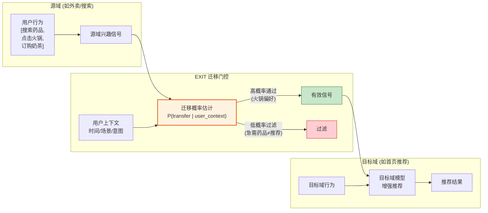
```mermaid
graph LR
    subgraph "源域 (如外卖/搜索)"
        S_BEH["用户行为<br/>[搜索药品,<br/>点击火锅,<br/>订购奶茶]"]
        S_INT["源域兴趣信号"]
        S_BEH --> S_INT
    end

    subgraph "EXIT 迁移门控"
        S_INT --> GATE["迁移概率估计<br/>P(transfer | user_context)"]
        UCTX["用户上下文<br/>时间/场景/意图"] --> GATE
        GATE -->|"高概率通过<br/>(火锅偏好)"| PASS["有效信号"]
        GATE -->|"低概率过滤<br/>(急需药品≠推荐)"| BLOCK["过滤"]
    end

    subgraph "目标域 (如首页推荐)"
        PASS --> TGT["目标域模型<br/>增强推荐"]
        T_BEH["目标域行为"] --> TGT
        TGT --> REC["推荐结果"]
    end

    style GATE fill:#FFF3E0,stroke:#E65100,stroke-width:2px
    style PASS fill:#C8E6C9,stroke:#2E7D32
    style BLOCK fill:#FFCDD2,stroke:#C62828
```

核心思想是显式建模源域兴趣信号在不同用户上下文下迁移到目标域的概率，过滤不适当的信号。该方法无需复杂的网络结构，提供了一种简单而有效的跨域推荐解决方案，已部署于美团首页推荐系统。

### 4.4 跨会话序列建模

美团团队在ICDM 2020 NeuRec Workshop上发表了探索跨会话信息感知的推荐模型[^meituan_session]，研究如何在Session-based推荐中利用跨Session的长期用户信息。在本地生活场景中，用户的单次Session行为往往较短（如搜索一家附近的餐厅），但跨Session的长期行为模式（如每周固定时间的外卖订购）对推荐效果有重要价值。

### 4.5 生成式推荐与Scaling Law：MTGR

美团在用户建模方向的最新突破是**MTGR（Meituan Generative Recommendation）**框架（美团技术博客, 2025[^meituan_mtgr]），这标志着从传统DLRM范式向生成式推荐范式的重要转型。

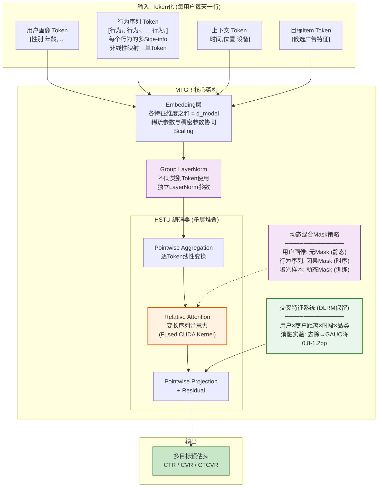
```mermaid
graph TB
    subgraph "输入: Token化 (每用户每天一行)"
        U["用户画像 Token<br/>[性别,年龄,...]"]
        S["行为序列 Token<br/>[行为₁, 行为₂, ..., 行为ₙ]<br/>每个行为的多Side-info<br/>非线性映射→单Token"]
        C["上下文 Token<br/>[时间,位置,设备]"]
        T["目标Item Token<br/>[候选广告特征]"]
    end

    subgraph "MTGR 核心架构"
        direction TB
        EMB["Embedding层<br/>各特征维度之和 = d_model<br/>稀疏参数与稠密参数协同Scaling"]

        GLN["Group LayerNorm<br/>不同类别Token使用<br/>独立LayerNorm参数"]

        subgraph "HSTU 编码器 (多层堆叠)"
            direction TB
            PA["Pointwise Aggregation<br/>逐Token线性变换"]
            RA["Relative Attention<br/>变长序列注意力<br/>(Fused CUDA Kernel)"]
            PW["Pointwise Projection<br/>+ Residual"]
            PA --> RA --> PW
        end

        MASK["动态混合Mask策略<br/>━━━━━━━━━━━━━━━━<br/>用户画像: 无Mask (静态)<br/>行为序列: 因果Mask (时序)<br/>曝光样本: 动态Mask (训练)"]

        CROSS["交叉特征系统 (DLRM保留)<br/>━━━━━━━━━━━━━━━━<br/>用户×商户距离×时段×品类<br/>消融实验: 去除→GAUC降0.8-1.2pp"]
    end

    subgraph 输出
        PRED["多目标预估头<br/>CTR / CVR / CTCVR"]
    end

    U --> EMB
    S --> EMB
    C --> EMB
    T --> EMB
    EMB --> GLN
    GLN --> PA
    MASK -.-> RA
    CROSS --> PW
    PW --> PRED

    style RA fill:#FFF3E0,stroke:#E65100,stroke-width:2px
    style CROSS fill:#E8F5E9,stroke:#2E7D32,stroke-width:2px
    style GLN fill:#F3E5F5,stroke:#6A1B9A
    style MASK fill:#F3E5F5,stroke:#6A1B9A
    style PRED fill:#C8E6C9,stroke:#2E7D32
```

MTGR的关键设计包括：

- **混合架构定位**：不同于Meta GR的纯生成式架构（放弃交叉特征）或阿里LUM/字节HLLM的堆叠式架构（复杂多阶段训练），MTGR采用混合架构——以HSTU为核心编码器，但保留DLRM的全量特征系统（包括交叉特征）。
- **Token化输入设计**：将用户画像、行为序列、上下文和目标item分别Token化，每个历史交互的多个Side-info通过非线性映射压缩为单个Token。
- **Group LayerNorm**：对不同类别的Token使用不同的LayerNorm参数，解决不同语义空间Token的对齐问题。
- **动态混合Mask**：针对历史静态特征（无Mask）、实时行为序列（因果Mask）、曝光样本（动态Mask）设计不同的注意力掩码策略。
- **数据组织革新**：每用户每天一行数据（而非传统DLRM的N次曝光N行），使用JaggedTensor和变长HSTU算子消除padding浪费。

MTGR在线实验结果：推理FLOPs提升65倍（55.76 GFLOPs），但通过工程优化实现推理成本降低12%；CTCVR GAUC提升2.88个百分点；外卖首页列表订单量提升1.22%（近两年最大单次迭代增益）。截至2025年4月已全量部署于美团外卖首页、频道页和小程序。

### 4.6 DLRM到生成式推荐的演进路线

美团外卖推荐模型的Scaling路径清晰地展示了技术演进方向[^meituan_mtgr]：

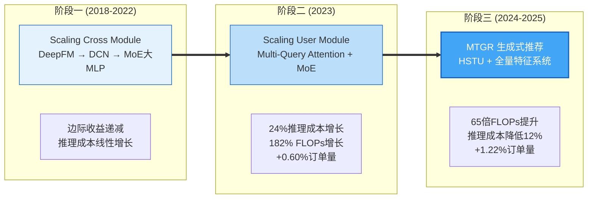
```mermaid
graph LR
    subgraph "阶段一 (2018-2022)"
        A1["Scaling Cross Module<br/>DeepFM → DCN → MoE大MLP"]
        A1_NOTE["边际收益递减<br/>推理成本线性增长"]
    end

    subgraph "阶段二 (2023)"
        A2["Scaling User Module<br/>Multi-Query Attention + MoE"]
        A2_NOTE["24%推理成本增长<br/>182% FLOPs增长<br/>+0.60%订单量"]
    end

    subgraph "阶段三 (2024-2025)"
        A3["MTGR 生成式推荐<br/>HSTU + 全量特征系统"]
        A3_NOTE["65倍FLOPs提升<br/>推理成本降低12%<br/>+1.22%订单量"]
    end

    A1 ==> A2 ==> A3

    style A1 fill:#E3F2FD,stroke:#1565C0
    style A2 fill:#BBDEFB,stroke:#1565C0
    style A3 fill:#42A5F5,stroke:#1565C0,color:#fff,stroke-width:2px
```

1. **Scaling Cross Module阶段（2018-2022）**：特征交叉网络的升级（DeepFM → DCN → MoE大MLP），但边际收益递减且推理成本线性增长。
2. **Scaling User Module阶段（2023）**：Multi-Query Attention + MoE处理行为序列，用户模块计算结果广播到各候选项，以24%推理成本增长实现182% FLOPs增长和0.60%订单量提升。
3. **MTGR生成式推荐阶段（2024-2025）**：上述MTGR混合架构。

---

## 5. 竞价与机制设计

### 5.1 问题定义与理论基础

广告竞价与机制设计是广告系统中连接"效果预估"与"商业变现"的关键技术环节，关注的核心问题包括：拍卖机制选择（GSP vs VCG vs GFP）、排序公式设计（eCPM计算）、智能出价（OCPC/OCPM/Auto-bidding）、预算分配（Budget Pacing）、以及保量合约与竞价广告的混排策略。

#### 5.1.1 拍卖机制理论

在线广告拍卖的主流机制包括：

- **GFP（Generalized First-Price）**：广告主按其出价支付，出价最高者获得展示。GFP的优势是规则简单透明，但存在激烈的出价震荡问题——广告主有动机频繁调整出价以避免多付，导致拍卖收入不稳定。近年来Google Ad Manager和Header Bidding生态已回归First-Price模式[^despotakis2021first]。

- **GSP（Generalized Second-Price）**：广告主按下一名出价者的出价支付（加一个最小增量）。GSP是Google AdWords/Ads在2002年引入的经典机制（Edelman et al., 2007[^edelman2007gsp]; Varian, 2007[^varian2007gsp]），其核心性质包括：非真实（non-truthful，广告主有动机出价低于真实估值）、存在局部纳什均衡（locally envy-free equilibrium）、在均衡状态下的收入介于VCG收入与完全竞争收入之间。

- **VCG（Vickrey-Clarke-Groves）**：每个广告主支付其参与对其他广告主造成的外部性成本。VCG是唯一满足激励相容（truthful）、个体理性和分配效率的机制，但在实践中存在收入较低、计算复杂度高、对广告主不直觉等问题。Facebook/Meta的广告系统长期采用VCG机制（Varian & Harris, 2014[^varian2014vcg]）。

#### 5.1.2 排序公式（eCPM Ranking）

广告排序的基本公式为：

```
eCPM = pCTR × bid × quality_factor
```

其中`pCTR`为预估点击率，`bid`为广告主出价，`quality_factor`为质量因子（涵盖相关性、用户体验等）。在OCPC/OCPM模式下，排序公式演变为：

```
eCPM = pCTR × pCVR × target_CPA × adjustment_factor    (OCPC)
eCPM = pCTR × pCVR × target_CPA                        (OCPM)
```

美团搜索广告主要采用CPC计费+GSP机制，推荐广告场景则逐步向OCPM模式演进。在LBS约束下，美团的排序公式还需考虑地理距离因子和品类质量分[^meituan_mixedrank]。

### 5.2 OCPC/OCPM智能出价架构

#### 5.2.1 基本框架

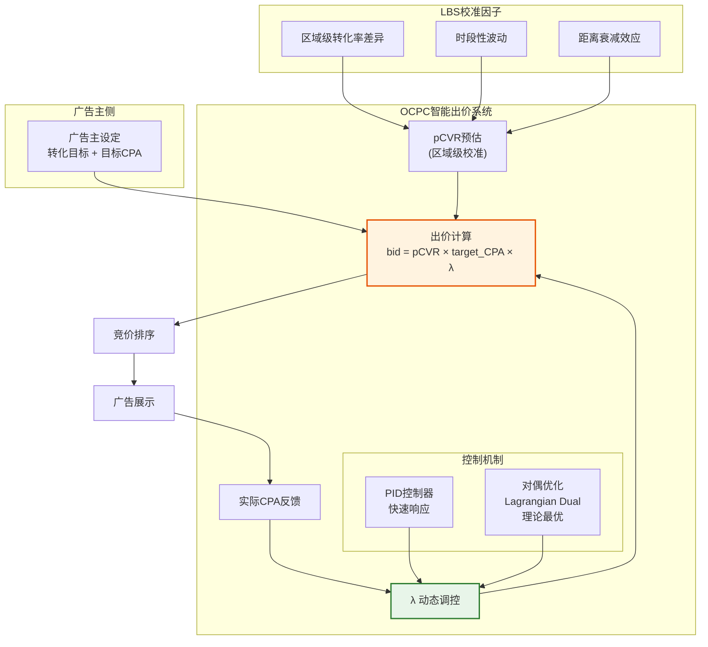
```mermaid
graph TB
    subgraph 广告主侧
        ADV["广告主设定<br/>转化目标 + 目标CPA"]
    end

    subgraph "OCPC智能出价系统"
        direction TB
        PCVR["pCVR预估<br/>(区域级校准)"]
        BID["出价计算<br/>bid = pCVR × target_CPA × λ"]
        CTRL["λ 动态调控"]

        subgraph 控制机制
            PID["PID控制器<br/>快速响应"]
            DUAL["对偶优化<br/>Lagrangian Dual<br/>理论最优"]
        end

        FEEDBACK["实际CPA反馈"]
    end

    subgraph "LBS校准因子"
        GEO["区域级转化率差异"]
        TIME["时段性波动"]
        DIST["距离衰减效应"]
    end

    ADV --> BID
    PCVR --> BID
    BID --> AUCTION["竞价排序"]
    AUCTION --> SHOW["广告展示"]
    SHOW --> FEEDBACK
    FEEDBACK --> CTRL
    PID --> CTRL
    DUAL --> CTRL
    CTRL --> BID
    GEO --> PCVR
    TIME --> PCVR
    DIST --> PCVR

    style BID fill:#FFF3E0,stroke:#E65100,stroke-width:2px
    style CTRL fill:#E8F5E9,stroke:#2E7D32,stroke-width:2px
```

美团广告系统的智能出价方案参考了淘宝展示广告的OCPC框架（Zhu et al., KDD 2017[^zhu2017ocpc]），核心思路是将广告主的转化目标约束转化为系统侧的自动出价优化问题。在OCPC模式下，广告主设定转化目标（如到店核销）和期望CPA（Cost Per Action），系统自动调整CPC出价，使实际CPA趋近于目标CPA。

典型的OCPC出价公式为：

```
bid_i = pCVR_i × target_CPA × λ
```

其中`pCVR_i`是对第i次展示机会的转化率预估，`target_CPA`是广告主设定的目标转化成本，`λ`是动态调控系数（由PID控制器或对偶方法求解）。

#### 5.2.2 LBS场景下的出价校准

美团的OCPC实现面临LBS场景下的独特挑战[^meituan_ctr_deep]：

- **区域级转化率差异**：同一广告主在商业区（如三里屯）和住宅区的转化率可能相差数倍，需要区域级别的`pCVR`校准和出价调整。
- **时段性波动**：本地生活消费具有强时段特征（午餐/晚餐高峰），出价策略需要时段感知的动态调控。
- **距离衰减效应**：用户距离商户越远，转化概率越低。出价系统需要将距离因子纳入转化率预估和出价计算中。
- **O2O转化链路长**：从线上点击到线下到店核销，转化链路长且存在延迟归因问题，对CPA反馈控制的延迟容忍度提出了更高要求。

#### 5.2.3 出价控制机制

智能出价系统的核心控制逻辑通常基于两种范式：

**PID控制方法**：将目标CPA与实际CPA的偏差作为误差信号，通过比例-积分-微分控制器调整`λ`系数。优势是实现简单、响应快，但在流量波动大时可能出现震荡。淘宝OCPC系统[^zhu2017ocpc]的early版本即采用此方案。

**对偶优化方法（Lagrangian Dual）**：将带约束的出价优化问题（最大化转化数，受预算和CPA约束）转化为无约束的拉格朗日对偶问题，通过梯度下降更新对偶变量（即出价调控系数）。该方法理论性质更优——在凸松弛条件下可证明收敛到最优解，是阿里妈妈Auto-bidding系列工作的核心方法论（Wen et al., KDD 2021[^wen2021uscb]）。

### 5.3 预算控制与Budget Pacing

#### 5.3.1 问题形式化

Budget Pacing解决的核心问题是：广告主设定日预算B，系统需要将预算在一天的流量中合理分配，避免预算在高峰时段过早耗尽（early stop）或在低峰时段浪费（under-delivery）。形式化为在线分配问题：

```
max  Σ_t v_t × x_t        (最大化总价值)
s.t. Σ_t c_t × x_t ≤ B    (预算约束)
     x_t ∈ {0, 1}          (每次竞拍的参与决策)
```

其中`v_t`是第t次展示机会的预期价值，`c_t`是预期花费，`x_t`是是否参与竞拍的决策。

#### 5.3.2 主流Budget Pacing算法

**Throttling（流量节流）**：按一定概率丢弃展示机会，使消耗速度匹配预期。经典做法是将一天划分为T个时段，每个时段分配B/T的预算。LinkedIn提出了基于在线学习的自适应节流算法（Agarwal et al., KDD 2014[^agarwal2014budget]），通过乘性权重更新实现接近最优的预算分配。

**Bid Modification（出价调整）**：不丢弃流量，而是通过降低出价来控制消耗速度。当消耗过快时降低出价系数，反之提高。该方法对收入影响较小，但可能导致广告在高价值流量上竞争力不足。

**混合方案**：实际系统通常结合Throttling和Bid Modification。美团在LBS场景下的Budget Pacing需要额外考虑地理维度——同一广告主在不同区域的流量供给不均衡，需要区域感知的预算分配策略。

#### 5.3.3 美团场景的特殊考量

美团到店广告的Budget Pacing面临以下LBS特有挑战：

- **流量的时空聚集性**：本地生活搜索流量在午餐/晚餐时段集中爆发，与电商搜索流量的平滑分布形成对比。简单的均匀分配策略（B/T）会导致高价值时段预算不足。
- **候选集有限**：在稀疏候选集（约150个门店）场景下，预算控制的粒度更粗，每个广告主的竞拍机会有限，要求更精准的取舍决策。
- **多目标预算分配**：广告主可能同时设定日预算和目标CPA，系统需要在满足双重约束下最大化转化数。

### 5.4 异构广告混排中的竞价策略

美团到店搜索广告的异构混排系统[^meituan_mixedrank]在竞价层面引入了创新性的候选关系处理策略：

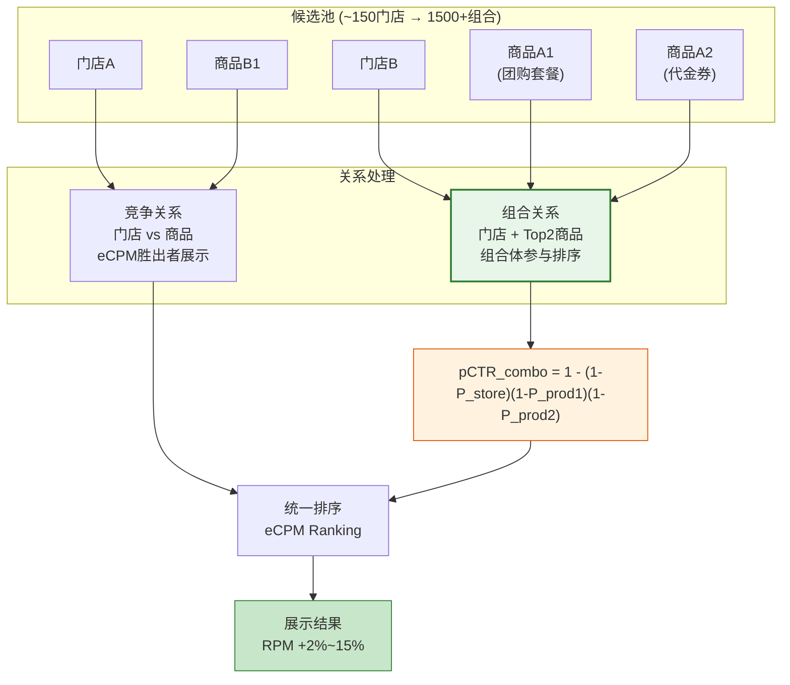
```mermaid
graph TB
    subgraph "候选池 (~150门店 → 1500+组合)"
        S1["门店A"]
        S2["门店B"]
        P1["商品A1<br/>(团购套餐)"]
        P2["商品A2<br/>(代金券)"]
        P3["商品B1"]
    end

    subgraph "关系处理"
        direction TB
        COMP["竞争关系<br/>门店 vs 商品<br/>eCPM胜出者展示"]
        COMB["组合关系<br/>门店 + Top2商品<br/>组合体参与排序"]
    end

    S1 --> COMP
    P3 --> COMP

    S2 --> COMB
    P1 --> COMB
    P2 --> COMB

    COMB --> FORMULA["pCTR_combo = 1 - (1-P_store)(1-P_prod1)(1-P_prod2)"]

    COMP --> RANK["统一排序<br/>eCPM Ranking"]
    FORMULA --> RANK
    RANK --> RESULT["展示结果<br/>RPM +2%~15%"]

    style COMB fill:#E8F5E9,stroke:#2E7D32,stroke-width:2px
    style FORMULA fill:#FFF3E0,stroke:#E65100
    style RESULT fill:#C8E6C9,stroke:#2E7D32
```

#### 5.4.1 竞争关系与组合关系

- **竞争关系**：门店广告与商品广告竞争同一展示位，胜出者（由eCPM决定）获得展示。这是传统拍卖机制的直接延伸。
- **组合关系**：门店广告与其下属商品广告组合为一个展示单元（门店 + Top2商品），以组合体整体参与排序。组合体的pCTR通过概率加法公式计算：

```
pCTR_combo = 1 - (1 - P_store) × (1 - P_product1) × (1 - P_product2)
```

这种组合竞价的关键创新在于将门店和商品视为互补而非替代关系——用户点击门店或其下属任一商品都算作有效点击，因此组合体的pCTR应取互斥事件并集的概率。

#### 5.4.2 竞价空间扩展效果

这种异构竞价策略使候选空间从约150个门店扩展到1500+个门店+商品组合，RPM（Revenue Per Mille）提升2%~15%[^meituan_mixedrank]。这一提升源于两个机制：(1) 组合体的pCTR系统性高于单独门店，提升了eCPM上界；(2) 更丰富的候选使拍卖竞争更充分，推高了均衡出价。

### 5.5 探索与利用（E&E）机制

在竞价系统中，新广告和新商品面临"冷启动"问题——缺乏历史数据导致pCTR估计不准确，进而影响出价的合理性。

#### 5.5.1 Thompson Sampling方案

美团采用**Thompson Sampling**（汤普森采样）替代朴素的ε-greedy随机探索[^meituan_mixedrank]：每个商品的pCTR从Beta(a, b)分布中采样，其中参数设计为：

```
a / (a + b) = f(pCTR)        (均值对齐预估CTR)
a + b = g(历史曝光量)         (曝光越多，分布越集中)
```

历史曝光越少的商品获得越大的采样随机性（探索），充分探索的商品则趋向于利用模型预估值（利用）。该方案在10%的随机性幅度下未出现精度损失，同时有效缓解了新商品的曝光不足问题。

#### 5.5.2 E&E与竞价效率的关系

探索机制对竞价效率的影响是双面的：短期内对低曝光商品的强制探索可能降低即时eCPM，但长期来看通过获取更准确的pCTR估计可以提升整体拍卖效率。在美团的稀疏候选集场景中，E&E的重要性尤为突出——候选数仅约150个，每个候选的pCTR准确性对整体排序质量影响显著。

### 5.6 OR+ML融合的竞价优化

美团最新公开的OR算法+ML模型混合推理框架（美团技术博客, 2025[^meituan_or_ml]）为竞价优化提供了新的技术基座。该框架将运筹优化（如线性规划、整数规划）与机器学习模型统一在同一推理链路中，使得竞价决策可以在满足复杂约束（预算、CPA、ROI、流量均匀性等）的同时利用ML模型的预估能力。这种OR+ML融合方案在广告竞价场景中的典型应用包括：

- **带约束的实时竞价决策**：将预算约束、CPA约束建模为线性约束，通过LP/QP求解器在毫秒级获得最优出价。
- **多广告主联合优化**：在平台视角下同时优化多个广告主的出价策略，避免单广告主优化导致的纳什均衡低效。
- **保量合约与竞价混排**：通过整数规划分配保量合约的展示资源，剩余流量交由竞价机制分配。

### 5.7 与业界竞价方案深度对比

#### 5.7.1 阿里妈妈Auto-bidding体系

阿里妈妈在智能出价领域积累最为深厚，构建了完整的理论和工程体系：

- **USCB（Unified Solution for Constrained Bidding）**（Wen et al., KDD 2021[^wen2021uscb]）：将带约束的出价优化统一建模为受限马尔可夫决策过程（CMDP），通过对偶分解将约束吸收到目标函数中，在每个时刻的出价决策转化为无约束优化。USCB首次在工业规模验证了基于对偶方法的实时出价可以有效满足预算和ROI双重约束。
- **AIGB（AI-Generated Bidding）**（Guo et al., KDD 2024[^wen2022aigb]）：将出价策略生成建模为条件扩散模型（Conditional Diffusion Model），直接对回报与完整出价轨迹的联合分布进行建模，避免了传统MDP方法在长时域上的误差累积。AIGB在大规模在线广告系统中验证了生成式出价的有效性。
- **理论贡献**：阿里团队系统性证明了在线广告出价的竞争比（competitive ratio）下界，建立了Auto-bidding领域的理论基准。

#### 5.7.2 字节跳动广告竞价优化

字节跳动在广告竞价优化方面同样有系统性的技术积累。Chen et al.（2022[^he2022creater]）提出了一个统一的广告活动效果预测框架，将广告投放中的预算消耗预测、曝光量预测和转化效果预测纳入统一建模体系：

- 将广告活动（Campaign）级别的效果预测建模为多目标预测问题，同时预估预算消耗速率、曝光量和转化指标。
- 通过统一框架整合多个预测任务，利用任务间的关联性（如预算消耗速率与曝光量的正相关）提升各任务的预测精度。
- 该框架服务于广告主的投放决策——帮助广告主在投放前评估不同预算、出价和定向策略下的预期效果，降低投放不确定性。
- 在字节跳动的大规模在线广告系统中验证了框架的有效性，相比独立建模各预测任务取得了显著的精度提升。

#### 5.7.3 Google的竞价理论贡献

Google在广告竞价领域的贡献主要在理论奠基层面：

- **GSP机制分析**（Edelman et al., 2007[^edelman2007gsp]; Varian, 2007[^varian2007gsp]）：首次严格分析了GSP拍卖的均衡性质，证明其均衡收入介于VCG收入和完全价格歧视收入之间。
- **Budget Pacing算法**（Balseiro & Gur, 2019[^balseiro2015budget]）：提出了基于对偶方法的在线Budget Pacing算法，证明了O(√T)的遗憾界（regret bound）。
- **Auto-bidding均衡分析**（Aggarwal et al., 2019[^aggarwal2019autobidding]）：分析了当所有广告主都使用Auto-bidding时的市场均衡性质——证明First-Price拍卖在Auto-bidding环境下具有更好的效率和稳定性，这也是Google回归First-Price的理论支撑之一。

#### 5.7.4 综合对比

| 维度 | 美团 | 阿里妈妈 | 字节跳动 | Google |
|------|------|----------|----------|--------|
| **拍卖机制** | GSP（搜索）+ OCPM（推荐） | GSP + VCG混合 | First-Price为主 | First-Price（2019后） |
| **出价优化方法** | PID控制 + 对偶方法 | CMDP + Transformer生成 | 统一效果预测+出价优化 | 对偶方法 + 在线学习 |
| **核心约束** | 预算 + CPA + LBS | 预算 + ROI | 预算 + ROI | 预算 + target CPA |
| **独特挑战** | 时空稀疏性、区域异质性 | 海量广告主博弈 | 内容生态平衡 | 跨平台归因 |
| **理论深度** | 工程实践为主 | 理论+工程并重 | 预测+优化融合 | 理论奠基 |
| **Budget Pacing** | 时段+区域感知 | 对偶方法+实时调控 | RL-based | 在线凸优化 |
| **公开论文数** | 较少（竞价方向） | 10+ | 5+ | 20+ |

#### 5.7.5 美团竞价技术的定位与差异化

美团在竞价技术方面的公开学术输出相对阿里和Google较少，这与美团广告业务发展阶段和研发重心有关——美团将更多资源投入在CTR/CVR预估、多任务学习和用户建模等上游模块的精度提升上。但美团在以下方面具有独特价值：

1. **LBS约束下的机制设计**：美团是少数需要在竞价机制中深度集成地理因素的平台。区域级出价校准、距离衰减建模、时空流量分配等问题在纯电商或纯信息流场景中并不突出。

2. **异构候选的组合竞价**：门店+商品的组合体竞价策略是美团在LBS搜索广告中的独创，通过概率组合扩展了有效候选空间，这在候选集稀疏的本地生活场景中意义重大。

3. **OR+ML融合决策**：美团最新的混合推理框架为复杂约束下的竞价优化提供了工程基础，有望在保量合约、多约束出价等场景中发挥更大作用。

4. **信息有限性说明**：需要指出的是，美团在竞价方向的公开技术分享（tech blog和顶会论文）相比CTR预估、多任务学习等方向明显较少。本节中关于美团竞价架构的部分描述基于其CTR博客[^meituan_ctr_deep]和混排博客[^meituan_mixedrank]中的侧面信息推断，美团可能在内部有更完善的竞价体系但尚未公开。

---

## 6. 创意优化

### 6.1 概述

广告创意优化旨在为每个广告/商户自动生成或选择最优的展示内容（标题文案、封面图片、详情描述等），以提升CTR和用户体验。美团在创意优化方面积累了从文本生成到图像设计的全链路技术体系。

### 6.2 文本创意生成

美团大众点评信息流团队在创意文本生成方面进行了系统性的技术演进（美团技术博客, 2019[^meituan_creative]）：

**抽取式标题生成**：将标题生成重新定义为短文本分类问题，模型架构从Bi-LSTM + Attention（v1）→ ELMo增强（v1.5）→ CNN + Bi-LSTM + Attention（v2）→ Self-Attention/Transformer（v3）逐步演进。累计在CTR上实现超过10%的提升。

**生成式标题生成**：采用Seq2Seq架构，编码器融合主题/商户信息和源文本的双重表征，解码器通过注意力机制学习主题与源文本表征的权重关系。Transformer变体通过增加Context Encoder和上下文注意力层强化上下文捕捉能力。

**Copy机制**：结合抽取式和生成式的优势，独立建模Copy和Generate概率，解决"Where To Point"问题。

**商户文案生成（Data-to-Text）**：
- 商户理解：通过LDA提取卖点/主题，表示为Key-Value对（如Key="菜品"，Value="雪蟹"）
- 硬约束控制：必须（或禁止）出现的信息直接注入Context
- 软约束控制：基于贝叶斯采样，根据共现条件概率决定卖点加入
- 风格控制：PGC与UGC内容源作为控制信号
- 多样性控制：批级别entity去重 + n-gram重复检测

### 6.3 智能海报设计

美团AI海报设计系统（美团技术博客, 2018[^meituan_banner]）采用"规划器-优化器-生成器"三组件架构：

- **序列生成式布局规划**：将设计元素类比为"词"，海报类比为"句子"，使用SeqGAN启发的判别器提供Object loss评估整体序列连贯性。
- **神经风格迁移**：当素材库缺乏合适素材时，通过风格迁移融合源图像的内容和目标图像的风格。
- **FCN分割+抠图**：基于FCN的编码器-解码器架构配合空洞卷积和Matting管线实现商品精细抠图。
- 支持千人千面的个性化营销素材大规模生成。

### 6.4 CIKM 2024：设计元素感知的海报布局生成

美团在CIKM 2024上发表了**DET（Design Element aware Transformer）**[^det2024]，定义了"设计元素感知的海报布局生成"新任务：根据背景图像和给定的设计元素（文字、Logo、纹理等）生成匹配的布局。DET使用可变形注意力（Deformable Attention）提取多尺度特征，并关联元素内容/宽高比特征与背景，已部署于美团展示广告和联盟广告场景。

### 6.5 动态创意优化与排序

创意排序模型在特征工程上采用"强化User/Context特征、弱化Item/POI特征"的策略[^meituan_creative]，让创意表征隐式捕捉品类、场景、商户属性等高阶结构信息。在线E&E采用改进的Epsilon-Greedy策略，将创意按历史表现分为7个层级，表现优异的创意获得更大的流量分配比例。

### 6.6 CIKM 2024：视觉想象增强检索（VIER）

美团在CIKM 2024上发表的**VIER（Visual Imagination Enhanced Retrieval）**[^vier2024]针对即时零售搜索场景中的极端Query问题（过短歧义Query和过长噪声Query），提出了多模态检索模型——重建视觉图像表征来捕捉Query的共性特征和用户的个性化视觉偏好，融合视觉预期与语义和行为序列信号，在收入、点击和CTR等指标上取得显著在线提升。

---

## 7. 特征工程与Embedding

本章聚焦美团广告系统中特征工程与Embedding技术的独特设计，重点分析LBS场景下区别于通用电商/信息流广告的特征工程方法论，以及美团在Embedding架构选择上与业界方案的具体技术差异。

### 7.1 LBS场景的特征体系

美团广告的特征体系围绕LBS场景的核心要素构建：


```mermaid
graph TB
    subgraph "LBS特征体系"
        direction TB
        subgraph "用户特征"
            U1["基础画像<br/>性别/年龄/消费水平"]
            U2["行为统计<br/>近N天点击/转化"]
            U3["实时行为序列"]
        end

        subgraph "商户/商品特征"
            M1["品类/评分/价格"]
            M2["地理位置/经营状态"]
            M3["销量统计"]
        end

        subgraph "上下文特征"
            C1["时间<br/>小时/星期/节假日"]
            C2["位置<br/>用户GPS/距离"]
            C3["设备信息"]
        end

        subgraph "LBS独特交叉特征"
            X1["Geohash网格编码<br/>多精度地理离散化"]
            X2["POI Embedding<br/>地理邻近+行为图"]
            X3["距离非线性建模<br/>品类条件距离偏好"]
            X4["用户×商户距离<br/>×时段×品类"]
        end
    end

    U1 & U2 & U3 --> MODEL["CTR/CVR<br/>预估模型"]
    M1 & M2 & M3 --> MODEL
    C1 & C2 & C3 --> MODEL
    X1 & X2 & X3 & X4 --> MODEL

    style X1 fill:#FFF3E0,stroke:#E65100,stroke-width:2px
    style X2 fill:#FFF3E0,stroke:#E65100,stroke-width:2px
    style X3 fill:#FFF3E0,stroke:#E65100,stroke-width:2px
    style X4 fill:#FFF3E0,stroke:#E65100,stroke-width:2px
    style MODEL fill:#E8F5E9,stroke:#2E7D32,stroke-width:2px
```

主要包括：

- **用户特征**：基础画像（性别、年龄、消费水平等）、行为统计特征（近N天点击/转化次数）、实时行为序列
- **商户/商品特征**：品类、评分、价格区间、地理位置、经营状态、销量统计
- **上下文特征**：时间（小时、星期、节假日）、位置（用户当前位置、与商户距离）、设备信息
- **交叉特征**：用户-商户距离、用户品类偏好 × 商户品类、时段 × 品类等

### 7.2 美团LBS特征工程的独特设计

与纯电商或信息流广告系统相比，美团LBS广告的特征工程在以下方面有独特的技术设计：

#### 7.2.1 地理网格编码（Geohash Grid Encoding）

美团广告系统将地理空间划分为多层次网格，形成层次化的地理编码体系：

- **多精度Geohash**：采用不同精度级别的Geohash编码（如6位约1.2km×0.6km、7位约150m×150m、8位约20m×10m），将连续的经纬度坐标离散化为可Embedding化的地理Token。不同精度级别的Geohash捕捉不同粒度的区域特征——高精度网格反映街区级商圈特征（如办公楼密集区vs住宅区），低精度网格反映城市级消费模式（如商业中心vs城郊）。
- **相对位置编码**：除了用户和商户各自的绝对Geohash外，系统还编码用户-商户之间的相对地理关系——包括方向（东南西北）、跨越网格数（反映距离）等。这种相对编码使模型能够学习"用户偏好去哪个方向消费"的模式（如午餐时向公司周边搜索，晚餐时向家的方向搜索）。

#### 7.2.2 POI Embedding

美团拥有千万级的POI（Point of Interest）数据，POI Embedding的设计需要综合考虑地理邻近性、品类语义和用户行为信号：

- **POI图构建**：基于用户行为序列（同一用户在时间窗口内先后访问的POI构成有向边）和地理邻近关系（距离阈值内的POI构成无向边）构建异构POI图。
- **Side Information融合**：在图Embedding学习过程中，将POI的品类标签、评分区间、价格带、营业时段等Side Information注入节点表征，使得地理位置相近但品类不同的商户获得不同的Embedding表征。
- **时间衰减采样**：在用户行为图的边权计算中引入时间衰减——近期行为的共现关系权重高于远期行为，反映用户兴趣的动态演化。

#### 7.2.3 距离特征的非线性建模

用户-商户距离对转化率的影响并非简单的线性衰减，美团广告系统对距离特征进行了精细化的非线性建模：

- **分段Embedding**：将距离按业务语义分段编码——步行可达（<500m）、骑行可达（500m-2km）、驾车近距（2-5km）、驾车远距（5-15km）、超远（>15km），每段赋予独立的Embedding ID。不同品类的距离敏感度差异显著（外卖通常<3km，到店餐饮<5km，酒店可跨城）。
- **品类条件距离建模**：对"距离×品类"进行交叉编码，使模型学习到"用户愿意为火锅走3km但只愿意为快餐走1km"这类品类特异性的距离偏好。
- **出行方式推断**：结合用户当前速度（通过GPS轨迹估计）和时段信息推断出行方式（步行/骑行/驾车/公交），不同出行方式下的距离敏感度模型参数独立。

### 7.3 自动特征选择与特征重要性分析

在特征数量持续增长（美团广告模型的特征规模达到数百个稠密特征和数十亿稀疏特征ID）的背景下，自动特征选择对模型效率和效果具有关键意义：

#### 7.3.1 特征重要性评估方法

- **基于梯度的特征重要性**：在Deep模型中，通过计算损失函数对各Embedding输入的梯度大小来评估特征贡献。对于MTGR中Token化的输入，可计算每个Token组成特征的平均梯度范数作为重要性指标。
- **Permutation重要性**：对特定特征进行随机打乱后观察AUC的变化——在LBS场景中，距离特征和品类特征的Permutation重要性通常排名前列，验证了地理信息对美团广告的核心价值。
- **SHAP值分析**：基于Shapley值的特征归因方法可提供实例级别的特征重要性解释，用于分析单条预估结果中各特征的贡献方向和大小。

#### 7.3.2 自动特征筛选策略

- **基于正则化的特征门控**：在Embedding层后添加可学习的Gate参数（如AutoFIS方法），训练过程中通过L1正则化自动将低价值特征的Gate趋近于零，实现端到端的特征选择。
- **特征淘汰策略**：周期性评估各特征的增量贡献，对贡献低于阈值的特征进行淘汰。在美团实践中，约20-30%的低效特征可在不损失AUC的情况下移除，显著降低模型推理延迟和存储开销。
- **特征交叉自动发现**：AutoCross等方法通过搜索算法自动发现高价值的特征交叉组合。在LBS场景中，自动发现的高价值交叉通常涉及时空维度（如"星期×时段×品类×距离段"），验证了人工设计交叉特征的合理性。

### 7.4 Embedding架构技术演进

美团广告Embedding技术的发展与整体模型演进紧密关联：

- **FM时代的隐向量**：早期Factorization Machines中各特征对应固定维度的Embedding向量，通过内积建模二阶特征交叉。
- **Deep模型中的Embedding Layer**：Wide & Deep架构中，高维稀疏特征通过Embedding层映射为低维稠密向量，是深度网络的输入基础。
- **预训练Embedding**：MT-BERT系列工作中[^meituan_pretrain]，通过大规模搜索日志预训练获取商户和Query的语义Embedding。
- **MTGR中的Embedding Scaling**：MTGR框架中[^meituan_mtgr]，在模型scale-up过程中同步扩展稀疏参数（Embedding维度），对于由k个特征组成的Token，每个特征的Embedding维度设置为接近d_model/k的值，确保稠密参数和稀疏参数的协同扩展。

### 7.5 向量检索系统

美团外卖团队构建了基于GPU的向量检索系统（美团技术博客, 2024[^meituan_gpu_retrieval]），支持向量+标量混合检索，为Embedding-based的召回提供了高性能基础设施。该系统在外卖搜索场景中实现了高吞吐、低延迟的ANN（Approximate Nearest Neighbor）检索。

### 7.6 与业界Embedding方案的具体技术差异

#### 7.6.1 vs 阿里 Graph Embedding（EGES）

阿里提出的EGES（Enhanced Graph Embedding with Side Information, Wang et al., KDD 2018[^wang2018eges]）是电商Graph Embedding的经典方案：

| 对比维度 | 美团POI Embedding | 阿里EGES |
|----------|-------------------|-----------|
| **图构建信号** | 用户行为序列 + 地理邻近 | 用户行为序列 + 商品共购 |
| **Side Information** | 品类、评分、位置、营业时段 | 品类、品牌、店铺、价格 |
| **核心差异** | 地理邻近性是一等公民，POI的物理距离直接影响图结构 | 纯行为信号驱动，无地理约束 |
| **冷启动处理** | 地理邻近POI的Embedding均值作为初始化 | Side Information加权平均 |
| **训练规模** | 千万级POI节点 | 亿级商品节点 |
| **适用场景** | LBS召回（地理+语义双重相关性） | 电商召回（语义相关性为主） |

核心差异在于：阿里EGES的图是纯行为驱动的，两个商品是否有"边"完全取决于用户共同交互行为；美团POI图则引入了物理空间的先验知识——地理邻近的POI天然存在关联（用户倾向于在地理范围内连续消费），这种先验在行为数据稀疏时尤其重要。

#### 7.6.2 vs 字节跳动 Monolith Embedding

字节跳动的Monolith系统（Liu et al., RecSys 2022[^liu2022monolith]）是大规模Embedding工程优化的标杆：

| 对比维度 | 美团（MTGR体系） | 字节Monolith |
|----------|-------------------|--------------|
| **Embedding更新** | 增量训练（小时级） | 实时在线更新（分钟级） |
| **哈希策略** | 标准特征哈希 + 频次过滤 | Cuckoo Hashing + 自动淘汰过期ID |
| **Embedding维度** | 统一维度（d_model/k per feature） | 混合维度（热门ID高维、长尾ID低维） |
| **Collisionless保证** | 高频ID专属slot | HashTable无冲突存储 |
| **核心优化方向** | 稠密-稀疏协同Scaling | 超大规模在线服务（万亿参数） |
| **适用场景** | LBS场景（候选有限、特征交叉重要） | 信息流推荐（海量item、实时性要求极高） |

核心差异在于：Monolith解决的是"万亿级Embedding参数的在线实时更新"问题——抖音每天产生数百万新视频，对应的Embedding必须实时可用；美团LBS场景的商户变化速率远低于此（日均新增/关闭商户有限），更关注Embedding质量（如地理语义的准确捕捉）而非更新实时性。

#### 7.6.3 vs Meta DLRM Embedding架构

Meta的DLRM（Naumov et al., 2019[^naumov2019dlrm]）奠定了推荐系统Embedding架构的工业标准：

- **Embedding Sharding**：Meta在数据并行和模型并行之间采用混合并行——大Embedding表（如用户ID、item ID）进行模型并行切分到多块GPU，小Embedding表进行数据并行复制。MTGR继承了TorchRec框架中的这一设计，但在稀疏参数的scale-up策略上有所创新——MTGR要求各特征Embedding维度之和等于d_model，在模型规模增大时同步扩展Embedding维度。
- **Embedding Compression**：Meta探索了量化Embedding（INT8/INT4）、Hash Embedding（多次哈希取平均）等压缩技术。美团在MTGR的FP16推理中验证了低精度Embedding的可行性（打分误差仅0.006）。

---

## 8. 在线学习与系统架构

下图展示美团广告模型训练与推理系统的整体架构及关键优化点：

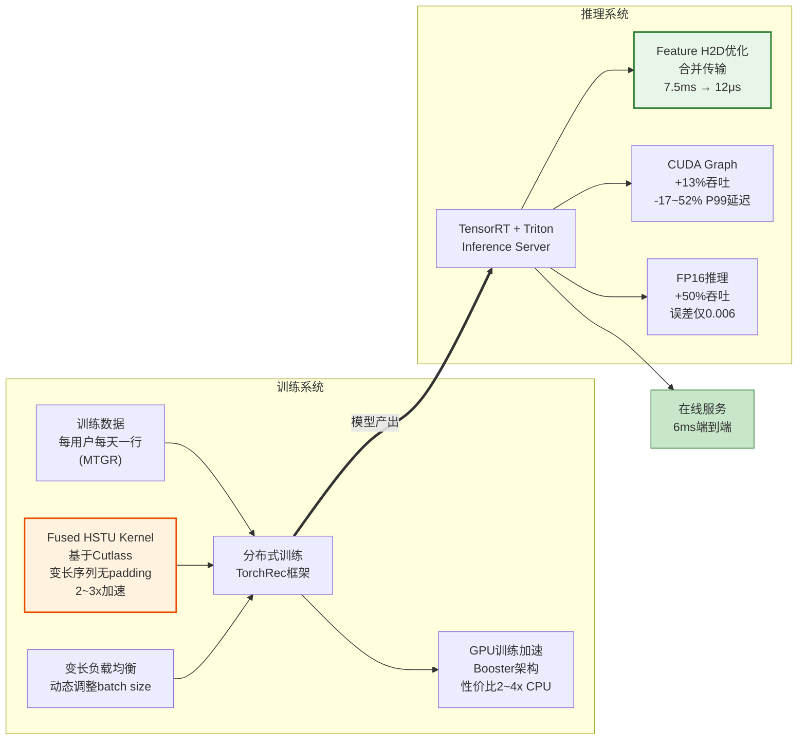
```mermaid
graph LR
    subgraph "训练系统"
        direction TB
        DATA["训练数据<br/>每用户每天一行<br/>(MTGR)"]
        TF["分布式训练<br/>TorchRec框架"]
        GPU_T["GPU训练加速<br/>Booster架构<br/>性价比2~4x CPU"]
        FUSED["Fused HSTU Kernel<br/>基于Cutlass<br/>变长序列无padding<br/>2~3x加速"]
        LB["变长负载均衡<br/>动态调整batch size"]
        DATA --> TF --> GPU_T
        FUSED --> TF
        LB --> TF
    end

    subgraph "推理系统"
        direction TB
        TRT["TensorRT + Triton<br/>Inference Server"]
        H2D["Feature H2D优化<br/>合并传输<br/>7.5ms → 12μs"]
        CG["CUDA Graph<br/>+13%吞吐<br/>-17~52% P99延迟"]
        FP16["FP16推理<br/>+50%吞吐<br/>误差仅0.006"]
        TRT --> H2D
        TRT --> CG
        TRT --> FP16
    end

    TF ==>|"模型产出"| TRT
    TRT --> ONLINE["在线服务<br/>6ms端到端"]

    style FUSED fill:#FFF3E0,stroke:#E65100,stroke-width:2px
    style H2D fill:#E8F5E9,stroke:#2E7D32,stroke-width:2px
    style ONLINE fill:#C8E6C9,stroke:#2E7D32
```

### 8.1 分布式训练优化

美团推荐系统团队在TensorFlow分布式训练方面进行了深入优化（美团技术博客, 2021[^meituan_tf_dist]）：

- **分布式扩展性提升10倍以上**：通过优化Parameter Server通信、数据并行策略和梯度压缩等技术。
- **同步训练 + Backup Worker**：平衡异步更新的参数延迟与同步训练的性能瓶颈。
- **GreedyLoadBalancing**：根据参数大小估计进行PS负载均衡，替代Round Robin的均匀分配策略。

### 8.2 GPU训练加速

美团外卖推荐团队构建了**Booster架构**进行GPU训练优化（美团技术博客, 2022[^meituan_gpu_train]），实现了GPU训练的性价比达到CPU任务的2~4倍。这为后续MTGR等大规模模型的训练奠定了基础设施基础。

### 8.3 在线推理系统

美团DSP的TensorFlow Serving在线推理系统（美团技术博客, 2018[^meituan_tfserving]）经历了从18ms到6ms的端到端延迟优化历程：

- **OpenMP并行化**：请求打包时间从5ms降至2ms。
- **模型OPS优化**：将高级`tf.feature_column` API替换为预计算的低级操作，前向传播占比从55.78%降至39.53%。
- **XLA/JIT编译**：通过HLO → LLVM IR → 机器码的编译优化，实现操作融合和高效代码生成。
- **模型切换毛刺解决**：独立的模型加载/卸载线程池 + 预热请求，将切换延迟毛刺从84ms降至4ms。

### 8.4 MTGR推理引擎

MTGR的推理引擎基于NVIDIA TensorRT + Triton Inference Server构建[^meituan_mtgr]：

- **Feature H2D优化**：将数百个特征合并为连续buffer后单次Host-to-Device传输，H2D延迟从7.5ms降至12μs，整体推理延迟从19ms降至12ms（37%降低）。
- **CUDA Graph**：13%吞吐提升，平均延迟降低17-52%，P99延迟降低16-57%。
- **FP16推理**：50%吞吐提升，打分误差仅0.006。

### 8.5 MTGR训练引擎

MTGR训练引擎基于Meta开源的TorchRec框架扩展[^meituan_mtgr]：

- **Fused HSTU Kernel**：基于Cutlass的自定义CUDA Kernel（借鉴FlashAttention），支持变长序列且无需padding，实现2-3倍加速。
- **变长负载均衡**：动态调整每块GPU的batch size以均衡各卡的total_tokens，梯度聚合按batch size加权。
- **训练成本优化**：65倍计算复杂度增长下，通过随机长度采样等策略将训练成本控制到与DLRM基线持平。

### 8.6 OR+ML混合推理框架

美团最新公开的OR算法+ML模型混合推理框架（美团技术博客, 2025[^meituan_or_ml]）将运筹优化与机器学习模型统一在同一推理框架中，解决了跨系统调用的性能、稳定性和可扩展性问题，体现了广告系统从纯ML向ML+OR融合决策的演进趋势。

### 8.7 与业界系统架构对比

| 维度 | 美团 | 阿里 | 字节 | Meta |
|------|------|------|------|------|
| 训练框架 | TorchRec + 自定义Kernel | XDL/PAI | Monolith/BytePS | DLRM/TorchRec |
| 推理引擎 | TensorRT + Triton | PAI-EAS | 自研 | 自研 |
| 在线学习 | 增量训练 + EWC | COLD (实时学习) | Monolith在线更新 | 准实时 |
| 特色能力 | Fused HSTU, H2D优化 | 弹性分布式训练 | 超大规模Embedding | FlashAttention |

---

## 9. 大模型在广告中的应用

本章从大模型视角审视美团广告技术体系的演进脉络，聚焦于大模型范式对广告系统各环节的变革性影响与前沿探索方向。关于MT-BERT的技术细节和MTGR的架构设计，分别参见第2.4节和第4.5节。

### 9.1 从预训练到大模型：美团广告的范式演进

美团广告系统中的大模型应用经历了三个阶段的范式跃迁：

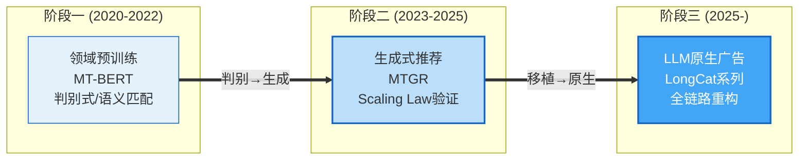
```mermaid
graph LR
    subgraph "阶段一 (2020-2022)"
        P1["领域预训练<br/>MT-BERT<br/>判别式/语义匹配"]
    end

    subgraph "阶段二 (2023-2025)"
        P2["生成式推荐<br/>MTGR<br/>Scaling Law验证"]
    end

    subgraph "阶段三 (2025-)"
        P3["LLM原生广告<br/>LongCat系列<br/>全链路重构"]
    end

    P1 ==>|"判别→生成"| P2 ==>|"移植→原生"| P3

    style P1 fill:#E3F2FD,stroke:#1565C0
    style P2 fill:#BBDEFB,stroke:#1565C0,stroke-width:2px
    style P3 fill:#42A5F5,stroke:#1565C0,color:#fff,stroke-width:2px
```

**阶段一：领域预训练（2020-2022）**。以MT-BERT为代表（详见第2.4节），核心思路是将通用预训练模型适配到广告领域任务。MT-BERT在搜索广告语义匹配中验证了预训练范式的有效性，但其本质仍是判别式模型——对Query-Ad对进行二分类，未涉及生成能力。从大模型视角看，MT-BERT的局限性体现在：（1）模型规模受限于在线推理延迟（双塔模型4.0ms），难以进一步scale-up；（2）预训练任务（点击预测）与下游任务（相关性判断）之间存在目标偏差；（3）仅处理文本模态，未覆盖商户图片、用户行为序列等多模态信息。

**阶段二：生成式推荐与Scaling Law验证（2023-2025）**。MTGR（详见第4.5节）标志着从判别式到生成式范式的转型。从大模型发展角度看，MTGR的核心意义不仅在于架构创新，更在于首次在美团LBS场景中验证了推荐系统的Scaling Law——推理FLOPs从传统DLRM的不足1 GFLOPs扩展到55.76 GFLOPs（最大实验版本137.87 GFLOPs），离线指标持续获得增益。这一发现与NLP领域的Scaling Law（Kaplan et al., 2020）形成呼应，但也揭示了推荐系统scale-up的独特瓶颈：稀疏参数（Embedding表）与稠密参数（Transformer层）的协同扩展问题、变长序列的计算效率问题、以及LBS稀疏候选集对数据密度的制约。

**阶段三：LLM原生广告应用（2025-）**。当前正在从"将大模型技术移植到广告系统"转向"以LLM能力原生重构广告链路"的新阶段（详见9.2-9.4节）。

### 9.2 LLM驱动的广告理解与生成

大型语言模型（LLM）的涌现能力为广告系统的多个核心环节提供了变革性工具：

**（1）LLM-based用户画像构建**。传统用户画像依赖统计特征（如品类偏好分布、消费频次）和手工标签体系，难以捕捉用户需求的细粒度语义。LLM-based用户画像通过将用户行为序列（浏览、点击、下单、评价）转化为自然语言描述，利用LLM的语义理解能力生成结构化的用户兴趣画像。阿里妈妈已在此方向进行了探索，利用通义千问对用户行为进行语义摘要，生成包含消费动机、价格敏感度、品牌偏好等维度的用户画像文本，用于广告定向和创意个性化。在美团LBS场景中，LLM-based画像有望捕捉传统特征难以表达的复合意图——例如"周末想带家人去环境好、有儿童设施的中高端餐厅"这类结构化标签难以覆盖的需求。

**（2）广告文案自动生成与优化**。美团已有Seq2Seq/Transformer基础的创意生成体系（第6.2节），LLM可进一步实现：基于商户特色和用户画像的个性化文案生成（如针对"健身爱好者"突出低卡菜品）、A/B文案的自动变体生成与效果预测、以及多语言/多风格文案的批量化生产。Google的Performance Max广告产品已将Gemini集成到创意生成流程中，实现了从广告主简要描述到完整广告素材的端到端生成。

**（3）LLM广告内容审核与合规**。广告审核是广告系统中人力成本最高的环节之一。LLM的语义理解和推理能力可用于：虚假宣传检测（如识别"全网最低价"等绝对化用语）、敏感内容识别（如医疗广告的资质合规检查）、竞品关键词侵权判定等。相比基于关键词匹配和分类模型的传统审核方案，LLM能够理解上下文语义和隐含意图，在模糊边界案例（如隐喻式虚假宣传）上的判断能力显著更强。

**（4）Query理解与意图识别增强**。LLM的语义理解能力可用于搜索广告的query改写、意图分类和相关性判断，补充MT-BERT在长尾query和新兴表达上的覆盖不足。

### 9.3 多模态大模型在广告中的应用前景

多模态大模型（如GPT-4V/o系列、Gemini等）为广告系统打开了新的能力空间：

- **广告图文联合理解**：结合视觉和语言能力，实现对广告素材的全面质量评估——不仅判断文案质量，还能评估图片吸引力、图文一致性、品牌调性匹配度等。VIER[^vier2024]已展示了视觉信息对搜索广告检索的增强效果，多模态大模型可将这一思路扩展到全链路。
- **商户视觉内容自动生成**：基于商户的菜品图片、环境照片等素材，自动生成适配不同广告位尺寸和风格的创意图片。美团的DET（第6.4节）在布局生成方面已有实践，多模态生成模型可进一步实现内容级别的自动创作。
- **视频广告素材生成**：美团在LongCat-Video等视频生成方面的基础能力[^meituan_algo_page]，有望应用于短视频广告素材的自动化生产——从商户图片和文字描述生成15-30秒的推广视频。

### 9.4 美团基础大模型能力与广告赋能

美团在基础大模型领域的持续投入为广告系统的智能化升级提供了技术底座。LongCat系列模型（LongCat-Flash-Chat、LongCat-Flash-Thinking、LongCat-Flash-Omni等）[^meituan_algo_page]覆盖了对话、推理、多模态等基础能力，视频生成（LongCat-Video）和Agent评测（VitaBench）则面向更前沿的应用场景。这些能力与广告系统的结合路径包括：LongCat-Chat用于广告策略的自然语言交互（帮助中小商户通过对话描述投放需求，系统自动转化为竞价策略和定向条件）、LongCat-Thinking用于复杂广告优化问题的推理求解、LongCat-Omni用于多模态广告内容的统一理解与生成。

### 9.5 业界大模型广告应用对比

| 维度 | 美团 | 阿里妈妈 | 字节跳动 | Google | Meta |
|------|------|----------|----------|--------|------|
| **推荐系统范式** | MTGR混合式（保留交叉特征） | LUM堆叠式（LLM增强传统模型） | HLLM层次化LLM | LLM辅助式 | GR纯生成式 |
| **预训练语义匹配** | MT-BERT + VIRT蒸馏 | CoLT / BERT4Rec | — | — | — |
| **LLM用户画像** | 探索中 | 通义千问语义摘要 | 行为序列语义化 | — | — |
| **LLM创意生成** | NLG基础 + LLM升级中 | M6/通义千问创意 | AIGC素材 | Gemini + P-Max | Advantage+ Creative |
| **LLM广告审核** | 潜在方向 | 通义千问审核辅助 | — | Gemini审核 | — |
| **基础大模型** | LongCat系列 | 通义千问 | 豆包/云雀 | Gemini | LLaMA |
| **核心差异** | LBS场景定制化 | 电商全链路LLM化 | 多模态内容理解 | 跨产品整合 | 开源生态+Scaling |

---

## 10. 业界对比分析

### 10.1 综合对比框架

| 维度 | 美团 | 阿里妈妈 | 字节跳动 | 腾讯广告 | 快手 | 百度凤巢 | Google | Meta |
|------|------|----------|----------|----------|------|----------|--------|------|
| **业务场景** | 本地生活LBS | 电商 | 短视频/信息流 | 社交+内容 | 短视频 | 搜索 | 搜索+展示 | 社交+信息流 |
| **核心挑战** | 候选集稀疏、时空依赖 | 海量SKU、长尾分布 | 多模态理解、内容生态 | 社交关系建模 | 内容消费双侧 | Query理解、知识增强 | 跨平台归因 | 隐私计算 |
| **CTR模型** | DPIN、SRP4CTR | DIN/DIEN/SIM/COLD | 大规模Transformer | DCAF/OPAL | PPNet/LHUC | ERNIE-enhanced Phoenix | Wide&Deep | DLRM |
| **多任务** | HiNet、AdaScene | ESMM/AITM | MetaBalance | PLE | Multi-Domain MoE | 多目标MoE+知识蒸馏 | MMoE | MTL-DLRM |
| **推荐范式** | MTGR混合式 | LUM堆叠式 | HLLM堆叠式 | 特征增强式 | OneRec纯生成式 | ERNIE语义增强式 | LLM辅助式 | GR纯生成式 |
| **创意优化** | NLG+智能设计+DET | 鹿班/AI设计 | 自动化素材+AIGC | 智能创意 | 短视频智能剪辑 | 创意工具+文心 | P-Max创意 | 动态创意+Advantage+ |
| **系统特色** | TorchRec+Fused HSTU | XDL/PAI | Monolith | Angel | KwaiRec/分布式GPU | PaddlePaddle/飞桨 | TFX | PyTorchRec/TorchRec |

### 10.2 美团广告算法的独特定位

**1) LBS约束下的技术创新**：美团是少数以LBS为核心的广告系统，在位置偏差建模（DPIN）、时空注意力（Trilateral Spatiotemporal Attention）、异构混排等方面形成了独特的技术壁垒。

**2) 混合架构的务实路线**：在生成式推荐大潮中，MTGR选择保留交叉特征的混合架构，而非追随Meta GR的纯生成式路线。这反映了LBS场景下"重复消费"为主的用户行为特性——交叉特征对捕捉用户的高频回购模式至关重要。

**3) 多场景多任务的层次化方法论**：从HiNet的层次化解耦到AdaScene的自适应知识迁移，美团在多场景多任务建模方面形成了系统化的方法论体系。

**4) 工程与算法的深度融合**：从TensorFlow Serving优化到MTGR的Fused HSTU Kernel和H2D优化，体现了算法创新必须与系统工程协同推进的实践理念。

### 10.3 关键技术维度横向深度对比

本节选取三个在广告/推荐系统中最具争议性和分化性的技术维度，对各公司的方案进行深度横向分析，揭示技术路线选择背后的业务逻辑和工程约束。

#### 10.3.1 维度一：生成式推荐架构路线之争

生成式推荐（Generative Recommendation）是2024-2025年推荐系统领域最重要的技术趋势，核心问题是：如何将Transformer的Scaling Law引入推荐系统。各公司在架构选择上出现了明显分化：

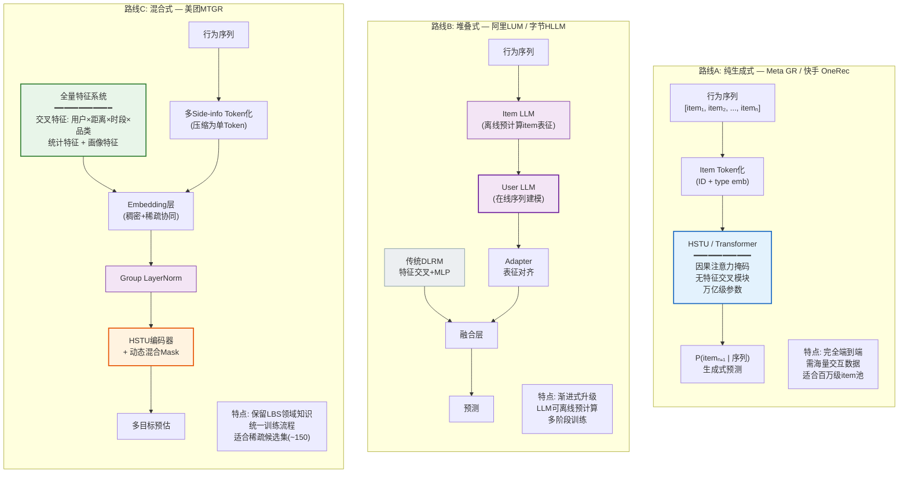
```mermaid
graph TB
    subgraph "路线A: 纯生成式 — Meta GR / 快手 OneRec"
        direction TB
        G_SEQ["行为序列<br/>[item₁, item₂, ..., itemₙ]"] --> G_TOK["Item Token化<br/>(ID + type emb)"]
        G_TOK --> G_HSTU["HSTU / Transformer<br/>━━━━━━━━━━━━<br/>因果注意力掩码<br/>无特征交叉模块<br/>万亿级参数"]
        G_HSTU --> G_OUT["P(itemₙ₊₁ | 序列)<br/>生成式预测"]
        G_LABEL["特点: 完全端到端<br/>需海量交互数据<br/>适合百万级item池"]
    end

    subgraph "路线B: 堆叠式 — 阿里LUM / 字节HLLM"
        direction TB
        S_SEQ["行为序列"] --> S_ITEM["Item LLM<br/>(离线预计算item表征)"]
        S_ITEM --> S_USER["User LLM<br/>(在线序列建模)"]
        S_USER --> S_ADAPT["Adapter<br/>表征对齐"]
        S_FEAT["传统DLRM<br/>特征交叉+MLP"] --> S_MERGE["融合层"]
        S_ADAPT --> S_MERGE
        S_MERGE --> S_OUT["预测"]
        S_LABEL["特点: 渐进式升级<br/>LLM可离线预计算<br/>多阶段训练"]
    end

    subgraph "路线C: 混合式 — 美团MTGR"
        direction TB
        M_SEQ["行为序列"] --> M_TOK["多Side-info Token化<br/>(压缩为单Token)"]
        M_FEAT["全量特征系统<br/>━━━━━━━━━━━━<br/>交叉特征: 用户×距离×时段×品类<br/>统计特征 + 画像特征"] --> M_EMB["Embedding层<br/>(稠密+稀疏协同)"]
        M_TOK --> M_EMB
        M_EMB --> M_GLN["Group LayerNorm"]
        M_GLN --> M_HSTU["HSTU编码器<br/>+ 动态混合Mask"]
        M_HSTU --> M_OUT["多目标预估"]
        M_LABEL["特点: 保留LBS领域知识<br/>统一训练流程<br/>适合稀疏候选集(~150)"]
    end

    style G_HSTU fill:#E3F2FD,stroke:#1565C0,stroke-width:2px
    style S_ITEM fill:#F3E5F5,stroke:#6A1B9A
    style S_USER fill:#F3E5F5,stroke:#6A1B9A,stroke-width:2px
    style S_FEAT fill:#ECEFF1,stroke:#78909C
    style M_HSTU fill:#FFF3E0,stroke:#E65100,stroke-width:2px
    style M_FEAT fill:#E8F5E9,stroke:#2E7D32,stroke-width:2px
    style M_GLN fill:#F3E5F5,stroke:#6A1B9A
```

**（1）纯生成式路线：Meta GR & 快手 OneRec**

Meta的**GR（Generative Recommenders）**（Zhai et al., ICML 2024[^zhai2024gr]）是纯生成式推荐的开创性工作：
- **架构**：基于HSTU（Hierarchical Sequential Transduction Unit），完全抛弃传统DLRM的特征交叉模块，将推荐建模为"给定用户行为序列，生成下一个交互item"的序列生成问题。
- **核心主张**：在足够大的模型和数据规模下，显式特征交叉是不必要的——Transformer的自注意力机制可以隐式学习所有必要的特征交互。
- **实验证据**：在Meta内部数据集上，当模型规模达到万亿参数时，GR在所有指标上超越了传统DLRM+交叉特征的方案。

快手的**OneRec**系统[^onerec2024]遵循类似路线：
- **架构**：纯Transformer编码器，统一建模用户的多类型行为序列（点击、播放完成、点赞、分享等），不依赖手工特征工程。
- **关键设计**：采用多行为类型的统一Token化方案，不同交互类型通过type embedding区分；使用因果注意力掩码保证时序一致性。
- **适用场景**：短视频推荐场景中item空间巨大（日均数百万新视频）、用户行为序列密集（日均数百次交互），为纯生成式模型提供了充足的训练信号。

**（2）堆叠式路线：阿里 LUM & 字节 HLLM**

阿里的**LUM（Large User Model）**[^lum2024]采用"LLM增强传统推荐"的堆叠式架构：
- **架构**：底层保留传统推荐模型（含特征交叉），上层叠加预训练的大语言模型作为用户行为的语义编码器。两层通过适配器（Adapter）连接，分阶段训练。
- **核心思路**：利用LLM的语义理解能力增强行为序列中的item表征，但不替代传统的特征交叉和多任务架构。
- **优势**：对现有系统改动小，可渐进式升级；LLM部分可离线预计算，不增加在线推理负担。
- **局限**：多阶段训练流程复杂，LLM与推荐模型之间可能存在表征空间不对齐问题。

字节跳动的**HLLM（Hierarchical Large Language Model for Recommendation）**（Chen et al., 2024[^hllm2024]）：
- **架构**：两层LLM结构——Item LLM负责将item的多模态特征（标题、封面截帧文本描述等）编码为统一表征，User LLM负责在item表征序列上建模用户兴趣演化。
- **关键创新**：Hierarchical设计使得Item LLM可以离线预计算并缓存item embedding，只有User LLM需要在线推理，大幅降低了在线计算成本。
- **公开效果**：在字节内部短视频推荐场景实验中，HLLM在多个离线指标上超越了传统的DIN/SIM系列模型。

**（3）混合式路线：美团 MTGR**

美团的**MTGR**[^meituan_mtgr]选择了介于纯生成式和堆叠式之间的混合路线：
- **架构**：以HSTU为核心序列编码器（继承GR的生成式思想），但保留DLRM的全量特征系统（包括手工交叉特征、统计特征等）。
- **核心权衡**：美团认为在LBS场景下，交叉特征（如"用户×商户距离×时段×品类"）承载了不可替代的领域知识，纯生成式模型需要极大的数据量才能隐式学到这些交互模式；而美团单城市候选集仅约150个门店，数据密度远低于Meta或快手。
- **实验证据**：消融实验表明，去除交叉特征导致CTCVR GAUC下降0.8-1.2个百分点，证实了交叉特征在LBS场景中的不可替代性[^meituan_mtgr]。

**（4）各路线综合对比**

| 对比维度 | 纯生成式(GR/OneRec) | 堆叠式(LUM/HLLM) | 混合式(MTGR) |
|----------|---------------------|-------------------|--------------|
| **特征工程依赖** | 无（完全端到端） | 底层保留 | 全量保留 |
| **Scaling效率** | 最高（单一模型scale） | 中（多阶段训练） | 中高（统一训练） |
| **对数据密度要求** | 极高（需海量交互） | 中等 | 中等 |
| **适用候选集规模** | 大（百万级item） | 大到中 | 中到小（百级门店） |
| **工程改造成本** | 最高（重构全链路） | 低（增量叠加） | 中（核心模块重构） |
| **领域知识注入** | 困难（隐式学习） | 容易（保留特征层） | 容易（显式特征） |
| **代表性公开效果** | Meta: 全指标超DLRM | 字节HLLM: 离线+1-3% AUC | MTGR: GAUC+2.88pp, 订单+1.22% |
| **最佳适用场景** | 超大规模、密集交互 | 现有系统渐进升级 | LBS/稀疏候选集 |

**路线选择的根本分歧**在于对"特征工程是否可被模型规模替代"这一问题的不同判断。Meta和快手拥有日均数十亿交互的数据规模，支撑了纯生成式模型隐式学习特征交互的假设；而美团面临LBS约束下的数据稀疏性，选择通过显式特征注入领域知识是更务实的工程决策。

#### 10.3.2 维度二：多任务/多场景建模方法论

多任务/多场景建模是广告系统的核心挑战之一——广告系统需要同时优化多个目标（CTR/CVR/GMV等），且往往服务于多个异质场景。各公司在此方向形成了不同的方法论体系：

**（1）方案概览**

| 方案 | 提出方 | 核心机制 | 场景/任务处理方式 | 公开会议 |
|------|--------|----------|-------------------|----------|
| **HiNet** | 美团 | 层次化信息提取（场景层+任务层） | 场景Expert+SAN注意力 → 任务CGC | ICDE 2023[^hinet2023] |
| **STAR** | 阿里 | 星型拓扑网络 | 共享中心网络 + 场景辅助网络 | CIKM 2021[^star2021] |
| **PLE** | 腾讯 | 渐进式分层提取 | 共享Expert + 任务Expert + 多层门控 | RecSys 2020[^tang2020ple] |
| **MetaBalance** | 字节 | 梯度平衡优化 | 元学习自适应任务梯度权重 | WWW 2022[^metabalance2022] |
| **PPNet** | 快手 | 参数个性化网络 | Gate机制实现用户级参数化 | — |

**（2）核心机制差异**

**HiNet（美团）的层次化解耦**：HiNet的核心创新在于将"场景差异"和"任务差异"解耦到两个独立的特征空间中逐层处理。场景提取层通过SAN（场景感知注意力）显式建模跨场景信息流动的方向性——例如"到店餐饮"场景的信息对"到店休闲"有正向贡献，但反向贡献可能不同。这种非对称注意力设计捕捉了场景关系的方向性，是HiNet相对于STAR对称共享结构的关键区别。在美团到店6个推荐场景的实验中，HiNet在CTR AUC上相比PLE平均提升0.2-0.4个百分点，相比STAR提升0.1-0.3个百分点[^hinet2023]。

**STAR（阿里）的星型拓扑**（Sheng et al., CIKM 2021[^star2021]）：STAR采用"一个共享中心网络 + N个场景辅助网络"的星型拓扑结构。每个场景的最终参数通过中心网络参数与场景辅助参数的element-wise乘积得到（而非加法），这使得参数空间在各场景间既共享基础语义又保持差异化。STAR的优势在于参数效率——场景辅助网络规模很小，适合场景数量极多（阿里有数百个投放场景）的情况。但STAR假设场景间信息流动是对称的（通过共享中心隐式传递），未显式建模场景间的方向性关系。

**PLE（腾讯）的渐进式提取**：PLE通过多层堆叠的Expert网络实现信息的渐进式提取——底层Expert捕捉通用特征，高层Expert逐步分化为任务特定表征。PLE首次提出任务特定Expert与共享Expert并存的CGC（Customized Gate Control）结构，有效缓解了MMoE中所有Expert被某一主导任务垄断的问题。PLE在腾讯视频推荐的多目标优化中验证了跷跷板问题的缓解效果——VCR（Video Completion Rate）和VTR（Video Through Rate）实现了同时提升。

**MetaBalance（字节）的梯度级优化**（He et al., WWW 2022[^metabalance2022]）：MetaBalance不改变模型架构，而是在训练过程中通过元学习（Meta-Learning）自适应调整各任务的梯度权重。核心思想是在每个训练步骤中，通过在验证集上评估各任务损失对梯度方向的敏感性，动态计算最优的任务权重组合。MetaBalance的优势在于模型无关（model-agnostic）——可以叠加在任何多任务架构之上，与HiNet/PLE等结构正交互补。

**PPNet（快手）的参数个性化**：快手的PPNet（Parameter Personalized Network）通过Gate机制为每个用户生成个性化的网络参数（类似于LHUC——Learning Hidden Unit Contributions），实现了用户级别的模型适配。这种方法在快手"千人千模"的个性化推荐中表现优异，但其计算开销随用户数线性增长，适合快手短视频场景中用户行为密集、需要极致个性化的需求。

**（3）适用场景与选择逻辑**

| 选择因素 | HiNet适用 | STAR适用 | PLE适用 | MetaBalance适用 |
|----------|-----------|----------|---------|-----------------|
| 场景数量 | 中等（5-20） | 大量（50-500+） | 少量（2-10） | 任意 |
| 场景异质性 | 高（需方向性建模） | 中（可对称假设） | 中 | 任意 |
| 任务冲突程度 | 中到高 | 低到中 | 高（跷跷板严重） | 高 |
| 工程复杂度 | 中（两层结构） | 低（参数高效） | 中 | 低（仅改训练） |
| 与其他方法兼容性 | 可叠加MetaBalance | 可叠加 | 基础框架 | 叠加在任何架构上 |

#### 10.3.3 维度三：CTR位置偏差建模

位置偏差（Position Bias）是搜索/推荐广告CTR预估的经典问题——用户对高位置展示的广告天然有更高的点击倾向，与广告本身质量无关。准确解耦位置因素对CTR预估和拍卖公平性至关重要。各公司在此问题上采用了不同的建模思路：

**（1）美团 DPIN：深度位置交互网络**

DPIN（Deep Position-wise Interaction Network, Huang et al., SIGIR 2021[^dpin2021]）的核心创新在于认为位置偏差不是简单的加性或乘性因子，而是与上下文特征存在复杂交互：
- **建模思路**：将位置信息与周围候选的上下文特征（如同屏展示的其他广告品类、评分等）进行深度交互建模，学习"位置在特定上下文下的偏差模式"。
- **技术实现**：位置Embedding与上下文特征通过多层交叉网络融合，产生位置感知的偏差修正项。
- **场景特殊性**：在LBS搜索中，位置偏差受距离排序、品类聚集等因素调制——例如用户搜索"火锅"时，第3位的高评分店可能比第1位的低评分店获得更多点击，位置偏差的模式与纯电商搜索不同。
- **效果**：离线AUC提升显著，在线CTR预估准确性提升使eCPM排序更合理[^dpin2021]。

**（2）阿里 PAL：位置感知学习**

阿里的**PAL（Position-Aware Learning）**（Guo et al., 2019[^guo2019pal]）采用因果推断视角处理位置偏差：
- **建模思路**：将位置视为"treatment"，CTR视为"outcome"，通过因果模型（具体采用逆倾向加权IPW或双塔解耦）分离位置因素对CTR的因果效应。
- **技术实现**：训练时引入位置特征，推理时将位置设为默认值（如统一设为第1位），从而得到去偏后的"内在CTR"。PAL使用双塔结构——一塔学习position-dependent的偏差，另一塔学习position-independent的广告内在质量。
- **适用场景**：在阿里电商搜索中，候选集极大（数万级），位置偏差相对稳定可预测，适合加性解耦假设。
- **与DPIN的核心区别**：PAL假设位置偏差与广告特征条件独立（即位置对所有广告的影响模式一致），DPIN则放松了这一假设，认为位置偏差与上下文交互相关。PAL的优势是推理时完全去除位置因素（无需位置信息），DPIN的优势是建模精度更高但推理时仍需考虑位置交互。

**（3）经典 PBM 及其扩展**

**PBM（Position-Based Model）**（Craswell et al., 2008[^craswell2008pbm]）是位置偏差建模的经典框架，假设CTR可分解为：

```
P(click | ad, pos) = P(examine | pos) × P(click | examine, ad)
```

即用户首先以与位置相关的概率"审视"（examine）该位置，然后在审视条件下以与广告质量相关的概率点击。各公司对PBM的扩展方向不同：

- **腾讯广告**：采用PBM的乘性分解结构，在模型训练中将examine概率和click概率分别参数化，通过EM算法交替优化。这种方法在微信朋友圈广告中验证有效——朋友圈信息流的位置分布较为固定，适合PBM的独立性假设。
- **百度凤巢**：在搜索广告中扩展PBM为上下文感知版本——examine概率不仅依赖位置，还依赖Query类型（导航类Query的位置偏差远强于信息类Query）和广告样式（大图广告比文字广告的examine概率更高）。
- **Google**：在GSP机制分析中将PBM作为理论工具，推导出位置偏差下GSP拍卖的修正均衡条件[^varian2007gsp]。

**（4）三种范式的定量对比**

| 对比维度 | DPIN（美团） | PAL（阿里） | PBM及扩展 |
|----------|-------------|-------------|-----------|
| **理论假设** | 位置偏差与上下文交互 | 位置与广告质量条件独立 | examine-click二阶段独立 |
| **建模复杂度** | 高（深度交互网络） | 中（双塔解耦） | 低（概率分解） |
| **推理开销** | 需上下文信息 | 无需位置信息 | 无需位置信息 |
| **适用候选集规模** | 中小（百级） | 大（万级） | 任意 |
| **位置偏差的精细度** | 上下文条件位置偏差 | 全局位置偏差 | 全局/Query级 |
| **对排序公平性的影响** | 高（精确解耦提升拍卖效率） | 中（加性去偏） | 中 |
| **典型公开AUC提升** | +0.2-0.5%（SIGIR 2021） | +0.1-0.3% | baseline |

**核心insight**：位置偏差建模方法的选择与候选集规模高度相关。在美团LBS搜索的稀疏候选集中（约150个门店），每个位置的上下文组合变化有限但影响显著，值得用复杂模型精确建模；在阿里电商搜索的海量候选集中，全局位置偏差的统计规律足够稳定，简洁的加性去偏即可获得大部分收益。

### 10.4 美团广告算法的独特定位总结

基于上述三个维度的深度对比，美团广告算法的技术定位可以更精确地表述为：

1. **"LBS-native"的技术路线选择者**：美团的每一项关键技术决策（MTGR保留交叉特征、DPIN的上下文交互位置偏差、HiNet的场景方向性建模）都根植于LBS场景的独特约束——候选集稀疏、时空强依赖、领域知识价值高。这使得美团的技术选择与拥有海量数据的Meta/快手形成了鲜明分化。

2. **"精度优先"而非"规模优先"的Scaling策略**：在生成式推荐的Scaling路径上，Meta追求模型参数规模的极致扩展（万亿参数），而美团MTGR追求在有限候选集上的预估精度最大化（保留交叉特征+适度scale模型规模至55.76 GFLOPs）。

3. **"层次化解耦"的系统设计哲学**：从HiNet的场景-任务两层解耦，到MTGR的静态特征-动态序列-曝光样本的三层Mask设计，再到AdaScene的全局-场景知识迁移，美团一贯采用层次化解耦的设计哲学处理复杂系统中的多粒度问题。

### 10.5 美团与各公司的重点差异分析

**vs 阿里妈妈**：阿里在电商广告领域积累最深，尤其在智能出价（Auto-bidding: USCB/AIGB）、用户行为序列建模（DIN→DIEN→SIM→COLD）、实时学习（COLD的分钟级更新）方面保持学术界领先地位。在多场景建模上，阿里STAR的参数效率适合其数百个投放场景的规模需求，而美团HiNet的方向性场景注意力更适合场景间异质性大但数量有限的LBS业务。在位置偏差上，阿里PAL的条件独立假设简化了推理流程，美团DPIN则追求更精确的上下文交互建模。两者的根本差异在于：阿里面对海量候选和稀疏点击率（电商CTR通常<1%），追求大规模高效处理；美团面对稀疏候选但较高点击率（LBS搜索CTR通常5-15%），追求小候选集上的极致预估精度。

**vs 字节跳动**：字节在超大规模模型训练（Monolith支撑万亿参数级别的在线Embedding更新）和多模态理解（视频+文本+音频联合建模）方面投入巨大。在生成式推荐路线上，字节HLLM的堆叠式架构选择反映了其"渐进升级"策略——不重构现有系统，而是在现有推荐模型之上叠加LLM能力。相比之下，美团MTGR选择了更激进的"核心重构"路线——用HSTU替换传统排序模型的核心编码器。在多任务优化上，字节MetaBalance关注训练过程中的梯度平衡，与美团HiNet/阿里STAR等关注模型结构的方法正交互补——理论上MetaBalance可以叠加在HiNet之上进一步提升。

**vs 腾讯广告**：腾讯在多任务学习（PLE）方面有奠基性贡献，美团HiNet显式继承了PLE的CGC模块并在其上加入了场景级层次化结构。两者的关键区别在于：PLE处理的是单一场景内的多任务冲突，HiNet进一步处理跨场景的信息共享与隔离问题。腾讯广告的独特优势在于社交图谱信息（微信关系链、QQ好友）对广告定向的增强——这是其他平台不具备的独占数据资产。

**vs 快手**：快手的OneRec系统与Meta GR路线一致，追求纯Transformer架构的端到端推荐。快手选择纯生成式路线的合理性在于：短视频场景中item空间极大（日均百万级新视频）、用户行为序列极长（日均数百次滑动），为模型提供了充足的训练信号，使得显式特征交叉的边际价值较低。美团MTGR强调交叉特征不可替代则源于相反的数据条件——LBS场景候选集稀疏（约150门店）、用户行为稀疏（日均数次到店消费），纯生成式模型在此条件下难以隐式学到"距离×时段×品类"等关键交互。此外，快手的PPNet通过用户级参数化实现极致个性化，这在其高频交互场景中效果显著，但在美团低频消费场景中数据支撑不足。

**vs 百度凤巢**：百度在搜索广告领域积累深厚，其技术特色体现在：（1）基于ERNIE系列预训练模型的深度语义理解——凤巢将ERNIE应用于Query-Ad语义匹配、广告质量评估等环节，在中文NLP语义理解方面的积累优于美团MT-BERT；（2）知识图谱增强的广告理解——百度的知识增强技术（Knowledge-enhanced）将百度百科等知识库信息注入广告理解模型；（3）PaddlePaddle/飞桨生态——百度构建了完整的深度学习框架生态，在大规模稀疏参数训练方面有PaddleRec等专项优化。美团与百度的核心差异在于搜索场景的本质不同：百度搜索广告面向开放域Query（任何主题），需要极强的泛化语义理解；美团搜索广告面向领域受限的本地生活Query（餐饮、美容等品类），需要更强的LBS感知和商户结构化信息利用。

**vs Google/Meta**：Google是广告技术的理论奠基者（GSP机制分析、Wide&Deep、MMoE），Meta是推荐系统工程化和Scaling的标杆（DLRM、TorchRec、GR万亿参数验证）。美团在这些基础架构上进行了面向LBS场景的深度定制——MTGR基于Meta的HSTU和TorchRec框架但保留了交叉特征，HiNet基于Google MMoE的Expert思想但加入了层次化场景解耦。从全球视角看，美团的独特贡献在于证明了"在候选集稀疏、数据密度受限的垂直领域中，领域知识（通过特征工程注入）与模型规模扩展是互补而非替代关系"。

---

## 11. 结论与展望

### 11.1 核心发现

本综述系统梳理了美团广告算法在八个核心技术方向的研究进展，得出以下核心发现：

1. **LBS约束是核心差异化因素**：美团广告系统的技术创新很大程度上围绕LBS场景的独特约束展开——候选集稀疏促使了异构混排技术的发展，时空依赖性催生了时空注意力网络，地理位置的强影响推动了位置偏差的深度建模。

2. **多场景多任务的层次化建模已成方法论**：从HiNet到AdaScene，美团形成了"场景级信息提取→任务级信息提取"的两层解耦范式，并在自适应知识迁移和场景聚合方面有系统性的技术积累。

3. **生成式推荐的务实路线**：MTGR选择混合架构而非纯生成式架构，保留交叉特征以适应LBS场景的高频回购特性，同时验证了推荐系统中Scaling Law的有效性。

4. **预训练技术在搜索广告中已成熟落地**：MT-BERT + VIRT知识蒸馏方案实现了精度与效率的平衡，为工业级预训练模型部署提供了参考。

5. **工程与算法协同进化**：从TensorFlow Serving的6ms延迟优化到MTGR的Fused HSTU Kernel和推理成本降低12%，系统工程能力是算法创新落地的关键。

### 11.2 存在的不足与挑战

1. **竞价方向公开成果较少**：相比阿里妈妈在Auto-bidding领域的系统性研究（USCB、AIGB等），美团在竞价机制设计和智能出价方面的公开论文和博客较少，尽管其OR+ML混合推理框架和异构竞价策略显示了内部技术积累。
2. **在线学习实时性有待提升**：相比阿里COLD的实时在线学习和字节Monolith的在线Embedding更新，美团在模型实时性方面的公开工作不多。
3. **大模型广告应用尚在早期**：虽然有MT-BERT和MTGR的基础，但LLM在广告创意生成、用户意图理解等方面的深入应用仍处于探索阶段。
4. **隐私计算与数据合规**：在DSP外投场景下，跨平台数据合规使用和联邦学习技术的应用尚缺乏公开讨论。

### 11.3 未来方向展望

1. **端到端生成式广告系统**：从召回、粗排、精排到竞价，全链路采用生成式架构，实现更高效的端到端优化。MTGR团队已提出将粗排和精排合并为单阶段打分系统的构想[^meituan_mtgr]。
2. **多模态广告理解与生成**：融合文本、图像、视频等多模态信息，实现广告内容的全面理解和自动生成。VIER[^vier2024]和DET[^det2024]的工作是重要起步。
3. **LLM驱动的广告策略**：利用LLM的推理能力辅助广告策略制定，如自动化定向、智能出价策略推荐等。
4. **多业务统一建模**：构建跨外卖、到店、酒旅等业务线的统一用户表征和广告模型，基于MTGR的User-Center生成式框架和KV Cache实现多场景共享[^meituan_mtgr]。
5. **强化学习在广告决策中的深化**：美团已在离线多智能体强化学习方面有探索（MARL, 美团技术博客, 2025[^meituan_marl]），未来可扩展至广告预算分配、出价策略、推荐策略等动态决策场景。

---

## 12. 参考文献

[^friedman2001]: Friedman, J. H. (2001). Greedy function approximation: a gradient boosting machine. *Annals of Statistics*, 29(5), 1189-1232.

[^rendle2010]: Rendle, S. (2010). Factorization machines. In *Proceedings of the 2010 IEEE International Conference on Data Mining (ICDM)*, pp. 995-1000.

[^cheng2016]: Cheng, H. T., Koc, L., Harmsen, J., et al. (2016). Wide & deep learning for recommender systems. In *Proceedings of the 1st Workshop on Deep Learning for Recommender Systems*, pp. 7-10.

[^zhou2018din]: Zhou, G., Zhu, X., Song, C., et al. (2018). Deep interest network for click-through rate prediction. In *Proceedings of the 24th ACM SIGKDD International Conference on Knowledge Discovery & Data Mining (KDD)*, pp. 1059-1068.

[^ma2018mmoe]: Ma, J., Zhao, Z., Yi, X., et al. (2018). Modeling task relationships in multi-task learning with multi-gate mixture-of-experts. In *Proceedings of the 24th ACM SIGKDD International Conference on Knowledge Discovery & Data Mining (KDD)*, pp. 1930-1939.

[^tang2020ple]: Tang, H., Liu, J., Zhao, M., et al. (2020). Progressive layered extraction (PLE): a novel multi-task learning (MTL) model for personalized recommendations. In *Proceedings of the 14th ACM Conference on Recommender Systems (RecSys)*, pp. 269-278.

[^dpin2021]: Huang, J., Hu, K., Tang, Q., Chen, M., Qi, Y., Cheng, J., & Lei, J. (2021). Deep position-wise interaction network for CTR prediction. In *Proceedings of the 44th International ACM SIGIR Conference on Research and Development in Information Retrieval (SIGIR)*, pp. 1885-1889.

[^qi2021cikm]: Qi, Y., Yi, X., et al. (2021). Trilateral spatiotemporal attention network for user behavior modeling in location-based search. In *Proceedings of the 30th ACM International Conference on Information & Knowledge Management (CIKM)*.

[^pi2020sim]: Pi, Q., Bian, W., Zhou, G., et al. (2020). Search-based user interest modeling with lifelong sequential behavior data for click-through rate prediction. In *Proceedings of the 29th ACM International Conference on Information & Knowledge Management (CIKM)*, pp. 2685-2692.

[^zhu2017ocpc]: Zhu, H., Jin, J., Tan, C., et al. (2017). Optimized cost per click in Taobao display advertising. In *Proceedings of the 23rd ACM SIGKDD International Conference on Knowledge Discovery and Data Mining (KDD)*, pp. 2191-2200.

[^hinet2023]: Zhou, J., Cao, X., Li, W., Bo, L., Zhang, K., Luo, C., & Yu, Q. (2023). HiNet: Novel multi-scenario & multi-task learning with hierarchical information extraction. In *Proceedings of the 39th IEEE International Conference on Data Engineering (ICDE 2023)*.

[^zhai2024gr]: Zhai, J., et al. (2024). Actions speak louder than words: Trillion-parameter sequential transducers for generative recommendations. In *Proceedings of the 41st International Conference on Machine Learning (ICML)*.

[^meituan_ctr_deep]: 美团技术团队. (2021). 广告深度预估技术在美团到店场景下的突破与畅想. *美团技术博客*. https://tech.meituan.com/2021/10/14/breakthrough-and-prospect-of-deep-ctr-prediction-in-meituan-ads.html

[^meituan_mixedrank]: 美团技术团队. (2022). 异构广告混排在美团到店业务的探索与实践. *美团技术博客*. https://tech.meituan.com/2022/03/10/exploration-and-practice-of-heterogeneous-ad-mixed-ranking-in-meituan-ads.html

[^meituan_pretrain]: 美团技术团队. (2021). 预训练技术在美团到店搜索广告中的应用. *美团技术博客*. https://tech.meituan.com/2021/12/02/application-of-pre-training-technology-in-meituan-search-ads.html

[^meituan_dsp]: 美团技术团队. (2023). 美团多场景建模的探索与实践. *美团技术博客*. https://tech.meituan.com/2023/09/14/demand-side-platform.html

[^meituan_mtgr]: 美团技术团队. (2025). MTGR：美团外卖生成式推荐Scaling Law落地实践. *美团技术博客*. https://tech.meituan.com/2025/05/19/meituan-generative-recommendation.html

[^meituan_creative]: 美团技术团队. (2019). 大众点评信息流基于文本生成的创意优化实践. *美团技术博客*. https://tech.meituan.com/2019/03/14/information-flow-creative-optimization-practices.html

[^meituan_banner]: 美团技术团队. (2018). AI技术在智能海报设计中的应用. *美团技术博客*. https://tech.meituan.com/2018/12/27/ai-in-banner-design.html

[^meituan_tfserving]: 美团技术团队. (2018). 基于TensorFlow Serving的深度学习在线预估. *美团技术博客*. https://tech.meituan.com/2018/10/11/tfserving-improve.html

[^meituan_tf_dist]: 美团技术团队. (2021). TensorFlow在推荐系统中的分布式训练优化实践. *美团技术博客*. https://tech.meituan.com/2021/12/09/meituan-tensorflow-in-recommender-systems.html

[^meituan_gpu_train]: 美团技术团队. (2022). TensorFlow在美团外卖推荐场景的GPU训练优化实践. *美团技术博客*. https://tech.meituan.com/2022/03/24/tensorflow-gpu-training-optimization-practice-in-meituan-waimai-recommendation-scenarios.html

[^meituan_gpu_retrieval]: 美团技术团队. (2024). 美团外卖基于GPU的向量检索系统实践. *美团技术博客*. https://tech.meituan.com/2024/04/11/gpu-vector-retrieval-system-practice.html

[^meituan_session]: 美团技术团队. (2020). ICDM论文：探索跨会话信息感知的推荐模型. *美团技术博客*. https://tech.meituan.com/2020/12/10/session-based-recommendation-icdm-neurec-workshop-2020.html

[^meituan_or_ml]: 美团技术团队. (2025). OR算法+ML模型混合推理框架架构演进. *美团技术博客*. https://tech.meituan.com/2025/05/12/or-ml-practice.html

[^meituan_marl]: 美团技术团队. (2025). 行为正则化与顺序策略优化结合的离线多智能体学习算法. *美团技术博客*. https://tech.meituan.com/2025/02/21/marl-in-meituan.html

[^meituan_algo_page]: 美团技术博客 - 算法标签页. https://tech.meituan.com/tags/算法.html

[^meituan_annual_report]: 美团. (2024). 美团2023年年度报告. 港交所披露易. https://www1.hkexnews.hk/listedco/listconews/sehk/2024/0426/2024042600037.pdf

[^srp4ctr2024]: Han, R., Li, Q., Jiang, H., Li, R., Zhao, Y., Li, X., & Lin, W. (2024). Enhancing CTR prediction through sequential recommendation pre-training: Introducing the SRP4CTR framework. In *Proceedings of the 33rd ACM International Conference on Information and Knowledge Management (CIKM)*.

[^exit2024]: Huang, L., Li, W., Zhang, C., Wang, J., Yi, X., & Chen, S. (2024). EXIT: An explicit interest transfer framework for cross-domain recommendation. In *Proceedings of the 33rd ACM International Conference on Information and Knowledge Management (CIKM)*.

[^det2024]: Li, Y., Chen, J., Bai, Y., Cheng, J., & Lei, J. (2024). Design element aware poster layout generation. In *Proceedings of the 33rd ACM International Conference on Information and Knowledge Management (CIKM)*.

[^vier2024]: Zhang, Y., Song, Y., Lu, S., Liu, Q., & Wang, X. (2024). VIER: Visual imagination enhanced retrieval in sponsored search. In *Proceedings of the 33rd ACM International Conference on Information and Knowledge Management (CIKM)*.

[^edelman2007gsp]: Edelman, B., Ostrovsky, M., & Schwarz, M. (2007). Internet advertising and the generalized second-price auction: Selling billions of dollars worth of keywords. *American Economic Review*, 97(1), 242-259.

[^varian2007gsp]: Varian, H. R. (2007). Position auctions. *International Journal of Industrial Organization*, 25(6), 1163-1178.

[^varian2014vcg]: Varian, H. R., & Harris, C. (2014). The VCG auction in theory and practice. *American Economic Review*, 104(5), 442-445.

[^despotakis2021first]: Despotakis, S., Ravi, R., & Srinivasan, A. (2021). First-price auctions in online display advertising. *Journal of Marketing Research*, 58(5), 888-907.

[^wen2021uscb]: Wen, H., Zhang, J., Lin, Y., Yang, K., Li, Y., Zhang, Y., ... & Zhu, J. (2021). Unified solution for constrained bidding in online advertising. In *Proceedings of the 27th ACM SIGKDD Conference on Knowledge Discovery & Data Mining (KDD)*, pp. 3860-3868.

[^wen2022aigb]: Guo, J., Huo, Y., Zhang, Z., Wang, T., Yu, C., Xu, J., Zhang, Y., & Zheng, B. (2024). AIGB: Generative auto-bidding via conditional diffusion modeling. In *Proceedings of the 30th ACM SIGKDD Conference on Knowledge Discovery and Data Mining (KDD)*.

[^he2022creater]: Chen, J., Chen, C., Zhang, H., & Tan, Q. (2022). A unified framework for campaign performance forecasting in online display advertising. arXiv preprint arXiv:2202.11877.

[^agarwal2014budget]: Agarwal, D., Ghosh, S., Wei, K., & You, S. (2014). Budget pacing for targeted online advertisements at LinkedIn. In *Proceedings of the 20th ACM SIGKDD International Conference on Knowledge Discovery and Data Mining (KDD)*, pp. 1613-1622.

[^balseiro2015budget]: Balseiro, S. R., & Gur, Y. (2019). Learning in repeated auctions with budgets: Regret minimization and equilibrium. *Management Science*, 65(9), 3952-3968.

[^aggarwal2019autobidding]: Aggarwal, G., Badanidiyuru, A., & Mehta, A. (2019). Autobidding with constraints. In *Proceedings of the 15th International Conference on Web and Internet Economics (WINE)*, pp. 17-30.

[^star2021]: Sheng, X., Zhao, T., Li, J., et al. (2021). One model to serve all: Star topology adaptive recommender for multi-domain CTR prediction. In *Proceedings of the 30th ACM International Conference on Information & Knowledge Management (CIKM)*, pp. 4104-4113.

[^metabalance2022]: He, Y., Feng, X., Cheng, C., Ji, G., Guo, Y., & Caverlee, J. (2022). MetaBalance: Improving multi-task recommendations via adapting gradient magnitudes of auxiliary tasks. In *Proceedings of the ACM Web Conference (WWW)*, pp. 2205-2215.

[^hllm2024]: Chen, J., Chi, L., Peng, B., & Yuan, Z. (2024). HLLM: Enhancing sequential recommendations via hierarchical large language models for item and user modeling. arXiv preprint arXiv:2409.12740.

[^lum2024]: 阿里妈妈技术团队. (2024). LUM: 大规模用户模型在阿里妈妈广告推荐中的实践. 阿里妈妈技术博客.

[^onerec2024]: 快手推荐技术团队. (2024). OneRec：快手推荐系统的纯Transformer架构探索. 快手技术博客.

[^guo2019pal]: Guo, H., Tang, R., Ye, Y., Li, Z., & He, X. (2019). PAL: A position-bias aware learning framework for CTR prediction in live recommender systems. In *Proceedings of the 13th ACM Conference on Recommender Systems (RecSys)*, pp. 452-456.

[^craswell2008pbm]: Craswell, N., Zoeter, O., Taylor, M., & Ramsey, B. (2008). An experimental comparison of click position-bias models. In *Proceedings of the 2008 International Conference on Web Search and Data Mining (WSDM)*, pp. 87-94.

[^wang2018eges]: Wang, J., Huang, P., Zhao, H., Zhang, Z., Zhao, B., & Lee, D. L. (2018). Billion-scale commodity embedding for e-commerce recommendation in Alibaba. In *Proceedings of the 24th ACM SIGKDD International Conference on Knowledge Discovery & Data Mining (KDD)*, pp. 839-848.

[^liu2022monolith]: Liu, Z., Zou, L., Zou, X., Wang, C., Zhang, B., Tang, D., ... & Zhu, J. (2022). Monolith: Real time recommendation system with collisionless embedding table. In *Proceedings of the 16th ACM Conference on Recommender Systems (RecSys)*, pp. 270-279.

[^naumov2019dlrm]: Naumov, M., Mudigere, D., Shi, H. M., Huang, J., Sundaraman, N., Park, J., ... & Smelyanskiy, M. (2019). Deep learning recommendation model for personalization and recommendation systems. arXiv preprint arXiv:1906.00091.
