> 每个职场人都在"销售"——你卖的不是产品，而是你的想法、你的方案、你自己。

## 目录

1. [为什么职场人需要学销售](#ch1)
2. [销售的本质：理解需求，创造价值](#ch2)
3. [卖出你的 Idea：从构思到说服](#ch3)
4. [说服的底层逻辑](#ch4)
5. [向上管理：把方案卖给你的老板](#ch5)
6. [跨部门协作：没有职权时的影响力](#ch6)
7. [求职与晋升：把自己当产品来卖](#ch7)
8. [常见误区与反模式](#ch8)
9. [持续修炼：从刻意练习到自然流露](#ch9)

---

<a id="ch1"></a>
## 1. 为什么职场人需要学销售

### 你已经在"卖"了，只是没意识到

回想一下你上周的工作：

你在周会上提了一个优化方案，希望团队采纳；你写了一封邮件，试图说服产品经理调整需求优先级；你在一对一面谈中向主管解释，为什么你应该负责那个新项目。

这些场景有一个共同点——你都在"卖"东西。不是卖产品，而是在卖你的判断力、你的方案、你对问题的理解。

大多数职场人对"销售"这个词有本能的抵触。一提到销售，脑子里浮现的是电话推销、话术套路、死缠烂打。但真正的销售从来不是这些。**销售的核心是一种能力：让别人理解你的价值，并愿意为此行动。**

这个定义下，每个职场人每天都在做销售——只不过有人做得好，有人做得差，而差距往往决定了职业发展的天花板。

### 同样的能力，不同的结局

让我讲两个真实场景。

**场景一：被埋没的好方案**

陈明是一家互联网公司的后端工程师，工作三年，技术扎实。他发现公司的订单系统在高峰期经常出现超时，于是花了两周业余时间做了一套异步化改造方案：架构图画得清清楚楚，性能预估写得详详细细，甚至连灰度发布的步骤都列好了。

他在技术评审会上打开 PPT，从第一页开始讲："我对现有订单系统做了分析，发现主链路上有三个同步阻塞点……"接下来 20 分钟，他逐页讲解了技术细节。

结果呢？技术总监说"方案不错，先放一放，下个季度再看"。三个月后，另一个团队用类似的思路做了改造，拿了季度最佳项目奖。

陈明的方案有问题吗？没有。他缺的不是技术能力，而是"卖方案"的能力。

**场景二：同一个方案，不同的开场**

如果陈明换一种方式呢？

"上周五大促，订单系统超时率达到了 12%。当天系统处理了约 14 万笔订单，按平均客单价 200 元估算，12% 的超时意味着近 1.7 万笔订单受到影响，折合约 340 万元的流失。我分析了根因，找到了三个关键瓶颈，有一个改造方案可以把超时率降到 1% 以下。改造需要两个人投入三周，把超时率从 12% 降到 1% 以下——也就是说，同等流量下超时订单从 1.7 万笔降到约 1400 笔，每次大促能多挽回近 300 万元的订单。"

同样的技术方案，但开场完全不同。第一种讲的是"我做了什么"，第二种讲的是"公司正在亏多少钱，以及我能帮你挽回多少"。

**第一种是在做技术汇报，第二种是在做销售。** 区别在于：你是在展示自己的工作量，还是在帮对方理解"这件事为什么值得现在就做"。

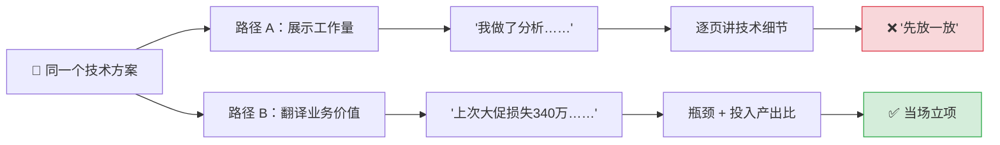

> 📌 **图示要点**：同样的方案，差别在开场的前 30 秒——你选择展示"我做了什么"，还是帮对方看到"不做会亏多少"。

### 销售能力是职场的"隐形分水岭"

你一定见过这样的人：技术能力未必是团队最强的，但总能拿到好项目、好资源、好机会。你也见过另一种人：能力很强，但总觉得自己被低估、不被重视。

这两类人的差距，往往不在专业技能，而在于一项很少被正式教授的能力——**把自己的价值翻译成别人能理解、愿意买单的语言**。

这种能力在职场中处处体现：

| 场景 | "不会卖"的表现 | "会卖"的表现 |
|------|---------------|-------------|
| 推动技术方案 | 详细讲解实现细节 | 先讲业务收益，再讲实现路径 |
| 争取项目资源 | "我们人手不够" | "如果增加两人，Q3 可以提前上线 X 功能，预计带来 Y 收入" |
| 一对一面谈 | 罗列自己做了哪些事 | 说明自己的工作如何推动了团队目标 |
| 跨部门协作 | "这是我们部门的需求" | "这个改动能帮你们部门解决 Z 问题" |
| 求职面试 | 按时间线背诵经历 | 围绕对方的岗位需求组织故事 |

这不是话术技巧，而是一种**思维方式的转换**：从"我做了什么"转向"对方需要什么，我能提供什么"。

### 为什么学校和公司都不教这个？

原因很简单：大多数教育体系和企业培训关注的是"硬技能"——怎么写代码、怎么做设计、怎么分析数据。这些技能有明确的对错标准，容易教，也容易考核。

但"把想法卖出去"这件事，涉及对人的理解、对场景的判断、对语言的组织，没有标准答案，很难用课程的形式教授。

结果就是：**这项关键能力几乎完全靠个人悟性和试错来习得。** 悟性好的人自然学会了，悟性一般的人可能工作十年也没搞明白——为什么自己明明能力不差，却总是在关键时刻"输"给那些看起来没什么特别的人。

好消息是，销售思维不是天赋。它是一套可以拆解、可以练习、可以持续改进的方法论。B2B 销售领域几十年来积累了大量系统化的方法——SPIN 提问法、挑战者销售模式、价值销售框架——这些方法的底层逻辑，和你在职场中推动想法、说服他人所需要的能力完全一致。

### 这篇文章能给你什么

这篇文章不会教你话术套路，不会给你"万能模板"。它要做的是：

1. **给你一套底层逻辑**：理解说服的本质是什么，为什么有些方式有效、有些方式无效
2. **给你一组实战方法**：在具体场景中（推方案、争资源、向上管理、跨部门协作、求职晋升）如何应用这些逻辑
3. **给你一系列可练习的动作**：每个方法都拆解为可执行的步骤，配合实战清单（checklist.md）落地

读完这篇文章，下次你走进会议室、打开邮件编辑器、或者坐下来和主管谈话时，你会有一个清晰的框架来组织你要说的话——不是为了"表演"，而是为了让你的好想法真正被听见、被采纳、被执行。

> **认知转变点**：销售不是一个岗位，而是一种让价值被看见的能力。你的方案再好，如果对方不理解它的价值，它就等于不存在。学会"卖"，不是为了操控别人，而是为了不辜负自己的专业能力。

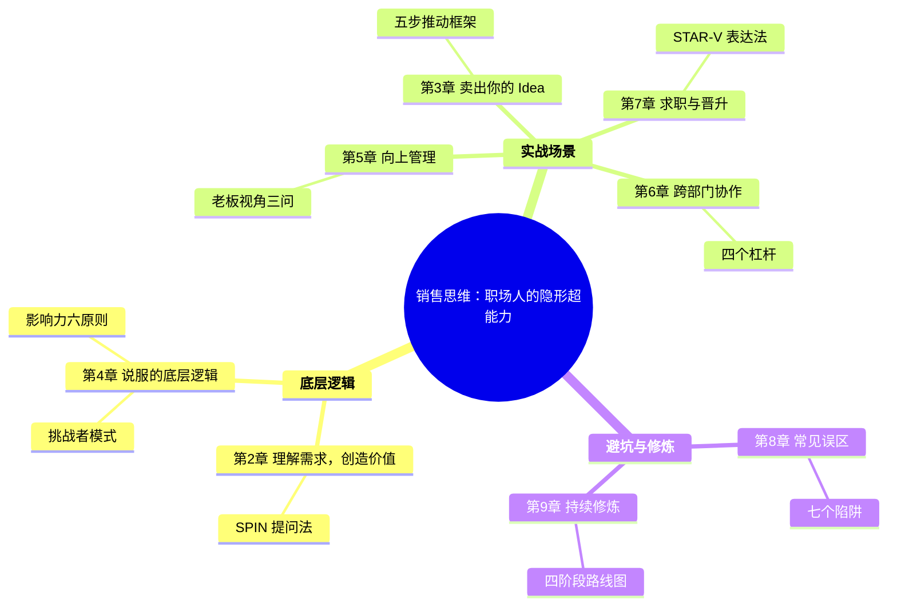

> 📌 **导读提示**：全书分为三大板块——先建立底层逻辑（第 2、4 章），再在五个实战场景中应用（第 3、5、6、7 章），最后避坑和长期修炼（第 8、9 章）。你可以按顺序通读，也可以直接跳到最相关的场景章节。

---

<a id="ch2"></a>
## 2. 销售的本质：理解需求，创造价值

### 忘掉"说服"，从"理解"开始

大多数人对销售有一个根深蒂固的误解：销售就是说服别人接受你的东西。

这个理解不能说全错，但它把因果关系搞反了。真正优秀的销售从来不以"说服"为起点——他们的起点是**理解对方的处境和需求**，然后把自己的方案连接到对方已经存在的痛点上。

区别在哪里？

- **说服模式**：我有一个好方案 → 我要想办法让你同意
- **理解模式**：你有一个问题 → 我来帮你看清这个问题有多严重 → 顺便，我有一个解决方案

说服模式的问题在于：你越努力"推"，对方越本能地"抗"。这是人类的心理防御机制——当我们感觉到别人在试图改变我们的想法时，第一反应是抵触，不管对方说的有没有道理。

理解模式的逻辑完全不同。你不是在推销，而是在帮对方做一次诊断。你帮他看清了问题的全貌，他自己会得出"需要解决"的结论。这时候你再提出方案，他接受的概率会高出数倍——因为这已经不是"你要我做"，而是"我自己想做"。

**销售的本质，是一个帮助对方发现问题、理解代价、看到出路的过程。** 你卖的不是方案本身，而是对方对"现状不可接受"的认知。

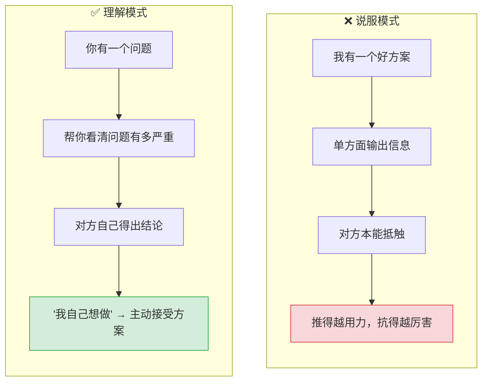

> 📌 **核心区别**：说服模式的起点是"我的方案"，理解模式的起点是"你的问题"。起点不同，对方的心理姿态完全不同。

### SPIN：一个经过验证的需求挖掘框架

这不是我的个人感悟，而是经过严谨研究验证的结论。

1988 年，尼尔·雷克汉姆（Neil Rackham）出版了《SPIN Selling》。这本书基于对 35,000 多个销售拜访的实证研究，揭示了一个反直觉的发现：在复杂销售场景中，**最有效的销售行为不是"呈现"和"说服"，而是"提问"**。

雷克汉姆把高效销售提问归纳为四个层次，组成了 SPIN 框架：

| 层次 | 英文 | 含义 | 职场翻译 |
|------|------|------|----------|
| **S** — 现状问题 | Situation | 了解对方当前的状况 | "你们现在的流程是怎样的？" |
| **P** — 痛点问题 | Problem | 发现对方遇到的困难 | "这个环节有没有让你头疼的地方？" |
| **I** — 影响问题 | Implication | 帮对方看清问题的代价 | "这个问题如果不解决，会带来什么后果？" |
| **N** — 价值问题 | Need-payoff | 让对方自己描述解决后的好处 | "如果这个问题解决了，对你的业务意味着什么？" |

前两个层次（S 和 P）大多数人天然就会做——了解情况、发现问题。但真正拉开差距的是后两个层次：**I（影响）和 N（价值）**。

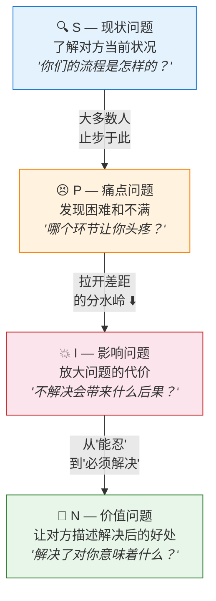

> 📌 **关键洞察**：S 和 P 让你发现问题，I 和 N 让问题变得"不可忍受"。大多数人在 P 之后就急着提方案，但真正驱动行动的力量藏在 I 和 N 里。

为什么？因为大多数问题在日常工作中都处于一种"能忍"的状态。大家都知道有问题，但还没有严重到"必须现在解决"。I 类问题的作用，就是帮对方把一个"能忍的小问题"看成"不能忍的大问题"；N 类问题的作用，则是让对方自己构想出解决后的美好前景，从而产生行动的内驱力。

### 一个完整的职场案例：推动数据治理项目

让我用一个完整的案例来展示 SPIN 在职场中的应用。

林薇是一家电商公司的产品经理，负责用户增长方向。她发现公司各业务线的用户数据散落在十几个系统里，口径不统一，每次做增长分析都要花大量时间手工对数据。她想推动一个数据治理项目，把用户数据打通。

问题是：这个项目需要数据团队、后端团队、运营团队三方协作，而她没有任何一个团队的管理权。更关键的是，数据团队的负责人赵磊觉得"现在的数据虽然散，但各条线自己能用就行，没必要大动"。

**如果林薇用"说服模式"：**

"赵磊，我觉得我们应该做数据治理，把用户数据统一起来。现在数据太散了，分析效率很低，我每次做增长报告都要花三天对数据。我已经写了一份方案，你看看？"

赵磊大概率会说："你的需求我理解，但我们数据团队这个季度排期已经满了，下个季度再说吧。"

这不是赵磊不讲理。他听到的信息是："你有一个需求要占我的资源。"他的本能反应是保护自己的排期。

**如果林薇用 SPIN 逻辑：**

她约赵磊喝了杯咖啡，没有带方案，而是带了几个问题。

**S（现状）：** "赵磊，我最近在做增长分析的时候注意到，用户数据分散在不同系统里。你们数据团队平时给各业务线出报告的时候，是怎么处理这些数据的？"

赵磊说："确实挺散的，我们一般是从不同库里各取一部分，然后手工合并。"

**P（痛点）：** "手工合并会不会出现口径对不上的情况？比如用户增长这边的 DAU 和运营那边的 DAU 对不上？"

赵磊叹了口气："这个问题老出现了。上个月运营总监问我，为什么你们出的月活数据和增长团队的差了 15%，我花了两天才查清楚是埋点口径不一样。"

**I（影响）：** "这种数据打架的情况，除了你花时间排查，对业务决策有没有影响？比如上次运营那边是不是因为数据不确定，某个决策推迟了？"

赵磊想了想："确实有。上个月那次之后，运营总监说他不太敢完全信数据了，一些投放决策他开始靠直觉做。而且说实话，我们团队每个月花在数据口径排查上的时间，加起来至少有 5-6 个人日。"

**N（价值）：** "如果用户数据有一个统一的口径和来源，你觉得你们团队能省出多少时间？对运营那边做决策的速度和信心会有什么变化？"

赵磊说："那至少能省 70% 的对数据时间。而且如果数据是可信的，运营的决策周期可能从现在的两周缩短到三天。投放那边动作快一天，都是真金白银。"

到这一步，赵磊已经不再是一个"被说服的人"，而是一个"主动看到问题的人"。林薇还没有提她的方案，赵磊已经开始帮她计算数据治理的价值了。

这时候林薇才说："我这边初步梳理了一个方案，核心是建一个统一的用户数据中间层，你有空的话帮我看看技术上是否可行？"

赵磊的反应完全不同了："发我看看。这个如果能做，确实能解决不少问题。我看看能不能从下个迭代开始排进去。"

### 为什么 SPIN 在职场中特别有效

你可能注意到了，SPIN 的四层提问本质上不是"话术"，而是一种**对话结构**。它有效的原因有三个：

**第一，它把"推销"变成了"共同诊断"。** 你不是在单方面输出信息，而是在和对方一起分析问题。这种对话模式天然消除对抗感——你们是同一边的。

**第二，它让对方自己得出结论。** 心理学中有一个概念叫"自我说服效应"：人们更容易被自己得出的结论说服，而不是别人告诉他的结论。当赵磊自己算出"每月浪费 5-6 个人日"的时候，这个数字的说服力远大于林薇在 PPT 上写的同一个数字。

**第三，它解决了"优先级"问题。** 职场中大部分提案被拒绝，不是因为方案不好，而是因为对方不觉得"现在就要做"。I 类问题（影响）的作用就是把"以后再说"变成"现在不做就要出问题"——它重构了对方心中的优先级排序。

### 从 SPIN 到职场的三条行动原则

SPIN 是一个完整的框架，但你不需要每次都严格走完四步。提炼其核心逻辑，有三条原则可以立刻应用到日常工作中：

**原则一：先诊断，后开方。**

在提出任何方案之前，先确认你真正理解了对方的处境和痛点。不要假设你知道对方的问题是什么——去问、去确认。很多时候，你以为对方关心 A，其实对方真正关心的是 B。

**实操方法：** 在任何重要沟通之前，写下三个你准备问对方的开放式问题。如果你一个问题都想不出来，说明你对对方的情况了解不够，还没到提方案的时候。

**原则二：量化代价，制造紧迫感。**

帮对方把"隐隐觉得有问题"变成"清楚知道这个问题每天/每周/每月在亏多少"。抽象的问题不会驱动行动，具体的数字会。

**实操方法：** 把问题的影响翻译成对方关心的指标——时间、金钱、人力、客户满意度、错失的机会。"数据不准"是抽象的，"每月因为数据口径问题浪费 6 个人日、推迟 3 个决策"是具体的。

**原则三：让对方自己说出价值。**

不要急着告诉对方"我的方案能带来什么好处"。用 N 类问题引导对方自己描述解决后的收益。他自己说出来的好处，比你说的有效十倍。

**实操方法：** 把"我的方案能帮你节省 X"换成"如果这个问题解决了，你觉得你的团队会有什么变化？"。让对方用自己的语言描述价值，然后在后续方案呈现中引用他自己的话。

### 一个容易踩的坑：跳过"影响"直奔"方案"

最后提醒一个常见错误。

很多人在发现了对方的问题（P）之后，会立刻兴奋地跳到方案："你有这个问题？太好了，我正好有一个方案能解决！"

这就像医生刚听病人说"我头疼"，就立刻开药方。你可能开对了，但病人会想："你都没问清楚我怎么疼的、疼了多久、有没有别的症状，就敢开药？"

正确的节奏是：**发现问题 → 展开影响 → 建立紧迫感 → 对方主动问"那怎么办" → 你再提方案**。如果对方还没有问"怎么办"，说明他还没觉得问题严重到必须解决，你需要在 I 层多花一些时间。

回看第一章陈明的案例：他的第二版开场之所以有效，正是因为他先用影响问题（"超时率 12%，损失 340 万"）建立了紧迫感，让听众先感受到"这个问题不能再拖了"，然后才提出技术方案。他可能没听说过 SPIN，但他本能地做对了这个节奏。

> **认知转变点**：销售的本质不是"我说你听"，而是"我问你答"。最强的说服不是你把道理讲得有多透彻，而是你的提问让对方自己看到了真相。当对方自己说出"这个问题必须解决"的时候，你的方案就已经卖出去了一半。

---

<a id="ch3"></a>
## 3. 卖出你的 Idea：从构思到说服

你有一个好想法。也许是一个能大幅提升效率的工具、一套新的工作流程、一个值得投入的产品方向。你很兴奋，觉得"这件事一定要做"。

然后呢？

大多数好想法死在"然后呢"这一步。不是因为想法不好，而是因为提出想法的人不知道如何把它从脑子里搬到别人的行动清单上。

第二章讲了销售的底层逻辑——理解需求、用提问代替说服。这一章要解决的是更具体的问题：**当你有一个想法想推动时，从零到一的完整路径是什么？**

我把它拆成五个步骤。每一步都有明确的动作，做完这五步，你的想法被采纳的概率会比"直接提方案"高出数倍。

### 第一步：先别急着卖——验证你的想法值得卖

这是最容易被跳过的一步，也是最关键的一步。

很多人一有想法就急着推。但问题是：**你觉得好的想法，不一定是值得投入资源的想法。** "好"和"值得做"之间有一个巨大的鸿沟——值得做意味着它解决的问题足够重要、时机合适、投入产出比合理。

验证一个想法是否值得推动，问自己三个问题：

**问题一：这个想法解决的是谁的问题？**

如果答案是"只有我自己觉得有问题"，你需要谨慎。不是说你的感受不重要，而是一个只影响你一个人的问题，很难获得组织资源去解决。你需要找到证据证明这是一个共性问题。

**问题二：不做会怎样？**

如果不做这件事，半年后会发生什么？如果答案是"也不会怎样"，那这个想法可能是"锦上添花"而非"雪中送炭"。锦上添花的想法不是不能推，但推动成本会高很多，因为对方缺乏行动的紧迫感。

**问题三：为什么是现在？**

好想法在错误的时间提出，等于坏想法。刚经历一轮裁员时推动一个需要增加人手的项目、在季度冲刺的最后两周提出流程改造——时机不对，再好的方案也会被搁置。

#### 案例：周然的设计系统提案

让我用一个贯穿本章的案例来演示这五步。

周然是一家 SaaS 公司的 UI 设计师，工作四年。她发现公司产品的界面风格越来越不统一——每个产品线的按钮样式不同、间距规则不同、配色方案不同。她想推动建立一套统一的设计系统（Design System），把组件标准化。

在跳进方案之前，周然先做了验证：

- **谁的问题？** 她和三个产品线的设计师分别聊了一次，发现他们都有同样的痛点：每次新开一个页面都要重新定义基础组件，效率很低，而且跨产品线协作时经常返工。这不只是她一个人的问题。
- **不做会怎样？** 公司正在准备把三条产品线整合成一个统一的平台。如果没有统一的设计系统，整合后的界面会像"缝合怪"——用户在不同模块之间切换时体验割裂。这个后果在产品整合后会被放大。
- **为什么是现在？** 平台整合项目刚进入规划期，架构还没定型。如果等到前端已经开发了一半再来统一设计语言，改造成本会翻好几倍。现在是窗口期。

三个问题的答案都指向"值得做、现在做"。如果有任何一个答案是模糊的，周然应该先去补充信息，而不是急着推。

### 第二步：找到你的"买家"——谁能让这件事发生

一个想法能否落地，取决于是否有**能调动资源的人**支持它。这个人就是你的"买家"。

在职场中，买家通常不止一个。你需要区分三种角色：

| 角色 | 定义 | 特征 |
|------|------|------|
| **决策者** | 能拍板说"做"的人 | 通常是你的直属领导或相关团队的负责人 |
| **影响者** | 能影响决策者判断的人 | 技术专家、资深同事、决策者信任的人 |
| **受益者** | 从你的方案中直接获益的人 | 日常受困于问题的一线同事 |

很多人犯的错误是：只找决策者，忽略影响者和受益者。

决策者通常很忙，你很难获得足够长的沟通时间来做一次完整的 SPIN 对话。但如果你先说服了影响者和受益者，他们会帮你"预热"——当决策者听到你的方案时，他可能已经从其他渠道听到过这个问题，你的方案就不再是"空降"的陌生提案，而是"大家都在说的那个事"。

#### 回到周然的案例

周然梳理了她的"买家"：

- **决策者：** 设计总监张蕾——负责整个设计团队，有权批准设计系统项目并分配人力。
- **影响者：** 前端技术负责人孙浩——如果他认为设计系统在工程上可行且有价值，张蕾会更容易被说服。
- **受益者：** 三条产品线的 UI 设计师——他们是日常痛点的直接承受者。

周然的策略是：**从受益者开始，经过影响者，最后到决策者。** 不是直接去找张蕾提方案，而是先让其他设计师和前端负责人认可这件事的价值。

### 第三步：翻译价值——用对方的语言说你的想法

这是最核心的一步，也是第一章和第二章反复强调的：**你眼中的价值，不等于对方眼中的价值。**

同一个方案，对不同的"买家"，价值是不同的。你需要把你的想法"翻译"成每个买家关心的语言。

翻译的核心原则是：**不要讲你做了什么，讲对方能得到什么。**

这里有一个简单但有效的工具——**"所以呢"测试**。写下你想说的任何一句话，然后问自己"所以呢？对方为什么要在乎？"，一直追问下去，直到答案触及对方真正关心的东西。

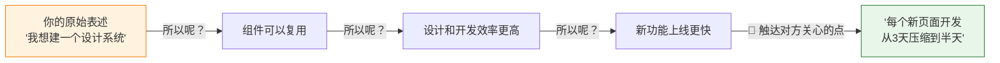

> 📌 **使用方法**：每句话至少追问三次"所以呢"，直到答案变成对方能直接感知的**时间、金钱、风险**。追问不到底 = 还没找到真正的价值点。

| 你的原始表述 | "所以呢"追问 | 翻译后的表述 |
|-------------|-------------|-------------|
| "我想建一个设计系统" | 所以呢？→ 组件可以复用 → 所以呢？→ 设计和开发效率更高 → 所以呢？→ 新功能上线更快 | "目前每个新页面的基础组件开发要花 3 天，设计系统建好后这个时间能压缩到半天" |
| "我写了一个自动化脚本" | 所以呢？→ 手工操作变少了 → 所以呢？→ 出错率降低 → 所以呢？→ 团队不用花时间排错 | "这个脚本每周能帮团队省出约 8 小时的重复操作时间，同时消除人工操作导致的配置错误" |
| "我们应该引入代码审查流程" | 所以呢？→ 代码质量更好 → 所以呢？→ 线上 bug 更少 → 所以呢？→ 客户投诉减少、团队加班减少 | "上个月有 3 次线上事故是低级代码错误导致的，代码审查能在上线前拦截这类问题" |

#### 周然的三种"翻译"

周然为三种买家准备了三种不同的价值表述：

**对受益者（其他设计师）：**"你们是不是每次新开一个页面都要重新画按钮、定间距？设计系统建好之后，基础组件直接拖进来用，一个页面的设计时间至少能缩短 40%。"

——这打中的是设计师的日常痛点：重复劳动。

**对影响者（前端负责人孙浩）：**"现在三条产品线的前端组件各自维护，很多功能重复开发。如果有统一的组件库，你们维护一套代码就行，而且产品整合的时候前端适配工作量会小很多。我估算过，整合期的前端返工量至少能减少三分之一。"

——这打中的是前端团队的效率和即将到来的整合痛点。

**对决策者（设计总监张蕾）：**"产品整合后用户会在不同模块之间频繁切换，如果界面风格不统一，用户体验评分很可能下降。而且目前设计师在基础组件上花了大量时间，设计系统能把这部分时间释放出来投入到更有价值的交互设计上。我初步评估过，两个人投入六周可以完成第一版，覆盖 80% 的常用组件。"

——这打中的是张蕾关心的两个维度：用户体验风险和团队产出效率。

注意三段话的共同特点：**都没有从"我想做"开始，而是从"你会得到"开始。** 这就是"翻译"的本质。

### 第四步：选择时机和场景——在对的地方说对的话

同样的话，在不同场景下说，效果天差地别。

一个常见错误是：在正式会议上第一次抛出一个重大提案。决策者没有心理准备，信息量太大来不及消化，而且在公开场合他不好轻易表态支持（万一后来发现不靠谱怎么办？）。结果往往是"我们回去再讨论讨论"——这通常意味着你的提案被打入冷宫。

**高效的节奏是：非正式场合预热 → 一对一深入沟通 → 正式场合确认。**

| 阶段 | 场合 | 目的 | 话术示例 |
|------|------|------|---------|
| 预热 | 茶水间、午餐、工位闲聊 | 植入问题意识，不推方案 | "最近产品整合你们那边准备得怎么样？前端组件适配的工作量大不大？" |
| 深入 | 约咖啡、一对一会议 | 用 SPIN 逻辑展开完整对话 | "我整理了一些想法，想听听你的看法……" |
| 确认 | 团队周会、评审会 | 获得正式支持和资源承诺 | "基于前期和各方的沟通，我梳理了一个方案……" |

周然的做法是：

- **预热阶段：** 她在午餐时跟几个设计师聊起组件重复的问题，大家纷纷吐槽。她没有当场提方案，只是说"是啊，这个问题确实该想想办法"。这些设计师回去后自然会跟其他人提起，"连周然也觉得这个问题很严重"。
- **深入阶段：** 她分别约了前端负责人孙浩和设计总监张蕾的一对一。跟孙浩的对话用了 SPIN 逻辑（见第二章），让孙浩自己算出了整合期返工成本。跟张蕾的对话重点放在用户体验风险和团队效率上。
- **确认阶段：** 等张蕾在一对一中表示"这件事确实应该做"之后，周然才在设计团队的月度评审会上正式提出方案。这时候张蕾已经了解背景、孙浩表示技术可行、其他设计师翘首以盼——方案几乎没有悬念地通过了。

关键在于：**正式会议不是用来"说服"的，而是用来"确认"的。** 真正的说服工作应该在会议之前的非正式沟通中完成。如果你走进会议室时还需要从头说服人，你已经输了一半。

### 第五步：设计行动路径——让对方容易说"好"

说服一个人同意你的想法只是第一步。真正的挑战是：**让同意变成行动。**

很多提案死在"大家都觉得好，但没人动"这个阶段。原因通常是：方案太大、起步太难、风险太高。人的本能是避免不确定性——如果一个方案需要"先投入三个月，三个月后才能看到效果"，大多数决策者会犹豫。

解决方案是：**把大方案拆成小的、低风险的第一步。**

这个思路在创业圈叫"MVP"（最小可行产品），在销售领域叫"降低决策门槛"。核心逻辑是一样的：不要让对方做一个"全押"的大决定，而是让他做一个"试试看"的小决定。

**三条具体策略：**

**策略一：提供"试点方案"而非"全面推广方案"。**

不要说"我们应该在整个公司推行 X"，而是说"我们可以先在一个产品线试两周，效果好再推广"。试点的好处是：成本低、风险可控、效果可衡量。

**策略二：把投入说清楚，把退出成本说低。**

"需要两个人投入六周"比"需要投入一些资源"具体得多。而"如果两周后发现效果不好，随时可以停"比"我们做了就不能回头"安全得多。决策者需要知道：这件事如果失败了，代价有多大？代价越小，他越容易说好。

**策略三：主动承担第一步的工作量。**

"这件事我来牵头，第一阶段不需要额外人力，我用业余时间先做一个原型出来"——这句话能极大降低对方的心理负担。你不是在要求对方给你资源，而是在表明你愿意先投入，用结果说话。

#### 周然的"行动路径"设计

周然没有提出"花三个月建一套完整的设计系统"，而是这样设计方案：

> **第一阶段（2 周）：** 我先整理出目前三条产品线使用频率最高的 20 个基础组件（按钮、输入框、卡片等），做一份差异对比文档。这一步我自己利用项目间隙就能完成，不需要额外排期。
>
> **第二阶段（4 周）：** 基于差异对比，统一这 20 个组件的设计规范，和前端一起做成可复用的组件库。这一步需要我全职投入加一个前端配合。
>
> **第三阶段（持续）：** 新页面优先使用组件库，旧页面在迭代中逐步替换。不需要专门排期做"改造"。

这个方案好在哪里？

- **第一步几乎零成本：** 周然自己就能做，不需要任何人批准资源。
- **第二步有第一步的成果做背书：** 差异对比文档出来后，问题有多严重一目了然，批资源就有了数据支撑。
- **第三步没有"大爆炸"改造：** 渐进替换，降低了"万一不好怎么办"的风险。

对张蕾来说，她需要做的决定只是"让周然花两周整理一份文档"——这个决定几乎不需要犹豫。而等到文档出来，下一步的决定也因为有了数据支撑而变得容易。

**这就是"降低决策门槛"的精髓：不要让对方做一个大决定，而是做一连串小决定。每个小决定都因为上一步的成果而变得顺理成章。**

### 五步框架速查

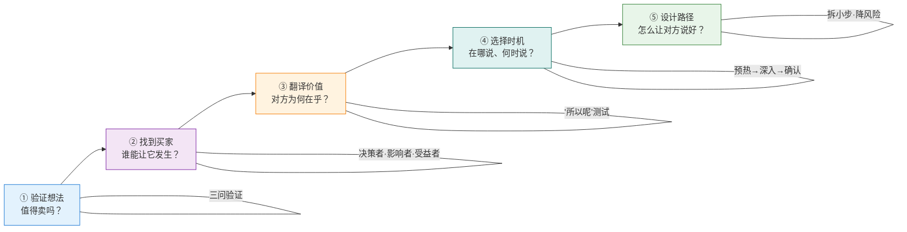

| 步骤 | 核心问题 | 关键动作 |
|------|---------|---------|
| 1. 验证想法 | 值得卖吗？ | 问三个问题：谁的问题、不做会怎样、为什么是现在 |
| 2. 找到买家 | 谁能让它发生？ | 识别决策者、影响者、受益者，从受益者开始 |
| 3. 翻译价值 | 对方为什么要在乎？ | 用"所以呢"测试，把你的想法翻译成对方的语言 |
| 4. 选择时机 | 在哪里说、什么时候说？ | 非正式预热 → 一对一深入 → 正式确认 |
| 5. 设计路径 | 怎么让对方容易说好？ | 拆小步、降风险、主动承担第一步 |

### 从五步到日常：两个即学即用的微技巧

你不需要每次都完整走完五步。对于日常的小想法——比如建议团队换一个协作工具、提议修改某个流程——两个微技巧就够了：

**微技巧一：30 秒电梯测试。**

假设你在电梯里遇到决策者，只有 30 秒。你能不能一句话说清楚"有什么问题、我有什么方案、做了有什么好处"？如果说不清，说明你的想法还没有成型到可以拿出来推的程度。

练习方法：把你的想法写成一句话，格式为——"[谁] 目前面临 [什么问题]，导致 [什么后果]。我建议 [怎么做]，预计能 [带来什么改善]。"

例如："我们的设计团队目前每个新页面都要重新画基础组件，导致 40% 的设计时间花在重复劳动上。我建议花两周整理一套统一组件库，建成后每个页面的设计时间能缩短一半。"

**微技巧二：预约而非突袭。**

不要在对方忙碌时突然抛出一个需要思考的提案。发一条消息："我有一个关于 X 的想法想跟你聊 15 分钟，你这周什么时候方便？"这样做的好处是：对方有心理准备，会在对话前主动回忆相关背景；你也有时间精心准备你要说的话。

"突袭"式沟通的成功率远低于"预约"式——不是因为你说的话有区别，而是因为对方的接收状态完全不同。

> **认知转变点**：好想法被拒绝，问题往往不在想法本身，而在于你呈现它的方式。把"我有一个好方案"的心态换成"我要帮对方发现一个值得解决的问题"，你就从一个"推销员"变成了一个"顾问"。没有人喜欢被推销，但每个人都欢迎一个能帮自己解决问题的顾问。

---

<a id="ch4"></a>
## 4. 说服的底层逻辑：为什么有些话能改变决定

前三章给了你方法：用 SPIN 提问挖掘需求，用五步框架推动想法落地。但你有没有想过一个更根本的问题——**为什么这些方法有效？**

换个角度问：当一个人改变主意、接受你的提案时，他的大脑里到底发生了什么？

理解说服的底层心理机制，不是为了玩"心术"，而是为了让你在方法论之外多一层判断力。当你知道一个技巧**为什么**起作用，你就能在新场景中灵活应变，而不是机械套用模板。

### 影响力的六个支点

1984 年，社会心理学家罗伯特·西奥迪尼（Robert Cialdini）出版了《影响力》（*Influence: The Psychology of Persuasion*）。这本书基于他长达三年的田野研究——他伪装成销售员、募捐者、广告商的实习生，观察各行各业的"说服高手"到底在做什么。

他发现，不管行业和场景如何变化，有效的说服几乎都在利用人类心理的六个基本倾向。这六个原则不是话术，而是人脑在信息过载时用来简化决策的"心理捷径"：

| 原则 | 心理机制 | 职场中的体现 |
|------|---------|------------|
| **互惠** | 别人帮了我，我有义务回报 | 你先帮同事解决了一个问题，之后请他帮忙时他很难拒绝 |
| **承诺与一致** | 人倾向于与自己之前的言行保持一致 | 让对方先口头认同"这个问题确实重要"，后续他更容易同意投入资源解决 |
| **社会认同** | 不确定时，看别人怎么做 | "隔壁团队已经在用这个方案了"比"我觉得这个方案好"有效得多 |
| **权威** | 专家的话更可信 | 引用行业报告、技术专家的评估来支撑你的方案 |
| **喜好** | 我们更容易被自己喜欢的人说服 | 先建立信任和好感，再谈事情，效果远好于冷启动 |
| **稀缺** | 即将失去的东西比可能获得的更有吸引力 | "这个窗口期只有这个季度"比"做了会更好"更能驱动行动 |

你可能注意到，前三章的方法论里已经暗含了这些原则。SPIN 中的 I（影响）问题本质上是在激活**稀缺**感——帮对方看到"不解决就会失去什么"；第三章的"从受益者开始"策略利用的是**社会认同**——当决策者发现很多人都在讨论这个问题时，他的决策阻力会大幅下降；而"先帮对方解决一个小问题再提你的方案"则是经典的**互惠**。

理解这些原则的价值不在于把它们当成清单逐一"使用"，而在于**帮你诊断失败**。当你的提案被拒绝时，回头检查：你是不是缺了某个关键支点？比如——你有逻辑，但缺乏社会认同（没人背书）；你有数据，但缺乏喜好基础（对方对你还不够信任）。

### 挑战者模式：不只是回应需求，而是重塑认知

西奥迪尼的六原则解释了"为什么人会被说服"，但在职场中，还有一个更深层的问题：**如果对方根本不知道自己有问题呢？**

SPIN 适用于对方已经隐约感到有痛点的情况——你通过提问帮他把模糊的不适变成清晰的问题。但有些时候，你要推动的是对方完全没有意识到的改变。这时候，你需要一种更主动的方式。

2011 年，马修·迪克森（Matthew Dixon）和布伦特·亚当森（Brent Adamson）在《挑战者销售》（*The Challenger Sale*）中提出了一个颠覆性发现。他们研究了 6000 多名 B2B 销售人员，发现业绩最好的不是最善于倾听和维护关系的"关系型"销售，而是敢于**挑战客户既有认知**的"挑战者"。

挑战者模式的核心是三个动作：**教学（Teach）—— 定制（Tailor）—— 掌控（Take Control）**。

```mermaid
flowchart LR
    T["💡 教学 Teach<br/>给对方一个<br/>没想到的新视角"]
    -->|"产生'原来如此'<br/>的顿悟"| 
    C["🎯 定制 Tailor<br/>把洞察连接到<br/>对方的具体处境"]
    -->|"'这跟我有关'"| 
    K["🚀 掌控 Take Control<br/>在对方犹豫时<br/>推动对话向前"]

    style T fill:#e3f2fd,stroke:#1976d2
    style C fill:#fff3e0,stroke:#f57c00
    style K fill:#e8f5e9,stroke:#2e7d32
```

> 📌 **与 SPIN 的区别**：SPIN 适合对方已经隐约感到痛点的场景；挑战者模式适合对方**完全没意识到问题**的场景——你需要先"教"他看到一个新视角。

**教学**不是把你知道的东西讲给对方听，而是给对方一个他没有想到过的视角，让他重新审视自己的处境。好的教学让对方产生"原来如此"的顿悟感，而不是"这些我都知道"的无感。

**定制**是把你的洞察连接到对方的具体处境上。同一个道理，对不同的人要用不同的方式说。第三章的"翻译价值"就是定制的实操方法。

**掌控**是在对方犹豫时，敢于推动对话向前走，而不是退回到"你考虑考虑，有需要再找我"。这不是施压，而是在你确信对方会从行动中受益时，帮他越过决策的心理门槛。

### 一个完整的职场案例：制造业质量总监的流程改造

让我用一个非互联网行业的案例来展示这些底层逻辑如何在实际场景中协同运作。

何江是一家汽车零部件制造企业的质量工程师，工作五年，专注于焊接工艺质量控制。他发现公司沿用了十多年的质量检测流程存在一个系统性问题：终检环节（成品出厂前的最终检测）发现的缺陷中，有 60% 以上其实可以在过程检测环节（焊接工序完成后的中间检测）就拦截住，但目前过程检测的标准过于粗糙，只检查外观和尺寸，不检查焊缝强度。

结果就是：大量有焊接缺陷的零件走完了全部后续工序（打磨、涂装、装配），到终检时才被发现不合格，前面的工序全部白做。何江估算过，过去一年因为这个问题，公司在报废和返工上花了约 470 万元。

何江想推动在过程检测环节增加超声波探伤设备，在焊接完成后立即检测焊缝质量，把缺陷拦截在源头。设备采购加上产线改造，初期投入约 120 万元。

问题是：质量总监刘刚已经在这家公司干了十五年，一手建立了现有的质量检测体系。在刘刚看来，"终检兜底"的流程运行了十多年，虽然有报废，但没有出过大的客户质量事故。你要说他的体系有系统性缺陷，等于在说他十五年的工作有问题——这比推动一个互联网项目难得多，因为你面对的不只是逻辑阻力，还有**身份认同阻力**。

**何江如果直接提方案：**

"刘总，我觉得我们的过程检测标准太粗了，应该加超声波探伤。去年报废和返工花了快 500 万，很多都是过程检测没拦住的。"

刘刚的反应几乎可以预见："我们的质量体系运行了这么多年，客户没投诉过。报废率在行业里不算高。你一个年轻工程师，先把手头的事做好。"

这不是刘刚不讲道理。他听到的潜台词是："你建的体系有问题。"他的第一反应是防御。

**何江用的方法——教学、定制、掌控：**

何江没有直接提方案。他做了两件准备工作。

第一，他花了一个月收集了三组数据：（1）过去一年终检拦截的所有缺陷，按类型、工序来源分类，制成了一张清晰的桑基图；（2）每类缺陷如果在过程检测环节就被拦截，能节省多少后续工序成本，逐项计算；（3）三家同行企业（包括一家刚拿到大众汽车供应商认证的竞争对手）的过程检测标准对比。

第二，他没有约刘刚正式汇报，而是找了一个刘刚主持的内部质量复盘会的机会。在复盘会上，大家照例讨论上个月的质量问题。何江等到一个自然的切入点——有人提到某批零件的返工成本偏高——然后说了这样一段话：

**"教学"——给一个新视角：**

"刘总，关于返工成本这个问题，我最近在整理数据的时候发现了一个以前没注意到的规律。我把过去一年终检拦截的缺陷做了溯源分析，发现 63% 的缺陷源头在焊接工序，而且这些焊接缺陷走完了打磨、涂装、装配三道工序才在终检被拦住。也就是说，**我们不是检测能力不够——终检拦截率其实很高——而是拦截的位置太靠后了，导致每拦截一个缺陷，平均已经浪费了 3.2 道工序的成本**。"

注意何江的措辞：他不是说"你的检测体系有问题"，而是说"我发现了一个以前没注意到的规律"。他肯定了终检的拦截能力（"终检拦截率很高"），只是指出拦截位置的问题。这是**教学**的精髓——给对方一个"原来如此"的新视角，而不是一个"你做错了"的指控。

**"定制"——连接到对方的具体处境：**

刘刚听完沉默了一下，说："这个数据我没看过。但报废率我们一直控制在 2% 以内，在行业里算可以了。"

何江说："刘总，报废率确实控制得不错，这是您这些年建立的体系的功劳。但我对比了一下，我们和刚拿到大众认证的竞和达，他们的报废率是 0.8%。他们的做法是在焊接工序后加了超声波探伤——不是加了终检力度，而是**把检测点前移了**。他们去年因此省下了大概 350 万的返工成本。我算了一下我们的数据，如果我们也把焊接缺陷的拦截点前移，按去年 470 万的返工和报废成本估算，至少能减少 60%，也就是省下近 280 万。设备加改造投入大约 120 万，半年就能回本。"

这里何江同时用了两个原则：**社会认同**（竞争对手已经在做）和**稀缺**（竞和达拿到了大众认证，暗示"不跟上可能会在客户审核中处于劣势"）。而且他把数据定制到了刘刚关心的维度——不是泛泛的"行业趋势"，而是和公司直接竞争对手的对比，以及用公司自己的报废数据算出的具体金额。

**"掌控"——推动决策向前：**

刘刚开始思考了，但还是有些犹豫："120 万不是小数目，而且产线改造要停工，影响交付。"

何江没有退回到"您考虑考虑"，而是说："刘总，我理解产线停工是最大的顾虑。所以我建议我们不要一次性改造全部四条焊接线，而是**先在三号线做一个月的试点**。三号线目前产量最低，停工影响最小，而且它焊的是底盘支架件，恰好是去年报废率最高的品类。一个月的试点数据出来，我们就能看到实际拦截效果，再决定要不要推广到其他产线。试点的设备投入大约 18 万，如果效果不好，随时可以停。"

这就是第三章讲的"降低决策门槛"，但它之所以有效，底层逻辑是**承诺与一致**原则——一旦刘刚同意了试点，一个月后看到数据时，他在心理上已经是"这件事的支持者"了，推广全产线只是他之前决定的自然延伸。

**结果：**

刘刚同意了试点。一个月后数据显示，三号线的焊接缺陷拦截率从终检阶段的 97% 前移到了过程检测阶段，返工成本下降了 71%。刘刚在季度质量大会上主动提出在全部产线推广，而且——关键细节——他在汇报中把这件事称为"质量体系的升级优化"，而不是"修复缺陷"。

何江做对了什么？他没有让刘刚觉得"我的体系被推翻了"，而是让刘刚觉得"我的体系在进化"。**保护对方的身份认同，是说服中最容易被忽视、也最致命的一环。**

### 从案例中提炼：说服的四条底层规律

回看何江的案例，以及前三章的所有案例，可以提炼出四条跨越行业和场景的说服底层规律：

**规律一：人不反对道理，人反对被改变。**

当你试图说服一个人时，他抗拒的往往不是你的逻辑，而是"被你改变"这件事本身。心理学中叫"心理抗拒"（Psychological Reactance）——当人感觉到自己的自主权被威胁时，会本能地反弹，哪怕你说的有道理。

**实操推论：** 不要让对方觉得是你在改变他。用提问代替陈述，用"你觉得呢"代替"你应该"，用"我发现了一个有意思的数据"代替"你这样做不对"。让对方在对话中保持主动权的感觉，即使方向是你引导的。

**规律二：先认同，后挑战。**

何江先肯定了"终检拦截率很高"和刘刚体系的功劳，再指出拦截位置的问题。这不是客套话，而是说服的必要步骤。心理学中有一个概念叫"是的阶梯"（Yes Ladder）——人在连续认同了几个观点之后，更容易接受下一个观点，即使那个观点有一定挑战性。

**实操推论：** 在提出任何挑战性观点之前，先找到至少两个你真心认同对方的地方，并且明确说出来。这不是为了讨好，而是为了建立"我们是同一边"的心理基础。如果你找不到任何真心认同的点，说明你对对方的理解还不够深。

**规律三：数据说服大脑，故事说服情感。**

何江用了详细的数据（63% 的缺陷源头、470 万的报废成本、竞对的 0.8% 报废率），也讲了一个清晰的"故事"（一个焊接缺陷走完四道工序才被发现的旅程）。两者缺一不可。纯粹的数据会让人觉得"有道理但跟我无关"；纯粹的故事会让人觉得"很生动但我不确定是不是真的"。

**实操推论：** 每一个关键论点，准备一组数据和一个场景。数据回答"有多严重"，场景回答"具体是怎么发生的"。在呈现时先讲场景（让对方代入），再出数据（让代入感固化为确信）。

**规律四：给对方一个"聪明的退路"。**

何江让刘刚把全产线推广定义为"质量体系的升级优化"而不是"修复缺陷"。这不是文字游戏——这是在帮刘刚维护他在团队面前的形象和专业权威。人在做决策时，不只考虑"这件事对不对"，还考虑"做了这个决定后，别人会怎么看我"。

**实操推论：** 当你的方案意味着对方要改变之前的做法时，帮他准备一个体面的叙事——"不是之前做错了，而是现在条件变了"；"不是推翻旧方案，而是在旧方案基础上升级"。你帮对方找到了台阶，对方才会走下来。

### 说服四条底层规律速查

| 规律 | 一句话概括 | 实操要诀 | 反面案例 |
|------|-----------|---------|---------|
| **人不反对道理，人反对被改变** | 抗拒的不是逻辑，而是"被你改变"的感觉 | 用提问代替陈述，让对方保持主动权 | 在会上直接说"你这样做不对" |
| **先认同，后挑战** | 先找到你真心认同对方的地方 | 至少说出两个真心认同的点再提挑战 | 上来就指出问题，没有任何铺垫 |
| **数据说服大脑，故事说服情感** | 两者缺一不可 | 先讲场景让对方代入，再用数据固化确信 | 只甩数据表格，或只讲感人故事 |
| **给对方一个"聪明的退路"** | 帮对方维护身份认同和专业形象 | "不是之前做错了，而是现在条件变了" | 让对方公开承认"之前的做法有问题" |

### 六原则的职场速查表

最后，把西奥迪尼的六原则翻译成你下周就能用的职场动作：

| 原则 | 下周就能做的一件事 |
|------|------------------|
| **互惠** | 在提出请求之前，先主动帮对方解决一个小问题——哪怕只是帮他查一个数据、转发一篇相关资料 |
| **承诺与一致** | 在正式提案前，先在非正式场合让对方口头认同问题的存在（"你也觉得这个流程效率挺低的对吧？"）。他之后更难否认这个问题 |
| **社会认同** | 在方案中引用同行业其他团队或公司的做法。"XX 团队已经在用类似的方案"比"我觉得这样好"有说服力得多 |
| **权威** | 引用对方信任的信息源——行业报告、技术专家的评估、上级的公开表态。不要只依赖自己的判断 |
| **喜好** | 在推动重要方案之前，先投入时间建立与关键人的个人关系。一起吃过饭的人比陌生人更容易被说服 |
| **稀缺** | 强调时间窗口和机会成本。"如果这个季度不做，下个季度竞对就领先了"比"做了会更好"更能驱动行动 |

> **认知转变点**：说服不是一场你赢对方输的博弈，而是帮对方看到一个他原本没注意到的、对他自己有利的选择。最高级的说服结束后，对方的感受不是"我被说服了"，而是"我自己想通了"。如果对方觉得是被你说服的，你的说服其实只成功了一半——因为他随时可能反悔。只有当他觉得这是自己的决定时，改变才是持久的。

---

<a id="ch5"></a>
## 5. 向上管理：把方案卖给你的老板

前四章讲的方法——SPIN 提问、五步推动框架、影响力六原则、挑战者模式——适用于所有方向的说服：向下、平行、对外。但有一个方向，大多数职场人觉得最难，也最不敢尝试：**向上**。

向上管理之所以难，不是因为你的老板不讲道理（大多数时候他是讲道理的），而是因为这个方向有一层额外的心理压力：**权力不对等**。你在向一个对你的绩效、晋升、甚至去留有决定权的人推销想法。这种不对等让很多人本能地选择了最安全的策略——等老板来问，不主动提。

但"不主动提"的代价是巨大的。它意味着你把自己的职业发展、项目方向、资源获取的主动权，全部交给了另一个人的注意力分配。你的老板每天要处理十几件事，他不可能主动发现你脑子里的每一个好想法。**如果你不把方案卖给他，别人会。**

这一章要解决的就是这个问题：如何系统性地向上推动你的方案，而不是靠运气等老板"看到"你。

### 先理解你的"买家"：老板的决策逻辑

第三章讲了"找到买家"的重要性。在向上管理的场景中，你的买家是明确的——就是你的直属上级。但"知道买家是谁"和"理解买家怎么想"是两回事。

大多数人对老板的决策逻辑有一个根本性的误判：**他们以为老板关心的和自己关心的是同一件事。**

你是一个业务骨干，你关心的是"这个方案在专业上是否正确"——技术是否最优、流程是否合理、方法是否科学。但你的老板关心的是另一组问题：

| 你关心的 | 你老板关心的 |
|---------|------------|
| 方案在专业上是否正确 | 这件事对团队/部门 KPI 的影响是什么 |
| 实现细节是否优雅 | 需要投入多少资源，会不会影响其他优先级 |
| 这个问题有多严重 | 这件事如果做砸了，我要承担什么责任 |
| 为什么我的方案比现有做法好 | 我怎么向我的老板汇报这件事的价值 |

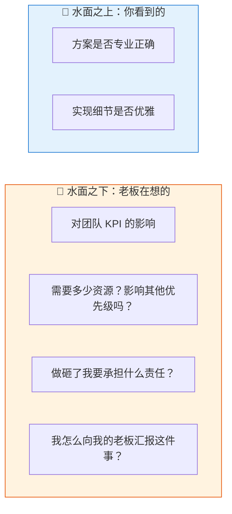

> 📌 **冰山模型**：你看到的是方案的专业性，老板看到的是资源、风险、政治和向上汇报——水面之下的部分往往决定了方案的命运。

最后一行是关键中的关键：**你的老板也有老板。** 他在评估你的方案时，有一个你看不到的维度——"如果我批了这件事，我怎么向上交代？如果搞砸了，锅谁来背？"

理解这一点，你就明白了为什么很多"明显正确"的方案被老板搁置。不是他不知道你说得对，而是他在权衡一组你没看到的变量：政治风险、资源竞争、优先级排序、向上汇报的难度。

**实操方法——"老板视角三问"：**

在向老板提任何方案之前，先回答这三个问题：

1. **这件事和老板当前最关心的目标有什么关系？** 如果你的方案和他的 KPI 没有直接关联，你需要找到关联点，或者承认这件事在他的优先级里排不上号。
2. **如果老板批了这件事，他怎么向他的老板汇报？** 你能不能帮他准备好一句话的汇报口径——"我们在做 X，因为它能解决 Y 问题，预计带来 Z 收益"？
3. **如果这件事失败了，最坏情况是什么？** 你有没有想好止损方案？老板最怕的不是失败本身，而是"不可控的失败"——投了资源进去，既没效果，又没退路。

### 一个完整的职场案例：银行客户经理的风控流程优化

让我用一个金融行业的案例来演示向上管理的完整过程。

沈雨是一家城市商业银行对公业务部的客户经理，工作六年，主要负责中小企业贷款业务。她发现银行现有的贷前风控流程存在一个效率瓶颈：每笔中小企业贷款申请需要经过五个审批节点（客户经理初审→风控专员现场调查→风控主管复核→分行审批委员会→总行备案），平均审批周期是 22 个工作日。

这 22 天在同业中偏慢。沈雨从客户端感受到了直接的压力：过去一年，她跟进的 47 笔贷款申请中，有 8 笔客户在等待审批期间转去了审批更快的竞争对手（主要是两家股份制银行，平均审批周期 12 天）。按平均单笔贷款金额 500 万元计算，8 笔流失意味着 4000 万元的业务规模损失，对应约 120 万元的年利差收入。

沈雨分析了审批流程后发现，最大的瓶颈不在审批标准本身，而在第二个节点——**风控专员现场调查**。按现有流程，每笔贷款无论金额大小、企业资质如何，风控专员都必须实地走访企业、拍摄经营场所照片、核对财务原件。对于那些有完整征信记录、纳税数据良好、已有存量贷款且还款记录优良的"低风险复贷客户"，这个环节耗时约 7 个工作日，但实质性发现问题的概率不到 3%。

沈雨想提出一个方案：**对低风险复贷客户（满足特定条件的老客户），用远程尽调（视频连线+数据交叉验证）替代现场走访，将这类客户的审批周期从 22 天压缩到 10 天以内。**

问题是：她的直属上级——对公业务部总经理孟海涛——是一个极其谨慎的管理者。银行业有一句老话叫"放贷一时爽，坏账火葬场"。孟海涛在这家银行干了十八年，经历过 2013 年那一轮中小企业贷款坏账潮，当时银行的不良率一度飙到 4.7%，他主管的两个分支行有三个客户经理因为贷前调查不到位被追责处分。从那以后，孟海涛对风控流程的态度就是"宁可慢，不能松"。

**如果沈雨直接提方案：**

"孟总，我觉得我们的贷前现场调查效率太低了，对于老客户应该改成远程尽调，这样审批能快一倍。去年因为审批慢流失了 8 个客户。"

孟海涛大概率会说："风控是银行的命根子，不能为了快就降标准。流失客户是业务问题，但坏账是生存问题。这件事不要再提了。"

他说的不是没有道理。他听到的信息是："你要在风控环节走捷径。"对于一个经历过坏账潮的管理者来说，这等于在说"你想让我冒我最怕的那个风险"。

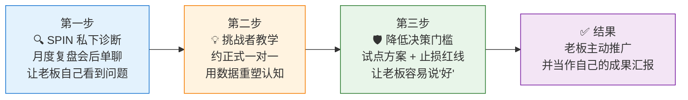

> 📌 **节奏要点**：不是一次会议搞定一切，而是三步递进——先植入问题意识，再用数据建立紧迫感，最后用低风险试点让决策变得容易。

#### 第一步：用 SPIN 逻辑做私下诊断，而不是提方案

沈雨没有直接提方案。她知道孟海涛对风控话题高度敏感，直接推等于直接撞墙。她选择在一次部门月度复盘会后，留下来和孟海涛单独聊。

**S（现状）：** "孟总，上个月我跟进的几笔贷款，客户那边催得挺急。您觉得我们现在的审批周期在同业里大概是什么水平？"

孟海涛说："确实不算快，但我们也不追求最快。风控质量是第一位的。"

**P（痛点）：** "理解。不过我注意到一个情况——最近半年有几个老客户，就是在我们行已经有两三年贷款记录、还款一直很正常的那种，他们在续贷的时候转去了别的银行。我问了原因，他们说不是利率问题，就是我们审批太慢，他们等不起。"

孟海涛皱了皱眉："有几个这种情况？"

沈雨说："我手上的有 8 个，整个部门的我没统计过。但我跟小李和张姐聊过，他们也碰到了类似的情况。"

**I（影响）：** "孟总，这些流失的客户有一个共同特点——他们都是低风险客户。就是说，我们花了最多的审批时间在风险最低的客户身上，结果反而把他们推给了竞争对手。而且这些客户转走之后，他们在我们行的存款也会逐步转移。我粗算了一下，光我手上流失的 8 个客户，涉及的贷款规模大概 4000 万，年利差收入大概 120 万。如果算上全部门，这个数字可能要翻两到三倍。"

孟海涛沉默了一会儿，说："你说的这个情况……确实要关注。但我不能因为业务压力就降低风控标准，2013 年的教训太深了。"

**N（价值）：** "完全理解，2013 年的事情不能重演。我在想的是，有没有一种办法，**在不降低风控标准的前提下**，把低风险老客户的审批效率提上来？如果能做到，一方面留住这批优质客户，另一方面也能让风控专员把时间精力集中在真正需要深入调查的新客户和高风险客户上——反而可能提高整体风控质量。您觉得这个方向值不值得想？"

注意最后这个问题的设计。沈雨没有说"我有一个方案"，而是说"这个方向值不值得想"。她让孟海涛自己判断——如果他说"值得想"，他就在心理上迈出了第一步（第四章的"承诺与一致"原则）。

孟海涛说："方向可以想，但得保证风控不出问题。你有什么具体想法吗？"

——到这一步，沈雨才拿出方案。而且是被**邀请**拿出方案，不是主动推销。

#### 第二步：用"挑战者教学"重塑认知——风控的瓶颈不在标准，在资源错配

沈雨等了两天（给孟海涛消化的时间），然后约了一次正式的一对一。

她打开电脑，展示了一组数据。但她没有从方案开始——她用了第四章的"挑战者教学"方法，先给了孟海涛一个他没想到的视角。

"孟总，我这两天整理了我们过去一年所有贷前现场调查的数据。我发现一个规律，可能您之前没注意到。"

她展示了一张图表：过去一年 312 次现场调查中，对"低风险复贷客户"（定义为：在本行存量贷款满两年、无逾期记录、纳税评级 A 或 B）的调查有 148 次，占 47%。这 148 次调查中，发现实质性风险问题的只有 4 次，问题发现率 2.7%。

而对"新客户或高风险客户"的 164 次调查中，发现实质性问题的有 31 次，问题发现率 18.9%。

"也就是说，**我们的风控专员把将近一半的时间花在了问题发现率不到 3% 的客户身上，而真正需要深挖的高风险客户，反而因为排期紧张，有时候调查做得不够深入**。上个季度总行通报的那两笔关注类贷款，都是新客户首贷，风控专员当时因为排期太满，现场调查只去了半天。"

这段话的关键在于：**沈雨不是在说"现场调查太慢"（这会触发孟海涛的防御），而是在说"风控资源分配不合理"（这和孟海涛的核心关切——风控质量——是同一方向的）**。

这就是"教学"的精髓——不是告诉对方"你做错了"，而是给他一个新的视角来看他自己已经关心的问题。孟海涛关心风控质量，沈雨用数据告诉他：**当前的做法不是在最大化风控质量，而是在浪费风控资源。**

孟海涛看了数据说："这个数据……我确实没从这个角度看过。你的意思是，把低风险客户的现场调查简化，省出来的人力去加强高风险客户的调查？"

沈雨说："对，核心逻辑就是这个——**不是降低风控标准，而是把风控资源从低产出区调配到高产出区**。具体方案是这样的——"

#### 第三步：降低决策门槛——试点方案与止损设计

沈雨拿出了她的方案，但她特别注意了两件事：**让方案可控，让失败代价极低。**

"我建议分两步走。第一步，选 20 个最典型的低风险复贷客户做试点，试点期三个月。这些客户满足三个硬性条件：在本行存量贷款满三年、历史无任何逾期、最近一年纳税评级 A 级。对这 20 个客户，贷前调查从现场走访改为远程视频尽调加数据交叉验证——我已经和风控部的小王确认过，远程尽调的核查清单和现场走访完全一致，只是把实地拍照换成视频实时拍摄，把原件核对换成电子件加事后抽验。"

"第二步，试点期内设一条红线：如果这 20 个客户中出现任何一笔贷后异常（逾期、企业经营异常信号），立即恢复全部现场调查，试点终止。三个月后如果零异常，再评估是否扩大范围。"

"另外，试点期间省出来的风控专员工时——大约每月 12 个工作日——我建议全部调配给新客户首贷的现场调查，把首贷客户的调查时长从现在的平均 1.5 天增加到 2.5 天。这样做的好处是双重的：低风险客户审批加快、高风险客户调查加深。"

注意沈雨做了什么：

1. **试点范围极小**（20 个客户），孟海涛批一个小试点的心理压力远小于批一个全面改革。
2. **设了止损红线**（一笔异常就终止），这直接回应了孟海涛最大的恐惧——"万一出坏账怎么办"。
3. **把省出来的资源给了高风险客户**，这让方案从"削减风控"变成了"优化风控"——和孟海涛的核心立场一致。
4. **帮孟海涛准备了向上汇报的口径**——"我们在优化风控资源配置，用同样的人力实现更精准的风险覆盖"。

这是第三章"设计行动路径"策略的向上管理版本，也呼应了第四章的"给对方一个聪明的退路"——如果试点失败，孟海涛可以说"我们做了小范围探索，发现时机不成熟，及时叫停了"，这不会损害他的专业形象。

#### 预判顾虑：提前准备对方没问出口的问题

孟海涛听完方案，又沉默了一会儿。然后他说："思路我认可，但我有个顾虑——如果试点期间监管来检查，发现我们有客户没有做现场调查，这个怎么解释？"

这是一个很现实的问题。沈雨如果没有准备，这里就会卡住。

"这个我查过了。银保监会 2022 年发的《商业银行小微企业授信尽职免责办法》里有一条：对满足特定条件的续贷客户，银行可以采用非现场调查方式替代实地走访，但需保留完整的远程核查记录。我们的远程尽调方案完全覆盖了监管要求的核查清单，而且视频记录比现场照片更完整——照片只能拍几个角度，视频是全程录制的。如果检查时被问到，我们的解释反而比现在更充分。"

**这就是向上管理中一个关键但常被忽视的动作：预判老板的顾虑，提前准备答案。**

大多数提案被否决时，被否的不是方案本身，而是老板脑子里冒出来的某个你没回答的问题。如果你在提案前就想到了他可能问什么，并且准备好了有据可查的回答，被否的概率会大幅下降。

怎么预判？**回到"老板视角三问"**：他担心什么？他的老板会问什么？最坏情况是什么？围绕这三个维度列出可能的反对意见，逐条准备应对。

孟海涛听完关于监管的解释，点了点头："行，你先出一个正式的试点方案，我拿到部门办公会上讨论。风控部那边你先别说，我来和他们沟通。"

最后这句话值得注意——"我来和他们沟通"。孟海涛不只是批准了方案，他开始把这件事当成**他自己要推动的事**了。这就是 SPIN 的终极效果：你不是卖了一个方案给老板，而是帮老板发现了一个他自己想解决的问题。

**结果：**

试点三个月，20 个客户零异常。低风险复贷客户的平均审批周期从 22 天降到 9 天，客户满意度评分从 3.6 提升到 4.4（5 分制）。同时，新客户首贷的现场调查时长增加了 67%，当季新客户贷后异常率从上年同期的 2.1% 下降到 0.8%。

孟海涛在季度经营分析会上向行长汇报："我们对公业务部在风控资源配置上做了优化——把低产出环节的人力释放到高风险领域，实现了审批提速和风控加强的双赢。"

沈雨的名字没有出现在汇报中。但三个月后的晋升答辩上，孟海涛给她写的推荐语是："具备全局视野，能从业务和风控两个维度系统性地优化流程。"

### 向上管理的三条核心原则

从沈雨的案例中，可以提炼出向上管理的三条核心原则。这些原则不只是"技巧"，而是底层逻辑——理解了它们，你在面对不同风格的老板时都能灵活应用。

**原则一：用老板的 KPI 包装你的想法。**

你的方案再好，如果和老板当前的核心目标无关，他没有动力去推。沈雨的方案本质是"提升审批效率"，但她包装成了"优化风控资源配置"——因为后者才是孟海涛的核心关切。

这不是虚伪，而是**翻译**（第三章的核心概念）。同一件事，从你的角度看是效率问题，从老板的角度看是资源配置问题，从老板的老板角度看是风控能力升级。你需要找到那个和老板 KPI 重合的表述角度。

**实操方法：** 在提方案之前，查看或推断老板当前最核心的 3 个 KPI 或目标。然后问自己：我的方案和哪个目标有关联？如果找不到关联，要么这件事不是现在的优先级，要么你需要重新框定方案的价值定位。

**原则二：帮老板准备好向上汇报的"一句话"。**

你的老板批准你的方案之后，他很可能需要向他的老板汇报或至少提及这件事。如果他自己都说不清"我们为什么要做这件事"，他不会轻易批准。

沈雨做对了这一点——她的方案自带汇报口径："优化风控资源配置，把低产出环节的人力释放到高风险领域。"这句话简洁、正面、符合银行业的话语体系。孟海涛几乎原封不动地用在了季度汇报中。

**实操方法：** 在每份提案的末尾（或口头汇报的总结中），主动提供一句"一句话总结"——格式为"我们在做 [什么]，因为 [为什么]，预计能 [带来什么]"。这不是为了偷懒，而是为了降低老板的认知负担和决策成本。

**原则三：让功劳归老板，让成长归自己。**

沈雨的名字没有出现在孟海涛的季度汇报中。有些人会觉得这不公平——"明明是我的方案，为什么功劳归他？"

但换个角度想：如果每次你提的方案都让老板觉得"这是我的下属在抢我的风头"，他以后还会批你的方案吗？向上管理最忌讳的就是**让老板感到威胁**。

真正聪明的做法是：让方案的成功归功于老板的决策和支持（他确实承担了批准试点的风险），而你获得的是更有说服力的东西——**实际推动复杂项目的经历和老板对你能力的信任**。这种信任会转化为更多的机会、更大的授权、更好的推荐——这些东西比某一次汇报上的署名权有价值得多。

### 被拒绝后怎么办：读懂三种"不"

向上管理不可能百发百中。你的方案被老板否了，这是常态。关键在于：**区分不同类型的"不"，采取不同的应对策略。**

| 老板说的"不" | 真实含义 | 应对策略 |
|-------------|---------|---------|
| "这件事先放一放" | 不是优先级，或者他还没想清楚 | 不要催。过两周用新的数据或事件重新触发话题——"上次说的那个问题，最近又出现了一个新情况……" |
| "方向可以，但方案需要改" | 他认可问题，但对解决方案有顾虑 | 这是好信号。追问具体顾虑是什么，根据反馈调整方案后再提 |
| "这件事不归你管" | 你越界了，或者他觉得你的角色不适合推这件事 | 最敏感的情况。退后一步，找到"归你管"的切入角度，或者把想法通过老板信任的人传递 |

无论哪种情况，核心原则是：**当场接受，事后跟进。** "理解，我再想想。"然后过几天，带着新的信息或调整后的方案再来。回到第四章的底层规律——"人不反对道理，人反对被改变"。你的跟进不应该是加强方案的逻辑力度（他可能已经认可了逻辑），而应该是**降低他批准之后的风险感知**——更小的试点、更清晰的止损、更充分的预案。

### 向上管理的常见误区

最后，列出三个向上管理中最常见的误区，它们比"方案不好"杀死了更多的提案。

**误区一：等到方案完美再提。**

很多人花三个月打磨一份完美方案，然后在正式会议上"重磅发布"。结果老板说"这个方向我不太同意"，三个月的工作白费。

正确做法是：**方案三成熟的时候就去试探老板的态度。** 用第三章的"预热"策略——在非正式场合聊一句"最近在想一个关于 X 的问题，您觉得这个方向有没有价值？"如果老板的反应是积极的，你再投入精力打磨；如果反应冷淡，你及时止损，或者调整方向。

**误区二：只带问题，不带方案。**

向老板反映问题是必要的，但如果你每次都只是说"这里有个问题"，从不说"我有一个想法可以试试"，老板会逐渐把你归类为"会抱怨但不会解决问题的人"。

正确做法是：**每提一个问题，至少附带一个初步的解决方向。** 不需要是完整方案，一个思路就行——"我注意到 X 问题，初步想法是 Y，您觉得这个方向靠谱吗？"这样你在老板眼中的定位就从"提问题的人"变成了"解决问题的人"。

**误区三：把汇报当成信息倾倒。**

有些人一到汇报时间就把自己这周做的所有事情列一遍。老板听完觉得"嗯，挺忙的"，然后转头就忘了。

正确做法是：**每次汇报聚焦在一个核心信息上——你做的事如何推动了团队目标。** 格式很简单："这周最重要的进展是 [X]，它对 [团队目标] 的影响是 [Y]，下一步我打算 [Z]。"其他的事情，老板如果想问自然会问。

> **认知转变点**：向上管理不是"哄老板开心"，也不是"揣摩上意"。它的本质和前四章讲的所有销售技能完全一致——理解对方的处境和需求，用对方的语言表达你的价值，降低对方做决定的心理门槛。唯一的区别是，这个"对方"恰好有权力决定你的职业走向。但权力不对等不意味着价值不对等——你的老板需要好方案、需要能解决问题的人、需要帮他减轻管理负担的下属，而这些恰恰是你可以"卖"给他的。学会向上管理，不是在讨好谁，而是在确保你的能力不被权力结构埋没。

---

<a id="ch6"></a>
## 6. 跨部门协作：没有职权时的影响力

前五章的场景有一个共同特点：你的"买家"虽然可能难搞，但你们之间至少存在某种关系——他是你的老板、你的同事、你的技术伙伴。你们在同一个部门、同一条汇报线上，有共同的大目标。

跨部门协作完全是另一回事。

你要推动的人跟你没有汇报关系，你对他的绩效没有任何影响力，他的 KPI 和你的 KPI 可能根本不在同一个方向上。更麻烦的是，他完全有"正当理由"拒绝你——"我们部门排期满了"、"这不在我们的职责范围内"、"你找你们领导跟我们领导协调吧"。

这种场景在职场中极其高频。产品经理需要推动技术团队做一个不在路线图上的优化；运营团队需要数据团队出一个定制报表；质量部门需要生产线调整工艺参数。**每一次跨部门协作，本质上都是一次没有权力背书的"销售"。**

而大多数人在这种场景中的应对方式只有两种：要么"走流程"——发邮件、提工单、等排期，效率极低；要么"找领导"——把问题升级到双方共同的上级，让上级来协调。这两种方式偶尔有效，但都有明显的副作用：走流程容易被无限期搁置，找领导容易得罪对方（"你连跟我直接沟通都不愿意，直接告状？"）。

这一章要解决的就是第三种路径：**不靠流程压力，不靠权力介入，用影响力让对方主动愿意配合你。**

### 跨部门协作为什么特别难：三重障碍

在深入方法之前，先理解跨部门协作为什么比部门内协作难出数倍。这不是一个"沟通技巧"问题，而是一个**结构性问题**——组织设计本身就在制造障碍。

**障碍一：利益不一致。**

每个部门有自己的 KPI，而不同部门的 KPI 之间经常存在张力甚至矛盾。研发部门追求技术领先和代码质量，业务部门追求上线速度和市场份额；质量部门追求零缺陷，生产部门追求产量和效率；合规部门追求风险最小化，业务部门追求收入最大化。

当你跨部门请求协作时，对方的第一反应不是"这件事对不对"，而是"这件事对我的 KPI 有什么影响"。如果你的需求会占用他的资源但不会提升他的考核指标，他没有动力帮你——不是因为他自私，而是因为组织的激励结构就是这么设计的。

**障碍二：优先级冲突。**

即使对方认可你的需求有价值，他也有自己的一堆待办事项。他的老板给了他 Q2 的三个重点任务，你的需求不在其中。他帮你做，意味着他自己的事情要延后。在资源永远不够用的组织中，"帮你"的另一面就是"亏自己"。

这就是为什么"走流程"往往无效——你的需求进了对方的排期池，和二十件其他事情一起排队。如果没有人持续推动，它会自然沉到最底部。

**障碍三：信息不对称。**

你非常清楚你的需求为什么重要、不做会有什么后果。但对方不知道。他只看到你发来的一个需求描述——可能写得很专业，但缺乏他需要的背景信息来判断这件事值不值得优先做。

更隐蔽的信息不对称是：**你不知道对方真正的压力和约束。** 你觉得对方在"推诿"，也许他是真的排期满了；你觉得对方"不配合"，也许他的老板刚给他加了一个紧急任务。你在用自己的视角解读对方的行为，往往会误判。

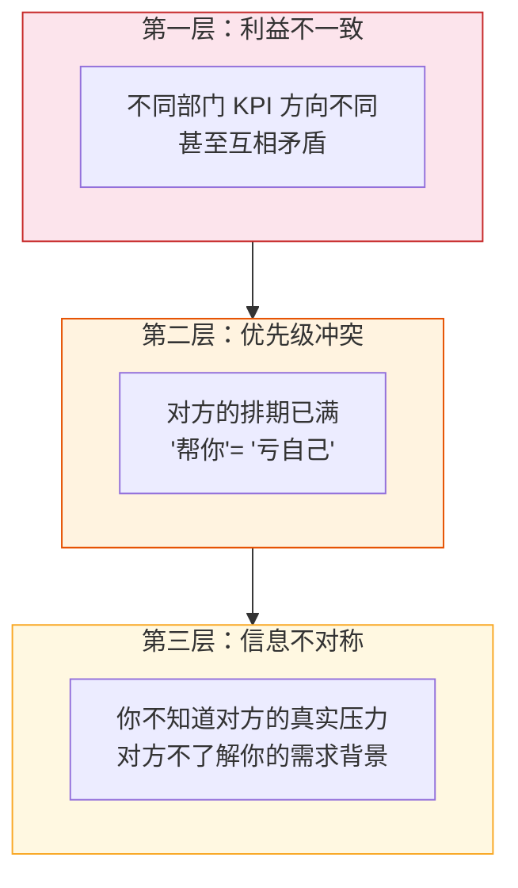

> 📌 **结构性问题，不是沟通问题**：三重障碍层层叠加——即使你消除了信息不对称，还有优先级冲突；即使对方排得开，KPI 不一致仍然让他缺乏动力。单纯提升"沟通技巧"解决不了结构性障碍。

理解这三重障碍的意义在于：**跨部门协作的失败，大多数时候不是因为你沟通能力差，而是因为你在对抗组织结构。** 单纯提升沟通技巧解决不了结构性问题。你需要的是一套系统性方法，把结构性障碍转化为可以操作的杠杆。

### 无权力影响力的四个杠杆

在没有职权的情况下影响他人，你需要找到不依赖权力的杠杆。结合前面章节的框架，我把跨部门影响力的方法归纳为四个杠杆：

| 杠杆 | 核心逻辑 | 适用场景 | 具体做法 |
|------|---------|---------|---------|
| **① 共同利益** | 把"你帮我"变成"我们一起赢" | 对方的 KPI 与你的需求有交集 | 先了解对方本季度目标，找到双赢切入点 |
| **② 互惠账户** | 先存款，后取款 | 日常协作中积累信任 | 平时主动帮忙，需要时自然取款，不提"上次帮过你" |
| **③ 社会压力** | 让"不配合"变得困难 | 对方部门内部也有人认可这件事 | 先说服对方的一线同事，让需求从内部生长 |
| **④ 降低成本** | 让配合变得容易 | 对方觉得"太麻烦了" | 你来做 90% 的工作，对方只需投入最少的人力 |

**杠杆一：共同利益——把"你帮我"变成"我们一起赢"。**

这是最强的杠杆，也是最需要前期投入的。核心思路是：找到你的需求和对方 KPI 的交集，把你的请求重新定义为一个双方都受益的合作。

回顾第三章的"翻译价值"方法。在跨部门场景中，翻译的难度更大——你不仅要翻译成对方能理解的语言，还要翻译成**对方的 KPI 能受益的方案**。

具体做法：在提出协作请求之前，先花时间了解对方部门这个季度的核心目标是什么。然后问自己：我的需求如果被满足，有没有任何一个维度能帮到对方的目标？如果有，用这个维度作为沟通的切入点；如果完全没有，你需要考虑能不能在请求中附加一些对对方有价值的东西——比如你的数据、你的用户洞察、你的技术能力。

**杠杆二：互惠账户——先存款，后取款。**

第四章讲了西奥迪尼的互惠原则：别人帮了你，你有义务回报。反过来也成立——如果你先帮了对方，对方在你需要帮助时更难拒绝。

跨部门协作中，互惠不是即时交易，而是一个**长期账户**。你在平时帮其他部门的忙——分享你的数据分析结果、帮他们debug一个问题、在他们赶工时主动提供支持——这些都是在"存款"。等你需要跨部门支持时，你的账户余额决定了对方配合的意愿。

实操要点：互惠要发生在你不需要任何回报的时候。如果你每次帮忙都紧跟着一个请求，对方会把你的"帮忙"解读为"交易筹码"，互惠效应会大打折扣。好的节奏是：平时多存款，需要时自然取款，取款时甚至不需要提醒对方"我之前帮过你"——他自己记得。

**杠杆三：社会压力——让"不配合"变得困难。**

第三章的"从受益者开始"策略在跨部门场景中尤其有效。如果你能让对方部门的人主动认为这件事应该做，对方的负责人就很难说"不"——因为他不只是在拒绝你，还是在拒绝他自己团队成员的判断。

具体做法：不要一开始就去找对方部门的负责人。先找到对方部门中和你的需求直接相关的一线同事，帮他们看到这件事的价值。当对方负责人收到你的协作请求时，如果他的下属说"这个事确实应该做"，他拒绝的阻力就大了很多。

这不是"搞政治"，而是第四章讲的**社会认同原则**的实际应用——人在不确定时，会参考周围人的判断。你只是在帮助更多人看到真实的问题，让决策者有更全面的信息。

**杠杆四：降低成本——让配合变得容易。**

第三章的"降低决策门槛"在跨部门场景中需要更进一步——不只是降低**决策**成本，还要降低**执行**成本。

对方拒绝你，很多时候不是觉得你的事不重要，而是觉得"太麻烦了"。如果你能把对方需要做的事情减到最少——你来出方案、你来协调排期、你来做大部分前期工作、对方只需要投入最少的人力和时间——配合的概率会大幅提升。

最强的版本是："你只需要让小王花两个小时帮我看一下 X，其他所有事情我来搞定。"对方几乎没有理由拒绝一个两小时的请求。

### 一个完整的职场案例：医院药剂师推动处方审核系统

让我用一个医疗行业的案例来展示这四个杠杆如何在实际场景中协同运作。

谢芸是一家三甲医院药剂科的临床药师，工作七年，专注于抗菌药物合理使用。她发现医院的处方审核流程存在一个系统性隐患：门诊医生开出的抗菌药物处方，目前只在药房发药环节做简单的剂量和过敏审核，但不审查**用药适应证**——也就是说，没有人系统性地检查"这个病人是否真的需要用抗生素、用的品种和疗程是否合理"。

这不是一个可以忽视的问题。国家卫健委对三甲医院有明确的抗菌药物使用率考核指标：门诊处方抗菌药物使用率不得超过 20%。谢芸调取了医院过去半年的数据，发现门诊抗菌药物使用率已经达到 27.3%，连续三个月超标。如果这个趋势不扭转，医院在下一次等级评审中可能因为这一项指标被扣分，严重的话甚至会影响三甲资质的保持。

谢芸想推动建立一个**前置处方审核机制**：在医生开出抗菌药物处方后、药房发药前，由临床药师对处方的适应证和用药合理性进行审核。不合理的处方会被退回给医生修改，确保每一张抗菌药物处方都经过专业把关。

问题是：这件事涉及三个部门的协作，而谢芸对其中任何一个部门都没有管理权。

- **医务部**：负责全院医疗质量管理，有权制定和修改诊疗流程。处方审核流程的变更需要医务部审批。医务部主任孙健关心的核心 KPI 是医疗质量指标（包括抗菌药物使用率）和医疗纠纷发生率。
- **信息中心**：负责医院 HIS（医院信息系统）的开发和维护。如果要在处方流程中插入审核环节，需要信息中心改造系统。信息中心主任陆远这个季度的重点任务是上线电子病历四级评审系统，排期已经满了。
- **门诊部**：管理门诊医生的日常工作。处方审核会增加医生的操作步骤（被退回的处方需要修改后重新提交），门诊部副主任赵颖担心这会拖慢门诊效率、增加患者等待时间、引发医生抱怨。

三个部门，三套不同的 KPI，三种不同的顾虑。谢芸如果直接去找任何一个部门的负责人说"我们应该做处方审核"，几乎可以预见会被拒绝——不是因为对方觉得这事不对，而是因为每个人都有更"紧急"的事要做，没有人愿意额外承担一件"别人的事"。

**谢芸的策略：逐个击破，各个杠杆配合使用。**

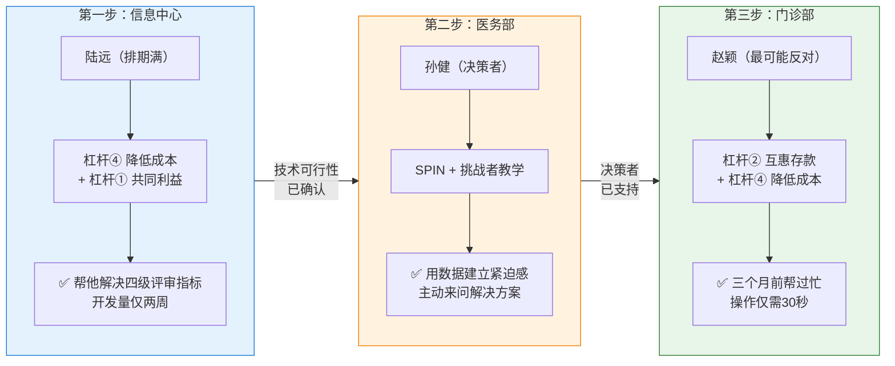

> 📌 **顺序的精髓**：先搞定最容易的（信息中心），每一步的结果都是下一步的筹码。等到面对最可能反对的门诊部时，技术可行性和决策者支持都已到位。

#### 第一步：从信息中心开始——先解决"太麻烦"的问题（杠杆四：降低成本）

谢芸没有一开始就去找医务部主任推动流程变更（那是最终的决策者），也没有先去说服门诊医生（他们是最可能反对的群体）。她选择先解决一个技术问题：**系统改造的成本。**

她知道，信息中心的陆远这个季度排期很满，如果处方审核系统的改造需要大量开发工时，陆远一定会拒绝。所以她先做了功课——她联系了医院 HIS 供应商的技术支持，了解到当前系统其实已经内置了处方审核的模块接口，只是没有启用。启用这个模块需要的开发工作量不大：主要是配置审核规则和调整处方流转流程，大约需要一个系统工程师投入两周。

更关键的是，谢芸找到了一个对陆远有价值的"附赠品"。她了解到电子病历四级评审（陆远当前最重要的任务）中有一项指标是"处方点评覆盖率"——如果处方审核系统上线，这项指标的数据可以自动生成，不需要信息中心再手工统计。也就是说，**帮谢芸做处方审核系统，顺便能帮陆远完成他自己的一项考核指标**。

谢芸约陆远喝了杯咖啡，聊的不是处方审核——而是电子病历评审。

"陆主任，听说四级评审下个月就要预检了，你们准备得怎么样？处方点评那块数据是不是还得手工统计？"

陆远说："别提了，处方点评数据是最头疼的。现在药剂科每个月做一次抽查，100 张处方人工点评，然后我们再手工录入系统。每次都要来回对数据，上个月还对错了一次。"

谢芸说："我最近在研究处方审核的事，发现我们 HIS 系统其实有一个自带的审核模块，只是没启用。如果启用了，每张处方的审核结果会自动记录在系统里——也就是说，处方点评覆盖率可以从现在的月度 100 张抽查变成**实时全覆盖、自动生成报表**。四级评审的那项指标就不需要手工对了。"

陆远的眼睛亮了："这个模块启用复杂吗？"

"我问过供应商了，主要是规则配置和流程调整，大概一个工程师两周的事。最费时间的规则配置部分我来做——我把审核规则梳理成标准化的判断逻辑表，你们直接导入系统就行。"

注意谢芸做了什么。她没有说"请信息中心帮药剂科做一个系统"——这是在**增加**陆远的工作量。她说的是"启用一个功能，顺便帮你解决四级评审的一个头疼指标"——这是在**减少**陆远的工作量。而且她主动承担了最费时的规则配置工作（杠杆四：降低成本），让信息中心的实际投入降到最低。

同时，她用了杠杆一（共同利益）——处方审核系统不只是药剂科的需求，它直接帮助信息中心完成电子病历评审的硬指标。这件事从"帮别人做事"变成了"给自己做事的同时顺便帮别人"。

#### 第二步：获取医务部支持——用数据建立紧迫感（SPIN + 挑战者教学）

信息中心的技术障碍扫清后，谢芸转向医务部主任孙健。孙健是这件事的关键决策者——没有医务部的审批，处方流程不能改。

谢芸没有直接去找孙健提方案。她知道孙健每天处理几十件事，对药剂科的事务关注度有限。她选择了一个巧妙的切入点——正好医院每季度有一次医疗质量委员会例会，谢芸作为临床药学专业组的代表需要做一个五分钟的抗菌药物使用情况汇报。

在这个例会上，谢芸没有像往常一样念数据。她用了第四章的"挑战者教学"方法：

"各位主任，我今天汇报的主题是抗菌药物使用情况。先说一个好消息和一个坏消息。好消息是我们住院患者的抗菌药物使用强度控制得不错，DDDs 值在同级医院中排前 30%。坏消息是门诊抗菌药物使用率——过去三个月分别是 25.1%、26.8%、27.3%，逐月上升，已经连续三个月超过卫健委 20% 的红线。"

她停顿了一下，让数字沉入每个人的脑海，然后继续：

"27.3% 意味着什么？**意味着我们每四张门诊处方里就有一张开了抗菌药物，比国家标准高出七个百分点。** 从趋势看，如果不干预，到年底评审的时候这个数字可能突破 30%。大家知道，上一轮三甲评审中，某省人民医院就是因为抗菌药物指标超标被降级整改的。我不是说我们一定会面临同样的结果，但这个趋势需要引起重视。"

"我分析了超标的原因。不是我们的医生在乱开药——大多数情况下，医生的用药判断是合理的。问题在于**没有一个系统性的反馈机制**。门诊量大、时间紧，医生有时候会习惯性地开出抗菌药物而没有仔细评估是否必要。他们不是不知道合理用药的原则，而是缺少一个在处方环节的即时提醒。"

这段话的设计和第四章何江的案例如出一辙——**先肯定（住院用药控制好、医生不是在乱开药），再指出结构性问题（缺乏反馈机制），避免让任何人觉得在被指责**。孙健听到的不是"门诊医生在乱开药"（那会让门诊部副主任当场反弹），而是"我们的系统缺少一个支撑医生做好工作的机制"。

会后，孙健主动找到谢芸："小谢，你说的那个趋势确实要重视。你有什么建议吗？"

——SPIN 中的 N 类问题效果出现了：孙健自己意识到问题的严重性，主动来问解决方案。这时候谢芸才拿出她准备好的处方审核方案。

#### 第三步：化解门诊部的反对——先帮忙，再谈事（杠杆二：互惠 + 杠杆四：降低成本）

最难的一关是门诊部副主任赵颖。处方审核意味着门诊医生的一部分处方会被退回修改——这会增加医生的操作步骤、可能导致患者等待时间延长。赵颖最怕的就是患者投诉。

谢芸没有等到方案推进阶段才去找赵颖。早在三个月前，赵颖的门诊部碰到一个棘手的问题：某个高频使用的口服抗生素出现了全国性缺货，门诊医生不知道该用什么替代品，有些医生开了不太合适的替代药，引发了几起患者投诉。

当时谢芸主动帮了赵颖一个忙：她在 48 小时内整理了一份"缺货药品临床替代方案表"，列出了缺货品种的所有可替代药物、等效剂量换算、注意事项，发给了全体门诊医生。这份东西帮赵颖平息了投诉，赵颖在部门会上专门感谢了药剂科。

这就是**互惠账户的存款**。谢芸当时帮忙的时候完全没有提过处方审核的事——她只是在看到问题时做了一个专业人士应该做的事。但三个月后，当她去找赵颖谈处方审核时，这笔"存款"起了作用。

谢芸约赵颖聊的时候，一上来没提处方审核，而是问："赵主任，上次缺药的事情后来怎么样了？医生们对替代方案表的反馈如何？"

赵颖说："挺好的，那个表特别实用，好几个医生说以后类似的情况都希望药剂科能出这种指导。"

谢芸说："其实那次的事让我在想一个问题——那种情况是临时缺药，影响还算可控。但如果问题是长期的用药习惯不太合理呢？不是说我们的医生水平不行，而是门诊量太大、时间太紧，有时候会'顺手开出去'一些不太必要的抗菌药物。我最近看了数据，门诊抗菌药物使用率到了 27%，超出国标七个百分点。"

赵颖皱了皱眉："这个我也知道，但你让忙得脚不沾地的门诊医生每张处方都仔细斟酌用不用抗生素，说实话不太现实。"

谢芸说："完全理解，这正是我想说的——**不能把压力加到医生身上，而是要用系统来帮医生减轻负担**。我在设计的方案是这样的：系统会自动判断哪些处方需要审核——不是每张处方都审，只审那些触发规则的处方，大概只占总处方量的 15% 左右。触发审核的处方会弹出一个简短的提示，医生可以选择修改或说明理由，整个操作不超过 30 秒。而且试运行第一个月，审核结果不和医生绩效挂钩，只做数据统计——医生看到的是'善意提醒'，而不是'批评扣分'。"

"另外，我做了一个对赵主任你可能有价值的东西——审核系统上线后，每周会自动生成一份门诊用药合理性报告。这份报告可以直接用在门诊部的科室质控会上，省得你们每次质控还要手工整理数据。"

注意谢芸做了三件关键的事：

第一，**降低执行成本**（杠杆四）——不是每张处方都审、操作时间控制在 30 秒、第一个月不挂钩绩效。这把门诊部面临的"成本"从"医生每天多花大量时间"降低到"少数处方多花 30 秒"。

第二，**附加了对门诊部有价值的产出**（杠杆一：共同利益）——每周自动生成质控报告，这恰好是门诊部本身需要但一直在手工做的事情。

第三，前期的互惠存款让赵颖对谢芸有了**信任基础**（杠杆二）——谢芸不是一个来"找麻烦"的跨部门请求者，而是一个"上次帮过大忙"的合作伙伴。赵颖更愿意认真听她的方案，而不是条件反射式地拒绝。

#### 结果

三个部门的阻力逐一化解后，谢芸在医务部主导的专项会议上正式提出了方案。此时孙健已经认可了紧迫性，陆远确认了技术可行性且工作量可控，赵颖认可了对门诊影响可控且有附加价值。方案通过，一个月后系统上线试运行。

试运行三个月的数据：门诊抗菌药物使用率从 27.3% 下降到 21.4%，接近 20% 的国标红线。被审核退回的处方中，82% 的医生在看到提醒后主动修改了处方，平均额外操作时间 22 秒——远低于赵颖担心的"严重影响效率"。信息中心的电子病历四级评审中，处方点评覆盖率一项直接满分。

更重要的是过程中的一个细节：试运行第二个月，门诊部一位资深主任医师在科室会上主动说："那个处方审核系统其实挺好的，上周提醒我一个老年患者的抗菌药物和他的降压药有相互作用，我差点开错了。"**当使用者自己成为方案的代言人时，这件事就不再需要你推了。**

### 从案例中提炼：跨部门影响力的关键策略

谢芸的案例揭示了几条跨部门协作的核心策略，值得单独拎出来说。

**策略一：拆解利益相关者，各个击破，顺序极其重要。**

谢芸没有同时去找三个部门，而是精心设计了顺序：先找信息中心（扫清技术障碍、降低系统改造的感知成本），再推动医务部（获得决策者的支持和流程审批），最后化解门诊部（消除最大的执行阻力）。

为什么是这个顺序？因为每一步的结果都是下一步的筹码。当她去找孙健时，可以说"技术上已经确认可行了，信息中心评估只需要两周"；当她去找赵颖时，可以说"医务部已经认可了紧迫性，我们要讨论的不是'做不做'，而是'怎么做得对门诊影响最小'"。

这就是第三章"从受益者到影响者到决策者"策略的跨部门升级版。在部门内，你的顺序是"受益者→影响者→决策者"；在跨部门场景中，你的顺序应该是**"最容易搞定的部门→核心决策部门→最可能反对的部门"**。每搞定一个，下一个就更容易。

**策略二：每次沟通只用"对方的语言"，绝不用"我的需求"。**

回顾谢芸和三个人的对话。她从来没有说过"药剂科需要你们帮忙做一个系统"——这是她的需求。她对陆远说的是"帮你解决四级评审的处方点评数据问题"；对孙健说的是"门诊抗菌药物使用率超标的趋势需要关注"；对赵颖说的是"用系统帮医生减轻负担，顺便自动生成质控报告"。

**同一个项目，对三个人讲的是三个完全不同的故事。** 这不是在说谎——每个故事都是真实的。但每个故事切入的角度不同，因为每个人关心的东西不同。这就是第三章"翻译价值"的极致应用。

**策略三：平时存款，需要时取款——但永远不要明说。**

谢芸三个月前帮赵颖解决缺药问题时，完全没有想过要"换"什么。但这笔互惠存款在她后来需要门诊部配合时，起到了至关重要的作用——它让赵颖从"对一个跨部门请求的防御姿态"转变为"对一个可信赖的合作伙伴的倾听姿态"。

跨部门协作中，长期的互惠关系比任何一次沟通技巧都重要。那些总是能推动跨部门合作的人，往往不是因为他们"会说话"，而是因为他们在平时就积累了足够的信任和好感。这是第四章"喜好"原则的长线投资版本。

### 跨部门协作的三条铁律

最后，提炼三条在任何跨部门场景中都适用的铁律：

**铁律一：永远不要以"我的部门需要"开头。**

以"我的部门需要你们帮忙做 X"开头的对话，从第一句话就把双方放在了对立面——你是需求方，他是资源方；你是在"要"，他是在"给"。

替换为："我发现了一个影响我们双方的问题"或"有一个机会可能对你们也有价值"。开头的措辞决定了对方是以"防御姿态"还是"探索姿态"进入对话——而防御姿态下，你说什么都很难被真正听进去。

**铁律二：在正式请求之前，至少做一次非正式的"温度测试"。**

直接发邮件提跨部门需求，是效率最低的方式。对方收到你的邮件，第一反应是"又有人来加活了"，然后要么不回、要么回一句"这件事需要走正式流程"。

在任何正式请求之前，先找到对方部门中你认识的人，做一次非正式沟通——了解对方部门当前的优先级和压力、判断你的请求是否有可能被排进去、试探对方可能的顾虑。这些信息会帮你大幅优化你正式请求的内容和时机。

这就是第三章"预热→深入→确认"节奏的跨部门版本。正式请求不是用来"说服"的，而是用来"确认"你已经在非正式渠道铺好的路。

**铁律三：帮对方的领导准备好说"是"的理由。**

你的跨部门对接人可能被你说服了，但他还需要向他的领导汇报为什么要投入资源帮你做事。如果他说不清楚，他就不敢承诺。

最聪明的做法是：在沟通中主动帮他准备这个理由。"你跟你们领导汇报的时候可以这样说——这个项目对你们部门的价值是 X，我们需要的投入只有 Y，而且 Z 部分我来负责。"你帮他降低了向上汇报的难度（第五章的"帮老板准备汇报口径"），他反过来也更愿意帮你推进。

> **认知转变点**：跨部门协作的本质不是"你帮我、我帮你"的交易，而是**在组织的缝隙中创造共同价值**。当你能把"我需要你帮忙"重新定义为"我们可以一起解决一个都在意的问题"时，你就从一个"请求者"变成了一个"共创者"。没有人喜欢被人请求帮忙，但每个人都愿意参与一件对自己也有价值的事。真正会做跨部门协作的人，让配合者觉得这不是在"帮你的忙"，而是在"做自己分内应该做的事"——因为你已经帮他看到了，这件事本来就和他有关。

---

<a id="ch7"></a>
## 7. 求职与晋升：把自己当产品来卖

前六章讲的都是"向外销售"——把方案卖给同事、老板、其他部门。这一章要讲一个更私人、也更关键的话题：**把自己当产品来卖。**

求职面试、晋升答辩、绩效汇报——这三个场景决定了你的职业发展速度，而它们的本质都是同一件事：让评估者在有限的时间内理解你的价值，并做出对你有利的决定。

这和销售有什么关系？关系太大了。

一个产品从被制造到被购买，要经过四个阶段：**定位**（我是什么、解决什么问题）→ **包装**（怎么让人一眼看到价值）→ **渠道**（在哪里被目标客户看到）→ **转化**（让对方做出购买决定）。把这四个阶段映射到个人职业发展上，你会发现逻辑完全一致：

| 产品销售阶段 | 个人职业发展 | 关键问题 |
|-------------|------------|---------|
| **定位** | 明确你的核心竞争力 | 你能解决什么别人解决不了的问题？ |
| **包装** | 用对方能理解的方式呈现你的价值 | 你的经历如何翻译成对方关心的收益？ |
| **渠道** | 让对的人在对的时机看到你 | 你的能力在哪些场景被展示和传播？ |
| **转化** | 在关键时刻促成决策 | 面试官/评审委员会凭什么选你？ |

大多数职场人在"定位"和"包装"这两步就出了问题。他们不是能力不够，而是不知道怎么把自己的能力"翻译"成评估者需要的语言——这正是第三章"翻译价值"在个人职业场景中的应用。

### 定位：不要什么都想卖

产品定位的第一条铁律是：**不要试图满足所有人的需求。** 一个什么都能做的产品，等于一个什么都不突出的产品。个人定位也一样。

很多人在准备简历或晋升材料时，恨不得把自己做过的每一件事都列上去——前端开发、后端维护、项目管理、用户调研、数据分析……看起来"全面"，但评估者看完之后的感受是："什么都做过，但我不知道他最擅长什么。"

**好的定位回答一个问题：在什么场景下，找你比找别人更靠谱？**

这个问题的答案不需要很宏大。"复杂系统的性能优化""从零到一的产品冷启动""制造业产线的良率提升""高频交易系统的风控建模"——这些都是清晰的定位。它们有一个共同特点：**指向了一个具体的、可验证的能力领域。**

怎么找到自己的定位？用第三章的"三问验证"反过来问自己：

1. **过去两年，你做的哪件事让周围的人主动来找你帮忙或咨询？** 被别人反复"购买"的能力，就是你的核心产品。
2. **如果你明天离职，团队在哪个环节会最先感到吃力？** 那个环节就是你的不可替代性所在。
3. **你做什么事情的时候，效率和质量明显高于团队平均水平？** 这是你的比较优势。

三个问题的答案交集，就是你应该重点"销售"的定位。

### 包装：STAR-V 价值表达法

找到定位之后，下一步是**包装**——用对方能理解的方式呈现你的价值。

大多数人知道 STAR 法则（Situation-Task-Action-Result），它是面试中结构化叙事的标准工具。但 STAR 有一个致命缺陷：**它只讲了你做了什么，没有讲你创造了什么价值。**

一个典型的 STAR 回答是这样的：

> "当时系统出了性能问题（S），我被安排去排查和优化（T），我做了 profiling、定位到数据库查询瓶颈、优化了索引和查询逻辑（A），最后性能提升了 3 倍（R）。"

这个回答不能说错，但它的视角是"我做了什么"——和第一章陈明的第一版开场犯了同样的错误。评估者听完会想："嗯，技术还行。"然后呢？然后就没有然后了。

我建议你在 STAR 的基础上加一个 **V（Value）**，变成 **STAR-V**。V 回答的是："你做的事情，对业务/团队/组织意味着什么？"

同一个经历，用 STAR-V 重新组织：

> "去年Q3，我们的核心交易系统在流量高峰期频繁超时，直接导致每天约 2000 笔订单处理失败，按平均客单价估算，日均损失约 40 万元（S——用业务影响开场）。我主动申请牵头这个优化项目（T）。通过全链路 profiling 定位到三个关键瓶颈——数据库慢查询、缓存击穿和连接池配置不当——逐一优化后（A），系统 P99 响应时间从 3.2 秒降到 380 毫秒，超时率从 8% 降到 0.3%（R）。**优化上线后的第一个大促，系统零超时，多承接了约 15% 的峰值流量，对应增量 GMV 约 600 万（V）。**"

区别在哪里？STAR 的终点是"性能提升了 3 倍"——这是一个技术指标，只有技术人员能理解它的含义。STAR-V 的终点是"增量 GMV 600 万"——这是任何层级的评估者都能理解的业务价值。

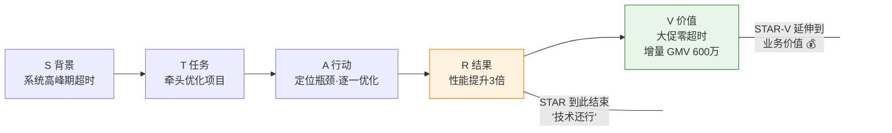

> 📌 **STAR 止于技术指标，STAR-V 延伸到业务价值**。评估者不一定懂"P99 从 3.2 秒降到 380 毫秒"意味着什么，但他一定懂"增量 GMV 600 万"意味着什么。

**STAR 回答的是"你有什么能力"，STAR-V 回答的是"你的能力值多少钱"。**

V 的关键不在于数字有多大，而在于**建立你的工作和业务结果之间的因果链**。有些工作的价值不容易用金额衡量——比如提升了团队协作效率、降低了技术债务、改善了用户体验——但你总能找到一个对方能理解的衡量维度：节省了多少人日、减少了多少次线上事故、提升了多少用户留存率。

第三章的"所以呢"测试在这里同样适用：**你的每一个成果，追问到底，都应该连接到一个业务/组织层面的价值。** 如果连接不上，要么你还没想清楚，要么你选的事情本身影响力不够——换一个更有影响力的事例。

### 一个完整的职场案例：教育行业产品总监的晋升答辩

让我用一个案例来展示"把自己当产品卖"的完整过程。

吴桐是一家在线教育公司的产品总监，负责 K12 学科辅导业务线，工作九年。她面临一次关键的晋升答辩——从产品总监（P8）晋升到高级产品总监（P9）。公司的 P9 评审由 VP 级别的评审委员会负责，评审委员来自产品、技术、运营三个方向。

吴桐过去两年的业绩不错：她主导了业务线的产品改版，用户留存率从 45% 提升到 62%；推动了 AI 自适应学习功能的落地，课程完成率提升了 28%；带领一个 12 人的产品团队，两年内培养了两个能独当一面的产品经理。

但晋升答辩不是绩效回顾。P9 的评审标准是"战略影响力"——评委要看的不是"你做了多少事"，而是"你的思考和决策如何改变了业务的走向"。

**吴桐最初的答辩思路（STAR 模式）：**

她打算按时间线把过去两年的重要项目过一遍：先讲产品改版、再讲 AI 功能、最后讲团队建设。每个项目用 STAR 讲一遍背景、任务、行动、结果。

这个思路的问题在于：评委听完会觉得"她确实做了很多事，但这些事加在一起说明了什么？为什么她应该是 P9 而不是一个高绩效的 P8？"

**吴桐调整后的答辩思路（产品定位 + STAR-V）：**

她退后一步，先做了"定位"——她的核心竞争力是什么？用前面的三问自检：

1. **周围的人找她帮什么忙？** 经常被其他业务线的产品负责人请教"怎么用数据驱动产品决策"——她最擅长的是**在不确定的教育场景中用数据验证假设、快速迭代**。
2. **她离开后团队最缺什么？** 不是具体的产品设计能力（团队里有人能接），而是**把模糊的教育理念转化为可衡量的产品指标**的能力——比如把"提升学习效果"翻译成"课程完成率""知识点掌握率""续费率"。
3. **她的比较优势？** 公司其他产品负责人大多是纯互联网背景，她在入行前有三年教育行业一线教学经验。她的优势是**教育行业认知 + 数据驱动产品方法论的交叉能力**。

定位清晰了：**她不是一个"做了很多项目的产品总监"，而是一个"能在教育行业用数据驱动方法论实现业务增长的产品领导者"。**

基于这个定位，她重新组织了答辩内容。她不再按时间线罗列项目，而是围绕一条主线展开：**"我如何用数据驱动的方法论，解决了教育产品最难的问题——在用户体验和商业收益之间找到平衡。"**

**开场（30 秒定位声明）：**

"各位评委好。过去两年，我负责 K12 学科辅导业务线的产品工作。如果用一句话总结我的核心贡献，是**建立了一套数据驱动的教育产品方法论，让我们能用可验证的方式回答一个行业里长期靠直觉回答的问题：怎么让用户学得更好、留得更久、付得更多——三者不矛盾。**"

这 30 秒就是第三章的"电梯测试"——不讲你做了什么，讲你解决了什么问题、创造了什么独特价值。评委在开场 30 秒之内就能形成一个清晰的判断框架：后面她讲的每一件事，都是在验证这个核心定位。

**主体部分（三个 STAR-V 案例，服务于同一个定位）：**

吴桐选了三个项目，但她不是平铺三个项目，而是把它们编排成一个递进的叙事：

**案例一：产品改版——验证"用户体验可以量化"的假设。**

"去年初接手业务线时，产品的用户留存率是 45%，在同行中处于中下游。团队之前做过两次改版，效果都不明显。问题出在哪里？我发现之前的改版决策主要靠用户调研和行业直觉——'用户说他想要X，我们就做X'。但教育产品有一个特殊性：**用户想要的（轻松、有趣）和用户需要的（有效学习）之间经常矛盾。** 我推动团队建立了一个'行为-效果'双指标体系：不只看用户满意度（行为），还看知识点掌握率（效果）。基于这个体系，我们发现真正驱动留存的不是界面美观度，而是'学习成就感的反馈密度'——每 15 分钟一次正向反馈的用户，留存率是每 30 分钟一次的 2.3 倍。我们据此重新设计了学习路径，留存率从 45% 提升到 62%（V：按用户生命周期价值估算，17 个百分点的留存提升对应年化收入增长约 3400 万）。"

**案例二：AI 自适应学习——从单点功能到方法论沉淀。**

"留存问题解决后，下一个挑战是课程完成率。我们的数据显示，40% 的用户在第三节课之后就放弃了。传统做法是加推送提醒、加激励机制——这些我们都试过，效果有限。我换了一个思路：如果用户放弃是因为'太难'或'太简单'，那问题不在动力，而在匹配。我推动了 AI 自适应学习功能的立项。但我没有像很多产品负责人那样直接写 PRD——我先做了一个两周的灰度测试，用最简单的规则（根据正确率动态调整题目难度）验证'匹配假设'是否成立。灰度数据证实了假设：自适应组的课程完成率比对照组高 31%。有了这个数据，技术团队的投入从'帮产品做一个功能'变成了'投资一个被验证的增长杠杆'。功能全量上线后，整体课程完成率提升了 28%（V：完成率直接关联续费率，这一项功能贡献了当年续费率 9 个百分点的提升，折合续费收入增长约 2100 万）。"

**案例三：团队建设——把方法论变成组织能力。**

"个人能做对几个决策是不够的，P9 的要求是让团队都能做对决策。过去一年，我把前面两个项目中沉淀的'行为-效果双指标''灰度验证先行'方法论，编写成了团队的产品决策 SOP。同时培养了两个产品经理独立负责子业务线——我的方法不是'告诉他们怎么做'，而是用第二章 SPIN 的逻辑，在他们做关键决策前用提问帮他们自己理清思路。现在这两个人都能独立主导从立项到上线的完整产品周期，团队的人均产出比两年前提升了 40%。"

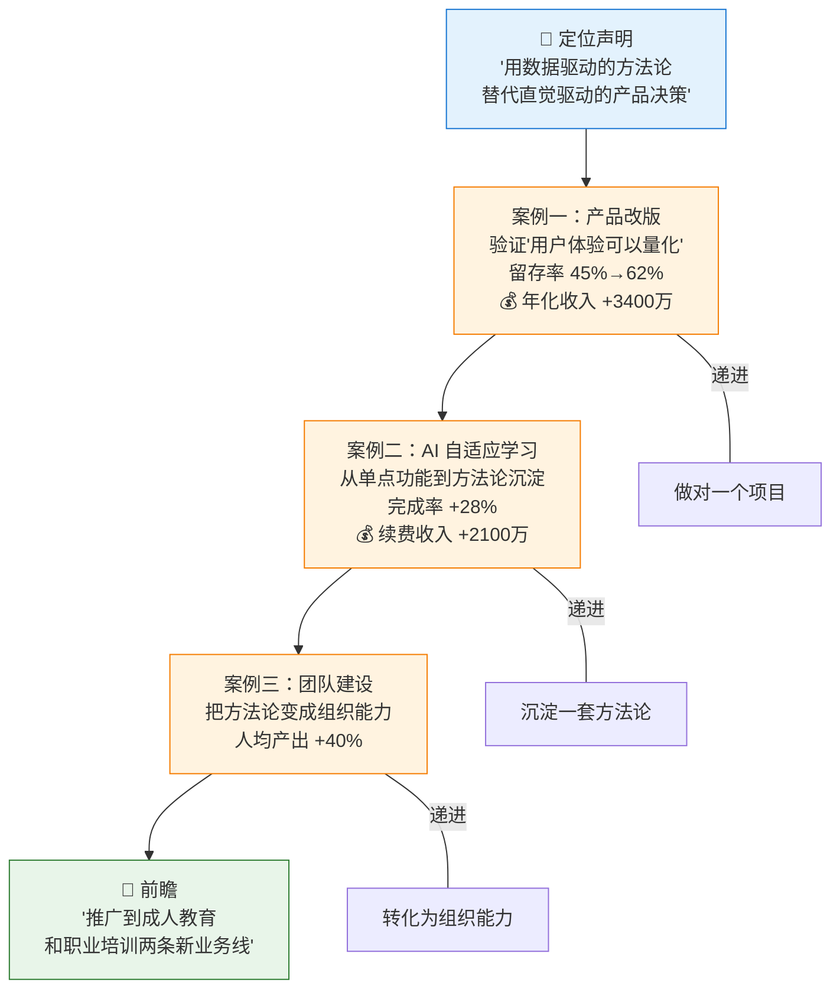

> 📌 **叙事递进的力量**：三个案例不是并列罗列"我做了多少事"，而是递进展示"我的思考力在什么层级"——这正是从 P8 到 P9 的分水岭。

注意吴桐的叙事结构：三个案例不是并列的，而是**递进的**——从"一个项目做对了"到"一套方法论被验证了"到"方法论变成了组织能力"。这个递进回应了 P9 的评审标准——"战略影响力"不是做更多的事，而是**让正确的做事方式在更大范围内复制**。

同时注意她在团队建设案例中回扣了第二章的 SPIN——"用提问帮他们自己理清思路"。这不是生硬引用，而是展示她把销售思维内化到了日常管理中。

**收尾（价值总结 + 前瞻）：**

"总结一下，过去两年我做的核心事情是：**用数据驱动的方法论替代直觉驱动的产品决策，并把这套方法论从个人能力转化为团队能力。** 如果给我 P9 的平台，下一步我要做的是把这套方法论从 K12 业务线推广到公司的成人教育和职业培训两条新业务线——它们面临的用户留存和学习效果问题，底层逻辑和 K12 是一致的。"

最后这段话做了两件事：**一是帮评委准备好"为什么给她P9"的一句话理由**（第五章的"帮老板准备汇报口径"），二是用前瞻展示她在 P9 层级能创造什么增量价值——不只是"过去做得好"，更是"未来能做更大的事"。

### 求职面试中的三条销售策略

吴桐的案例是晋升场景。求职面试的底层逻辑完全一致，但有几个特殊之处需要额外关注。

**策略一：面试前做"客户调研"——像销售研究客户一样研究目标公司。**

B2B 销售的第一条规矩是：拜访客户之前，先把客户的行业、业务、痛点研究透。求职面试同理。大多数候选人对目标公司的了解仅限于"看了官网和招聘JD"——这相当于销售只看了客户的名片就去谈生意。

面试前至少做三件事：

1. **读公司最近的财报/融资新闻/行业分析**——判断公司当前最关注的增长方向和面临的挑战。你的面试回答要和这些方向产生关联。
2. **研究面试官的背景**（LinkedIn、公司内部文章、技术博客）——了解他关心什么、他所在团队在做什么。如果你能在面试中提到一个他发表过的观点或者他团队做过的项目，你和他的心理距离会瞬间拉近（第四章的"喜好"原则）。
3. **准备三个你要问面试官的高质量问题**——这是第二章"先诊断后开方"的面试版本。好的问题比好的回答更能展示你的思考深度。"你们团队目前最大的技术挑战是什么？""这个岗位未来半年最重要的交付目标是什么？"这类问题让面试官觉得你不是来"找工作"的，而是来"评估这个机会是否值得你的能力投入"的——这种心态的转换，和第一章讲的"从展示自己转向理解对方"如出一辙。

**策略二：每个回答都用"对方的痛点"开场。**

面试中最常见的问题是"介绍一下你过去的工作经历"。大多数人从第一份工作开始按时间线讲——这相当于产品手册按生产日期排列功能。面试官要听的不是你的人生故事，而是"你能帮我解决什么问题"。

更好的回答方式是：先花 10 秒钟对齐面试官的需求，再讲你的经历。

"在回答之前，我想先确认一下——我理解这个岗位最核心的挑战是 X 和 Y（你从 JD 和前期调研中判断的），我会围绕这两个方向来讲我最相关的经验，您看可以吗？"

这个动作看似简单，但效果极强。它做了三件事：**确认了面试官的真正关注点**（避免你滔滔不绝讲了半天他根本不关心的事），**展示了你的沟通能力**（你在做第二章说的"先诊断后开方"），**掌控了对话的走向**（你决定讲什么，而不是被动回答）。

**策略三：用"留白"制造对话，而不是独角戏。**

很多人在面试中有一个本能：把自己知道的全部说完，不给面试官追问的机会——因为他们害怕被追问时答不上来。

但这是一个错误的策略。回忆第二章的核心观点："最强的说服不是你把道理讲得有多透彻，而是你的提问让对方自己看到了真相。"在面试中，你虽然不适合用 SPIN 去"提问"面试官，但你可以**刻意留白**——在讲完一个关键成果后，停下来说"这个项目在技术选型上有一些有意思的权衡，如果您感兴趣我可以展开讲"。

留白的好处是：面试官追问的方向，恰好是他最关心的方向。他问出来的问题，告诉你接下来应该往哪个方向深入。你从"独角戏"变成了"对话"——而对话中双方的参与感和信息匹配度远高于单方面演讲。这和 SPIN 的底层逻辑一脉相承——**让对方参与到价值发现的过程中，他对结论的认可度会高出数倍。**

### 绩效汇报：把日常工作变成持续的"产品营销"

求职面试和晋升答辩是低频但高影响的场景。但还有一个高频场景同样需要"把自己当产品卖"——**日常的绩效汇报**。

第五章讲了向上管理的三个常见误区，其中第三个是"把汇报当成信息倾倒"。在绩效汇报这个场景中，这个误区的杀伤力更大——因为绩效汇报的结果直接影响你的考评、加薪和晋升。

很多人在绩效汇报中犯的错误是：列一张长长的清单，写满"我做了什么"。这就像一份产品宣传册列了 50 个功能，但没有告诉客户"这些功能加在一起能帮你解决什么问题"。

**高效的绩效汇报遵循三个原则：**

**原则一：用"战役"而非"任务"来组织你的工作。**

不要说"这个季度我做了 A、B、C、D、E 五件事"。把它们归纳成一到两场"战役"——"这个季度我打了两场仗：第一场是把用户转化率从 X 提升到 Y，第二场是解决了困扰团队三个月的 Z 问题。"

"战役"叙事比"任务清单"叙事强在哪里？它有**主线**（为什么要打这场仗）、**敌人**（什么问题在阻碍目标）、**策略**（你怎么选择的打法）和**结果**（是否赢了）。人类天生对叙事的记忆远强于对清单的记忆——你的老板在年末做考评时，能想起你"打了哪几场仗"，但不会记得你"完成了几个 ticket"。

**原则二：每个成果都连接到团队/部门目标。**

这是第五章"用老板的 KPI 包装你的想法"在绩效场景中的直接应用。你做的每一件事，都要在汇报中说清楚"它和团队目标的关系是什么"。

格式很简单："[我做了什么]，它推动了 [团队目标的哪个维度]，具体贡献是 [可量化的指标]。" 如果你做的某件事和团队目标没有直接关系，要么不要在绩效汇报中重点提，要么找到间接关联——"这件事虽然不在 KPI 里，但它为下个季度的 X 目标打下了基础"。

**原则三：主动管理评估者的预期。**

不要等到绩效考核周期结束才和老板谈你的产出。第五章的"三成熟试探"在绩效管理中也完全适用——在季度中期就和老板做一次非正式的"进度校准"："我目前重点在推 X 和 Y，进展是这样的……您觉得方向对吗？有没有需要调整优先级的？"

这样做的好处是双重的：你在确认自己的工作方向和老板的预期是一致的（避免季度末才发现方向偏了），同时你在老板的脑海中**持续刷新你的贡献记录**——等到绩效考核时，他不需要从头回忆"这个人这个季度做了什么"，因为你已经在过程中帮他建立了印象。这就是"持续的产品营销"——不是等到大促才做广告，而是日常就在维护品牌认知。

### 从六章回扣：个人品牌的底层逻辑

回顾前六章的框架，你会发现它们全部适用于"把自己当产品卖"这个场景：

| 章节 | 核心方法 | 在个人品牌中的应用 |
|------|---------|-----------------|
| 第1章 | 从"我做了什么"转向"对方需要什么" | 求职/晋升的核心视角转换 |
| 第2章 | SPIN 提问 | 面试前调研目标公司的"痛点"，面试中用问题引导对话方向 |
| 第3章 | 翻译价值+"所以呢"测试 | 用 STAR-V 把技术成果翻译成业务价值 |
| 第4章 | 社会认同+权威 | 用行业口碑、推荐人背书、专业文章建立个人权威性 |
| 第5章 | 帮老板准备汇报口径 | 在晋升答辩中帮评委准备"为什么给他晋升"的一句话理由 |
| 第6章 | 互惠账户 | 平时在行业社区和公司内部积累的"信任存款"，在求职时变成推荐和背书 |

**这些方法之所以有效，是因为它们都指向同一个底层逻辑：把评估者从"审查你"的模式，转变为"发现你的价值"的模式。**

当你在面试中用 STAR-V 讲出一个清晰的业务价值故事时，面试官的心理活动不再是"我来看看这个人行不行"，而是"这个人如果来了我的团队，能帮我解决 X 问题"。当你在晋升答辩中把项目编排成递进的方法论验证叙事时，评委的心理活动不再是"他做了多少事"，而是"他在这个层级上展示了什么样的思考力"。

**你不是在等待被评价，你是在引导对方看到你的价值。** 这就是"把自己当产品卖"的本质。

> **认知转变点**：求职、晋升、绩效汇报，看起来是"被评估"的被动场景，但本质上和前六章的所有场景一样——你在把一个有价值的东西（你自己）卖给一个需要它的人（雇主、评审委员会、你的老板）。区别只在于：产品不好可以改进、可以下架，但你的职业生涯只有一次。**学会卖自己，不是虚荣，而是对自己专业能力的负责。** 你花了几年甚至十几年积累的能力，如果因为不会表达而被低估，浪费的不只是一次面试或一次晋升——而是你人生中那段不可再生的时间。

---

<a id="ch8"></a>
## 8. 常见误区与反模式：销售思维的七个陷阱

前七章给了你一整套方法论——SPIN 提问、五步推动框架、影响力六原则、挑战者模式、向上管理、跨部门协作、个人品牌。但方法论是双刃剑：**用对了是超能力，用歪了比不用更糟。**

我在过去几年的咨询和培训中，见过大量职场人在学习销售思维后反而"翻车"的案例。他们不是不聪明，也不是不努力，而是掉进了一些看似微妙但影响巨大的陷阱。这些陷阱有一个共同特点：**它们在短期内看起来像是"正确的操作"，但长期来看会损害你的信誉和影响力。**

这一章的目的不是教你新方法，而是帮你**避免把好方法用成坏习惯**。每个误区我会说清楚三件事：错误做法是什么、为什么它是错的、正确做法是什么。

### 误区一：把"翻译价值"变成"夸大其词"

**错误做法：** 为了让方案听起来更有吸引力，在数据推导中偷换假设、放大收益、忽略成本。比如第一章陈明的案例中，"340 万订单流失"是基于"12% 超时率的订单全部流失"这个最坏情况估算的——如果陈明把它说成"每次大促必定损失 340 万"，那就从合理推算变成了夸大其词。

**为什么错：** 第三章讲的"翻译价值"和"所以呢测试"，目的是帮你找到对方真正关心的维度，用对方的语言表达价值。但翻译不是虚构。一旦你给出的数据被发现经不起推敲，你在对方心中的**可信度**会瞬间归零——而可信度一旦失去，比从未建立更难修复。你以后说什么，对方都会本能地打一个折扣。

**正确做法：** 数据推导要"保守但诚实"。宁可说"最乐观情况下能省 300 万，保守估计在 150 万左右"，也不要只报最大值。展示你对数据的谨慎态度，反而会增强你的权威性——第四章的"权威"原则不只靠头衔，更靠专业判断力。**敢于说出不确定性的人，比只报好消息的人更可信。**

### 误区二：对所有人用同一套话术

**错误做法：** 学会了 SPIN 提问后，不管对方是谁、什么场景，都机械地走"S-P-I-N"四步。跟老板聊五分钟就问"这个问题如果不解决会带来什么后果"，跟同事随口聊天也试图"挖掘痛点"。结果对方觉得你说话"像培训课件"，甚至感到被操控。

**为什么错：** 第二章说得很清楚——SPIN 是一种**对话结构**，不是一套念台词的剧本。任何方法论一旦变成机械套用，就失去了它的核心——**真实的好奇心和对对方处境的关注**。人对"被套路"的感知极其敏锐。当你的提问节奏不自然、措辞像排练过的，对方的心理防御会立刻竖起来，效果反而比不用 SPIN 还差。

**正确做法：** 方法论是内化的思维框架，不是外显的操作流程。SPIN 的精髓是"在提方案之前先理解对方"——你可以用自己的方式去理解，不必拘泥于四个固定步骤。日常的短对话中，一个真诚的痛点问题就够了；正式的重要沟通中，SPIN 的完整节奏才值得展开。**会用工具的人知道什么时候不用工具。**

### 误区三：只关注"说服技巧"，忽略"专业地基"

**错误做法：** 把大量时间花在打磨表达方式、研究说服心理学上，但对自己方案的专业质量投入不够。PPT 做得很漂亮，开场白设计得很精巧，但被追问两层技术细节就答不上来。

**为什么错：** 前七章的所有方法论都建立在一个隐含前提上——**你的方案本身是过硬的**。销售思维解决的是"好方案被埋没"的问题，不是"烂方案被包装成好方案"的问题。第一章讲陈明的案例时，特意强调了"陈明的方案有问题吗？没有。他缺的不是技术能力，而是卖方案的能力"——这句话的前半段同样重要。如果陈明的方案本身漏洞百出，再好的开场白也救不了他。

**正确做法：** 把 80% 的精力放在方案的专业质量上，20% 放在表达和推动上。如果你的方案经不起专业审视，先回去打磨方案，而不是先来打磨话术。**最好的销售建立在最好的产品之上。** 第四章的"权威"原则也说了——权威来自专业判断力，不是来自表达技巧。一个技术方案被 CTO 追问三轮仍然逻辑自洽，比任何开场白都更有说服力。

### 误区四：把"预热"做成"打探"，把"互惠"做成"交易"

**错误做法：** 第三章教了"非正式预热→一对一深入→正式确认"的节奏，有些人把"预热"理解成了"到处打探消息、拉拢关系"。第六章教了"互惠账户"，有些人开始刻意记账——"我上次帮了你，这次你得帮我"。

**为什么错：** 预热的目的是在正式沟通前建立共识基础，让对方有心理准备。如果你的"预热"让对方觉得你在搞小动作、拉帮结派、私下串联，你不仅没有降低阻力，反而增加了政治风险。同样，互惠的力量来自**自愿和自然**——你帮别人是因为你能帮、愿意帮，而不是因为你在"投资"一笔未来可以兑现的债务。一旦对方感觉到你的帮助背后有目的，互惠的心理效应就消失了，取而代之的是"这个人在算计我"的警觉。

**正确做法：** 预热就是正常的同事交流，而非暗中布局——"最近产品整合你们那边怎么样？"是真诚的关心，不是信息侦察。互惠账户的存款应该是你的自然行为，而非策略性投资。**真正有影响力的人，是那些在没有任何需求时也愿意帮忙的人。** 第六章谢芸的案例之所以有效，恰恰是因为她三个月前帮赵颖解决缺药问题时，完全没有想过后面会用到这个"人情"。

### 误区五：忘了"卖方案"和"争对错"的区别

**错误做法：** 在推动方案的过程中，遇到反对意见后进入辩论模式——逐条反驳对方的质疑，用逻辑和数据"碾压"对方。即使最后在道理上赢了，对方嘴上不说，心里已经决定不配合你。

**为什么错：** 第四章的第一条底层规律说得很清楚——"人不反对道理，人反对被改变"。当你在会议上驳倒了一个人的观点，你以为你赢了，但你实际上输了——你赢了辩论，输了关系。对方不会因为你逻辑好就支持你的方案；他会因为你让他在众人面前丢了面子而处处给你设阻力。第五章专门提醒过"永远不要在被拒绝后当场反驳"，这条铁律不只适用于和老板的关系，适用于所有人。

**正确做法：** 把"我对你错"的框架换成"我们一起找最优解"的框架。面对反对意见时，先认真倾听，找到对方观点中合理的部分（一定有），然后用"你说的这个风险确实存在，我的方案在这个维度可以再优化"来回应，而不是"你这个逻辑有问题"。第四章的"先认同后挑战"不只是一个技巧，更是一种尊重——你是在和一个有独立判断的专业人士对话，不是在和一个需要被纠正的学生说教。**赢得盟友比赢得辩论重要一百倍。**

### 误区六：过度"管理预期"变成"不透明"

**错误做法：** 第五章说了"帮老板准备汇报口径"、"让功劳归老板"，有些人把这些策略推到了极端——刻意隐藏自己的贡献、对老板的每个决定都无条件附和、在公开场合从不表达自己的观点。他们以为这是"高情商的向上管理"，实际上这是"自我隐形"。

**为什么错：** 向上管理的目的是让你的价值被老板看到并转化为信任和机会，而不是让你变成一个没有存在感的"工具人"。第五章沈雨的案例中，"让功劳归老板"的前提是**老板确实认可了你的贡献**——孟海涛虽然在季度汇报中没有提沈雨的名字，但他在晋升推荐中写了明确的评价。如果你的老板根本不知道这件事是你推动的，那你不是在"让功劳归老板"，而是在"让自己的贡献消失"。

**正确做法：** 在公开场合把功劳归老板，在私下沟通中确保老板清楚你的贡献。两者不矛盾——你可以在会议上说"这是我们部门在孟总的指导下推动的项目"，同时在一对一中向孟总清晰地汇报"这个项目从方案设计到试点执行，是我牵头做的"。**适度的可见性不是炫耀，而是对自己工作的负责。** 第七章讲的"持续的产品营销"正是这个意思——你需要让评估者知道你在做什么，而不是等到年终才发现没人记得你的贡献。

### 误区七：学了方法论之后"看谁都像钉子"

**错误做法：** 学完这篇文章后，开始用"销售思维"审视所有的人际互动——每一次对话都在想"对方的痛点是什么"、每一次帮忙都在计算"互惠账户的余额"、每一次被拒绝都在分析"应该用哪个影响力原则"。你的同事开始觉得你"变了"——说话方式变得刻意、做事动机变得可疑。

**为什么错：** 方法论是工具，不是人格。第二章开篇就说了——"销售的本质是帮助对方发现问题、理解代价、看到出路的过程"。关键词是"帮助"。如果你把方法论用成了算计人的工具，你不仅背离了这篇文章的核心精神，更重要的是，**你会变成自己曾经讨厌的那种人——那个一提到"销售"就让你联想到"套路"和"操控"的人。**

**正确做法：** 方法论的最终归宿是**内化为直觉**。就像学骑自行车一样，一开始你需要刻意记住每一个动作——握把、踩踏、重心、转向。但学会之后，你不会再去想这些步骤，你只是自然地骑。销售思维也是如此——刻意练习阶段的笨拙是正常的，但终点不是"永远在刻意使用"，而是"已经不需要想就会做"。当你自然而然地在提方案前先想"对方关心什么"、汇报工作时自动连接业务价值、跨部门沟通前主动了解对方的压力——你就不再是在"使用方法论"，而是在**做一个好的沟通者和协作者**。

### 七个误区的速查表

| 误区 | 表现 | 根因 | 修正方向 |
|------|------|------|---------|
| 夸大其词 | 数据推导偷换假设，只报最大值 | 混淆了"翻译价值"和"虚构价值" | 保守但诚实，主动展示不确定性 |
| 一套话术通吃 | 对所有人都走 SPIN 四步 | 把方法论当剧本，不当思维框架 | 内化逻辑，按场景灵活调整 |
| 重表达轻专业 | PPT 精美但经不起追问 | 本末倒置，方案质量才是地基 | 80% 精力在方案，20% 在表达 |
| 预热变打探 | 到处拉关系、互惠变记账 | 把策略性行为伪装成真诚关心 | 让帮忙成为自然行为，非计算投资 |
| 辩论代替说服 | 逐条反驳，在道理上"赢"了 | 忘了目标是赢得支持而非赢得辩论 | "一起找最优解"取代"我对你错" |
| 自我隐形 | 功劳全给别人，自己毫无可见度 | 把向上管理等同于无条件服从 | 公开归功、私下确认贡献 |
| 处处套方法论 | 每次对话都在"分析"对方 | 工具异化为人格，方法论代替真诚 | 刻意练习→内化直觉→自然流露 |

### 你在光谱的哪个位置？——七个维度的自我定位

每项销售技能都有一个"甜蜜区"。不足和过度都是问题——用下表快速定位你当前的状态：

| 技能维度 | ⬅️ 不足 | ✅ 适度（甜蜜区） | ➡️ 过度 |
|---------|---------|-----------------|---------|
| **翻译价值** | 只讲技术细节，不提业务收益 | 保守但诚实地量化价值，主动说明不确定性 | 夸大数据、偷换假设、只报最大值 |
| **方法论使用** | 从不结构化思考沟通策略 | 内化为思维习惯，按场景灵活调整 | 对所有人机械套用 SPIN 四步 |
| **表达包装** | 有好方案但从不打磨表达 | 80% 精力在方案质量，20% 在表达 | PPT 精美但经不起两轮追问 |
| **关系经营** | 从不做非正式沟通和预热 | 真诚地关心他人，自然积累互惠 | 到处打探消息、帮忙后明示记账 |
| **应对反对** | 遇到反对就退缩或放弃 | "一起找最优解"，认同合理部分再提挑战 | 逐条反驳，在道理上"碾压"对方 |
| **向上可见度** | 做了事但老板完全不知道 | 公开归功老板，私下确认自己的贡献 | 刻意抢功，让老板感到威胁 |
| **方法论意识** | 完全凭直觉沟通 | 方法论已内化为自然习惯 | 每次对话都在"分析"对方的心理 |

> 📌 **使用方法**：逐行打勾，诚实判断你在每个维度偏左（不足）还是偏右（过度）。大多数人不是七项都偏同一侧——可能翻译价值不足，但应对反对过度。找到你的 1-2 个最大偏差，优先修正。

### 一条贯穿所有误区的底层原则

仔细看这七个误区，它们有一个共同的根源：**把方法论当成了操控他人的工具，而不是理解他人的工具。**

第二章定义了销售的本质——"帮助对方发现问题、理解代价、看到出路"。整篇文章的每一个方法论，底层假设都是**你真心认为你的方案对对方有价值**，你只是在帮对方看到这一点。如果这个假设不成立——如果你自己都不觉得你的方案对对方有好处，只是想利用心理技巧让对方就范——那么所有的方法论都会变味，所有的误区都会出现。

检验你是否踩进了误区，有一个极简标准：**如果对方知道了你的全部动机和思考过程，他会觉得你在帮他，还是在操控他？**

如果答案是"帮他"，你的做法就是对的，即使方法不完美。如果答案是"操控他"，你需要停下来，重新审视你的出发点。

> **认知转变点**：方法论的价值不在于让你变得"更会操作"，而在于让你变得"更会理解"。最高境界的销售思维，是你根本不觉得自己在"销售"——你只是在做一个称职的同事该做的事：理解他人的处境、看到组织的全局、用清晰的方式表达你的判断。当"销售思维"融入你的日常到了无感的程度，你就真正学会了。

---

<a id="ch9"></a>
## 9. 持续修炼：从刻意练习到自然流露

你已经读完了前八章。SPIN 提问、五步推动框架、影响力六原则、挑战者模式、向上管理、跨部门协作、个人品牌、七个常见误区——这些方法论加在一起，构成了一套完整的职场销售思维体系。

但我要提前告诉你一个可能让你失望的事实：**读完不等于学会，学会不等于会用，会用不等于用好。**

这不是客套话。回想一下你学过的任何一项复杂技能——开车、做菜、写代码、打篮球。有哪一项是读完教程就掌握的？没有。它们都经历了同一个过程：**知道→笨拙地做→反复纠错→逐渐顺手→最后不用想就能做。**

销售思维也一样。它不是一次性学会的知识点，而是一项需要持续精进的能力。这最后一章要解决的就是：**读完这篇文章之后，你具体怎么练？练多久？怎么知道自己在进步？**

### 为什么"知道"和"做到"之间有一条鸿沟

在进入练习方法之前，先理解一个关键问题：为什么你读完前八章觉得"都有道理"，但真到了会议室、邮件编辑器面前，还是会本能地回到旧模式？

答案和大脑的工作方式有关。

心理学家丹尼尔·卡尼曼在《思考，快与慢》中把人的思维系统分为两套：**系统一**（快速、自动、不费力）和**系统二**（缓慢、刻意、费力）。你日常的沟通习惯——怎么开场、怎么组织论点、怎么回应反对——属于系统一，是多年积累的自动化模式。而你刚学到的销售思维方法论属于系统二，每次使用都需要刻意调用、消耗注意力。

问题在于：**日常工作中，你的注意力永远不够用。** 你在会议上要同时处理技术细节、政治敏感度、时间压力、多方利益——这时候系统二的资源会被大量占用，系统一就会接管，你本能地回到旧的沟通模式。

所以"知道 SPIN 但开会时忘了用"不是你意志力不够，而是你的系统一还没有被重新训练。**方法论从系统二迁移到系统一，需要大量的重复练习——没有捷径。**

好消息是：一旦迁移完成，你不需要"想"就能做到。就像开了十年车的老司机不需要"想"怎么换挡一样——他的肌肉记住了。你的目标是让销售思维变成你沟通时的"肌肉记忆"。

### 把日常工作变成练习场：三个刻意练习方法

很多人听到"练习"就觉得要额外花时间。但销售思维最好的练习场就是你的日常工作——你每天都在开会、写邮件、做汇报、和同事协作。你不需要额外找时间，只需要在这些日常场景中嵌入刻意练习的结构。

**方法一：单次沟通的"赛前准备+赛后复盘"**

这是投入产出比最高的练习方法。核心是在每次重要沟通前后各花五分钟做一件事。

**赛前准备（沟通前 5 分钟）：**

拿出一张纸（或打开备忘录），回答三个问题：

1. **对方最关心什么？** 不是你觉得他应该关心什么，而是他实际上在关心什么——他的 KPI、他这周的压力、他老板最近在推的事。
2. **我的核心信息是什么？** 如果只能说一句话，我要传达什么？（第三章的"30 秒电梯测试"）
3. **对方可能的反对意见是什么？我怎么回应？** 提前想好至少一个可能的反对，和你的应对。

这三个问题花不了五分钟。但它们会强迫你从"我要说什么"切换到"对方需要听什么"——这个切换，就是第一章的核心认知转变在实操层面的落地。

**赛后复盘（沟通后 5 分钟）：**

回答两个问题：

1. **哪一个时刻对方的态度发生了变化（正面或负面）？是什么触发了这个变化？** 这个问题帮你校准你的"雷达"——随着练习次数增加，你会越来越敏锐地察觉到什么话会让对方打开，什么话会让对方关闭。
2. **如果再来一次，我会在哪个地方做不同的选择？** 不要泛泛地说"我应该表现得更好"。指向一个具体的时刻、一句具体的话。比如"当他说'这个排期很紧'的时候，我应该追问'紧到什么程度'而不是直接说'我理解'"——这种具体性是刻意练习和泛泛反思的分水岭。

**这个方法的精髓在于"小"。** 不是让你写一篇复盘报告，而是两到三句话。一天做一次，坚持一个月，你会明显感觉到自己在沟通中的"预判准确率"提升了。

**方法二：每周一次的"翻译练习"**

第三章讲了"翻译价值"和"所以呢测试"。这个方法把它变成一个定期的刻意练习。

**做法：** 每周五花 15 分钟，回顾本周你推动的一件事（可以是推方案、争资源、跨部门协作——任何需要说服别人的事），然后做一个"翻译测试"：

- **原始表述：** 你当时实际说的话是什么？把核心句子写下来。
- **对方视角：** 站在对方的角度，他听到这句话时的内心反应是什么？（"跟我有什么关系？""又有人来加活了？""这个数字可信吗？"）
- **翻译版本：** 用"所以呢"测试追问到底，写出一个对方真正关心的版本。

举个例子：

| 原始表述 | 对方内心反应 | 翻译版本 |
|---------|-----------|---------|
| "我觉得我们应该重构这个模块" | "又要花时间做没有业务价值的事" | "这个模块上个月导致了三次线上事故，重构后维护成本能降低 60%，你的团队每月能省出两个人日" |

每周一次，每次 15 分钟。四周之后你会发现，你在日常沟通中不需要刻意做"翻译"了——你的第一反应就是对方的视角。这就是系统二向系统一迁移的信号。

**方法三：找一个"练习搭档"**

如果你身边有一个也在刻意提升沟通能力的同事或朋友，找他做练习搭档——效果会比独自练习好出数倍。

**做法：** 每两周约一次 30 分钟的"模拟推演"。一个人扮演"推动者"（练习推方案），另一个人扮演"决策者"（模拟真实的反对和质疑）。结束后互相反馈：推动者哪里做得好、哪里可以改进；决策者在哪个时刻被打动了、在哪个时刻产生了抵触。

搭档练习的独特价值在于**即时反馈**。你在真实工作中很少能得到"你刚才那句话让我不舒服"这种坦率的反馈——对方出于礼貌或政治考量不会告诉你。但练习搭档可以。他可以直接说"你刚才问'这个问题如果不解决会怎样'的时候，我感觉你在套路我"——这种反馈比你自己复盘一百次都有效。

没有搭档也没关系。前两个方法——赛前准备/赛后复盘 + 每周翻译练习——已经足够让你持续进步。搭档是加速器，不是必需品。

### 一周练习计划建议

| 时间 | 练习方法 | 投入 | 具体动作 |
|------|---------|------|---------|
| **周一~周四** 每天 | 赛前准备 + 赛后复盘 | 每次 5+5 分钟 | 重要沟通前回答三问（对方关心什么/我的核心信息/可能的反对）；沟通后记录态度转折点和改进点 |
| **周五** 下午 | 翻译练习 | 15 分钟 | 回顾本周一件推动的事，写出原始表述 → 对方视角 → 翻译版本 |
| **隔周一次**（可选） | 搭档模拟推演 | 30 分钟 | 一人推方案、一人扮决策者，结束后互相反馈 |
| **每月最后一天** | 月度回顾 | 20 分钟 | 翻看本月的复盘记录，找到重复出现的模式（进步点和待改进点） |

> 📌 **最小投入**：如果只做一件事，就做"赛前 5 分钟"。每天 5 分钟的视角切换练习，一个月后你会明显感觉到"预判准确率"的提升。

### 进阶路线图：从新手到自然的四个阶段

销售思维的精进不是线性的。你不会每天匀速进步——更常见的模式是：一段时间快速提升，然后进入瓶颈期，觉得"方法我都知道但就是用不好"，直到某一天突然"打通"了，上一个台阶。

我把这个过程分成四个阶段，每个阶段有不同的特征、挑战和突破方向。

```mermaid
flowchart LR
    P1["📖 第一阶段<br/>知道<br/>第 1-4 周"]
    -->|"沟通前能想起来<br/>就算成功"| 
    P2["🔧 第二阶段<br/>刻意<br/>第 5-12 周"]
    -->|"笨拙但开始<br/>有效果"| 
    P3["⚡ 第三阶段<br/>熟练<br/>第 3-6 个月"]
    -->|"半自动运行<br/>成功率明显提升"| 
    P4["🌊 第四阶段<br/>自然<br/>6 个月以后"]

    P1 ---|"⚠️ 多数人<br/>止步于此"| D1["'知道但懒得练'"]
    P2 ---|"⚠️ 第二道<br/>放弃关"| D2["'太笨拙了，不像我'"]
    P3 ---|"⚠️ 第三道<br/>瓶颈"| D3["'够用了，不练了'"]

    style P1 fill:#e3f2fd,stroke:#1976d2
    style P2 fill:#fff3e0,stroke:#f57c00
    style P3 fill:#e8f5e9,stroke:#2e7d32
    style P4 fill:#f3e5f5,stroke:#7b1fa2
    style D1 fill:#f8d7da,stroke:#dc3545
    style D2 fill:#f8d7da,stroke:#dc3545
    style D3 fill:#f8d7da,stroke:#dc3545
```

> 📌 **每个阶段都有一个"放弃关"**。真正拉开差距的是第三到第四阶段的跨越——从"我在使用一种方法"到"我就是这样的人"。

**第一阶段：知道（第 1-4 周）**

| 特征 | 你能说出 SPIN 是什么、影响力六原则有哪些、五步框架的每一步 |
|------|------|
| 典型表现 | 沟通前会想"我应该先了解对方的痛点"，但实际对话中经常忘记，事后才想起来"刚才应该问一个 I 类问题" |
| 核心挑战 | 知识停留在"道理"层面，没有和行为建立连接 |
| 突破方向 | 用赛前准备强制自己在每次重要沟通前花 5 分钟切换视角。不追求完美执行，只追求"在沟通前想起来"这一个动作 |
| 练习重点 | checklist.md 第 1-2 章的条目——视角转换练习、SPIN 提问准备 |

**第二阶段：刻意（第 5-12 周）**

| 特征 | 你开始在沟通中有意识地使用方法论——会在提方案前先问几个问题，会在开场时想一下"对方关心什么" |
|------|------|
| 典型表现 | 使用方法论时感觉"笨拙"和"不自然"。有时候用对了，效果明显好于以前；有时候用错了，比如在不合适的场景机械套用 SPIN，反而让对方不舒服 |
| 核心挑战 | 第八章的误区会密集出现——话术机械、过度分析、辩论代替说服 |
| 突破方向 | 赛后复盘变得极其重要。每次"翻车"都是校准的机会。把注意力从"我有没有用对方法"转移到"对方的实际反应是什么"——后者才是唯一的评判标准 |
| 练习重点 | checklist.md 第 3-5 章的条目——翻译价值、降低决策门槛、老板视角三问。加上每周翻译练习 |

**第三阶段：熟练（第 3-6 个月）**

| 特征 | 方法论不再需要刻意调用，而是"半自动"运行——你在沟通中会自然地先问问题再提方案，会在写邮件时本能地从对方的利益切入 |
|------|------|
| 典型表现 | 成功率明显提升。你的方案被采纳的频率变高了，跨部门协作的阻力变小了，老板开始主动征求你的意见。同事可能会说"你最近说话越来越有说服力了"，但你自己可能不觉得有什么变化 |
| 核心挑战 | 容易"到此为止"——觉得已经够用了，不再刻意练习。但这个阶段还没有真正内化，如果停止练习，在高压场景（重大汇报、激烈冲突）下仍然会退回旧模式 |
| 突破方向 | 开始关注更细微的信号。对方的一个微表情、一句看似无意的反问、会议中的一个沉默——这些以前你注意不到的细节，现在应该成为你复盘的重点。同时，开始在更有挑战的场景中练习——向上两级的老板汇报、与强势的跨部门负责人对话 |
| 练习重点 | checklist.md 第 6-8 章的条目——跨部门影响力、个人品牌、误区自检。尝试找练习搭档做模拟推演 |

**第四阶段：自然（6 个月以后）**

| 特征 | 你不再觉得自己在"使用方法论"。销售思维已经融入了你的沟通本能——你自然而然地关注对方的需求，自然而然地用对方的语言表达价值，自然而然地在提方案前先建立共识 |
|------|------|
| 典型表现 | 别人觉得你"天生会沟通"、"情商很高"、"说话很有分量"——但你知道这不是天生的，而是刻意练习的结果。你开始能帮助其他人提升沟通能力——用第二章 SPIN 的提问方式引导他们自己找到问题 |
| 核心挑战 | 保持谦逊和反思的习惯。当方法论变成直觉后，你可能会忽略那些失败的场景——因为成功率已经很高了，偶尔的失败容易被归因为"对方不讲理"而不是"我哪里可以做得更好" |
| 突破方向 | 把关注点从"个人说服力"扩展到"组织影响力"——帮助团队建立更好的沟通文化，把你个人的方法论沉淀为团队的工作方式（第七章吴桐做的事） |
| 持续练习 | 定期回顾 checklist.md 全部条目，重点关注第 9 章的长期修炼条目。每季度做一次深度复盘 |

四个阶段的时间跨度因人而异。有些人在第一阶段就会停下来——"知道了但懒得练"；有些人在第二阶段放弃——"太笨拙了，不像我"。能走到第三阶段的人已经很少了，因为大多数人觉得"够用了"。但真正拉开差距的是第三到第四阶段的跨越——**从"我在使用一种方法"到"我就是这样的人"**。

### 一个你已经认识的人：陈明的两年后

让我用一个你已经认识的人来结束这篇文章。

还记得第一章的陈明吗？那个花了两周做了一套异步化改造方案，却在技术评审会上被搁置的后端工程师。

两年后。

陈明现在是技术组的 Tech Lead。不是因为他的代码能力在这两年里有了质的飞跃——他本来就很强。而是因为他学会了一件事：**让自己的技术判断力被组织看到、理解、采纳。**

他不再在技术评审会上从第一页 PPT 开始讲了。他会在评审会之前，先和最关键的两三个人做非正式沟通——了解他们的顾虑和关注点，调整自己的方案呈现方式。他在会上开口的第一句话不再是"我做了一个方案"，而是"我们目前面临一个问题，它的代价是这样的"。

他的老板发现，陈明推动的方案通过率从不到 30% 提升到了 80% 以上——不是因为方案质量变了（他的方案一直不差），而是因为**方案被理解的方式变了**。

更重要的变化不在工作中，而在陈明自己的感受里。他不再觉得"做好技术就够了，其他的是政治"。他开始理解：**帮别人看到你的价值，本身就是专业能力的一部分。** 一个方案再好，如果组织无法理解它的价值，它就无法帮到任何人——包括你自己。

陈明的故事没有什么戏剧性的转折。他只是在两年里持续做了一些很小的事：每次重要沟通前花五分钟想想"对方关心什么"、每次被拒绝后花五分钟想想"下次我可以怎么做"、偶尔在午饭时主动问问其他组的同事"你们最近在忙什么，有没有什么我能帮上的"。

这些事情小到不值一提。但日积月累，它们重塑了陈明在组织中的位置——从一个"技术很好但存在感不强"的工程师，变成了一个"技术很好而且能推动事情发生"的领导者。

**这就是销售思维的终极形态：它不再是一个你需要刻意启动的"模式"，而是你做事方式的自然组成部分。**

### 开始行动：你的第一步

读到这里，你面前有两条路。

第一条路：关掉这篇文章，觉得"写得不错，有空再说"。两周后你会忘掉 80% 的内容，三个月后你会忘掉它的存在。你的沟通方式不会有任何变化。

第二条路：**现在就做一件事。**

我为这篇文章配套准备了一份实战清单（checklist.md）。它把前八章的所有方法论拆解成了可以独立执行的行动条目——每个条目都有明确的动作、具体的格式和可衡量的产出。

你不需要一次做完所有条目。你只需要做一件事：

**打开 checklist.md，选出一个你觉得最容易做到的条目，在这周内完成它。**

不是最难的，不是最有价值的——**最容易的**。因为第三章教过你的道理同样适用于你自己：降低启动门槛，让行动变得容易发生。你对自己做的第一次"销售"，就是把"学习销售思维"这件事卖给你自己——而你最好的卖法，就是让第一步小到不需要犹豫。

完成第一个条目之后，下周再做一个。每周一个，两个月后你会完成大部分条目。到那时候，你会发现很多条目你已经不需要刻意去做了——它们已经变成了你的习惯。

### 结语

回到第一章开头的那句话：**每个职场人都在"销售"——你卖的不是产品，而是你的想法、你的方案、你自己。**

这篇文章从头到尾要传达的只有一个核心信念：**你的专业能力值得被看到。**

你花了多年积累的技术判断力、行业洞察、解决问题的能力——如果它们因为你不会表达而被忽视，浪费的不只是一次方案、一次晋升、一次面试，而是你人生中那段无法重来的职业时间。

学会"卖"，不是要你变成一个油嘴滑舌的人。它是让你成为一个**完整的专业人士**——不仅能做好事情，还能让好事情被理解、被支持、被落地。

陈明学会了。林薇学会了。周然、何江、沈雨、谢芸、吴桐——他们都学会了。他们没有变成"销售人员"，他们还是工程师、产品经理、设计师、质量工程师、客户经理、药剂师。他们只是多了一项能力：让自己的专业价值不被埋没。

现在轮到你了。

> **最后一个认知转变点**：这篇文章不是终点，而是起点。你读到的每一个方法论、每一个案例、每一条原则，都只是地图上的标记。真正的旅程，从你关掉这篇文章、走进下一个会议室的那一刻开始。地图不能替代行走，但有地图的人不会迷路。去走吧。

